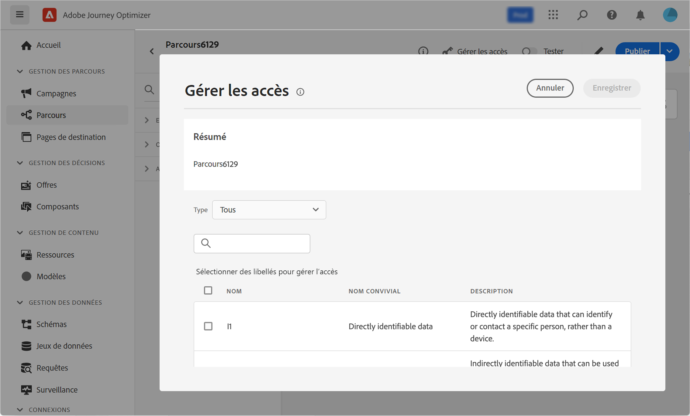

# Définition des propriétés de parcours {#jo-properties}

>[!CONTEXTUALHELP]
>id="ajo_journey_properties"
>title="Propriétés du parcours"
>abstract="Cette section présente les propriétés du parcours. Par défaut, les paramètres en lecture seule sont masqués. Les paramètres disponibles dépendent du statut du parcours, de vos autorisations et de la configuration de votre produit."

>[!CONTEXTUALHELP]
>id="ajo_journey_exit_criterias"
>title="Critères de sortie du parcours"
>abstract="Cette section présente les options des critères de sortie. Vous pouvez créer une ou plusieurs règles de critères de sortie pour votre parcours."

Les propriétés du parcours sont centralisées dans le rail droit du parcours. Cette section s&#39;affiche par défaut lors de la création d&#39;un parcours. Pour les parcours existants, cliquez sur l’icône en forme de crayon située en regard du nom du parcours pour accéder à ses propriétés.

Utilisez cette section pour définir le nom du parcours, ajouter une description et :

* gérer [entrée et rentrée](#entrance),
* sélectionner début et fin [dates](#dates),
* gérer [accès aux données](#manage-access),
* définir une [durée du délai](#timeout) dans les activités de parcours (pour les administrateurs uniquement),
* sélectionner le parcours et le profil ; [fuseaux horaires](#timezone)
* attribuez des balises unifiées Adobe Experience Platform à votre parcours afin de les classer facilement et d’améliorer la recherche dans la liste des campagnes. [Découvrir comment utiliser les balises](../start/search-filter-categorize.md#tags)

>[!NOTE]
>
>Pour les parcours en direct, cet écran affiche uniquement la date de publication et le nom de l’utilisateur qui a publié le parcours.

La fonction **Copier les détails techniques** permet de copier les informations techniques relatives au parcours qui seront utiles à l&#39;équipe d&#39;assistance technique pour résoudre les problèmes. Les informations suivantes sont copiées : `JourneyVersion UID`, `OrgID`, `orgName`, `sandboxName`, `lastDeployedBy`, `lastDeployedAt`.

## Entrée et reprise {#entrance}

### Autoriser une rentrée  {#allow-re-entrance}

>[!CONTEXTUALHELP]
>id="ajo_journey_properties_entrance"
>title="Autoriser une rentrée"
>abstract="Par défaut, les nouveaux parcours autorisent la reprise. Vous pouvez désélectionner l’option **Autoriser la reprise** pour les parcours « uniques », par exemple, si vous souhaitez offrir un cadeau unique à un utilisateur ou une utilisatrice qui effectue sa première visite dans la boutique."
>additional-url="https://experienceleague.adobe.com/en/docs/journey-optimizer/using/orchestrate-journeys/manage-journey/entry-management" text="Gestion des entrées de profil"

Par défaut, les nouveaux parcours autorisent la reprise. Vous pouvez désélectionner l’option **Autoriser la reprise** pour les parcours « uniques », par exemple, si vous souhaitez offrir un cadeau unique à un utilisateur ou une utilisatrice qui effectue sa première visite dans la boutique.

### Période d’attente de rentrée  {#re-entrance-wait}

>[!CONTEXTUALHELP]
>id="ajo_journey_properties_re-entrance_wait"
>title="Période d’attente de rentrée"
>abstract=" Définissez le temps d’attente avant de permettre à un profil de revenir au parcours dans les parcours unitaires. Cela empêche les utilisateurs de revenir sur le parcours pendant une durée donnée. Durée maximale : 29 jours."
>additional-url="https://experienceleague.adobe.com/en/docs/journey-optimizer/using/orchestrate-journeys/manage-journey/entry-management" text="Gestion des entrées de profil"

Lorsque l’option **Autoriser une reprise** est activée, le champ **Période d’attente de reprise** s’affiche. Ce champ vous permet de définir le temps d’attente avant d’autoriser un profil à entrer à nouveau dans un parcours pour les parcours unitaires (en commençant par un événement ou une qualification d’audience). Cela empêche les parcours d’être déclenchés plusieurs fois par erreur pour le même événement. Par défaut, le champ est défini sur 5 minutes. La durée maximale est de 29 jours.

En savoir plus sur la gestion des entrées et des reprises de profils dans [cette section](entry-management.md).

## Gérer l’accès {#manage-access}

Pour attribuer des libellés d’utilisation des données personnalisés ou de base au parcours, cliquez sur le bouton **[!UICONTROL Gérer l’accès]**. [En savoir plus sur le contrôle d’accès au niveau de l’objet (OLAC)](../administration/object-based-access.md)

## Fuseaux horaires des parcours et des profils {#timezone}

Le fuseau horaire est défini au niveau du parcours. Vous pouvez entrer un fuseau horaire fixe ou utiliser les profils Adobe Experience Platform pour définir le fuseau horaire du parcours. Si un fuseau horaire est défini dans le profil Adobe Experience Platform, il peut être récupéré dans le parcours.

Pour plus d&#39;informations sur la gestion des fuseaux horaires, voir [cette page](../building-journeys/timezone-management.md).

## Dates de début et de fin {#dates}

>[!CONTEXTUALHELP]
>id="ajo_journey_properties_start_date"
>title="Date de début"
>abstract="Sélectionnez la date de début dans le parcours. Si aucune date de début n’est spécifiée, elle est automatiquement définie au moment de la publication."

>[!CONTEXTUALHELP]
>id="ajo_journey_properties_end_date"
>title="Date de fin"
>abstract="Sélectionnez la date de fin de votre parcours. Une fois cette date atteinte, les profils de ce parcours le quittent automatiquement et les nouveaux ne peuvent plus y entrer."

Vous pouvez définir une **date de début**. Si vous n’en avez pas spécifié une, elle sera automatiquement définie au moment de la publication.

Vous pouvez également ajouter une **date de fin**. Cela permet aux profils de se fermer automatiquement lorsque la date est atteinte. Si aucune date de fin n’est spécifiée, les profils peuvent rester jusqu’au [délai d’expiration du parcours global](#global_timeout) (91 jours en général ou 7 jours avec l’offre de module complémentaire Healthcare Shield). La seule exception concerne les parcours de lecture d’audience récurrents avec l’option **Forcer une reprise sur la périodicité** activée, qui se termine à la date de début de l’occurrence suivante.

## Expiration {#timeout}

### Délai d’expiration ou erreur dans les activités de parcours {#timeout_and_error}

>[!CONTEXTUALHELP]
>id="ajo_journey_properties_timout"
>title="Expiration"
>abstract="Définissez la durée pendant laquelle le parcours tentera d’exécuter une action ou de vérifier une condition avant de la considérer comme un délai d’expiration."

Lorsque vous modifiez une action ou une activité de condition, vous pouvez définir un autre chemin en cas d&#39;erreur ou de temporisation. Si le traitement de l’activité qui interroge un système tiers dépasse le délai défini dans **[!UICONTROL Délai d’expiration ou erreur]** du champ des propriétés du parcours, le deuxième chemin est choisi pour effectuer une éventuelle action de secours.

Les valeurs autorisées sont comprises entre 1 et 30 secondes.

Nous vous recommandons de définir une valeur très courte **[!UICONTROL Délai d’expiration ou erreur]** si votre parcours est sensible au temps (par exemple : la réaction à l’emplacement en temps réel d’une personne), car vous ne pouvez pas retarder votre action de plus de quelques secondes. Si le facteur temps revêt une importance moindre, vous pouvez définir un délai plus long afin d’accorder davantage de temps au système appelé pour envoyer une réponse valide.

Parcours utilise également un délai d’expiration global comme décrit ci-dessous.

### Temporisation de parcours globale {#global_timeout}

En plus de la variable [timeout](#timeout_and_error) utilisé dans les activités de parcours, un délai d’expiration de parcours global est appliqué. Il ne s’affiche pas dans l’interface et ne peut pas être modifié.

Cette temporisation globale met fin à la progression des individus dans le parcours **91 jours** après leur entrée. Cette temporisation est réduite à **7 jours** avec l’offre de module complémentaire Healthcare Shield. En d’autres termes, la durée du parcours d’une personne ne peut pas excéder 91 jours (ou 7 jours). Après cette période de temporisation, les données de cette personne sont supprimées. Les personnes qui sont encore actives dans le parcours au terme de cette période de temporisation seront arrêtées et ne seront pas prises en compte dans le cadre du reporting. Vous pouvez donc voir plus de personnes rejoindre le parcours que le quitter.

>[!NOTE]
>
>Les parcours ne réagissent pas directement aux demandes d&#39;opt-out, de suppression ou d&#39;accès. Cependant, la temporisation globale limite à 91 jours la durée d&#39;activité d&#39;un individu au sein d&#39;un parcours.

En raison du délai de parcours de 91 jours, lorsque la rentrée du parcours n’est pas autorisée, nous ne pouvons pas nous assurer que le blocage de la rentrée fonctionnera plus de 91 jours. En effet, étant donné que nous supprimons toutes les informations sur les personnes qui ont rejoint le parcours 91 jours après leur entrée, rien ne nous permet de savoir qu&#39;une personne l&#39;a déjà rejoint il y a plus de 91 jours.

Un individu ne peut entrer dans une activité d’attente que s’il dispose de suffisamment de temps dans le parcours pour terminer la durée d’attente avant la temporisation de 91 jours du parcours. Consultez [cette page](../building-journeys/wait-activity.md).

#### FAQ sur la durée de vie et la rétention des données {#timeout-faq}

À compter de la version de juin 2024 de Adobe Journey Optimizer, le délai d’expiration global du parcours est passé de 30 à 91 jours. Les impacts sont répertoriés dans la FAQ ci-dessous :

**Pour les Parcours unitaires**
<table style="table-layout:auto">
  <tr style="border: 1;">
    <td>
      
Qu’advient-il du parcours publié après le déploiement de l’extension TTL ?

    </td>
    <td>
      
Les profils entrant dans le nouveau parcours auront automatiquement un délai d’activation de 91 jours.

    </td>
  </tr>
  <tr style="border: 1;">
    <td>
      
Qu’advient-il d’un profil entrant dans un parcours publié avant le lancement de l’extension TTL ?

    </td>
    <td>
      
Le profil aura un délai d’activation de 91 jours (7 jours pour HIPAA), en fonction de l’heure à laquelle le parcours a été publié à l’origine.

    </td>
  </tr>
  <tr style="border: 1;">
    <td>
      
Qu’advient-il d’un profil qui a déjà été saisi dans un parcours au lancement de l’extension TTL ?

    </td>
    <td>
      
Le profil conservera une durée de vie de 91 jours (7 jours pour HIPAA), selon l’heure de publication originale du parcours.

    </td>
  </tr>
  <tr style="border: 1;">
    <td>
      
Qu’advient-il d’un profil dans une version de parcours précédente qui est republiée après le lancement de l’extension TTL ?

    </td>
    <td>
      
Le profil conserve un délai d’activation de 91 jours (7 jours pour HIPAA), aligné sur l’heure de publication de la version par parcours d’origine.

    </td>
  </tr>
  <tr style="border: 1;">
    <td>
      
Qu’advient-il d’un nouveau profil entrant dans une version de parcours republiée après le lancement de l’extension TTL ?

    </td>
    <td>
      
Le profil aura un délai d’activation de 91 jours, correspondant au délai d’activation de la nouvelle version de parcours republiée.

    </td>
  </tr>
</table>

**Pour les Parcours de déclenchement de segment**

<table style="table-layout:auto">
  <tr style="border: 1;">
    <td>
      
Qu’advient-il des nouveaux parcours ponctuels publiés après l’extension TTL ?

    </td>
    <td>
      
Les profils entrant dans le nouveau parcours auront un TTL de 91 jours automatiquement.

    </td>
  </tr>
  <tr style="border: 1;">
    <td>
      
Qu’advient-il des nouveaux parcours récurrents sans nouvelle entrée forcée publiée après l’extension TTL ?

    </td>
    <td>
      
Les profils entrant dans le nouveau parcours auront un TTL de 91 jours automatiquement.

    </td>
  </tr>
  <tr style="border: 1;">
    <td>
      
Qu’advient-il des nouveaux parcours récurrents avec une rentrée forcée publiée après l’extension TTL ?

    </td>
    <td>
      
Les profils entrant dans le nouveau parcours auront un TTL égal à la période de périodicité. Par exemple, si le parcours s’exécute tous les jours, la durée de vie est de 1 jour.

    </td>
  </tr>
  <tr style="border: 1;">
    <td>
      
Qu’advient-il d’un profil entrant dans un parcours publié avant le lancement de l’extension TTL ?

    </td>
    <td>
      
Le profil aura un délai d’activation de 91 jours (7 jours pour HIPAA), cohérent avec l’heure de publication d’origine. Pour les parcours récurrents avec une rentrée forcée, la durée de vie correspond à la période de périodicité.

    </td>
  </tr>
  <tr style="border: 1;">
    <td>
      
Qu’advient-il d’un profil s’exécutant par un parcours lorsque l’extension TTL est lancée ?

    </td>
    <td>
      
Le profil conservera une durée de vie de 91 jours (7 jours pour HIPAA), selon l’heure de publication originale du parcours. Pour les parcours récurrents avec une rentrée forcée, la durée de vie correspond à la période de périodicité.

    </td>
  </tr>
  <tr style="border: 1;">
    <td>
      
Qu’advient-il d’un profil en cours d’exécution dans une version de parcours précédente qui est republiée après le lancement de l’extension TTL ?

    </td>
    <td>
      
Le profil conserve un délai d’activation de 91 jours (7 jours pour HIPPA), aligné sur l’heure de publication de la version par parcours d’origine. Pour les parcours récurrents avec une rentrée forcée, la durée de vie correspond à la période de périodicité.

    </td>
  </tr>
  <tr style="border: 1;">
    <td>
      
Qu’advient-il d’un nouveau profil entrant dans une version de parcours republiée après le lancement de l’extension TTL ?

    </td>
    <td>
      
Le profil aura un délai d’activation de 91 jours, correspondant au délai d’activation de la nouvelle version de parcours republiée. Pour les parcours récurrents avec une rentrée forcée, la durée de vie correspond à la période de périodicité.

    </td>
  </tr>
</table>

## Politiques de fusion {#merge-policies}

Le parcours utilise des politiques de fusion lors de la récupération des données de profil d’Adobe Experience Platform. Selon le type de parcours, différentes politiques de fusion sont utilisées :

* Dans les parcours Lecture d’audience ou Qualification d’audience : la politique de fusion de l’audience est utilisée
* Dans les parcours d’événement unitaire : la stratégie de fusion par défaut est utilisée
* Dans les parcours d’événements métier : la stratégie de fusion de l’audience ciblée dans l’activité Lecture d’audience suivante est utilisée

Parcours respectera la stratégie de fusion utilisée tout au long du parcours. Par conséquent, si plusieurs audiences sont utilisées dans un parcours (par exemple dans les fonctions &quot;inAudience&quot;), créant des incohérences avec la stratégie de fusion utilisée par le parcours, une erreur est générée et la publication est bloquée. Cependant, si une audience incohérente est utilisée dans la personnalisation des messages, une alerte n&#39;est pas générée, malgré l&#39;incohérence. C&#39;est pourquoi il est vivement recommandé de vérifier la stratégie de fusion associée à votre audience lorsque cette audience est utilisée dans la personnalisation des messages.

Pour en savoir plus sur les stratégies de fusion, reportez-vous à la section [Documentation Adobe Experience Platform](https://experienceleague.adobe.com/fr/docs/experience-platform/profile/merge-policies/overview){target="_blank"}.
