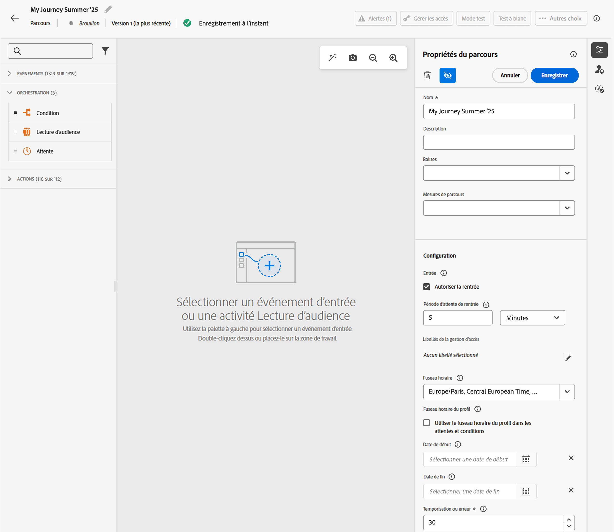
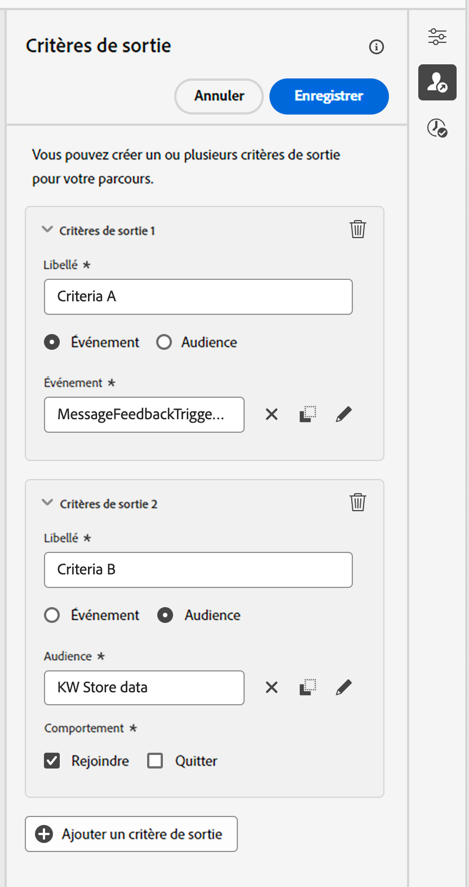

# Définir les propriétés de votre parcours {#jo-properties}

>[!CONTEXTUALHELP]
>id="ajo_journey_properties"
>title="Propriétés du parcours"
>abstract="Cette section présente les propriétés du parcours. Par défaut, les paramètres en lecture seule sont masqués. Les paramètres disponibles dépendent du statut du parcours, de vos autorisations et de la configuration de votre produit."

## Accéder aux propriétés d’un parcours {#access-properties}

Les propriétés d’un parcours sont centralisées dans le rail de droite. Cette section est affichée par défaut lors de la création d’un parcours. Pour les parcours existants, cliquez sur l’icône en forme de crayon à côté du nom du parcours pour l’ouvrir.

Dans cette section, choisissez le nom du parcours, ajoutez une description et définissez les propriétés globales du parcours.

Vous pouvez effectuer les actions suivantes :

* Attribuer des balises unifiées Adobe Experience Platform à votre parcours afin de les classer facilement et d’améliorer la recherche dans la liste des campagnes. [Découvrir comment utiliser les balises](../start/search-filter-categorize.md#tags)
* Sélectionner les mesures du parcours. [Découvrir comment configurer et suivre vos mesures de parcours.](success-metrics.md)
* Gérer [l’entrée et la rentrée](#entrance). La gestion des entrées de profils dépend du type de parcours. Pour plus d’informations, consultez [cette page](entry-management.md).
* Gérer l’[accès aux données](#manage-access)
* Sélectionner les [fuseaux horaires](#timezone) des parcours et des profils.
* Choisir des [dates de début et de fin](#dates) personnalisées.
* Définir une [durée de temporisation](#timeout) dans les activités de parcours (pour les personnes chargées de l’administration uniquement).
* Surveiller les conflits et gérer la priorité des parcours à l’aide des [outils de gestion des conflits](#conflict).

{width="80%"}{zoomable="yes"}

>[!NOTE]
>
>Pour les parcours actifs, cet écran affiche uniquement la date de publication et le nom de l’utilisateur ou de l’utilisatrice qui a publié le parcours.

L’option **Copier les détails techniques** vous permet de copier les informations techniques relatives au parcours qui pourront être utiles à l’équipe d’assistance technique pour résoudre les éventuels problèmes. Les informations suivantes sont copiées : `JourneyVersion UID`, `OrgID`, `orgName`, `sandboxName`, `lastDeployedBy`, `lastDeployedAt`.

Pour plus d’informations sur les champs techniques liés à un parcours pour un profil donné et comment les utiliser, consultez [cette page](expression/journey-properties.md).

## Entrée et rentrée {#entrance}

Le mode d’entrée des profils est défini au niveau du parcours, dans le volet de configuration de droite. Les paramètres sont décrits ci-dessous.

La gestion des entrées de profils dépend du type de parcours. Pour plus d’informations sur la gestion des entrées et des rentrées de profils, consultez [cette page](entry-management.md). En savoir plus sur les taux de traitement des parcours et le flux des profils dans les parcours dans [cette section](entry-management.md#journey-processing-rate).

### Autoriser une nouvelle rentrée  {#allow-reentrance}

>[!CONTEXTUALHELP]
>id="ajo_journey_properties_entrance"
>title="Autoriser une nouvelle rentrée"
>abstract="Par défaut, les nouveaux parcours autorisent la rentrée. Vous pouvez décocher l&#39;option **Autoriser une rentrée** si vous souhaitez par exemple offrir un cadeau unique à un utilisateur ou une utilisatrice qui effectue sa première visite dans la boutique."
>additional-url="https://experienceleague.adobe.com/fr/docs/journey-optimizer/using/orchestrate-journeys/manage-journey/entry-management" text="Gestion des entrées de profil"

Par défaut, les nouveaux parcours autorisent la rentrée. Vous pouvez désélectionner l’option **Autoriser la rentrée** pour les parcours « uniques », par exemple, si vous souhaitez offrir un cadeau unique à un utilisateur ou une utilisatrice qui effectue sa première visite dans la boutique.

### Période d’attente de rentrée  {#reentrance-wait}

>[!CONTEXTUALHELP]
>id="ajo_journey_properties_re-entrance_wait"
>title="Période d’attente de rentrée"
>abstract="Définissez le temps d’attente avant de permettre à un profil de reprendre le parcours dans les parcours unitaires. Cela empêche les utilisateurs et utilisatrices d’entrer de nouveau dans le parcours pendant une durée donnée. Durée maximale : 90 jours."
>additional-url="https://experienceleague.adobe.com/fr/docs/journey-optimizer/using/orchestrate-journeys/manage-journey/entry-management" text="Gestion des entrées de profil"

Lorsque l’option **Autoriser une rentrée** est activée, le champ **Période d’attente de rentrée** s’affiche. Ce champ vous permet de définir le temps d’attente avant d’autoriser un profil à entrer à nouveau dans un parcours pour les parcours unitaires (en commençant par un événement ou une qualification d’audience). Cela empêche les parcours d’être déclenchés plusieurs fois par erreur pour le même événement. Par défaut, le champ est défini sur 5 minutes. La durée maximale est de 90 jours.

## Gérer l’accès {#manage-access}

Vous pouvez limiter l’accès à un parcours en fonction des libellés d’accès.

Pour attribuer des libellés d’utilisation des données personnalisés au parcours, cliquez sur l’icône **[!UICONTROL Gérer les libellés d’accès]** et sélectionnez un ou plusieurs libellés.

[En savoir plus sur le contrôle d’accès au niveau de l’objet (OLAC)](../administration/object-based-access.md)

## Fuseaux horaires des parcours et des profils {#timezone}

Le fuseau horaire est défini au niveau du parcours. Vous pouvez entrer un fuseau horaire fixe ou utiliser les profils Adobe Experience Platform pour définir le fuseau horaire du parcours. Si un fuseau horaire est défini dans le profil Adobe Experience Platform, il peut être récupéré dans le parcours.

[En savoir plus sur la gestion des fuseaux horaires](../building-journeys/timezone-management.md)

## Dates de début et de fin {#dates}

>[!CONTEXTUALHELP]
>id="ajo_journey_properties_start_date"
>title="Date de début"
>abstract="Sélectionnez la date à laquelle les profils peuvent commencer à rejoindre le parcours. Si aucune date de début n’est définie, elle correspond par défaut à la date de publication du parcours."

>[!CONTEXTUALHELP]
>id="ajo_journey_properties_end_date"
>title="Date de fin"
>abstract="Définissez la date de fin du parcours. À cette date, les profils actifs quittent automatiquement le parcours et aucune nouvelle entrée n’est autorisée."

Par défaut, les profils peuvent rejoindre votre parcours dès qu’il est publié et y rester jusqu’à la [temporisation globale du parcours](#global_timeout). La seule exception concerne les parcours de lecture d’audience récurrents avec l’option **Forcer une rentrée sur la périodicité** activée, qui se termine à la date de début de l’occurrence suivante.

Si nécessaire, vous pouvez définir une **date de début** et une **date de fin** personnalisées. Les profils peuvent ainsi rejoindre votre parcours à une date spécifique et en sortir automatiquement à la date de fin.

## Temporisation {#timeout}

### Temporisation des activités du parcours {#timeout_and_error}

>[!CONTEXTUALHELP]
>id="ajo_journey_properties_timeout"
>title="Temporisation ou erreur"
>abstract="Indiquez la durée pendant laquelle le parcours doit tenter d’effectuer une action ou d’évaluer une condition avant de considérer qu’elle a expiré. Les valeurs recommandées sont comprises entre 1 et 30 secondes."

Lorsque vous modifiez une action ou une activité de condition, vous pouvez définir un autre chemin en cas d’erreur ou de temporisation. Si la durée de traitement de l’activité qui interroge un système tiers dépasse la durée de temporisation définie dans le champ **[!UICONTROL Temporisation ou erreur]** des propriétés du parcours, le deuxième chemin d’accès est choisi pour effectuer une éventuelle action de remplacement.

Les valeurs recommandées sont comprises entre 1 et 30 secondes.

Nous vous recommandons de définir une valeur très basse pour **[!UICONTROL Temporisation ou erreur]** si votre parcours est sensible au temps (c’est le cas, par exemple, lorsqu’il convient de réagir à l’emplacement d’une personne en temps réel), car l’action ne peut pas être différée de plus de quelques secondes. Si le facteur temps revêt une importance moindre, vous pouvez définir un délai plus long afin d’accorder davantage de temps au système appelé pour envoyer une réponse valide.

Les parcours utilisent également une temporisation globale comme décrit ci-dessous.

### Temporisation de parcours globale {#global_timeout}

En plus de la [temporisation](#timeout_and_error) utilisée dans les activités de parcours, une temporisation globale de parcours est appliquée. Elle ne s’affiche pas dans l’interface et ne peut pas être modifiée.

Cette temporisation globale arrête la progression des personnes dans le parcours **91 jours** après leur entrée. En d’autres termes, la durée du parcours d’une personne ne peut pas excéder 91 jours. Après cette période de temporisation, les données de cette personne sont supprimées. Les personnes qui sont encore actives dans le parcours au terme de cette période de temporisation seront arrêtées et ne seront pas prises en compte dans le cadre du reporting. Vous pouvez donc voir plus de personnes rejoindre le parcours que le quitter.

>[!NOTE]
>
>La définition exacte du moment où un parcours est considéré comme « terminé » varie selon le type de parcours. [Voir les critères détaillés](end-journey.md#journey-finished-definition).

Compte tenu de la temporisation de 91 jours du parcours, lorsque la rentrée de celui-ci n’est pas autorisée, nous sommes dans l’impossibilité de garantir que le blocage de la rentrée fonctionnera plus de 91 jours. En effet, étant donné que nous supprimons toutes les informations sur les personnes qui ont rejoint le parcours 91 jours après leur entrée, rien ne nous permet de savoir qu’une personne l’a déjà rejoint il y a plus de 91 jours.

Une personne ne peut entrer dans une activité d’attente que si elle dispose de suffisamment de temps dans le parcours pour terminer la durée d’attente avant la temporisation de 91 jours du parcours. Consultez [cette page](../building-journeys/wait-activity.md).

#### Questions fréquentes sur la durée de vie (TTL) et la rétention des données {#timeout-faq}

À compter de la version de juin 2024 d’Adobe Journey Optimizer, la temporisation globale du parcours est passée de 30 à 91 jours. Les éléments affectés sont répertoriés dans les questions fréquentes ci-dessous :

**Pour les parcours unitaires**

<table style="table-layout:auto">
  <tr style="border: 1;">
    <td>
      
Qu’advient-il du parcours publié après le déploiement de l’extension de la durée de vie ?

    </td>
    <td>
      
Les profils entrant dans le nouveau parcours auront automatiquement une durée de vie (TTL) de 91 jours.

    </td>
  </tr>
  <tr style="border: 1;">
    <td>
      
Qu’advient-il d’un profil entrant dans un parcours publié avant le lancement de l’extension de la durée de vie ?

    </td>
    <td>
      
Le profil conserve une durée de vie de 30 jours (7 jours pour HIPAA), en fonction de l’heure à laquelle le parcours a été publié à l’origine.

    </td>
  </tr>
  <tr style="border: 1;">
    <td>
      
Que se passe-t-il pour un profil qui a déjà accédé à un parcours au lancement de l’extension de la durée de vie ?

    </td>
    <td>
      
Le profil conserve une durée de vie de 30 jours (7 jours pour HIPAA), selon l’heure de publication originale du parcours.

    </td>
  </tr>
  <tr style="border: 1;">
    <td>
      
Qu’advient-il d’un profil dans une version de parcours précédente qui est republiée après le lancement de l’extension de la durée de vie ?

    </td>
    <td>
      
Le profil conserve une durée de vie de 30 jours (7 jours pour HIPAA), alignée sur l’heure de publication originale du parcours.

    </td>
  </tr>
  <tr style="border: 1;">
    <td>
      
Qu’advient-il d’un nouveau profil entrant dans une version de parcours republiée après le lancement de l’extension de la durée de vie ?

    </td>
    <td>
      
Le profil conserve une durée de vie de 91 jours, correspondant à la durée de vie de la nouvelle version de parcours republiée.

    </td>
  </tr>
</table>

**Pour les parcours de déclenchement de segment**

<table style="table-layout:auto">
  <tr style="border: 1;">
    <td>
      
Qu’advient-il des nouveaux parcours uniques publiés après l’extension de la durée de vie ?

    </td>
    <td>
      
Les profils entrant dans le nouveau parcours auront une durée de vie de 91 jours automatiquement.

    </td>
  </tr>
  <tr style="border: 1;">
    <td>
      
Qu’advient-il des nouveaux parcours récurrents sans nouvelle rentrée forcée publiée après l’extension de la durée de vie ?

    </td>
    <td>
      
Les profils entrant dans le nouveau parcours auront une durée de vie de 91 jours automatiquement.

    </td>
  </tr>
  <tr style="border: 1;">
    <td>
      
Qu’advient-il des nouveaux parcours récurrents avec une rentrée forcée publiée après l’extension de la durée de vie ?

    </td>
    <td>
      
Les profils entrant dans le nouveau parcours auront une durée de vie égale à la période de périodicité. Par exemple, si le parcours s’exécute tous les jours, la durée de vie est d’1 jour.

    </td>
  </tr>
  <tr style="border: 1;">
    <td>
      
Qu’advient-il d’un profil entrant dans un parcours publié avant le lancement de l’extension de la durée de vie ?

    </td>
    <td>
      
Le profil conserve une durée de vie de 30 jours (7 jours pour HIPAA), cohérente avec l’heure de publication originale du parcours. Pour les parcours récurrents avec une rentrée forcée, la durée de vie correspond à la période de périodicité.

    </td>
  </tr>
  <tr style="border: 1;">
    <td>
      
Qu’advient-il d’un profil s’exécutant par le biais d’un parcours lorsque l’extension de la durée de vie est lancée ?

    </td>
    <td>
      
Le profil conserve une durée de vie de 30 jours (7 jours pour HIPAA), selon l’heure de publication originale du parcours. Pour les parcours récurrents avec une rentrée forcée, la durée de vie correspond à la période de périodicité.

    </td>
  </tr>
  <tr style="border: 1;">
    <td>
      
Qu’advient-il d’un profil en cours d’exécution dans une version de parcours précédente qui est republiée après le lancement de l’extension de la durée de vie ?

    </td>
    <td>
      
Le profil conserve une durée de vie de 30 jours (7 jours pour HIPAA), alignée sur l’heure de publication originale du parcours. Pour les parcours récurrents avec une rentrée forcée, la durée de vie correspond à la période de périodicité.

    </td>
  </tr>
  <tr style="border: 1;">
    <td>
      
Qu’advient-il d’un nouveau profil entrant dans une version de parcours republiée après le lancement de l’extension de la durée de vie ?

    </td>
    <td>
      
Le profil conserve une durée de vie de 91 jours, correspondant à la durée de vie de la nouvelle version de parcours republiée. Pour les parcours récurrents avec une rentrée forcée, la durée de vie correspond à la période de périodicité.

    </td>
  </tr>
</table>

## Politiques de fusion {#merge-policies}

Adobe Journey Optimizer utilise des politiques de fusion lors de la récupération des données de profil d’Adobe Experience Platform. Selon le type de parcours, différentes politiques de fusion sont utilisées :

* Dans les parcours Lecture d’audience ou Qualification d’audience : la politique de fusion de l’audience est utilisée.
* Dans les parcours d’événements unitaires : la politique de fusion par défaut est utilisée.
* Dans les parcours d’événements métier : la politique de fusion de l’audience ciblée dans l’activité Lecture d’audience suivante est utilisée.

Adobe Journey Optimizer applique la politique de fusion utilisée tout au long du parcours. Par conséquent, si de multiples audiences sont utilisées dans un parcours (par exemple dans les fonctions [`inAudience`](functions/functioninaudience.md)), ce qui crée des incohérences avec la politique de fusion utilisée par le parcours, une erreur se produit et la publication est bloquée. Cependant, si une audience incohérente est utilisée dans la personnalisation des messages, une alerte n’est pas déclenchée, malgré l’incohérence. C’est pourquoi il est vivement recommandé de vérifier la politique de fusion associée à votre audience lorsque celle-ci est utilisée dans la personnalisation des messages.

Pour en savoir plus sur les politiques de fusion, consultez la [documentation d’Adobe Experience Platform](https://experienceleague.adobe.com/fr/docs/experience-platform/profile/merge-policies/overview){target="_blank"}.

>[!NOTE]
>
>Lorsque vous mettez à jour une politique de fusion d’audience, vous devez republier (ou dupliquer) tout parcours actif référençant cette audience. La modification de la politique de fusion crée de fait une « nouvelle » audience à laquelle le parcours en cours ne peut pas accéder, ce qui garantit la cohérence des données.

## Critères de sortie {#exit-criteria}

>[!CONTEXTUALHELP]
>id="ajo_journey_exit_criterias"
>title="Critères de sortie"
>abstract="Cette section présente les options des critères de sortie. Vous pouvez créer une ou plusieurs règles et un ou plusieurs filtres de critères de sortie pour votre parcours."

### Critères de sortie de parcours {#exit-criteria-desc}

En ajoutant des critères de sortie, vous faites quitter le parcours aux profils dès qu’un événement se produit (un achat, par exemple) ou qu’ils répondent aux critères d’une audience. Cela évite à l’utilisateur ou à l’utilisatrice de recevoir d’autres communications du parcours.

Vous pouvez supprimer des profils d’un parcours lorsqu’ils ne remplissent plus l’objectif du parcours. Pour ce faire, utilisez les **critères de sortie globale**, qui sont étroitement associés à la gestion des objectifs.

>[!TIP]
>
>Vous recherchez des conseils pratiques avec des exemples concrets ? Consultez notre [guide complet relatif aux critères d’entrée et de sortie de parcours](entry-exit-criteria-guide.md), qui comprend des cas d’utilisation complets avec des configurations d’entrée et de sortie, des bonnes pratiques et des stratégies d’optimisation.

**Exemple de cas d’utilisation**

Une personne spécialiste du marketing dispose d’un parcours promotionnel avec une série de communications. Chacune de ces communications a pour but d’inciter le client ou la cliente à effectuer un achat. Dès que l’achat est effectué, le client ou la cliente ne doit pas recevoir le reste des messages de la série. En définissant un critère de sortie, tous les profils ayant effectué un achat sont supprimés du parcours.

#### Configuration et utilisation {#exit-criteria-config}

Les critères de sortie sont définis au niveau du parcours. Un parcours peut comporter plusieurs critères de sortie. Lorsque plusieurs critères de sortie sont définis, l’évaluation se fait de haut en bas avec une logique `OR`. Ainsi, si vous disposez des critères de sortie A et B, ils seront évalués en tant que A **OU** B. Les critères sont évalués à chaque étape du parcours.

Pour **créer** un critère de sortie, procédez comme suit :

1. Ouvrez votre parcours.

1. Cliquez sur l’icône  **[!UICONTROL Afficher les critères de sortie]** située dans la section supérieure droite de la zone de travail du parcours.

1. Sélectionnez **[!UICONTROL Ajouter un critère de sortie]**.

1. Saisissez un **libellé** et sélectionnez si votre critère de sortie est basé sur un **événement** ou une **audience**.

   * Pour les critères de sortie basés sur un événement, comme le téléchargement d’une application ou l’ajout d’un produit à un panier, sélectionnez uniquement un événement unitaire.
   * Pour les critères de sortie en fonction d’une audience, par exemple une audience qui vérifie si un client ou une cliente a effectué un achat au cours des dernières 24 heures, sélectionnez une audience. Note : pour être efficaces, les critères de sortie utilisant une audience peuvent prendre jusqu’à 10 minutes.

Vous pouvez ajouter plusieurs critères de sortie.

{width="40%" align="left"}

### Critères de sortie basés sur des attributs de profil {#profile-exit-criteria}

Les critères de sortie basés sur des attributs de profil vous donnent un meilleur contrôle sur les parcours en pause en vous permettant de définir des règles qui suppriment automatiquement des profils spécifiques avant la reprise du parcours. Vous pouvez définir des conditions de sortie en fonction des attributs de profil (tels que l’emplacement, le statut ou les préférences) afin de vous assurer que seuls les profils pertinents poursuivent le parcours après sa reprise.

Par exemple, vous pouvez [mettre un parcours en pause](journey-pause.md), ajouter une condition de sortie pour supprimer tous les profils situés en France et reprendre le parcours en sachant que ces profils seront exclus à l’étape d’action suivante. Cette logique s’applique à la fois aux profils déjà présents dans le parcours et aux nouveaux profils qui remplissent les critères après la reprise du parcours.

Cette fonction complète la fonctionnalité Mettre en pause/Reprendre, ce qui vous permet de gérer les parcours de manière plus sécurisée et plus flexible. Elle minimise les interventions manuelles, réduit le risque d’envoi de communications non pertinentes ou non conformes et maintient votre logique de parcours alignée sur les besoins actuels de l’entreprise.

Reportez-vous à cette section pour savoir comment [utiliser les critères de sortie d’attribut de profil dans les parcours mis en pause](journey-pause.md#journey-pause-sample).

### Mécanismes de sécurisation et limitations {#exit-criteria-guardrails}

Les mécanismes de sécurisation et limitations suivants s’appliquent à la fonctionnalité de [critère de sortie de parcours](#exit-criteria-desc) :

* Les critères de sortie sont définis en état de brouillon uniquement.
* Cohérence de l’espace de noms de parcours entre les événements et les critères de sortie basés sur un événement

Les mécanismes de sécurisation suivants s’appliquent lors de l’utilisation de la fonctionnalité [Critères de sortie basés sur des attributs de profil](#profile-exit-criteria) :

* **Les critères de sortie s’appliquent au niveau de l’action**.\
  Les critères de sortie « Attribut de profil » sont évalués uniquement aux étapes d’action. Contrairement aux autres types de critères de sortie, ils ne s’appliquent pas globalement au parcours.\
  Si vous reprenez un parcours et que certains profils remplissent la condition de sortie, ces profils seront exclus au nœud d’action suivant.\
  Les nouveaux profils qui rejoignent le parcours après la reprise seront également évalués et exclus au niveau de leur premier nœud d’action, s’ils remplissent la condition.

* **Une règle de sortie basée sur un profil par parcours**\
  Vous pouvez définir un seul critère de sortie « Attribut de profil » par parcours. Cette limitation permet de maintenir la clarté et d’éviter les conflits dans la logique de parcours.

* **Disponible uniquement dans les parcours mis en pause**\
  Vous pouvez ajouter ou modifier des critères de sortie « Attribut de profil » uniquement lorsque le parcours est mis en pause.

   * Dans un **brouillon de parcours**, l’option *Attribut de profil* apparaît désactivée (lecture seule), tandis que les options *Événement* et *Audience* restent actives.
   * Dans un **parcours mis en pause**, l’option *Attribut de profil* devient modifiable et les options *Événement* et *Audience* sont en lecture seule.

### Rubriques connexes {#exit-criteria-related}

* [Guide des critères d’entrée et de sortie de parcours](entry-exit-criteria-guide.md) : guide complet avec des exemples réels et des bonnes pratiques.
* [Gestion des entrées de profil](entry-management.md) : configurez la manière dont les profils rejoignent les parcours.
* [Comment se terminent les parcours ](end-journey.md) : comprenez la fin naturelle des parcours.
* [Mettre en pause un parcours avec des critères de sortie d’attribut de profil](journey-pause.md#journey-exit-criteria) : utilisez des critères de sortie lors de la mise en pause des parcours.

## Planning du parcours {#schedule}

La section **[!UICONTROL Planifier]** n’est disponible que lorsqu’une activité **[!UICONTROL Lecture d’audience]** a été déposée dans la zone de travail. Elle vous permet de définir une date/heure et une fréquence spécifiques auxquelles le parcours doit s’exécuter. [Découvrir comment planifier un parcours Lecture d’audience](../building-journeys/read-audience.md)

## Gestion des conflits {#conflict}

La section **[!UICONTROL Gestion des conflits]** dans les propriétés du parcours vous permet de surveiller les conflits et de gérer la priorité de vos parcours. Vous pouvez effectuer les actions suivantes :

* Appliquez un **jeu de règles** pour exclure ce parcours pour une partie de votre audience en fonction de règles de capping de fréquence. [Découvrir comment utiliser les jeux de règles](../conflict-prioritization/rule-sets.md)

* Attribuez un **score de priorité** au parcours, allant de 0 à 100. Un nombre plus élevé indique une priorité plus élevée. La valeur de priorité insérée ici est héritée par toute action entrante (in-app, par exemple) contenue dans ce parcours. [Découvrir comment utiliser les scores de priorité](../conflict-prioritization/priority-scores.md)

  Dans les cas où cette même configuration de canal entrant est utilisée dans d’autres campagnes ou parcours, l’action entrante ayant le score de priorité le plus élevé est présentée aux destinataires. Si plusieurs parcours ou campagnes ont le même score, l’élément qui a été modifié le plus récemment est sélectionné.

* **Affichez les conflits** avec d’autres configuration de parcours, de campagnes, ou de canaux. Si vous souhaitez identifier un chevauchement concernant l’audience, la date de début et de fin, la configuration des canaux, le canal ou le jeu de règles, vous pouvez afficher les conflits potentiels ici. [Découvrir comment identifier les conflits potentiels dans un parcours](../conflict-prioritization/conflicts.md)
