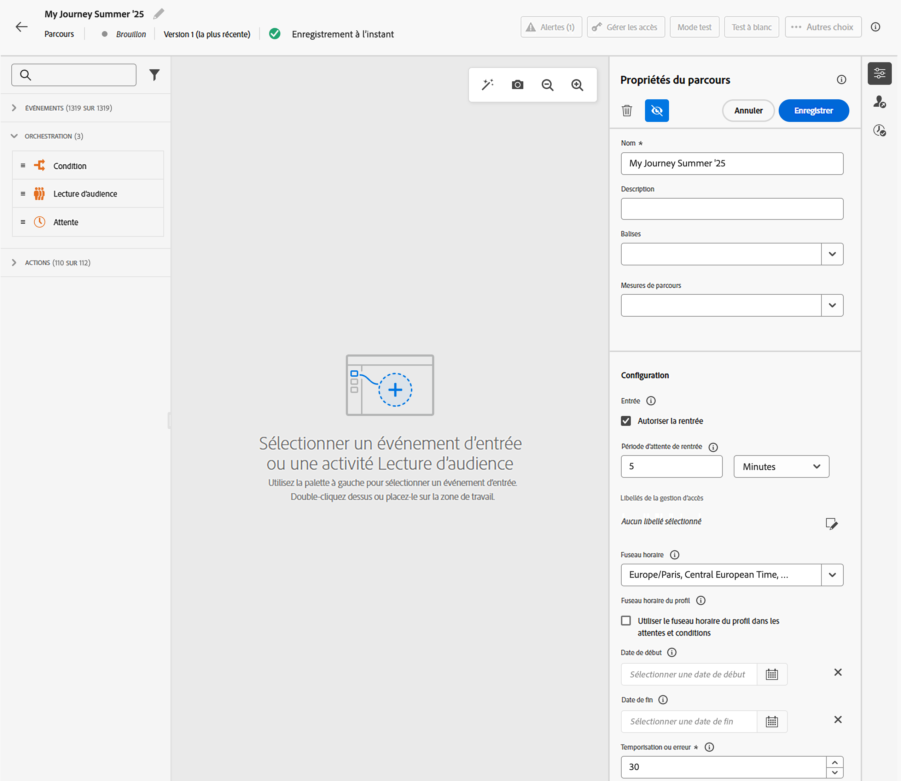
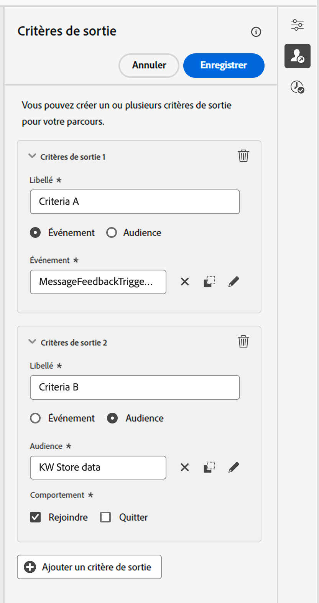

# Définir les propriétés de votre parcours {#jo-properties}

>[!BEGINSHADEBOX]

**Sur cette page :** découvrez comment définir les propriétés globales d’un parcours (nom, règles d’entrée, fuseau horaire, dates de début et de fin, délai d’expiration, critères de sortie et gestion des conflits) à partir du rail de droite lors de la création.

>[!ENDSHADEBOX]

Utilisez les propriétés du parcours pour configurer les paramètres globaux de votre parcours, notamment son nom, les règles d’entrée, son fuseau horaire, ses dates de début et de fin, sa durée de temporisation, ses critères de sortie et la gestion des conflits. Les propriétés sont accessibles à partir du rail de droite à n’importe quelle étape de la création de parcours.

>[!CONTEXTUALHELP]
>id="ajo_journey_properties"
>title="Propriétés du parcours"
>abstract="Les propriétés du parcours contiennent des paramètres globaux pour ce parcours, notamment le nom, les balises, les règles d’entrée, le fuseau horaire, les dates, le délai d’expiration et la gestion des conflits. Les paramètres en lecture seule sont masqués par défaut. Les options disponibles varient en fonction du statut du parcours, de vos autorisations et de la configuration du produit."

## Accéder aux propriétés d’un parcours {#access-properties}

Les propriétés d’un parcours sont centralisées dans le rail de droite. Cette section est affichée par défaut lors de la création d’un parcours. Pour les parcours existants, cliquez sur l’icône en forme de crayon à côté du nom du parcours pour l’ouvrir.

Dans cette section, choisissez le nom du parcours, ajoutez une description et définissez les propriétés globales du parcours.

Vous pouvez effectuer les actions suivantes :

* Attribuez [!DNL Adobe Experience Platform] balises unifiées à votre parcours pour les classer facilement et améliorer la recherche dans la liste des campagnes. [Découvrir comment utiliser les balises](../start/search-filter-categorize.md#tags)
* Sélectionner les mesures du parcours. [Découvrir comment configurer et suivre vos mesures de parcours.](success-metrics.md)
* Gérer [l’entrée et la rentrée](#entrance). La gestion des entrées de profils dépend du type de parcours. Pour plus d’informations, consultez [cette page](entry-management.md).
* Gérer l’[accès aux données](#manage-access)
* Sélectionner les [fuseaux horaires](#timezone) des parcours et des profils.
* Choisir des [dates de début et de fin](#dates) personnalisées.
* Définir une [durée de temporisation](#timeout) dans les activités de parcours (pour les personnes chargées de l’administration uniquement).
* Surveillez la [&#x200B; taille actuelle de la payload du parcours &#x200B;](#journey-payload-size) pour éviter les erreurs de publication
* Surveiller les conflits et gérer la priorité des parcours à l’aide des [outils de gestion des conflits](#conflict).

{width="80%"}{zoomable="yes"}

>[!NOTE]
>
>Pour les parcours actifs, cet écran affiche uniquement la date de publication et le nom de l’utilisateur ou de l’utilisatrice qui a publié le parcours.

L’option **Copier les détails techniques** vous permet de copier les informations techniques relatives au parcours qui pourront être utiles à l’équipe d’assistance technique pour résoudre les éventuels problèmes. Les informations suivantes sont copiées :

**Général**

* `JourneyVersion UID` - Identifiant unique de cette version du parcours
* `OrgID` - Identifiant (IMS) de votre organisation
* `orgName` - Nom de votre organisation
* `sandboxName` - Nom du sandbox dans lequel le parcours s’exécute
* `lastDeployedBy` - Dernier utilisateur à avoir publié le parcours
* `lastDeployedAt` - Date et heure de la dernière publication

**Suspendre et reprendre** (inclus lorsque le parcours a été suspendu au moins une fois)

* `lastPausedAt` - Date et heure de la dernière suspension du parcours
* `lastPausedBy` - Nom d’affichage de l’utilisateur qui a effectué la dernière pause
* `lastPausedById` - Identifiant interne de l’utilisateur ayant effectué la dernière pause
* `lastResumedAt` - Date et heure de la dernière reprise du parcours
* `lastResumedBy` - Nom d’affichage de l’utilisateur qui a effectué la dernière reprise
* `lastResumedById` - Identifiant interne de l&#39;utilisateur ayant effectué la dernière reprise

**Paramètres du parcours en pause** (en `pausedJourneySettings`, lorsque le parcours est ou a été mis en pause)

* `pauseBehavior` - Qu’advient-il des profils du parcours lorsqu’il est en pause (par exemple, les ignorer ou les conserver) ?
* `maxPauseDurationInMinutes` - Durée maximale de pause, en minutes, après laquelle le parcours reprend automatiquement (par exemple, 20160 = 14 jours)
* `transitionStateForAutoResume` - État appliqué lorsque le parcours reprend automatiquement à l’issue de la période de pause (par exemple, arrêter ou continuer)
* `pauseId` - Identifiant unique de l’instance de pause actuelle

Pour plus d’informations sur les champs techniques liés à un parcours pour un profil donné et comment les utiliser, consultez [cette page](expression/journey-properties.md).

## Entrée et rentrée {#entrance}

Le mode d’entrée des profils est défini au niveau du parcours, dans le volet de configuration de droite. Les paramètres sont décrits ci-dessous.

La gestion des entrées de profils dépend du type de parcours. Pour plus d’informations sur la gestion des entrées et des rentrées de profils, consultez [cette page](entry-management.md). En savoir plus sur les taux de traitement des parcours et le flux des profils dans les parcours dans [cette section](entry-management.md#journey-processing-rate).

### Autoriser une nouvelle rentrée  {#allow-reentrance}

>[!CONTEXTUALHELP]
>id="ajo_journey_properties_entrance"
>title="Autoriser une nouvelle rentrée"
>abstract="Par défaut, les nouveaux parcours autorisent la rentrée. En désactivant l’option **Autoriser une reprise**, vous empêchez une personne de rejoindre à nouveau le parcours, par exemple pour offrir un cadeau unique à une personne qui effectue sa première visite dans la boutique."
>additional-url="https://experienceleague.adobe.com/fr/docs/journey-optimizer/using/orchestrate-journeys/manage-journey/entry-management" text="Gestion des entrées de profil"

Par défaut, les nouveaux parcours autorisent la rentrée. Vous pouvez désélectionner l’option **Autoriser la rentrée** pour les parcours « uniques », par exemple, si vous souhaitez offrir un cadeau unique à un utilisateur ou une utilisatrice qui effectue sa première visite dans la boutique.

### Période d’attente de rentrée  {#reentrance-wait}

>[!CONTEXTUALHELP]
>id="ajo_journey_properties_re-entrance_wait"
>title="Période d’attente de rentrée"
>abstract="La période d’attente de reprise est le temps d’attente avant qu’un profil puisse entrer à nouveau dans le parcours dans les parcours unitaires. Cela empêche les utilisateurs et utilisatrices de rejoindre à nouveau le parcours pendant une durée choisie. Durée maximale : 90 jours."
>additional-url="https://experienceleague.adobe.com/fr/docs/journey-optimizer/using/orchestrate-journeys/manage-journey/entry-management" text="Gestion des entrées de profil"

Lorsque l’option **Autoriser une rentrée** est activée, le champ **Période d’attente de rentrée** s’affiche. Ce champ vous permet de définir le temps d’attente avant d’autoriser un profil à entrer à nouveau dans un parcours pour les parcours unitaires (en commençant par un événement ou une qualification d’audience). Cela empêche les parcours d’être déclenchés plusieurs fois par erreur pour le même événement. Par défaut, le champ est défini sur 5 minutes. La durée maximale est de 90 jours.

## Gérer l’accès {#manage-access}

Vous pouvez limiter l’accès à un parcours en fonction des libellés d’accès.

Pour attribuer des libellés d’utilisation des données personnalisés au parcours, cliquez sur l’icône **[!UICONTROL Gérer les libellés d’accès]** et sélectionnez un ou plusieurs libellés.

[En savoir plus sur le contrôle d’accès au niveau de l’objet (OLAC)](../administration/object-based-access.md)

## Taille de la payload du parcours {#journey-payload-size}

>[!CONTEXTUALHELP]
>id="ajo_journey_properties_payload_size"
>title="Taille actuelle de la payload du parcours"
>abstract="Affiche la taille actuelle de la payload du parcours par rapport à la limite configurée. Cet indicateur permet de surveiller la complexité du parcours avant publication et d’éviter les erreurs dues au dépassement de la taille limite de la payload."

Le champ **[!UICONTROL Taille actuelle de la payload du parcours]** du panneau des propriétés du parcours affiche la taille actuelle de la payload de votre parcours par rapport à la limite configurée, par exemple, *1,5 Mo (sur 2 Mo)*. Cet indicateur en lecture seule est visible à n’importe quelle étape de la création de parcours.

{width="50%" zoomable="yes"}

Utilisez ces informations pour surveiller la complexité de votre parcours avant publication. Si la taille de la payload approche ou dépasse la limite, la publication du parcours échoue. Pour réduire la taille, pensez à simplifier la logique du parcours ou à réduire le nombre d’activités.

La limite par défaut est de 4 Mo. Contactez l’assistance clientèle d’Adobe si vous devez demander une limite supérieure pour votre organisation.

Pour plus d&#39;informations sur les seuils, les messages d&#39;avertissement et d&#39;erreur, ainsi que les étapes de dépannage, reportez-vous aux sections Validation de la taille de la payload du Parcours [&#128279;](../start/guardrails.md#journey-payload-size) et [&#x200B; Mécanismes de sécurisation du parcours général](../start/guardrails.md#journeys-guardrails-journeys).

## Fuseaux horaires des parcours et des profils {#timezone}

Le fuseau horaire est défini au niveau du parcours. Vous pouvez saisir un fuseau horaire fixe ou utiliser des profils de [!DNL Adobe Experience Platform] pour définir le fuseau horaire du parcours. Si un fuseau horaire est défini dans [!DNL Adobe Experience Platform] profil, il peut être récupéré dans le parcours.

[En savoir plus sur la gestion des fuseaux horaires](../building-journeys/timezone-management.md)

## Dates de début et de fin {#dates}

>[!CONTEXTUALHELP]
>id="ajo_journey_properties_start_date"
>title="Date de début"
>abstract="La date de début est la date à laquelle les profils peuvent commencer à entrer dans le parcours. Si aucune date de début n’est définie, elle correspond par défaut à la date de publication du parcours."

>[!CONTEXTUALHELP]
>id="ajo_journey_properties_end_date"
>title="Date de fin"
>abstract="La date de fin est celle à laquelle le parcours se termine. À cette date, les profils actifs quittent automatiquement le parcours et aucune nouvelle entrée n’est autorisée."

Par défaut, les profils peuvent rejoindre votre parcours dès qu’il est publié et y rester jusqu’à la [temporisation globale du parcours](#global_timeout). La seule exception concerne les parcours de lecture d’audience récurrents avec l’option **Forcer une rentrée sur la périodicité** activée, qui se termine à la date de début de l’occurrence suivante.

Si nécessaire, vous pouvez définir une **date de début** et une **date de fin** personnalisées. Les profils peuvent ainsi rejoindre votre parcours à une date spécifique et en sortir automatiquement à la date de fin.

## Temporisation {#timeout}

Les paramètres de temporisation contrôlent la durée pendant laquelle un parcours attend l’exécution de l’activité et la durée pendant laquelle les profils peuvent rester dans un parcours.

### Temporisation des activités du parcours {#timeout_and_error}

>[!CONTEXTUALHELP]
>id="ajo_journey_action_timeout"
>title="Temporisation ou erreur"
>abstract="L’option **Temporisation ou erreur** définit un autre chemin d’accès dans le parcours lorsque l’action expire ou renvoie une erreur, de sorte que les profils continuent via un chemin de secours plutôt que de s’arrêter à cette étape. Les valeurs recommandées sont comprises entre 1 et 30 secondes."

Lorsque vous modifiez une action ou une activité de condition, vous pouvez définir un autre chemin en cas d’erreur ou de temporisation. Si la durée de traitement de l’activité qui interroge un système tiers dépasse la durée de temporisation définie dans le champ **[!UICONTROL Temporisation ou erreur]** des propriétés du parcours, le deuxième chemin d’accès est choisi pour effectuer une éventuelle action de remplacement.

Les valeurs recommandées sont comprises entre 1 et 30 secondes.

Nous vous recommandons de définir une valeur très basse pour **[!UICONTROL Temporisation ou erreur]** si votre parcours est sensible au temps (c’est le cas, par exemple, lorsqu’il convient de réagir à l’emplacement d’une personne en temps réel), car l’action ne peut pas être différée de plus de quelques secondes. Si le facteur temps revêt une importance moindre, vous pouvez définir un délai plus long afin d’accorder davantage de temps au système appelé pour envoyer une réponse valide.

Parcours utilise également un délai d’expiration global, comme décrit ci-dessous.

### Temporisation de parcours globale {#global_timeout}

En plus de la [temporisation](#timeout_and_error) utilisée dans les activités de parcours, une temporisation globale de parcours est appliquée. Elle ne s’affiche pas dans l’interface et ne peut pas être modifiée.

Cette temporisation globale arrête la progression des personnes dans le parcours **91 jours** après leur entrée. En d’autres termes, la durée du parcours d’une personne ne peut pas excéder 91 jours. Après cette période de temporisation, les données de cette personne sont supprimées. Les personnes qui sont encore actives dans le parcours au terme de cette période de temporisation seront arrêtées et ne seront pas prises en compte dans le cadre du reporting. Vous pouvez donc voir plus de personnes rejoindre le parcours que le quitter.

>[!NOTE]
>
>La définition exacte du moment où un parcours est considéré comme « terminé » varie selon le type de parcours. [Voir les critères détaillés](end-journey.md#journey-finished-definition).

Compte tenu de la temporisation de 91 jours du parcours, lorsque la rentrée de celui-ci n’est pas autorisée, nous sommes dans l’impossibilité de garantir que le blocage de la rentrée fonctionnera plus de 91 jours. En effet, étant donné que nous supprimons toutes les informations sur les personnes qui ont rejoint le parcours 91 jours après leur entrée, rien ne nous permet de savoir qu’une personne l’a déjà rejoint il y a plus de 91 jours.

Une personne ne peut entrer dans une activité d’attente que si elle dispose de suffisamment de temps dans le parcours pour terminer la durée d’attente avant la temporisation de 91 jours du parcours. Consultez [cette page](../building-journeys/wait-activity.md).

### FAQ sur la durée de vie (TTL) et la conservation des données {#timeout-faq}

Depuis [!DNL Adobe Journey Optimizer] version de juin 2024, le délai d’expiration global par parcours est passé de 30 à 91 jours. Les éléments affectés sont répertoriés dans les questions fréquentes ci-dessous :

**Pour les parcours unitaires**

<table style="table-layout:auto">
  <tr style="border: 1;">
    <td>
      
Qu’advient-il du parcours publié après le déploiement de l’extension de la durée de vie ?

    </td>
    <td>
      
Les profils entrant dans le nouveau parcours auront automatiquement une durée de vie (TTL) de 91 jours.

    </td>
  </tr>
  <tr style="border: 1;">
    <td>
      
Qu’advient-il d’un profil entrant dans un parcours publié avant le lancement de l’extension de la durée de vie ?

    </td>
    <td>
      
Le profil conserve une durée de vie de 30 jours (7 jours pour HIPAA), en fonction de l’heure à laquelle le parcours a été publié à l’origine.

    </td>
  </tr>
  <tr style="border: 1;">
    <td>
      
Que se passe-t-il pour un profil qui a déjà accédé à un parcours au lancement de l’extension de la durée de vie ?

    </td>
    <td>
      
Le profil conserve une durée de vie de 30 jours (7 jours pour HIPAA), selon l’heure de publication originale du parcours.

    </td>
  </tr>
  <tr style="border: 1;">
    <td>
      
Qu’advient-il d’un profil dans une version de parcours précédente qui est republiée après le lancement de l’extension de la durée de vie ?

    </td>
    <td>
      
Le profil conserve une durée de vie de 30 jours (7 jours pour HIPAA), alignée sur l’heure de publication originale du parcours.

    </td>
  </tr>
  <tr style="border: 1;">
    <td>
      
Qu’advient-il d’un nouveau profil entrant dans une version de parcours republiée après le lancement de l’extension de la durée de vie ?

    </td>
    <td>
      
Le profil conserve une durée de vie de 91 jours, correspondant à la durée de vie de la nouvelle version de parcours republiée.

    </td>
  </tr>
</table>

**Pour les parcours de déclenchement de segment**

<table style="table-layout:auto">
  <tr style="border: 1;">
    <td>
      
Qu’advient-il des nouveaux parcours uniques publiés après l’extension de la durée de vie ?

    </td>
    <td>
      
Les profils entrant dans le nouveau parcours auront une durée de vie de 91 jours automatiquement.

    </td>
  </tr>
  <tr style="border: 1;">
    <td>
      
Qu’advient-il des nouveaux parcours récurrents sans nouvelle rentrée forcée publiée après l’extension de la durée de vie ?

    </td>
    <td>
      
Les profils entrant dans le nouveau parcours auront une durée de vie de 91 jours automatiquement.

    </td>
  </tr>
  <tr style="border: 1;">
    <td>
      
Qu’advient-il des nouveaux parcours récurrents avec une rentrée forcée publiée après l’extension de la durée de vie ?

    </td>
    <td>
      
Les profils entrant dans le nouveau parcours auront une durée de vie égale à la période de périodicité. Par exemple, si le parcours s’exécute tous les jours, la durée de vie est d’1 jour.

    </td>
  </tr>
  <tr style="border: 1;">
    <td>
      
Qu’advient-il d’un profil entrant dans un parcours publié avant le lancement de l’extension de la durée de vie ?

    </td>
    <td>
      
Le profil conserve une durée de vie de 30 jours (7 jours pour HIPAA), cohérente avec l’heure de publication originale du parcours. Pour les parcours récurrents avec une rentrée forcée, la durée de vie correspond à la période de périodicité.

    </td>
  </tr>
  <tr style="border: 1;">
    <td>
      
Qu’advient-il d’un profil s’exécutant par le biais d’un parcours lorsque l’extension de la durée de vie est lancée ?

    </td>
    <td>
      
Le profil conserve une durée de vie de 30 jours (7 jours pour HIPAA), selon l’heure de publication originale du parcours. Pour les parcours récurrents avec une rentrée forcée, la durée de vie correspond à la période de périodicité.

    </td>
  </tr>
  <tr style="border: 1;">
    <td>
      
Qu’advient-il d’un profil en cours d’exécution dans une version de parcours précédente qui est republiée après le lancement de l’extension de la durée de vie ?

    </td>
    <td>
      
Le profil conserve une durée de vie de 30 jours (7 jours pour HIPAA), alignée sur l’heure de publication originale du parcours. Pour les parcours récurrents avec une rentrée forcée, la durée de vie correspond à la période de périodicité.

    </td>
  </tr>
  <tr style="border: 1;">
    <td>
      
Qu’advient-il d’un nouveau profil entrant dans une version de parcours republiée après le lancement de l’extension de la durée de vie ?

    </td>
    <td>
      
Le profil conserve une durée de vie de 91 jours, correspondant à la durée de vie de la nouvelle version de parcours republiée. Pour les parcours récurrents avec une rentrée forcée, la durée de vie correspond à la période de périodicité.

    </td>
  </tr>
  <tr style="border: 1;">
    <td>
      
Mon parcours de lecture d’audience récurrent toujours activé s’arrêtera-t-il après 91 jours ?

    </td>
    <td>
      
Non. Un parcours récurrent Lecture d’audience sans date de fin reste <strong>actif</strong> tant qu’il est publié. Il passe à l’état <strong>Terminé</strong> seulement 91 jours après l’exécution de sa <strong>dernière occurrence</strong>. La temporisation globale de 91 jours s’applique aux profils individuels traversant le parcours (durée d’activité maximale par profil), et non au statut Actif du parcours.

    </td>
  </tr>
  <tr style="border: 1;">
    <td>
      
Quelle est la différence entre le délai d’expiration de parcours de 91 jours et le créneau de rapport de 91 jours ?

    </td>
    <td>
      
Ce sont deux concepts distincts. La temporisation globale de <strong>parcours </strong> (91 jours) est la durée maximale pendant laquelle un profil individuel peut rester actif dans un parcours. Après 91 jours, le profil est quitté et ses données sont supprimées. La <strong> fenêtre de création de rapports </strong> (environ 91 jours) est une limite d’affichage dans l’interface utilisateur : les données de performances datant de plus de 91 jours ne sont plus visibles dans les rapports, mais le parcours lui-même continue de s’exécuter et de nouveaux profils continuent de saisir des données.

    </td>
  </tr>
</table>

## Politique de fusion {#merge-policies}

>[!CONTEXTUALHELP]
>id="ajo_journey_properties_merge_policy"
>title="Politique de fusion"
>abstract="La politique de fusion est automatiquement récupérée en fonction de l’événement ou de l’audience sélectionné. Cette politique de fusion est utilisée dans l’ensemble du parcours."

[!DNL Adobe Journey Optimizer] utilise des politiques de fusion lors de la récupération des données de profil de [!DNL Adobe Experience Platform]. Selon le type de parcours, différentes politiques de fusion sont utilisées :

* Dans les parcours **[Lecture d’audience](read-audience.md)** ou **[Qualification d’audience](audience-qualification-events.md)** : la politique de fusion de l’audience est utilisée
* Dans les parcours **[Événement unitaire](../event/about-events.md)** : la politique de fusion par défaut est utilisée
* Dans les parcours **[Événement métier](../event/about-creating-business.md)** : la politique de fusion de l’audience ciblée dans l’activité Lecture d’audience suivante est utilisée

[!DNL Adobe Journey Optimizer] applique la politique de fusion utilisée dans l’ensemble du parcours. Par conséquent, si de multiples audiences sont utilisées dans un parcours (par exemple dans les fonctions [`inAudience`](functions/functioninaudience.md)), ce qui crée des incohérences avec la politique de fusion utilisée par le parcours, une erreur se produit et la publication est bloquée. Cependant, si une audience incohérente est utilisée dans la personnalisation des messages, une alerte n’est pas déclenchée, malgré l’incohérence. C’est pourquoi il est vivement recommandé de vérifier la politique de fusion associée à votre audience lorsque celle-ci est utilisée dans la personnalisation des messages.

Pour en savoir plus sur les politiques de fusion, consultez la [[!DNL Adobe Experience Platform] documentation](https://experienceleague.adobe.com/fr/docs/experience-platform/profile/merge-policies/overview){target="_blank"}.

>[!NOTE]
>
>Lorsque vous mettez à jour une politique de fusion d’audience, vous devez republier (ou dupliquer) tout parcours actif référençant cette audience. La modification de la politique de fusion crée de fait une « nouvelle » audience à laquelle le parcours en cours ne peut pas accéder, ce qui garantit la cohérence des données.

## Critères de sortie {#exit-criteria}

>[!CONTEXTUALHELP]
>id="ajo_journey_exit_criterias"
>title="Critères de sortie"
>abstract="Cette section présente les options de critères de sortie, dans lesquelles une ou plusieurs règles et filtres de critères de sortie peuvent être définis pour le parcours."

### Critères de sortie de parcours {#exit-criteria-desc}

En ajoutant des critères de sortie, vous faites en sorte que les profils quittent le parcours dès qu’un événement se produit (par exemple, un achat) ou qu’ils remplissent les critères pour une audience. Cela évite à l’utilisateur ou à l’utilisatrice de recevoir d’autres communications du parcours.

Vous pouvez supprimer des profils d’un parcours lorsqu’ils ne remplissent plus l’objectif du parcours. Pour ce faire, utilisez les **critères de sortie globale**, qui sont étroitement associés à la gestion des objectifs.

>[!TIP]
>
>Vous recherchez des conseils pratiques avec des exemples concrets ? Consultez notre [guide complet relatif aux critères d’entrée et de sortie de parcours](entry-exit-criteria-guide.md), qui comprend des cas d’utilisation complets avec des configurations d’entrée et de sortie, des bonnes pratiques et des stratégies d’optimisation.

**Exemple de cas d’utilisation**

Une personne spécialiste du marketing dispose d’un parcours promotionnel avec une série de communications. Chacune de ces communications a pour but d’inciter le client ou la cliente à effectuer un achat. Dès que l’achat est effectué, le client ou la cliente ne doit pas recevoir le reste des messages de la série. En définissant un critère de sortie, tous les profils ayant effectué un achat sont supprimés du parcours.

### Configuration et utilisation {#exit-criteria-config}

Les critères de sortie sont définis au niveau du parcours. Un parcours peut comporter plusieurs critères de sortie. Lorsque plusieurs critères de sortie sont définis, l’évaluation se fait de haut en bas avec une logique `OR`. Ainsi, si vous disposez des critères de sortie A et B, ils seront évalués en tant que A **OU** B. Les critères sont évalués à chaque étape du parcours.

Pour **créer** un critère de sortie, procédez comme suit :

1. Ouvrez votre parcours.

1. Cliquez sur l’icône  **[!UICONTROL Afficher les critères de sortie]** située dans la section supérieure droite de la zone de travail du parcours.

1. Sélectionnez **[!UICONTROL Ajouter un critère de sortie]**.

1. Saisissez un **libellé** et sélectionnez si votre critère de sortie est basé sur un **événement** ou une **audience**.

   * Pour les critères de sortie basés sur un événement, comme le téléchargement d’une application ou l’ajout d’un produit à un panier, sélectionnez uniquement un événement unitaire.
   * Pour les critères de sortie en fonction d’une audience, par exemple une audience qui vérifie si un client ou une cliente a effectué un achat au cours des dernières 24 heures, sélectionnez une audience. Note : pour être efficaces, les critères de sortie utilisant une audience peuvent prendre jusqu’à 10 minutes.

Vous pouvez ajouter plusieurs critères de sortie. Le critère de sortie est désormais actif et sera évalué à chaque étape du parcours.

{width="40%"}

### Critères de sortie basés sur des attributs de profil {#profile-exit-criteria}

Les critères de sortie basés sur des attributs de profil vous donnent un meilleur contrôle sur les parcours en pause en vous permettant de définir des règles qui suppriment automatiquement des profils spécifiques avant la reprise du parcours. Vous pouvez définir des conditions de sortie en fonction des attributs de profil (tels que l’emplacement, le statut ou les préférences) afin de vous assurer que seuls les profils pertinents poursuivent le parcours après sa reprise.

Par exemple, vous pouvez [mettre un parcours en pause](journey-pause.md), ajouter une condition de sortie pour supprimer tous les profils situés en France et reprendre le parcours en sachant que ces profils seront exclus à l’étape d’action suivante. Cette logique s’applique à la fois aux profils déjà présents dans le parcours et aux nouveaux profils qui remplissent les critères après la reprise du parcours.

Cette fonction complète la fonctionnalité Mettre en pause/Reprendre, ce qui vous permet de gérer les parcours de manière plus sécurisée et plus flexible. Elle minimise les interventions manuelles, réduit le risque d’envoi de communications non pertinentes ou non conformes et maintient votre logique de parcours alignée sur les besoins actuels de l’entreprise.

Reportez-vous à cette section pour savoir comment [utiliser les critères de sortie d’attribut de profil dans les parcours mis en pause](journey-pause.md#journey-pause-sample).

### Mécanismes de sécurisation et limitations {#exit-criteria-guardrails}

Les mécanismes de sécurisation et limitations suivants s’appliquent à la fonctionnalité de [critère de sortie de parcours](#exit-criteria-desc) :

* Les critères de sortie sont définis en état de brouillon uniquement.
* Cohérence de l’espace de noms de parcours entre les événements et les critères de sortie basés sur un événement

Les mécanismes de sécurisation suivants s’appliquent lors de l’utilisation de la fonctionnalité [Critères de sortie basés sur des attributs de profil](#profile-exit-criteria) :

* **Les critères de sortie s’appliquent au niveau de l’action**.\
  Les critères de sortie « Attribut de profil » sont évalués uniquement aux étapes d’action. Contrairement aux autres types de critères de sortie, ils ne s’appliquent pas globalement au parcours.\
  Si vous reprenez un parcours et que certains profils remplissent la condition de sortie, ces profils seront exclus au nœud d’action suivant.\
  Les nouveaux profils qui rejoignent le parcours après la reprise seront également évalués et exclus au niveau de leur premier nœud d’action, s’ils remplissent la condition.

* **Une règle de sortie basée sur un profil par parcours**\
  Vous pouvez définir un seul critère de sortie « Attribut de profil » par parcours. Cette limitation permet de maintenir la clarté et d’éviter les conflits dans la logique de parcours.

* **Disponible uniquement dans les parcours mis en pause**\
  Vous pouvez ajouter ou modifier des critères de sortie « Attribut de profil » uniquement lorsque le parcours est mis en pause.

   * Dans un **brouillon de parcours**, l’option *Attribut de profil* apparaît désactivée (lecture seule), tandis que les options *Événement* et *Audience* restent actives.
   * Dans un **parcours mis en pause**, l’option *Attribut de profil* devient modifiable et les options *Événement* et *Audience* sont en lecture seule.

### Rubriques connexes {#exit-criteria-related}

* [Guide des critères d’entrée et de sortie de parcours](entry-exit-criteria-guide.md) : guide complet avec des exemples réels et des bonnes pratiques.
* [Gestion des entrées de profil](entry-management.md) : configurez la manière dont les profils rejoignent les parcours.
* [Comment se terminent les parcours &#x200B;](end-journey.md) : comprenez la fin naturelle des parcours.
* [Mettre en pause un parcours avec des critères de sortie d’attribut de profil](journey-pause.md#journey-exit-criteria) : utilisez des critères de sortie lors de la mise en pause des parcours.

## Planning du parcours {#schedule}

La section **[!UICONTROL Planifier]** n’est disponible que lorsqu’une activité **[!UICONTROL Lecture d’audience]** a été déposée dans la zone de travail. Elle vous permet de définir une date/heure et une fréquence spécifiques auxquelles le parcours doit s’exécuter. [Découvrir comment planifier un parcours Lecture d’audience](read-audience.md#schedule)

>[!TIP]
>
>Lors de la planification du parcours, vous pouvez également configurer l’envoi de vagues pour diffuser des actions de parcours par lots au fil du temps. [Découvrez comment envoyer à l’aide de vagues dans les parcours &#x200B;](send-using-waves.md)

## Gestion des conflits {#conflict}

La section **[!UICONTROL Gestion des conflits]** dans les propriétés du parcours vous permet de surveiller les conflits et de gérer la priorité de vos parcours. Vous pouvez effectuer les actions suivantes :

* Appliquez un **jeu de règles** pour exclure ce parcours pour une partie de votre audience en fonction de règles de capping de fréquence. [Découvrir comment utiliser les jeux de règles](../conflict-prioritization/rule-sets.md)

* Attribuez un **score de priorité** au parcours, allant de 0 à 100. Un nombre plus élevé indique une priorité plus élevée. La valeur de priorité insérée ici est héritée par toute action entrante (in-app, par exemple) contenue dans ce parcours. [Découvrir comment utiliser les scores de priorité](../conflict-prioritization/priority-scores.md)

  Dans les cas où cette même configuration de canal entrant est utilisée dans d’autres campagnes ou parcours, l’action entrante ayant le score de priorité le plus élevé est présentée aux destinataires. Si plusieurs parcours ou campagnes ont le même score, l’élément qui a été modifié le plus récemment est choisi.

* **Affichez les conflits** avec d’autres configuration de parcours, de campagnes, ou de canaux. Si vous souhaitez identifier un chevauchement concernant l’audience, la date de début et de fin, la configuration des canaux, le canal ou le jeu de règles, vous pouvez afficher les conflits potentiels ici. [Découvrir comment identifier les conflits potentiels dans un parcours](../conflict-prioritization/conflicts.md)

## Questions fréquentes {#faq}

**Où puis-je trouver les propriétés d’un parcours ?**

Les propriétés se trouvent dans le rail droit de la zone de travail du parcours. Ils apparaissent par défaut lors de la création d’un parcours. Pour un parcours existant, cliquez sur l’icône en forme de crayon en regard du nom du parcours pour l’ouvrir. Pour les parcours en direct, le panneau affiche uniquement la date de publication et le nom de l’utilisateur ou de l’utilisatrice qui a publié le parcours. Voir [Accès aux propriétés d’un parcours &#x200B;](#access-properties).

**Puis-je modifier les propriétés d’un parcours en direct ?**

La plupart des propriétés sont en lecture seule une fois qu’un parcours est actif. Pour les modifier, créez une nouvelle version du parcours ou dupliquez le parcours, apportez vos modifications dans le brouillon, puis [publiez](publish-journey.md) à nouveau.

**Quelle est la différence entre le paramètre de reprise et la période d’attente de reprise ?**

**[Autoriser une reprise](#allow-reentrance)** contrôle si un profil peut entrer dans le parcours plusieurs fois. La **[Période d’attente de reprise](#reentrance-wait)** (affichée uniquement lorsque la reprise est autorisée) définit la durée d’attente avant que le même profil puisse rejoindre à nouveau un parcours unitaire. La valeur par défaut est de 5 minutes et la valeur maximale est de 90 jours. Pour plus d’informations, voir [Gestion des entrées de profil](entry-management.md).

**Combien de temps un profil peut-il rester dans un parcours ?**

Un [délai d’expiration global du parcours &#x200B;](#global_timeout) arrête un profil **91 jours** après son entrée ; le parcours d’un individu ne peut pas durer plus longtemps. Ce délai d’expiration ne s’affiche pas dans l’interface et ne peut pas être modifié. Les données de profil étant supprimées après 91 jours, le blocage de reprise ne peut pas être garanti au-delà de cette période. Consultez également la section [Comment les parcours se terminent](end-journey.md#journey-finished-definition).

**Pourquoi la publication de mon parcours échoue-t-elle en raison de la taille de la payload ?**

L’indicateur **[!UICONTROL Taille actuelle de la payload du parcours]** affiche la payload de votre parcours par rapport à la limite configurée (4 Mo par défaut). Si la payload approche ou dépasse la limite, la publication échoue. Réduisez la taille en simplifiant la logique du parcours ou en réduisant le nombre d’activités, ou contactez l’assistance clientèle d’Adobe pour demander une limite plus élevée. Voir les sections [Taille de la payload de Parcours &#x200B;](#journey-payload-size) [Validation de la taille de la payload de Parcours &#x200B;](../start/guardrails.md#journey-payload-size) et [Mécanismes de sécurisation généraux du parcours &#x200B;](../start/guardrails.md#journeys-guardrails-journeys).

**Quelle politique de fusion mon parcours utilise-t-il ?**

Cela dépend du type de parcours : [Lecture d’audience](read-audience.md) et [Qualification de l’audience](audience-qualification-events.md) les parcours utilisent la politique de fusion de l’audience, [événement unitaire](../event/about-events.md) les parcours utilisent la politique de fusion par défaut et [événement métier](../event/about-creating-business.md) les parcours utilisent la politique de fusion de l’audience ciblée dans l’activité Lecture d’audience suivante. La même politique de fusion s’applique à l’ensemble du parcours. Si une politique de fusion d’audience est mise à jour, tout parcours actif référençant cette audience doit être republié ou dupliqué. Voir [&#x200B; Politique de fusion &#x200B;](#merge-policies).

**Quelle est la différence entre le délai d’expiration de parcours de 91 jours et le créneau de rapport de 91 jours ?**

Il s’agit de concepts distincts. La temporisation globale de **[parcours](#global_timeout)** (91 jours) est la durée maximale pendant laquelle un profil individuel peut rester actif dans un parcours, après laquelle le profil se ferme et ses données sont supprimées. La **fenêtre de création de rapports** (environ 91 jours) est une limite d’affichage de l’interface utilisateur : les données de performances datant de plus de 91 jours ne sont plus visibles, mais le parcours continue de fonctionner et de nouveaux profils continuent de s’afficher. Pour plus d’informations sur la durée de vie et la conservation des données, consultez la [FAQ sur la durée de vie (TTL) et la conservation des données](#timeout-faq).

## Rubriques connexes {#related-topics}

* [Gestion de l’entrée des profils](entry-management.md) - Configurer la manière dont les profils entrent et rentrent dans les parcours
* [Guide des critères d’entrée et de sortie de parcours](entry-exit-criteria-guide.md) : guide complet avec des exemples réels et des bonnes pratiques.
* [Fin des parcours &#x200B;](end-journey.md) - Comprendre la fin naturelle du parcours et la sortie du profil
* [Suspendre un parcours &#x200B;](journey-pause.md) - Suspendre et reprendre les parcours avec les critères de sortie d’attribut de profil
* [Gestion des fuseaux horaires](timezone-management.md) - Configuration des fuseaux horaires de parcours et de profil
* [Gestion et hiérarchisation des conflits](../conflict-prioritization/conflicts.md) - Identifiez et résolvez les conflits entre les parcours et les campagnes

+++ Référence des connaissances sur l’IA

Cette section contient des connaissances structurées destinées à soutenir l’interprétation, la récupération et la réponse aux questions liées à ce sujet.

Pour une compréhension totale, ces informations doivent être combinées avec la documentation de cette page. Aucune des sources n’est conçue pour être autonome. La page décrit la fonctionnalité, tandis que cette section fournit un contexte supplémentaire qui permet de clarifier la terminologie, l’intention, l’applicabilité et les contraintes.

* **TL;DR:** Cette page explique comment configurer et gérer tous les paramètres globaux d’un parcours, y compris les règles d’entrée, les fuseaux horaires, les dates de début et de fin, le comportement du délai d’expiration, les critères de sortie, la taille de la payload et la gestion des conflits.

**Intentions:**

* Configurer des règles d’entrée et de reprise de parcours pour les profils
* Définir les dates de début et de fin pour contrôler quand les profils peuvent entrer dans un parcours ou en sortir
* Définissez des critères de sortie pour supprimer automatiquement les profils lorsqu’une condition commerciale est remplie
* Gérer l’accès à un parcours à l’aide de libellés de contrôle d’accès au niveau de l’objet
* Surveiller la taille de la payload du parcours pour éviter les échecs de publication
* Résoudre les conflits et attribuer des scores de priorité aux parcours et aux campagnes

**Glossaire:**

* **Propriétés du Parcours** : panneau des paramètres globaux (rail de droite) qui contrôle le nom, les règles d’entrée, le fuseau horaire, les dates, le délai d’expiration, la taille de la payload et la gestion des conflits pour un parcours. *(spécifique au produit)*
* **Période d’attente de reprise** : durée minimale pendant laquelle un profil doit attendre avant d’être autorisé à rejoindre à nouveau un parcours unitaire ; 90 jours au maximum. *(spécifique au produit)*
* **Délai d’expiration global du parcours (TTL)** : durée maximale pendant laquelle un profil peut rester actif dans un parcours (actuellement 91 jours), après laquelle le profil est quitté et ses données supprimées. *(spécifique au produit)*
* **Critères de sortie** : règles définies au niveau du parcours qui suppriment automatiquement les profils d’un parcours lorsqu’un événement spécifié se produit ou qu’une condition d’audience est remplie. *(spécifique au produit)*
* **Critères de sortie basés sur les attributs de profil** : règles de sortie basées sur les attributs de profil (par exemple, emplacement, statut) qui sont évalués aux étapes d’action et ne sont modifiables que lorsqu’un parcours est en pause. *(spécifique au produit)*
* **Politique de fusion** : ensemble de règles utilisé par Adobe Experience Platform pour regrouper des données de profil provenant de plusieurs sources ; appliqué de manière cohérente sur l’ensemble du parcours. *(spécifique au produit)*
* **Gestion des conflits** : outils dans les propriétés du parcours permettant d’attribuer des scores de priorité, d’appliquer des ensembles de règles et d’identifier les parcours ou campagnes qui se chevauchent. *(spécifique au produit)*
* **Taille de la payload du Parcours** : taille actuelle de la payload de définition du parcours par rapport à la limite configurée ; dépassement de la limite de publication des blocs. *(spécifique au produit)*
* **OLAC (Object Level Access Control)** : modèle d’autorisation qui limite l’accès à des parcours individuels à l’aide de libellés d’utilisation des données.

**Mécanismes de sécurisation :**

* La période d’attente de reprise maximale est de 90 jours
* La temporisation globale du parcours est de 91 jours ; au-delà de cette période, les données de profil sont supprimées et le profil est quitté
* La limite par défaut de la payload du parcours est de 4 Mo. Si elle est dépassée, la publication est impossible. Contactez l’assistance clientèle d’Adobe pour obtenir une limite plus élevée.
* Les critères de sortie ne sont configurables qu’en statut brouillon (types d’événement/d’audience) ; les critères de sortie des attributs de profil ne sont modifiables que lorsque le parcours est en pause
* Une seule règle de critère de sortie d’attribut de profil est autorisée par parcours
* Les critères de sortie des attributs de profil sont évalués aux étapes d’action uniquement, et non globalement
* Lorsqu’une politique de fusion d’audience est mise à jour, tout parcours actif référençant cette audience doit être republié
* Politiques de fusion incohérentes dans une publication de bloc de parcours ; les incohérences dans la personnalisation des messages ne déclenchent pas d’alerte
* Pour les parcours en direct, le panneau Propriétés affiche uniquement la date de publication et le nom de l’éditeur

**Terminologie:**

* Nom canonique : propriétés du Parcours — Acronyme : none — variantes : paramètres du parcours, panneau de configuration du parcours
* Synonymes : « délai d’expiration du parcours global » = « TTL » = « Time-to-Live »
* Ne confondez pas : « délai d’expiration global du parcours (91 jours) » ≠ « fenêtre de création de rapports (~91 jours) » : le délai d’expiration limite la durée de profil individuel dans un parcours ; le délai de création de rapports est une limite d’affichage de l’interface utilisateur pour les données d’analyse

**FAQ:**

* **Q : Combien de temps un profil peut-il rester dans un parcours ?** : 91 jours au maximum (délai d’expiration global du parcours) ; au-delà de cette période, le profil est automatiquement quitté et ses données sont supprimées.
* **Q : Puis-je modifier les propriétés du parcours lorsque le parcours est actif ?** — Pour les parcours en direct, le panneau Propriétés affiche uniquement la date de publication et le nom de l&#39;éditeur ; les modifications structurelles nécessitent une nouvelle version.
* **Q : Que se passe-t-il lorsque plusieurs critères de sortie sont configurés ?** — Ils sont évalués de haut en bas avec une logique OR à chaque étape du parcours ; un profil se ferme lorsqu’un critère est satisfait.
* **Q : Comment empêcher un profil de rejoindre à nouveau un parcours ?** — Décochez l&#39;option « Autoriser une reprise » dans les propriétés de parcours ; cela convient aux expériences ponctuelles telles qu&#39;une offre cadeau.
* **Q : Quelle est la différence entre le délai d’expiration du parcours et la date de fin ?** — La date de fin arrête toutes les nouvelles entrées et quitte automatiquement les profils actifs à cette date spécifique ; la temporisation globale de 91 jours s’applique par profil à partir du moment où il entre, quelle que soit la date de fin du parcours.
* **Q : Comment la politique de fusion est-elle déterminée pour un parcours ?** — Cela dépend du type de parcours : les parcours Lecture d&#39;audience et Qualification d&#39;audience utilisent la politique de fusion de l&#39;audience ; les parcours d&#39;événement unitaire utilisent la politique de fusion par défaut ; les parcours d&#39;événement métier utilisent la politique de fusion de l&#39;audience ciblée dans l&#39;activité Lecture d&#39;audience suivante.

+++
