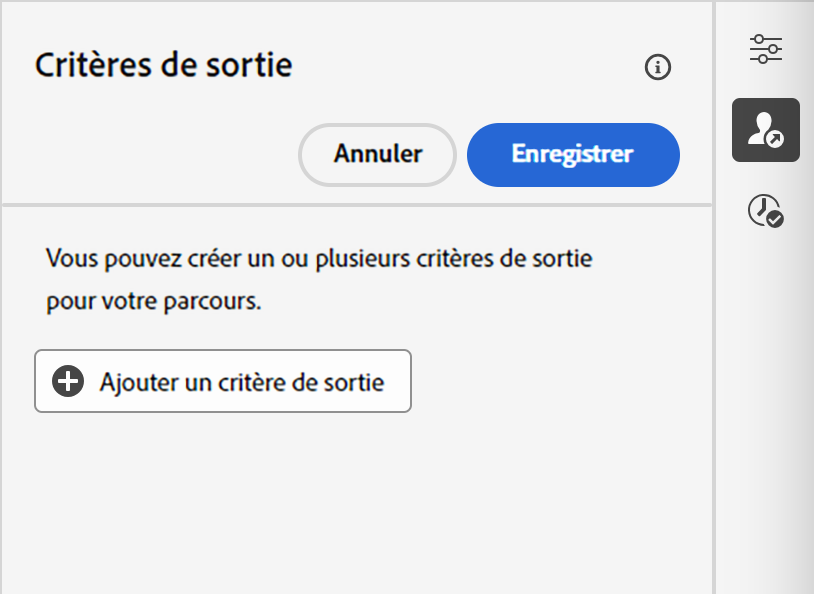

# Définir les propriétés de votre parcours {#jo-properties}

>[!CONTEXTUALHELP]
>id="ajo_journey_properties"
>title="Propriétés du parcours"
>abstract="Cette section présente les propriétés du parcours. Par défaut, les paramètres en lecture seule sont masqués. Les paramètres disponibles dépendent du statut du parcours, de vos autorisations et de la configuration de votre produit."

## Accéder aux propriétés d’un parcours {#access-properties}

Les propriétés d’un parcours sont centralisées dans le rail de droite. Cette section est affichée par défaut lors de la création d’un parcours. Pour les parcours existants, cliquez sur l’icône en forme de crayon à côté du nom du parcours pour l’ouvrir.

Depuis cette section, vous pouvez définir le nom du parcours, ajouter une description et :

* gérer [entrée et rentrée](#entrance),
* choisir les [dates](#dates) de début et de fin,
* gérer [l’accès aux données](#manage-access),
* définir une [durée de temporisation](#timeout) dans les activités de parcours (pour les personnes chargées de l’administration uniquement),
* sélectionner les [fuseaux horaires](#timezone) des parcours et des profils,
* attribuer des balises unifiées Adobe Experience Platform à votre parcours afin de les classer facilement et d’améliorer la recherche dans la liste des campagnes. [Découvrir comment utiliser les balises](../start/search-filter-categorize.md#tags)

>[!NOTE]
>
>Pour les parcours actifs, cet écran affiche la date de publication et le nom de l’utilisateur ou de l’utilisatrice qui a publié le parcours.

La fonction **Copier les détails techniques** permet de copier les informations techniques relatives au parcours qui seront utiles à l’équipe d’assistance technique pour résoudre les problèmes. Les informations suivantes sont copiées : `JourneyVersion UID`, `OrgID`, `orgName`, `sandboxName`, `lastDeployedBy`, `lastDeployedAt`.

Pour plus d’informations sur les champs techniques liés à un parcours pour un profil donné et comment les utiliser, consultez [cette page](expression/journey-properties.md).

## Entrée et rentrée {#entrance}

Le mode d’entrée des profils est défini au niveau du parcours, dans le volet de configuration de droite. Les paramètres sont décrits ci-dessous.

La gestion des entrées de profil dépend du type de parcours. Pour en savoir plus sur la gestion des entrées et des entrées de profil, consultez [cette page](entry-management.md).

### Autoriser la réentrée  {#allow-reentrance}

>[!CONTEXTUALHELP]
>id="ajo_journey_properties_entrance"
>title="Autoriser la réentrée"
>abstract="Par défaut, les nouveaux parcours autorisent la réentrée. Vous pouvez décocher l&#39;option **Autoriser la rentrée** par exemple si vous souhaitez offrir un cadeau unique lorsqu&#39;une personne entre dans une boutique."
>additional-url="https://experienceleague.adobe.com/fr/docs/journey-optimizer/using/orchestrate-journeys/manage-journey/entry-management" text="Gestion des entrées de profil"

Par défaut, les nouveaux parcours autorisent la réentrée. Vous pouvez décocher l&#39;option **Autoriser la rentrée** pour les parcours &quot;à un tir&quot;, par exemple si vous souhaitez offrir un cadeau ponctuel lorsqu&#39;une personne entre dans une boutique.

### Période d’attente de rentrée  {#reentrance-wait}

>[!CONTEXTUALHELP]
>id="ajo_journey_properties_re-entrance_wait"
>title="Période d’attente de rentrée"
>abstract="Définissez le temps d’attente avant de permettre à un profil de reprendre le parcours dans les parcours unitaires. Cela empêche les utilisateurs de revenir sur le parcours pendant une durée donnée. Durée maximale : 90 jours."
>additional-url="https://experienceleague.adobe.com/fr/docs/journey-optimizer/using/orchestrate-journeys/manage-journey/entry-management" text="Gestion des entrées de profil"

Lorsque l’option **Autoriser la rentrée** est activée, le champ **Période d’attente de rentrée** s’affiche. Ce champ vous permet de définir le temps d’attente avant d’autoriser un profil à entrer à nouveau dans un parcours pour les parcours unitaires (en commençant par un événement ou une qualification d’audience). Cela empêche les parcours d’être déclenchés plusieurs fois par erreur pour le même événement. Par défaut, le champ est défini sur 5 minutes. La durée maximale est de 90 jours.

## Gérer l’accès {#manage-access}

Pour attribuer des libellés d’utilisation des données personnalisés ou de base au parcours, cliquez sur le bouton **[!UICONTROL Gérer l’accès]**. [En savoir plus sur le contrôle d’accès au niveau de l’objet (OLAC)](../administration/object-based-access.md)

## Fuseaux horaires des parcours et des profils {#timezone}

Le fuseau horaire est défini au niveau du parcours. Vous pouvez entrer un fuseau horaire fixe ou utiliser les profils Adobe Experience Platform pour définir le fuseau horaire du parcours. Si un fuseau horaire est défini dans le profil Adobe Experience Platform, il peut être récupéré dans le parcours.

Pour plus d&#39;informations sur la gestion des fuseaux horaires, voir [cette page](../building-journeys/timezone-management.md).

## Dates de début et de fin {#dates}

>[!CONTEXTUALHELP]
>id="ajo_journey_properties_start_date"
>title="Date de début"
>abstract="Sélectionnez la date à laquelle l’entrée dans le parcours peut commencer. Si aucune date de début n’est spécifiée, elle est automatiquement définie au moment de la publication."

>[!CONTEXTUALHELP]
>id="ajo_journey_properties_end_date"
>title="Date de fin"
>abstract="Sélectionnez la date de fin de votre parcours. Une fois cette date atteinte, les profils de ce parcours le quittent automatiquement et les nouveaux ne peuvent plus y entrer."

Vous pouvez définir une **date de début**. Si vous n’en avez pas spécifié une, elle sera automatiquement définie au moment de la publication.

Vous pouvez également ajouter une **date de fin**. Cela permet aux profils de se fermer automatiquement lorsque la date est atteinte. Si aucune date de fin n’est spécifiée, les profils peuvent rester jusqu’à la [temporisation globale du parcours](#global_timeout) (ce qui correspond généralement à 91 jours). La seule exception concerne les parcours d’audience en lecture récurrente avec l’activation de l’option **Forcer la réentrée sur la périodicité**, qui se terminent à la date de début de l’occurrence suivante.

## Temporisation {#timeout}

### Temporisation ou erreur dans les activités du parcours {#timeout_and_error}

>[!CONTEXTUALHELP]
>id="ajo_journey_properties_timeout"
>title="Temporisation"
>abstract="Définissez la durée pendant laquelle le parcours tentera d’exécuter une action ou de vérifier une condition avant de considérer que le délai a expiré."

Lorsque vous modifiez une action ou une activité de condition, vous pouvez définir un autre chemin en cas d’erreur ou de temporisation. Si la durée de traitement de l’activité qui interroge un système tiers dépasse la durée de temporisation définie dans le champ **[!UICONTROL Temporisation ou erreur]** des propriétés du parcours, le deuxième chemin d’accès est choisi pour effectuer une éventuelle action de remplacement.

Les valeurs autorisées sont comprises entre 1 et 30 secondes.

Nous vous recommandons de définir une valeur très basse pour **[!UICONTROL Temporisation ou erreur]** si votre parcours est sensible au temps (c’est le cas, par exemple, lorsqu’il convient de réagir à l’emplacement d’une personne en temps réel), car l’action ne peut pas être différée de plus de quelques secondes. Si le facteur temps revêt une importance moindre, vous pouvez définir un délai plus long afin d’accorder davantage de temps au système appelé pour envoyer une réponse valide.

Les parcours utilisent également une temporisation globale comme décrit ci-dessous.

### Temporisation de parcours globale {#global_timeout}

En plus de la [temporisation](#timeout_and_error) utilisée dans les activités de parcours, une temporisation globale de parcours est appliquée. Elle ne s’affiche pas dans l’interface et ne peut pas être modifiée.

Cette temporisation globale met fin à la progression des personnes dans le parcours **91 jours** après leur entrée. En d’autres termes, la durée du parcours d’une personne ne peut pas excéder 91 jours. Après cette période de temporisation, les données de cette personne sont supprimées. Les personnes qui sont encore actives dans le parcours au terme de cette période de temporisation seront arrêtées et ne seront pas prises en compte dans le cadre du reporting. Vous pouvez donc voir plus de personnes rejoindre le parcours que le quitter.

En raison du délai d’attente de 91 jours du parcours, lorsque la réentrée du parcours n’est pas autorisée, nous ne pouvons pas nous assurer que le blocage de la réentrée fonctionnera plus de 91 jours. En effet, étant donné que nous supprimons toutes les informations sur les personnes qui ont rejoint le parcours 91 jours après leur entrée, rien ne nous permet de savoir qu’une personne l’a déjà rejoint il y a plus de 91 jours.

Une personne ne peut entrer dans une activité d’attente que si elle dispose de suffisamment de temps dans le parcours pour terminer la durée d’attente avant la temporisation de 91 jours du parcours. Consultez [cette page](../building-journeys/wait-activity.md).

#### Questions fréquentes sur la durée de vie (TTL) et la rétention des données {#timeout-faq}

À compter de la version de juin 2024 d’Adobe Journey Optimizer, la temporisation globale du parcours est passée de 30 à 91 jours. Les impacts sont répertoriés dans les questions fréquentes ci-dessous :

**Pour les parcours unitaires**
<table style="table-layout:auto">
  <tr style="border: 1;">
    <td>
      
Qu’advient-il du parcours publié après le déploiement de l’extension de la durée de vie ?

    </td>
    <td>
      
Les profils entrant dans le nouveau parcours auront automatiquement une durée de vie (TTL) de 91 jours.

    </td>
  </tr>
  <tr style="border: 1;">
    <td>
      
Qu’advient-il d’un profil entrant dans un parcours publié avant le lancement de l’extension de la durée de vie ?

    </td>
    <td>
      
Le profil conserve une durée de vie de 30 jours (7 jours pour HIPAA), en fonction de l’heure à laquelle le parcours a été publié à l’origine.

    </td>
  </tr>
  <tr style="border: 1;">
    <td>
      
Que se passe-t-il pour un profil qui a déjà accédé à un parcours au lancement de l’extension de la durée de vie ?

    </td>
    <td>
      
Le profil conserve une durée de vie de 30 jours (7 jours pour HIPAA), selon l’heure de publication originale du parcours.

    </td>
  </tr>
  <tr style="border: 1;">
    <td>
      
Qu’advient-il d’un profil dans une version de parcours précédente qui est republiée après le lancement de l’extension de la durée de vie ?

    </td>
    <td>
      
Le profil conserve une durée de vie de 30 jours (7 jours pour HIPAA), alignée sur l’heure de publication originale du parcours.

    </td>
  </tr>
  <tr style="border: 1;">
    <td>
      
Qu’advient-il d’un nouveau profil entrant dans une version de parcours republiée après le lancement de l’extension de la durée de vie ?

    </td>
    <td>
      
Le profil conserve une durée de vie de 91 jours, correspondant à la durée de vie de la nouvelle version de parcours republiée.

    </td>
  </tr>
</table>

**Pour les parcours de déclenchement de segment**

<table style="table-layout:auto">
  <tr style="border: 1;">
    <td>
      
Qu’advient-il des nouveaux parcours uniques publiés après l’extension de la durée de vie ?

    </td>
    <td>
      
Les profils entrant dans le nouveau parcours auront une durée de vie de 91 jours automatiquement.

    </td>
  </tr>
  <tr style="border: 1;">
    <td>
      
Qu’advient-il des nouveaux parcours récurrents sans nouvelle reprise forcée publiée après l’extension de la durée de vie ?

    </td>
    <td>
      
Les profils entrant dans le nouveau parcours auront une durée de vie de 91 jours automatiquement.

    </td>
  </tr>
  <tr style="border: 1;">
    <td>
      
Qu’advient-il des nouveaux parcours récurrents avec une reprise forcée publiée après l’extension de la durée de vie ?

    </td>
    <td>
      
Les profils entrant dans le nouveau parcours auront une durée de vie égale à la période de périodicité. Par exemple, si le parcours s’exécute tous les jours, la durée de vie est d’1 jour.

    </td>
  </tr>
  <tr style="border: 1;">
    <td>
      
Qu’advient-il d’un profil entrant dans un parcours publié avant le lancement de l’extension de la durée de vie ?

    </td>
    <td>
      
Le profil conserve une durée de vie de 30 jours (7 jours pour HIPAA), cohérente avec l’heure de publication originale du parcours. Pour les parcours récurrents avec une reprise forcée, la durée de vie correspond à la période de périodicité.

    </td>
  </tr>
  <tr style="border: 1;">
    <td>
      
Qu’advient-il d’un profil s’exécutant par le biais d’un parcours lorsque l’extension de la durée de vie est lancée ?

    </td>
    <td>
      
Le profil conserve une durée de vie de 30 jours (7 jours pour HIPAA), selon l’heure de publication originale du parcours. Pour les parcours récurrents avec une reprise forcée, la durée de vie correspond à la période de périodicité.

    </td>
  </tr>
  <tr style="border: 1;">
    <td>
      
Qu’advient-il d’un profil en cours d’exécution dans une version de parcours précédente qui est republiée après le lancement de l’extension de la durée de vie ?

    </td>
    <td>
      
Le profil conserve une durée de vie de 30 jours (7 jours pour HIPAA), alignée sur l’heure de publication originale du parcours. Pour les parcours récurrents avec une reprise forcée, la durée de vie correspond à la période de périodicité.

    </td>
  </tr>
  <tr style="border: 1;">
    <td>
      
Qu’advient-il d’un nouveau profil entrant dans une version de parcours republiée après le lancement de l’extension de la durée de vie ?

    </td>
    <td>
      
Le profil conserve une durée de vie de 91 jours, correspondant à la durée de vie de la nouvelle version de parcours republiée. Pour les parcours récurrents avec une reprise forcée, la durée de vie correspond à la période de périodicité.

    </td>
  </tr>
</table>

## Politiques de fusion {#merge-policies}

Le parcours utilise des politiques de fusion lors de la récupération des données de profil d’Adobe Experience Platform. Selon le type de parcours, différentes politiques de fusion sont utilisées :

* Dans les parcours Lecture d’audience ou Qualification d’audience : la politique de fusion de l’audience est utilisée
* Dans les parcours d’événements unitaires : la politique de fusion par défaut est utilisée.
* Dans les parcours d’événements métier : la politique de fusion de l’audience ciblée dans l’activité Lecture d’audience suivante est utilisée.

Le parcours respecte la politique de fusion utilisée tout au long du parcours. Par conséquent, si de multiples audiences sont utilisées dans un parcours (par exemple dans les fonctions « inAudience »), créant des incohérences avec la politique de fusion utilisée par le parcours, une erreur se produit et la publication est bloquée. Cependant, si une audience incohérente est utilisée dans la personnalisation des messages, une alerte n’est pas déclenchée, malgré l’incohérence. C’est pourquoi il est vivement recommandé de vérifier la politique de fusion associée à votre audience lorsque cette audience est utilisée dans la personnalisation des messages.

Pour en savoir plus sur les politiques de fusion, consultez la [documentation d’Adobe Experience Platform](https://experienceleague.adobe.com/fr/docs/experience-platform/profile/merge-policies/overview){target="_blank"}.

## Critères de sortie {#exit-criteria}

>[!CONTEXTUALHELP]
>id="ajo_journey_exit_criterias"
>title="Critères de sortie de parcours"
>abstract="Cette section présente les options des critères de sortie. Vous pouvez créer une ou plusieurs règles de critères de sortie pour votre parcours."

### Description

Souvent, les marketeurs souhaitent supprimer des profils d’un parcours lorsqu’ils ne remplissent plus l’objectif du parcours. Pour ce faire, **critères de sortie globaux**, qui sont étroitement associés à la gestion des objectifs.

**Exemple de cas d’utilisation :**

Un marketeur dispose d’un parcours promotionnel avec une série de communications. Chacune de ces communications a pour but de pousser le client à faire un achat. Dès que l&#39;achat est effectué, le client ne doit pas recevoir le reste des messages de la série. En définissant un critère de sortie, tous les profils ayant effectué un achat sont supprimés du parcours.

### Configuration et utilisation

Les critères de sortie sont définis au niveau du parcours. Un parcours peut comporter plusieurs critères de sortie. Lorsque plusieurs critères de sortie sont définis, l’évaluation se fait de haut en bas avec une logique OU. Ainsi, si vous disposez des critères de sortie n°1 et n°2, ils seront évalués sous la forme n°1 **ou** n°2. Les critères sont évalués à chaque étape du parcours.

Pour **créer** un critère de sortie :

* Cliquez sur l’icône suivante {width="40%" align="left"} dans le rail de droite.
* Cliquez sur le bouton **Ajouter des critères de sortie** .

{width="40%" align="left"}

* Vous pouvez ajouter plusieurs critères de sortie.
* Saisissez un **libellé** et sélectionnez si vos critères de sortie sont basés sur un événement ou une audience.

### Critères de sortie basés sur un événement

Sélectionnez un événement unitaire uniquement.

{width="40%" align="left"}

### Critères de sortie basés sur une audience

Choisissez une audience.

{width="40%" align="left"}

Remarque : Les critères de sortie utilisant une audience peuvent prendre jusqu’à 10 minutes pour être opérationnels.

### Contraintes et limitations

* Les critères de sortie sont définis en état de brouillon
* Cohérence de l’espace de noms de parcours entre les événements et les critères de sortie basés sur un événement

