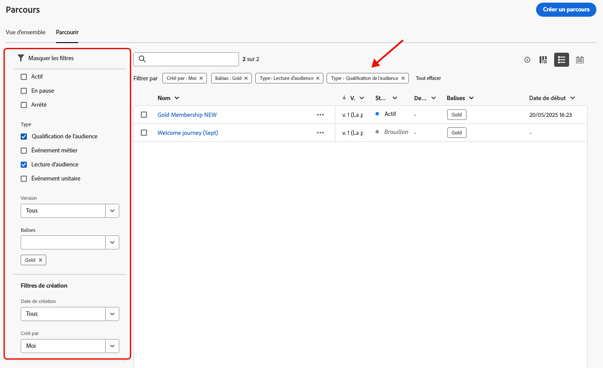
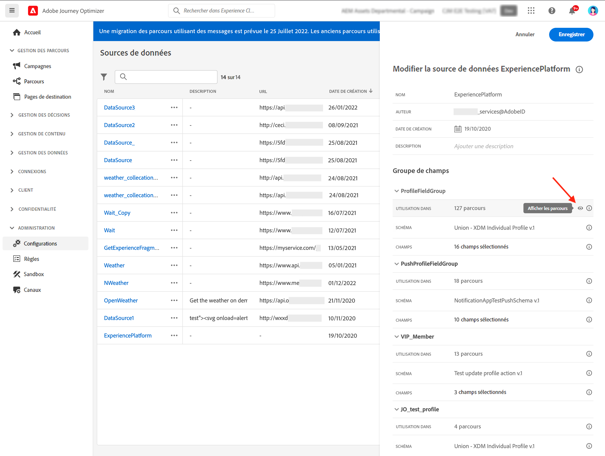

# Parcourir et filtrer vos parcours {#browse-journeys}

>[!CONTEXTUALHELP]
>id="ajo_journey_view"
>title="Vues Liste et Calendrier des parcours"
>abstract="Outre la liste des parcours, [!DNL Journey Optimizer] fournit une vue de calendrier de vos parcours, ce qui apporte une représentation visuelle claire de leurs plannings. Vous pouvez basculer entre les vues Liste et Calendrier à tout moment à l’aide de ces boutons."

## Tableau de bord des parcours {#dashboard-jo}

Dans la section du menu GESTION DES PARCOURS, cliquez sur **[!UICONTROL Parcours]**. Deux onglets sont disponibles : **[!UICONTROL Vue d’ensemble]** et **[!UICONTROL Parcourir]**.

### Vue d’ensemble des parcours

L’onglet **[!UICONTROL Vue d’ensemble]** affiche un tableau de bord avec les mesures clés liées à vos parcours.

* **Profils traités** : nombre total de profils traités au cours des dernières 24 heures
* **Parcours dynamiques** : nombre total de parcours dynamiques avec trafic au cours des dernières 24 heures. Les parcours dynamiques incluent les **parcours unitaires** (basés sur un événement) et les **parcours par lots** (lecture d’audience).
* **Taux d’erreur** : ratio de tous les profils en erreur par rapport au nombre total de profils entrés au cours des dernières 24 heures.
* **Taux de rejet** : ratio de tous les profils rejetés par rapport au nombre total de profils entrés au cours des dernières 24 heures. Un profil rejeté représente une personne qui ne répond pas aux conditions d’entrée du parcours, par exemple en raison d’un espace de noms incorrect ou des règles d’entrée.

>[!NOTE]
>
>Ce tableau de bord prend en compte les parcours avec trafic au cours des dernières 24 heures. Seuls les parcours auxquels vous avez accès s’affichent. Les mesures sont actualisées toutes les 30 minutes et uniquement lorsque de nouvelles données sont disponibles.

### Liste des parcours

L’onglet **[!UICONTROL Parcourir]** affiche la liste des parcours existants. Vous pouvez rechercher des parcours, utiliser des filtres et effectuer des actions de base sur chaque élément. Vous pouvez par exemple dupliquer ou supprimer un élément.

Dans la liste des parcours, toutes les versions de parcours sont accompagnées d’un numéro. Lorsque vous recherchez un parcours, les versions les plus récentes apparaissent en haut de la liste la première fois que vous ouvrez l&#39;application. Vous pouvez ensuite définir l&#39;ordre de tri souhaité ; l&#39;application le conservera en tant que préférence utilisateur. La version du parcours est également affichée en haut de l’interface d’édition des parcours, au-dessus de la zone de travail. En savoir plus sur la [gestion des versions des parcours](publish-journey.md#journey-versions).

### Calendrier des parcours {#calendar}

Outre la liste des parcours, [!DNL Journey Optimizer] fournit une vue de calendrier de vos parcours, ce qui apporte une représentation visuelle claire de leur planning.

Représentation des parcours :

* Par défaut, la grille de calendrier affiche tous les parcours actifs et planifiés pour la semaine sélectionnée. D’autres options de filtre peuvent afficher les activations ou activations complétées, arrêtées et terminées.
* Les brouillons de parcours et les parcours en mode test ne s’affichent pas.
* Les parcours s’étendant sur plusieurs jours s’affichent en haut de la grille du calendrier.
* Si aucune heure de début n’est spécifiée, l’heure d’activation manuelle la plus proche est utilisée pour la positionner dans le calendrier.
* Les parcours s’affichent sous la forme de périodes d’une heure, ce qui ne reflète pas l’heure d’envoi ou d’achèvement réelle.

Pour naviguer dans le calendrier des parcours :

1. Pour accéder à la vue de calendrier, ouvrez la liste des parcours et cliquez sur l’icône .

1. Utilisez les boutons fléchés ou le sélecteur de date au-dessus du calendrier pour passer d’une semaine à l’autre.

   Le calendrier affiche tous les parcours planifiés pour la semaine en cours.

   

1. Cliquez sur l’ afin de basculer vers l’affichage des éléments qui s’étendent sur plusieurs jours ou semaines.

   

1. Cliquez sur l’icône  pour gérer et ajouter jusqu’à trois calendriers externes.

   

1. Effectuez un glisser-déposer de vos fichiers CSV contenant les noms des événements, les dates de début et les dates de fin.

   Les événements chargés s’affichent pour l’ensemble des utilisateurs et utilisatrices de votre organisation et sur les calendriers des parcours et campagnes.

   +++Le format CSV doit être le suivant :

   | Colonne1 | Colonne2 | Colonne3 |
   |-|-|-|
   | Nom de l’événement | Date de début au format mm/jj/aa | Date de fin au format mm/jj/aa |

   +++

1. Si nécessaire, vous pouvez masquer, afficher ou supprimer les calendriers externes ajoutés.

   

1. Pour plus d’informations sur un parcours, cliquez sur son bloc visuel afin de l’ouvrir et d’en explorer les détails.

   

## Filtrer vos parcours {#journey-filter}

Dans la liste des parcours, utilisez différents filtres pour affiner la liste.

Filtrez les parcours en fonction de leur [statut](#journey-statuses), [type](#journey-types), [version](publish-journey.md#journey-versions) et [balises](../start/search-filter-categorize.md#tags) attribuées depuis les **[!UICONTROL Filtres de statut et de version]**.

Utilisez les **[!UICONTROL filtres de création]** pour filtrer les parcours en fonction de leur date de création ou de la personne qui les a créés.

Affichez les parcours qui utilisent un événement, un groupe de champs ou une action spécifique à l’aide des **[!UICONTROL filtres d’activité]** et des **[!UICONTROL filtres de données]**.

Utilisez les **[!UICONTROL filtres de publication]** pour sélectionner une date de publication ou une personne. Vous pouvez choisir, par exemple, d’afficher les dernières versions des parcours actifs publiées la veille.

Pour filtrer les parcours selon une période spécifique, sélectionnez **[!UICONTROL Personnalisé]** dans la liste déroulante **[!UICONTROL Publié]**.

Dans les volets de configuration des événements, des sources de données et des actions, le champ **[!UICONTROL Utilisé dans]** affiche également le nombre de parcours qui utilisent cet événement, ce groupe de champs ou cette action spécifique. Vous pouvez cliquer sur le bouton **[!UICONTROL Afficher les parcours]** pour faire apparaître la liste des parcours correspondants.

## Types de parcours {#journey-types}

Le type de parcours dépend des activités utilisées dans ce parcours. Il peut s’agir des éléments suivants :

* **[!UICONTROL Événements unitaires]** : les événements unitaires des parcours sont liés à un profil spécifique. Les événements sont liés au comportement d’une personne ou d’une chose qui se produit et qui est liée à une personne (par exemple, une personne qui atteint 10 000 points de fidélité). [En savoir plus](../event/about-events.md).
* **[!UICONTROL Événement métier]**. Le parcours d’événements métier commence par un événement non lié au profil. La configuration de l’événement est effectuée par un utilisateur ou une utilisatrice technique et ne peut pas être modifiée. [En savoir plus](../event/about-events.md).
* **[!UICONTROL Qualification d’audience]** : les parcours de qualification d’audience écoutent les entrées et les sorties des profils dans les audiences Adobe Experience Platform pour que les personnes puissent rejoindre le parcours ou y progresser. [En savoir plus](audience-qualification-events.md).
* **[!UICONTROL Lecture d’audience]** : dans les parcours Lecture d’audience, toutes les personnes de l’audience rejoignent le parcours et reçoivent les messages inclus dans votre parcours. [En savoir plus](read-audience.md).

En savoir plus sur les types de parcours et la gestion des entrées associées sur [cette page](entry-management.md).

## Statuts des parcours {#journey-statuses}

Le statut du parcours dépend de son cycle de vie. Il peut s’agir des éléments suivants :

* **Brouillon** : le parcours en est à sa première étape. Il n’a pas encore été publié.
* **Brouillon (test)** : le mode test a été activé à l’aide du bouton **Mode test**. [En savoir plus](../building-journeys/testing-the-journey.md)
* **Terminé** : le parcours passe automatiquement à ce statut en fonction du type et de la configuration du parcours. Les profils de clientes et clients qui ont déjà intégré le parcours le terminent normalement. Les nouveaux profils de cleintes et clients ne peuvent plus rejoindre le parcours. [Découvrez quand les parcours sont considérés comme terminés](end-journey.md#journey-finished-definition).
* **Actif** : le parcours a été publié à l’aide du bouton **Publier**. [En savoir plus](../building-journeys/publish-journey.md)
* **Mis en pause** : le parcours actif a été mis en pause, à l’aide du bouton **Pause**. [En savoir plus](../building-journeys/journey-pause.md)
* **Arrêté** : le parcours a été désactivé à l’aide du bouton **Arrêter**. Toutes les personnes quittent instantanément le parcours. [En savoir plus](../building-journeys/end-journey.md#stop-journey)
* **Fermé** : le parcours a été fermé à l’aide du bouton **Fermer aux nouvelles entrées**. Il n’est alors plus accessible aux nouvelles personnes. En revanche, la procédure suit son cours normal pour les personnes qui ont déjà rejoint le parcours. [En savoir plus](../building-journeys/end-journey.md)

>[!NOTE]
>
>* Le cycle de vie de création d’un parcours comprend également un ensemble de statuts intermédiaires qui ne sont pas disponibles pour le filtrage : **Publication** (entre « Brouillon » et « Actif »), **Activation du mode test** ou **Désactivation du mode test** (entre **Brouillon** et **Brouillon (test)**), **Arrêt en cours** (entre **Actif** et **Arrêté**), **Reprise** (entre **Mis en pause** et **Actif**), **En pause** (entre **Actif** et **Mis en pause**) lorsqu’un parcours est actif dans un état intermédiaire, il est en lecture seule.
>
>* Si vous devez apporter des modifications à un parcours **actif**, vous devez en [créer une nouvelle version](#journey-versions). Vous pouvez aussi mettre en pause vos parcours actifs, effectuer toutes les modifications nécessaires, puis les reprendre à tout moment. [En savoir plus sur la mise en pause des parcours](../building-journeys/journey-pause.md)

## Dupliquer un parcours {#duplicate-a-journey}

Vous pouvez dupliquer un parcours existant à partir de l’onglet **Parcourir**. Tous les objets et paramètres sont dupliqués dans la copie de parcours.

Pour ce faire, suivez les étapes ci-après :

1. Accédez au parcours à copier, puis cliquez sur l’icône **Autres actions** (les points de suspension en regard du nom du parcours).
1. Sélectionnez **Dupliquer**.

   

1. Saisissez le nom du parcours et confirmez. Vous pouvez également modifier le nom dans l’écran des propriétés du parcours. Par défaut, le nom est défini comme suit : `[JOURNEY-NAME]_copy`

   

1. Le nouveau parcours est créé et disponible dans la liste des parcours.

## Opérations en masse {#bulk-operations}

Dans la liste de vos parcours, vous pouvez mettre en pause un ou plusieurs parcours **actifs**. Pour mettre en pause un groupe de parcours (_pause par lots_), sélectionnez-les dans la liste et cliquez sur le bouton **Mettre en pause** dans la barre bleue en bas de l’écran. Le bouton **Mettre en pause** n’est disponible que lorsque des parcours **actifs** sont sélectionnés.

Vous pouvez également reprendre un ou plusieurs parcours **en pause**. Pour reprendre un groupe de parcours (_reprise par lots_), sélectionnez-les et cliquez sur le bouton **Reprendre** situé dans la barre bleue en bas de l’écran. Notez que le bouton **Reprendre** n’est disponible que lorsque des parcours **en pause** sont sélectionnés.

[En savoir plus sur la mise en pause et la reprise des parcours](journey-pause.md).

>[!NOTE]
>
>Vous pouvez mettre en pause/reprendre jusqu’à 10 parcours par opération.

