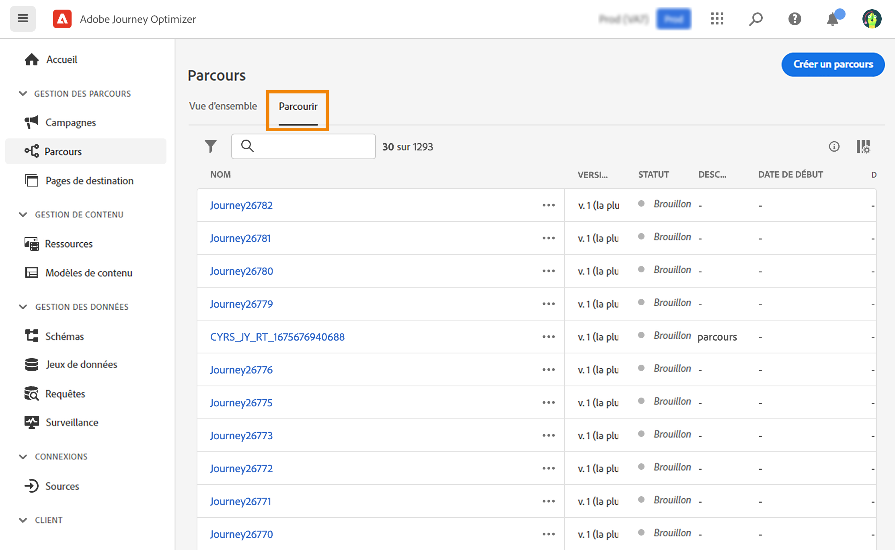

# Parcourir et filtrer vos parcours {#browse-journeys}

## Tableau de bord des parcours {#dashboard-jo}

>[!CONTEXTUALHELP]
>id="ajo_journey_view"
>title="Vues Tableau et Chronologie Parcours"
>abstract="Vues Tableau et Chronologie Parcours"

Dans la section du menu GESTION DES PARCOURS, cliquez sur **[!UICONTROL Parcours]**. Deux onglets sont disponibles : **[!UICONTROL Vue d’ensemble]** et **[!UICONTROL Parcourir]**.

* L’onglet **[!UICONTROL Vue d’ensemble]** affiche un tableau de bord avec les mesures clés liées à vos parcours.

  

   * **Profils traités** : nombre total de profils traités au cours des dernières 24 heures
   * **Parcours dynamiques** : nombre total de parcours dynamiques avec trafic au cours des dernières 24 heures. Les parcours dynamiques incluent les **parcours unitaires** (basés sur un événement) et les **parcours par lots** (lecture d’audience).
   * **Taux d’erreur** : ratio de tous les profils en erreur par rapport au nombre total de profils entrés au cours des dernières 24 heures.
   * **Taux de rejet** : ratio de tous les profils rejetés par rapport au nombre total de profils entrés au cours des dernières 24 heures. Un profil rejeté représente une personne qui ne répond pas aux conditions d’entrée du parcours, par exemple en raison d’un espace de noms incorrect ou des règles de rentrée.

  >[!NOTE]
  >
  >Ce tableau de bord prend en compte les parcours avec trafic au cours des dernières 24 heures. Seuls les parcours auxquels vous avez accès s’affichent. Les mesures sont actualisées toutes les 30 minutes et uniquement lorsque de nouvelles données sont disponibles.

* L’onglet **[!UICONTROL Parcourir]** affiche la liste des parcours existants. Vous pouvez rechercher des parcours, utiliser des filtres et effectuer des actions de base sur chaque élément. Vous pouvez par exemple dupliquer ou supprimer un élément.

  

## Filtrer vos parcours {#journey-filter}

Dans la liste des parcours, l’utilisation de différents filtres permet d’affiner la liste.

Filtrez les parcours en fonction de leur [statut](#journey-statuses), [type](#journey-types), [version](#journey-versions) et [balises](../start/search-filter-categorize.md#tags) attribuées depuis les **[!UICONTROL Filtres de statut et de version]**.

Utilisez les **[!UICONTROL filtres de création]** pour filtrer les parcours en fonction de leur date de création ou de la personne qui les a créés.

Affichez les parcours qui utilisent un événement, un groupe de champs ou une action spécifique à l’aide des **[!UICONTROL filtres d’activité]** et des **[!UICONTROL filtres de données]**.

Utilisez les **[!UICONTROL filtres de publication]** pour sélectionner une date de publication ou une personne. Vous pouvez choisir, par exemple, d’afficher les dernières versions des parcours actifs publiées la veille.

Pour filtrer les parcours selon une période spécifique, sélectionnez **[!UICONTROL Personnalisé]** dans la liste déroulante **[!UICONTROL Publié]**.

Dans les volets de configuration des événements, des sources de données et des actions, le champ **[!UICONTROL Utilisé dans]** affiche également le nombre de parcours qui utilisent cet événement, ce groupe de champs ou cette action spécifique. Vous pouvez cliquer sur le bouton **[!UICONTROL Afficher les parcours]** pour faire apparaître la liste des parcours correspondants.

## Types de parcours {#journey-types}

Le type de parcours dépend des activités utilisées dans ce parcours. Il peut s’agir des éléments suivants :

* **[!UICONTROL Événements unitaires]** : les événements unitaires des parcours sont liés à un profil spécifique. Les événements sont liés au comportement d’une personne ou à un événement lié à une personne (par exemple, une personne a atteint 10 000 points de fidélité). [En savoir plus](../event/about-events.md).
* **[!UICONTROL Événement métier]**. Le parcours d’événements métier commence par un événement non lié au profil. La configuration de l’événement est effectuée par un utilisateur ou une utilisatrice technique et ne peut pas être modifiée. [En savoir plus](../event/about-events.md).
* **[!UICONTROL Qualification de l’audience]** - Les parcours de qualification de l’audience écoutent les entrées et les sorties des profils dans les audiences Adobe Experience Platform afin de faire en sorte que des individus rejoignent un parcours ou y progressent. [En savoir plus](audience-qualification-events.md).
* **[!UICONTROL Lecture d’audience]** : dans les parcours Lecture d’audience, toutes les personnes de l’audience rejoignent le parcours et reçoivent les messages inclus dans votre parcours. [En savoir plus](read-audience.md).

Pour plus d’informations sur les types de parcours et la gestion des entrées associées, consultez [cette page](entry-management.md).

## Statuts des parcours {#journey-statuses}

Le statut du parcours dépend de son cycle de vie. Il peut s’agir des éléments suivants :

* **Fermé** : le parcours a été fermé à l’aide du bouton **Fermer aux nouvelles entrées**. Il n’est alors plus accessible aux nouveaux individus. En revanche, les personnes qui ont déjà intégré le parcours peuvent le terminer normalement.
* **Brouillon** : le parcours en est à sa première étape. Il n’a pas encore été publié.
* **Brouillon (test)** : le mode test a été activé à l’aide du bouton **Mode test**.
* **Terminé** : le parcours passe automatiquement à ce statut après la [temporisation globale](journey-properties.md#global_timeout) de 91 jours. Les profils de clientes et clients qui ont déjà intégré le parcours le terminent normalement. Les nouveaux profils ne peuvent plus rejoindre le parcours.
* **Actif** : le parcours a été publié à l’aide du bouton **Publier**.
* **Arrêté** : le parcours a été désactivé à l’aide du bouton **Arrêter**. Toutes les personnes quittent instantanément le parcours.

>[!NOTE]
>
>* Le cycle de vie de création de parcours comprend également un ensemble de statuts intermédiaires qui ne sont pas disponibles pour le filtrage : « Publication » (entre « Brouillon » et « Actif »), « Activer le mode test » ou « Désactiver le mode test » (entre « Brouillon » et « Brouillon (test) ») et « Arrêt en cours » (entre « Actif » et « Arrêté »). Lorsqu’un parcours se trouve dans un état intermédiaire, il est en lecture seule.
>
>* Si vous devez apporter des modifications à un parcours **publié**, vous devez en [créer une nouvelle version](#journey-versions).

## Versions de parcours {#journey-versions}

Dans la liste des parcours, toutes les versions de parcours sont accompagnées d&#39;un numéro. Lorsque vous recherchez un parcours, les versions les plus récentes apparaissent en haut de la liste la première fois que vous ouvrez l&#39;application. Vous pouvez ensuite définir l&#39;ordre de tri souhaité ; l&#39;application le conservera en tant que préférence utilisateur. La version du parcours est également affichée en haut de l&#39;interface d&#39;édition des parcours, au-dessus de la zone de travail.

>[!NOTE]
>
>Dans la plupart des cas, un profil ne peut pas être présent plusieurs fois dans le même parcours, en même temps. Si la nouvelle entrée est activée, un profil peut rejoindre à nouveau un parcours, mais ne peut pas le faire tant qu’il n’a pas complètement quitté cette instance précédente du parcours. [En savoir plus](end-journey.md).

### Créer une nouvelle version d’un parcours {#journey-create-new-version}

Si vous devez apporter des modifications à un parcours publié, vous devez en créer une nouvelle version. Pour créer une nouvelle version d’un parcours existant, procédez comme suit :

1. Ouvrez la dernière version de votre parcours actif, puis cliquez sur **[!UICONTROL Créer une version]**, puis confirmez.

   

   >[!NOTE]
   >
   >Vous ne pouvez créer une version qu&#39;à partir de la dernière version d&#39;un parcours.

1. Apportez vos modifications, cliquez sur **[!UICONTROL Publier]** et confirmez.

Dès la publication du parcours, les personnes vont accéder à la dernière version du parcours. Les clients qui ont déjà accédé à une version antérieure y restent jusqu&#39;à la fin du parcours. Si les personnes entrent à nouveau dans le même parcours par la suite, elles accéderont à la dernière version.

Les versions de parcours peuvent être arrêtées individuellement. Toutes les versions de parcours portent le même nom.

Lorsque vous publiez une nouvelle version d&#39;un parcours, la version précédente se termine automatiquement et passe au statut **Fermé**. Aucune entrée dans le parcours ne peut se produire. Même si vous arrêtez la dernière version, la version précédente reste fermée.

## Dupliquer un parcours {#duplicate-a-journey}

Vous pouvez dupliquer un parcours existant à partir de l’onglet **Parcourir**. Tous les objets et paramètres sont dupliqués dans la copie de parcours.

Pour ce faire, suivez les étapes ci-après :

1. Accédez au parcours à copier, puis cliquez sur l’icône **Autres actions** (les points de suspension en regard du nom du parcours).
1. Sélectionnez **Dupliquer**.

   

1. Saisissez le nom du parcours et confirmez. Vous pouvez également modifier le nom dans l’écran des propriétés du parcours. Par défaut, le nom est défini comme suit : `[JOURNEY-NAME]_copy`

   

1. Le nouveau parcours est créé et disponible dans la liste des parcours.
