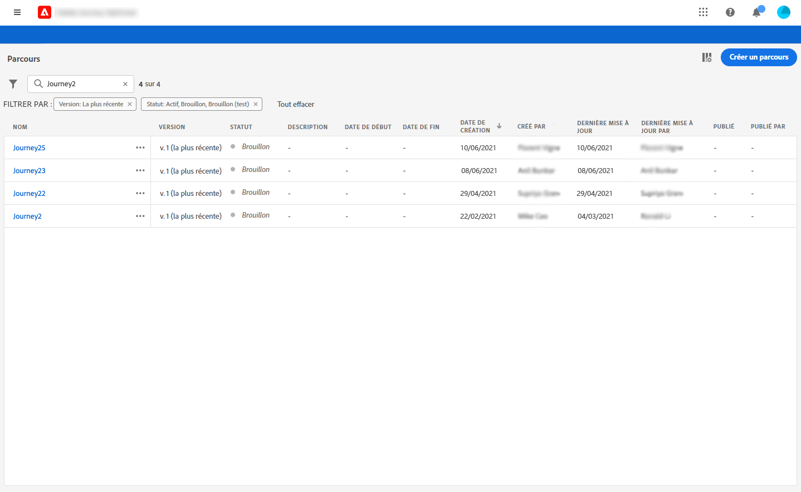
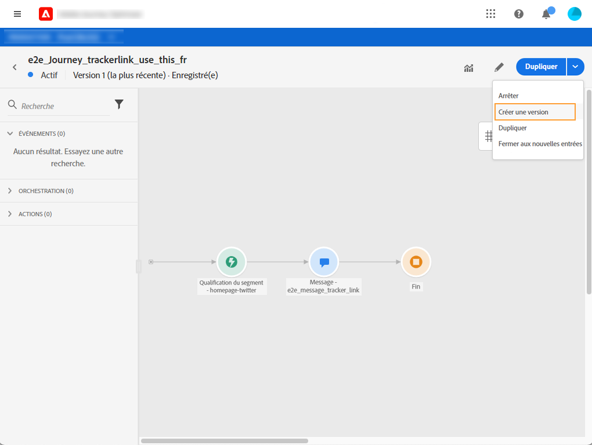
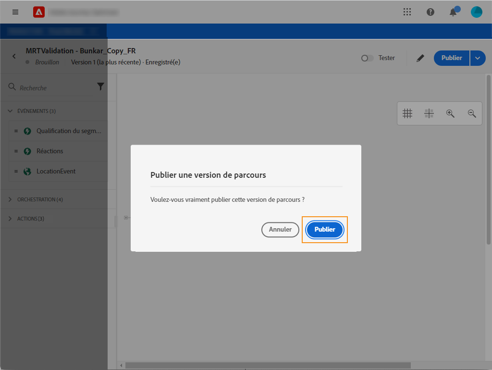

# Versions de parcours{#concept_ldc_k55_zgb}

Dans la liste de parcours, toutes les versions de parcours s’affichent avec le numéro de version. Voir [cette page](../building-journeys/using-the-journey-designer.md). Lorsque vous recherchez un parcours, les versions les plus récentes s’affichent en haut de la liste la première fois que l’application s’ouvre. Ensuite, vous pouvez définir le tri souhaité et l’application le conserve en tant que préférences utilisateur. La version du parcours s’affiche également en haut de l’interface de l’édition de parcours, au-dessus du canevas.

Si vous devez effectuer des modifications sur un parcours actif, vous devez créer une nouvelle version de votre parcours.

>[!NOTE]
>
>Pour en savoir plus sur les limitations des versions de parcours, voir [cette page](../building-journeys/limitations.md#journey-versions-limitations)

1. Ouvrez la dernière version de votre parcours en direct, cliquez sur **[!UICONTROL Créer une nouvelle version]** et confirmez.

   

   >[!NOTE]
   >
   >Vous pouvez uniquement créer une nouvelle version à partir de la dernière version d’un parcours.

1. Apportez vos modifications, cliquez sur **[!UICONTROL Publier]** et confirmez.

   

Dès que le parcours sera publié, les individus débuts à entrer dans la dernière version du parcours. Les personnes qui ont déjà entré une version précédente y restent jusqu’à la fin du parcours. S&#39;ils entrent à nouveau le même parcours, ils se rendent dans la dernière version.

Les versions de parcours peuvent être arrêtées individuellement. Toutes les versions des parcours portent le même nom.

>[!NOTE]
>
>Lorsque vous publiez une nouvelle version d’un parcours, la version précédente se termine automatiquement et passe à l’état **Fermé**. Aucune entrée dans le parcours n&#39;aura lieu. Même si vous arrêtez la dernière version, la version précédente reste fermée.
