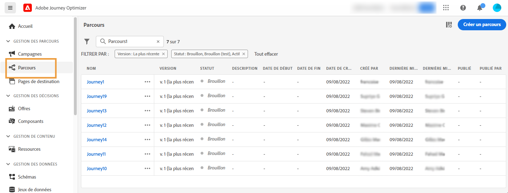

# Prise en main des parcours{#jo-general-principle}

Utilisez [!DNL Journey Optimizer] pour créer des cas d’utilisation d’orchestration en temps réel à l’aide de données contextuelles stockées dans des événements ou des sources de données.

Concevez des scénarios avancés à plusieurs étapes avec les fonctionnalités suivantes :

* Envoyez des **diffusions unitaires** en temps réel déclenchées lors de la réception d’un événement ou **par lots** à l’aide d’audiences Adobe Experience Platform.

* Tirez parti des **données contextuelles** issues des événements, des informations d’Adobe Experience Platform ou des données provenant de services d’API tiers.

* Utilisez les **actions intégrées** pour envoyer des messages conçus dans [!DNL Journey Optimizer] ou créez des **actions personnalisées** si vous utilisez un système tiers pour envoyer vos messages.

* Avec le **concepteur de parcours**, créez vos cas d’utilisation à plusieurs étapes : en toute facilité, faites glisser et déposez un événement d’entrée ou une activité de lecture d’audience, ajoutez des conditions et envoyez des messages personnalisés.

>[!NOTE]
>
>Les mécanismes de sécurisation et limitations des parcours sont détaillés sur [cette page](../start/guardrails.md).

## Procédure de création d’un parcours{#steps-journey}

Adobe Journey Optimizer vous permet de concevoir et d’orchestrer des parcours personnalisés dans une zone de travail unique. Suivez les étapes principales de création dʼun parcours décrites ci-après :

➡️ [Découvrir cette fonctionnalité en vidéo](#video)

Adobe Journey Optimizer comprend une zone de travail d’orchestration omnicanal qui permet aux spécialistes du marketing d’harmoniser la portée marketing avec l’engagement client individuel. L’interface utilisateur vous permet de faire glisser facilement des activités de la palette vers la zone de travail pour créer votre parcours.

Découvrez comment commencer et créer votre premier parcours sur [cette page](journey-gs.md).

Le concepteur de parcours omnicanaux dispose d’une interface intuitive par glisser-déposer, qui vous permet de créer des parcours à plusieurs étapes avec des audiences ciblées, des mises à jour basées sur des interactions client ou commerciale en temps réel et des messages omnicanaux.

En savoir plus dans [cette section](using-the-journey-designer.md).

Les ingénieurs de données peuvent consulter [cette section](../configuration/about-data-sources-events-actions.md) pour en savoir plus sur la procédure de configuration des parcours, y compris les sources de données, les événements et les actions.

## Cas d’utilisation{#uc-journey}

Découvrez comment créer des parcours dans les cas d’utilisation complets suivants.

Cas d’utilisation commerciale :

* [Envoi de messages multi-canal](journeys-uc.md)
* [Envoi de messages à l’aide de Campaign v7/v8](ajo-ac.md)
* [Envoyer un message aux abonnés](message-to-subscribers-uc.md)

Cas d’utilisation technique :

* [Transmettre des collections de manière dynamique à l’aide d’actions personnalisées](collections.md)
* [Limiter le débit avec les sources de données externes et les actions personnalisées](limit-throughput.md)

## Versions de parcours{#journey-versions}

Dans la liste des parcours, toutes les versions de parcours sont accompagnées d&#39;un numéro. Voir [cette page](../building-journeys/using-the-journey-designer.md).

Lorsque vous recherchez un parcours, les versions les plus récentes apparaissent en haut de la liste la première fois que vous ouvrez l&#39;application. Vous pouvez ensuite définir l&#39;ordre de tri souhaité ; l&#39;application le conservera en tant que préférence utilisateur. La version du parcours est également affichée en haut de l&#39;interface d&#39;édition des parcours, au-dessus de la zone de travail.

>[!NOTE]
>
>Dans la plupart des cas, un profil ne peut pas être présent plusieurs fois dans le même parcours, en même temps. Si la reprise est activée, un profil peut rejoindre à nouveau un parcours, mais ne peut pas le faire tant qu’il n’a pas complètement quitté cette instance précédente du parcours. [En savoir plus](end-journey.md).

Si vous devez apporter des modifications à un parcours actif, vous devez en créer une nouvelle version.

1. Ouvrez la dernière version de votre parcours en ligne, puis cliquez sur **[!UICONTROL Création d’une version]** et confirmez.

   

   >[!NOTE]
   >
   >Vous ne pouvez créer une version qu&#39;à partir de la dernière version d&#39;un parcours.

1. Effectuez vos modifications, cliquez sur **[!UICONTROL Publier]** et confirmez.

Dès la publication du parcours, les individus commencent à accéder à la dernière version du parcours. Les clients qui ont déjà accédé à une version antérieure y restent jusqu&#39;à la fin du parcours. S’ils entrent à nouveau le même parcours par la suite, ils accéderont à la dernière version.

Les versions de parcours peuvent être arrêtées individuellement. Toutes les versions de parcours portent le même nom.

Lorsque vous publiez une nouvelle version d&#39;un parcours, la version précédente se termine automatiquement et passe au statut **Fermé**. Aucune entrée dans le parcours ne peut se produire. Même si vous arrêtez la dernière version, la version précédente reste fermée.

## Vidéo pratique {#video}

Découvrez les composants d’un parcours et comprenez les principes de base de la création d’un parcours dans la zone de travail.

>[!VIDEO](https://video.tv.adobe.com/v/3424996?quality=12)
