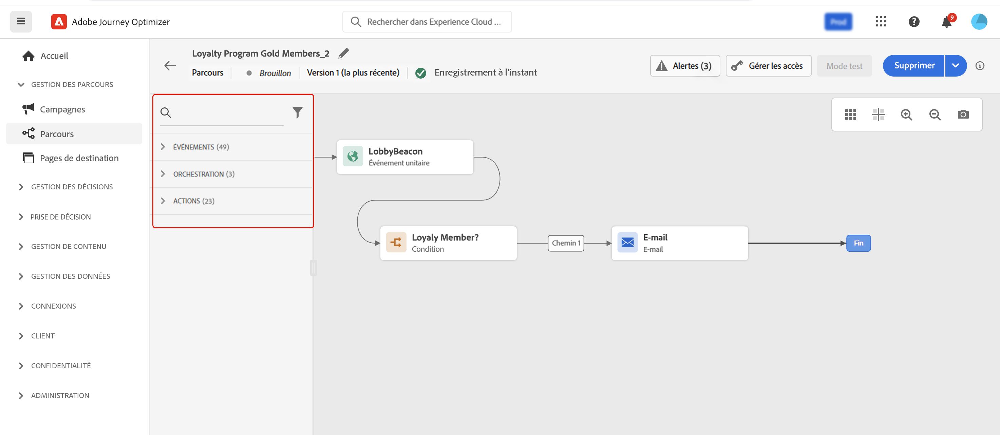

# Prise en main des parcours{#jo-general-principle}

Utilisation [!DNL Journey Optimizer] pour créer des cas d’utilisation d’orchestration en temps réel à l’aide de données contextuelles stockées dans des événements ou des sources de données.

Concevez des scénarios avancés à plusieurs étapes, optimisés par les fonctionnalités suivantes :

* Envoyer en temps réel **diffusion unitaire** déclenché lorsqu’un événement est reçu, ou **dans le lot** à l’aide des segments Adobe Experience Platform.

* Utilisation **données contextuelles** des événements, des informations d’Adobe Experience Platform ou des données de services d’API tiers.

* Utilisez la variable **actions intégrées** pour envoyer des messages conçus dans [!DNL Journey Optimizer] ou créer **actions personnalisées** si vous utilisez un système tiers pour envoyer vos messages.

* Avec le **concepteur de parcours**, créez vos cas d’utilisation à plusieurs étapes : faites glisser et déposez facilement un événement d’entrée ou une activité de lecture de segment, ajoutez des conditions et envoyez des messages personnalisés.

## Procédure de création d’un parcours{#steps-journey}

Utilisez Adobe Journey Optimizer pour concevoir et orchestrer des parcours personnalisés à partir d’une seule zone de travail.

Adobe Journey Optimizer comprend un canevas d’orchestration omnicanal qui permet aux marketeurs d’harmoniser la portée marketing avec l’engagement client individuel. L’interface utilisateur vous permet de faire glisser facilement des activités de la palette vers la zone de travail afin de créer votre parcours.

Découvrez comment démarrer et créer votre premier parcours dans [cette page](journey-gs.md).

Le concepteur de parcours omnicanal vous permet de créer des parcours à plusieurs étapes avec des audiences ciblées, des mises à jour basées sur les interactions client ou commerciale en temps réel et des messages omnicanaux à l’aide d’une interface intuitive de glisser-déposer.

En savoir plus dans [cette section](using-the-journey-designer.md).

En tant qu’ingénieur en données, les étapes de configuration de vos parcours, y compris les sources de données, les événements et les actions, sont détaillées dans la section [cette section](../configuration/about-data-sources-events-actions.md).

## Cas d’utilisation{#uc-journey}

Découvrez comment créer des parcours dans les cas d’utilisation de bout en bout suivants.

Cas pratiques professionnels :

* [Envoi de messages multicanaux](journeys-uc.md)
* [Envoyer un message à l&#39;aide de Campaign v7/v8](ajo-ac.md)
* [Envoyer un message aux abonnés](message-to-subscribers-uc.md)

Cas pratiques techniques :

* [Transmission dynamique des collections à l’aide d’actions personnalisées](collections.md)
* [Améliorez les diffusions](ramp-up-deliveries-uc.md)
* [Limitation du débit avec les sources de données externes et les actions personnalisées](limit-throughput.md)

## Versions de parcours{#journey-versions}

Dans la liste des parcours, toutes les versions de parcours sont affichées avec le numéro de version. Voir [cette page](../building-journeys/using-the-journey-designer.md).

Lorsque vous recherchez un parcours, les versions les plus récentes apparaissent en haut de la liste la première fois que l’application s’ouvre. Vous pouvez ensuite définir le tri souhaité et l’application le conservera comme préférence utilisateur. La version du parcours est également affichée en haut de l’interface d’édition du parcours, au-dessus de la zone de travail.

>[!NOTE]
>
>En règle générale, un profil ne peut pas être présent plusieurs fois au même moment dans le même parcours. Si la rentrée est activée, un profil peut revenir dans un parcours, mais ne peut pas le faire tant qu’il n’a pas complètement quitté cette instance précédente du parcours. [En savoir plus](end-journey.md).

Si vous devez modifier un parcours actif, créez une nouvelle version de votre parcours.

1. Ouvrez la dernière version de votre parcours actif, puis cliquez sur **[!UICONTROL Create a new version]** et confirmez.

   

   >[!NOTE]
   >
   >Vous pouvez uniquement créer une version à partir de la dernière version d’un parcours.

1. Effectuez vos modifications, cliquez sur **[!UICONTROL Publish]** et confirmez.

   

Dès la publication du parcours, les individus commencent à accéder à la dernière version du parcours. Les personnes qui sont déjà entrées dans une version précédente y restent jusqu’à la fin du parcours. S’ils reviennent ultérieurement dans le même parcours, ils accèdent à la dernière version.

Les versions de parcours peuvent être arrêtées individuellement. Toutes les versions des parcours portent le même nom.

Lorsque vous publiez une nouvelle version d’un parcours, la version précédente se termine automatiquement et passe à **Fermé** statut. Aucune entrée dans le parcours ne peut se produire. Même si vous arrêtez la dernière version, la version précédente reste fermée.

>[!NOTE]
>
>Pour en savoir plus sur les protections et les limites des versions de parcours, voir [cette page](../start/guardrails.md#journey-versions-limitations)