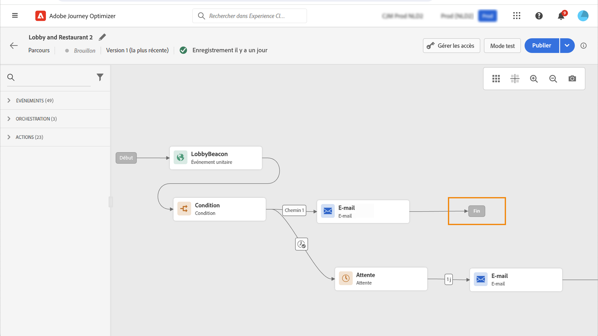
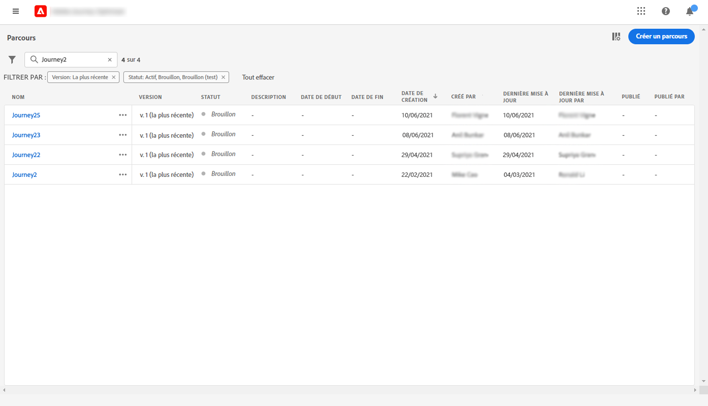

# Principe général{#jo-general-principle}

[!DNL Journey Optimizer] permet de créer des cas d&#39;utilisation d&#39;orchestration en temps réel à l&#39;aide de données contextuelles stockées dans des événements ou des sources de données.

Concevez des scénarios avancés à plusieurs étapes avec les fonctionnalités suivantes :

* Envoyez des **diffusions unitaires** en temps réel déclenchées lorsqu’un événement est reçu ou **par lots** à l’aide de segments Adobe Experience Platform.

* Tirez parti des **données contextuelles** issues des événements, des informations d’Adobe Experience Platform ou des données provenant de services d’API tiers.

* Utilisez les **actions intégrées** pour envoyer des messages conçus dans [!DNL Journey Optimizer] ou créez des **actions personnalisées** si vous utilisez un système tiers pour envoyer vos messages.

* Avec le **concepteur de parcours**, créez vos cas d’utilisation à plusieurs étapes : en toute facilité, faites glisser et déposez un événement d’entrée ou une activité de lecture de segment, ajoutez des conditions et envoyez des messages personnalisés.

## Cycle de vie du parcours{#journey-lifecyle}

### Profils dans les parcours{#profile-journey}

Dans un parcours unitaire :

* Si la reprise est activée, un profil peut rejoindre à nouveau plusieurs fois un parcours, mais ne peut pas le faire tant qu’il n’a pas complètement quitté cette instance précédente du parcours.

* Si la reprise est désactivée, un profil ne peut pas rejoindre plusieurs fois le même parcours

Pour plus d&#39;informations à ce sujet, consulter cette [section](../building-journeys/journey-gs.md#change-properties).

Dans un parcours de segment lu :

* Pour les parcours non récurrents : le profil rejoint une seule fois le parcours.
* Pour les parcours récurrents : le profil rejoint le parcours à chaque périodicité, s’il est dans le segment / le statut attendu. S’il était toujours dans le parcours d&#39;une précédente périodicité, il la redémarrera dès le début.

Dans les parcours d’événement métier commençant par une lecture de segment :

Sachant que ce parcours est basé sur la réception d’un événement métier, si le profil est qualifié dans le segment attendu, il rejoindra le parcours de chaque événement métier reçu, ce qui signifie que ce profil pourra être plusieurs fois dans le même parcours, au même moment, mais dans le contexte de différents événements métier.

Les parcours unitaires (commençant par un événement ou une qualification de segment) incluent une barrière de sécurité qui empêche les parcours d’être déclenchés par erreur plusieurs fois pour le même événement. La reprise du profil est temporairement bloquée par défaut pendant 5 minutes. Par exemple, si un événement déclenche un parcours à 12 h 01 pour un profil spécifique et qu’un autre arrive à 12 h 03 (qu’il s’agisse du même événement ou d’un autre déclenchant le même parcours), ce parcours ne reprendra pas pour ce profil.

### Fin de parcours{#journey-ending}

Un parcours peut se terminer pour un individu dans deux contextes spécifiques :

* Le client arrive à la dernière activité d&#39;un chemin.
* Le client arrive à une activité **Condition** (ou à une activité **Attente** avec une condition) et ne répond à aucune des conditions.

Il peut alors rejoindre de nouveau le parcours si la rentrée est autorisée. Voir [cette page](../building-journeys/journey-gs.md#change-properties)

Pour terminer un parcours actif, nous vous recommandons de le fermer. L’arrivée de nouveaux clients dans le parcours sera alors bloquée. Les clients qui ont déjà rejoint le parcours peuvent l’expérimenter jusqu’à la fin. Consultez [cette section](../building-journeys/.md#close-journey)

Vous pouvez arrêter un parcours uniquement lorsqu’une urgence s’est produite et qu’il doit être mis fin immédiatement à tout traitement sur un parcours. Les personnes qui l’ont déjà rejoint sont toutes stoppées dans leur progression. Consultez [cette section](../building-journeys/journey.md#stop-journey)

>[!NOTE]
>
>Notez que vous ne pouvez pas reprendre un parcours fermé ou arrêté.

#### Balise de fin de parcours{#end-tag}

Lors de la création d’un parcours, une « balise de fin » s’affiche à la fin de chaque chemin. Ce nœud ne peut pas être ajouté par un utilisateur, ne peut pas être supprimé et seul son libellé peut être modifié. Il marque la fin de chaque chemin du parcours. Si le parcours comporte plusieurs chemins, il est conseillé d’ajouter un libellé à chaque fin pour faciliter la lecture des rapports. Consultez [cette page](../reports/live-report.md).

<!--

### End activity{#journey-end-activity}

The **[!UICONTROL End]** activity allows you to mark the end of each path of the journey. It is not mandatory but recommended for visual clarity. See [this page](../building-journeys/end-activity.md)

-->

#### Fermeture d’un parcours{#close-journey}

Les raisons suivantes peuvent entraîner la fermeture d&#39;un parcours :

* Le parcours est fermé manuellement par le biais du bouton **[!UICONTROL Fermer aux nouvelles entrées]**.
* Un parcours basé sur un segment « unique » qui a terminé son exécution.
* Après la dernière occurrence d&#39;un parcours récurrent basé sur un segment.

Le fait de fermer un parcours manuellement assure que les clients qui l’ont déjà rejoint puissent terminer leur chemin, mais que les nouveaux utilisateurs ne puissent pas le rejoindre. Lorsqu&#39;un parcours est fermé (pour l&#39;une des raisons ci-dessus), le statut **[!UICONTROL Fermé]** lui est attribué. Il n&#39;est alors plus accessible aux nouveaux individus. En revanche, la procédure suit son cours normal pour les personnes qui ont déjà rejoint le parcours. Au-delà de la temporisation globale par défaut de 30 jours, le statut du parcours passe à **Terminé**. Consultez cette [section](../building-journeys/journey-gs.md#global_timeout).

La version d&#39;un parcours fermé ne peut pas être redémarrée ni supprimée. Vous pouvez la dupliquer ou en créer une nouvelle version. Seuls les parcours terminés peuvent être supprimés.

Pour fermer un parcours dans la liste des parcours, cliquez sur le bouton **[!UICONTROL Points de suspension]** situé à droite du nom du parcours et sélectionnez **[!UICONTROL Fermer aux nouvelles entrées]**.

Vous pouvez également réaliser les opérations suivantes :

1. Dans la liste **[!UICONTROL Parcours]**, cliquez sur le parcours que vous souhaitez fermer.
1. En haut à droite, cliquez sur la flèche vers le bas.

   

1. Cliquez sur **[!UICONTROL Fermer aux nouvelles entrées]** et confirmez dans la boîte de dialogue.

#### Arrêt d’un parcours{#stop-journey}

Si nécessaire, il est possible d’arrêter la progression de tous les individus dans le parcours. L’arrêt du parcours entraîne la temporisation de tous les individus qui en font partie. Cependant, le fait d’arrêter un parcours suppose qu&#39;il soit mis un terme à la progression de toutes les personnes qui y participent. Le parcours est simplement mis à l&#39;arrêt. Si vous souhaitez mettre fin à un parcours, nous vous recommandons de le fermer.

La version d’un parcours arrêté ne peut pas être redémarrée.

À l’arrêt, le statut du parcours est défini sur **[!UICONTROL Arrêté]**.

Vous pouvez arrêter un parcours, par exemple, si un spécialiste marketing se rend compte que le parcours cible une audience incorrecte ou si une action personnalisée censée diffuser des messages ne fonctionne pas correctement. Pour arrêter un parcours dans la liste des parcours, cliquez sur le bouton **[!UICONTROL Points de suspension]** situé à droite du nom du parcours et sélectionnez **[!UICONTROL Arrêter]**.

Vous pouvez également réaliser les opérations suivantes :

1. Dans la liste **[!UICONTROL Parcours]**, cliquez sur le parcours que vous souhaitez arrêter.
1. En haut à droite, cliquez sur la flèche vers le bas.
   
1. Cliquez sur **[!UICONTROL Arrêter]** et confirmez dans la boîte de dialogue.

## Versions de parcours{#journey-versions}

Dans la liste des parcours, toutes les versions de parcours sont accompagnées d&#39;un numéro. Voir [cette page](../building-journeys/using-the-journey-designer.md).

Lorsque vous recherchez un parcours, les versions les plus récentes apparaissent en haut de la liste la première fois que vous ouvrez l&#39;application. Vous pouvez ensuite définir l&#39;ordre de tri souhaité ; l&#39;application le conservera en tant que préférence utilisateur. La version du parcours est également affichée en haut de l&#39;interface d&#39;édition des parcours, au-dessus de la zone de travail.

>[!NOTE]
>
>Dans la plupart des cas, un profil ne peut pas être présent plusieurs fois dans le même parcours, en même temps. Si la reprise est activée, un profil peut rejoindre à nouveau un parcours, mais ne peut pas le faire tant qu’il n’a pas complètement quitté cette instance précédente du parcours. [En savoir plus](#journey-ending)

Si vous devez modifier un parcours actif, créez une nouvelle version de votre parcours.

1. Ouvrez la dernière version de votre parcours actif, cliquez sur **[!UICONTROL Créer une version]**, puis confirmez.

   

   >[!NOTE]
   >
   >Vous ne pouvez créer une version qu&#39;à partir de la dernière version d&#39;un parcours.

1. Effectuez vos modifications, cliquez sur **[!UICONTROL Publier]**, puis confirmez.

   

Aussitôt le parcours publié, les individus commencent à accéder à la dernière version. Les clients qui ont déjà accédé à une version antérieure y restent jusqu&#39;à la fin du parcours. En cas de rentrée ultérieure dans le même parcours, les clients accéderont à la version la plus récente.

Les versions de parcours peuvent être arrêtées individuellement. Toutes les versions des parcours portent le même nom.

Lorsque vous publiez une nouvelle version d&#39;un parcours, la version précédente se termine automatiquement et passe au statut **Fermé**. Aucune entrée dans le parcours ne peut se produire. Même si vous arrêtez la dernière version, la version précédente reste fermée.

>[!NOTE]
>
>Pour en savoir plus sur les versions de parcours, consultez [cette page](../start/guardrails.md#journey-versions-limitations)