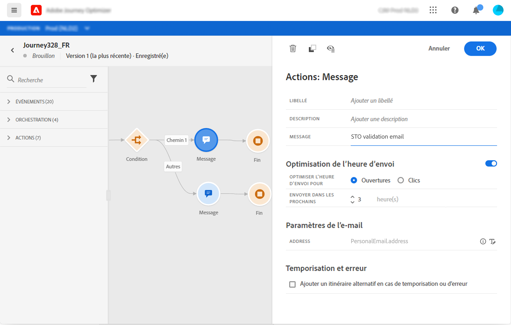

# Ajout d&#39;un message dans un parcours

Les fonctionnalités de message [!DNL Journey Optimizer] sont intégrées, il vous suffit de concevoir votre contenu et de publier votre message. Consultez [cette section](../get-started-content.md). Ensuite, vous ajoutez simplement, dans votre parcours, un message push ou e-mail conçu à l&#39;aide de Journey Optimizer.

Si vous utilisez un système tiers pour envoyer vos messages, vous pouvez créer une action personnalisée. En savoir plus dans cette [section](../action/action.md).

## Ajout d&#39;une activité de message

1. Comme toujours, débutez votre parcours avec un événement ou une activité **Lecture de segment**.

   

1. Dans la section **Actions** de la palette, faites glisser-déposer une activité **Message** dans la zone de travail.

   

1. Ajoutez un libellé et une description.

   

1. Cliquez dans le champ **Message**. La liste des messages disponibles conçus dans Journey Optimizer s&#39;affiche. Vous pouvez filtrer la liste par état.

   

1. Choisissez un message et cliquez sur **Sélectionner**. Vous pouvez également créer un nouveau message directement à partir de cet écran en cliquant sur **Créer un message**.

   

   Si vous souhaitez vérifier votre message, vous pouvez cliquer sur l&#39;icône **Ouvrir le message** dans le champ **Message**. Le message s&#39;ouvre dans un nouvel onglet.

   

1. Ajoutez les étapes suivantes à votre parcours.

## Paramètres de l&#39;e-mail et paramètres Push

Les sections **[!UICONTROL Paramètres de l&#39;e-mail]** et **[!UICONTROL Paramètres Push]** affichent des champs en lecture seule. Cette configuration est généralement effectuée lors de la création du message. Consultez [cette section](../get-started-content.md).

Pour forcer une valeur spécifique, vous pouvez utiliser l’icône **Activer la substitution de paramètre** à droite du champ. Cette option peut être utile à des fins de test. Par exemple, pour un e-mail, vous pouvez ajouter votre adresse e-mail. Une fois le parcours publié, l&#39;e-mail vous est envoyé.

## Optimisation de l&#39;heure d&#39;envoi{#send-time-optimization}

### A propos de l&#39;optimisation de l&#39;heure d&#39;envoi{#about-send-time-optimization}

>[!CONTEXTUALHELP]
>id="jo_bestsendtime_disabled"
>title="A propos de l&#39;optimisation de l&#39;heure d&#39;envoi"
>abstract="La fonctionnalité d’optimisation de l’heure d’envoi de Adobe Journey Optimizer, optimisée par les services d’IA d’Adobe, peut prévoir le meilleur moment pour envoyer un email ou un message push afin d’optimiser l’engagement en fonction des taux d’ouverture et de clic historiques."

La fonctionnalité d’optimisation de l’heure d’envoi de Adobe Journey Optimizer, optimisée par les services d’IA d’Adobe, peut prévoir le meilleur moment pour envoyer un email ou un message push afin d’optimiser l’engagement en fonction des taux d’ouverture et de clic historiques. Utilisez notre modèle d’apprentissage automatique pour planifier des heures d’envoi personnalisées pour que chaque utilisateur augmente les taux d’ouverture et de clic de vos messages.

Le modèle d’optimisation du temps d’envoi ingère vos données Adobe Journey Optimizer et examine les taux d’ouverture au niveau de l’utilisateur (pour les courriers électroniques et les notifications push) et de clics (pour les courriers électroniques) afin de déterminer à quel moment vos clients sont les plus susceptibles d’interagir avec vos messages. L’optimisation du temps d’envoi nécessite au moins un mois de données de suivi des messages pour formuler des recommandations éclairées. Pour chaque utilisateur, le modèle génère les données prédictives suivantes :

* La meilleure heure de chaque jour de la semaine pour optimiser l’engagement
* Le meilleur jour de la semaine pour optimiser l’engagement
* La meilleure heure du meilleur jour de la semaine pour optimiser l’engagement

Le modèle varie selon que vous parlez de notation ou de formation. La formation est dispensée une fois par semaine, puis une fois par trimestre. La notation est d’abord hebdomadaire, puis mensuelle.

* Formation : développement de l’algorithme utilisé pour effectuer le score.
* Notation : application d’un score à des profils individuels en fonction du modèle formé.

Ces informations sont stockées avec le profil de l’utilisateur et sont référencées lors de l’exécution du parcours pour indiquer à Adobe Journey Optimizer quand envoyer votre message.

## Remarques importantes{#send-time-optimization-notes}

* Cette fonctionnalité est uniquement disponible pour les messages mono-canal sur les emails et les notifications push avec le suivi activé.
* Le message doit être publié.
* Cette fonctionnalité n’est pas compatible avec le mode d’éclatement.

## Activer l’optimisation de l’heure d’envoi{#activate-send-time-optimization}

>[!CONTEXTUALHELP]
>id="jo_bestsendtime_email"
>title="Activer l’optimisation de l’heure d’envoi"
>abstract="Choisissez si vous souhaitez optimiser les ouvertures d’email ou les clics publicitaires par email en sélectionnant le bouton radio approprié. Vous pouvez également choisir de mettre entre crochets les heures d’envoi utilisées par le système en saisissant une valeur pour l’option Envoyer dans la suivante."

>[!CONTEXTUALHELP]
>id="jo_bestsendtime_push"
>title="Activer l’optimisation de l’heure d’envoi"
>abstract="Les messages push sont définis par défaut sur l’option d’ouverture, car les clics ne s’appliquent pas à la messagerie push. Vous pouvez également choisir de mettre entre crochets les heures d’envoi utilisées par le système en saisissant une valeur pour l’option Envoyer dans la suivante."

Activez l’optimisation de l’heure d’envoi sur un email ou un message push en sélectionnant le commutateur **Optimisation de l’heure d’envoi** dans les paramètres de l’activité Message .

Pour les emails, choisissez d’optimiser les ouvertures d’email ou les clics publicitaires par email en sélectionnant le bouton radio approprié. Les messages push sont définis par défaut sur l’option d’ouverture, car les clics ne s’appliquent pas à la messagerie push.

Vous pouvez également choisir de mettre les heures d’envoi entre crochets par le système en saisissant une valeur pour l’option **Envoyer dans la balise** suivante. Si vous choisissez &quot;six heures&quot; comme valeur, Adobe Journey Optimizer vérifie chaque profil utilisateur pour déterminer si le temps d’envoi optimal se produit dans les six heures suivant l’heure d’exécution du parcours et sélectionnez l’heure déterminée pour l’optimisation de l’heure d’envoi. Si ce délai n’est pas compris dans les six heures suivantes, Adobe Journey Optimizer enverra le message par défaut au moment de l’exécution du parcours.
