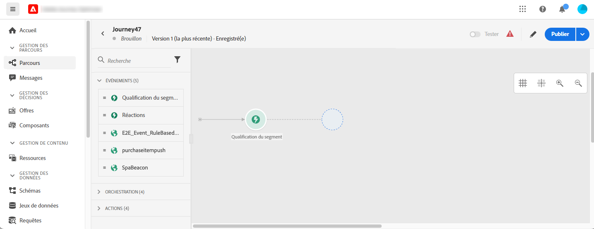
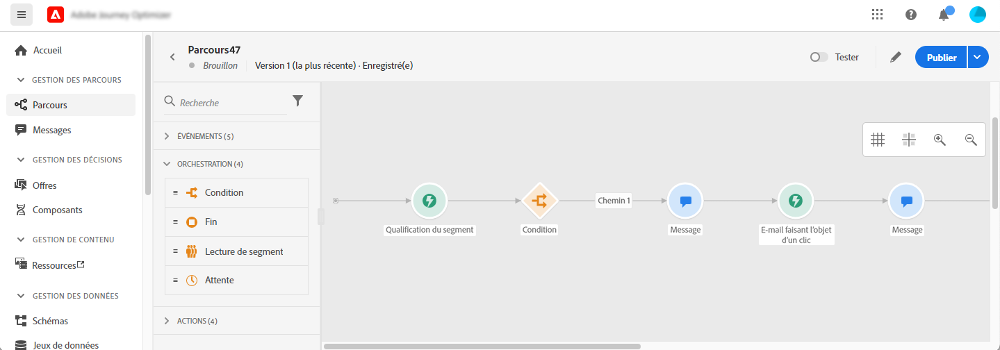
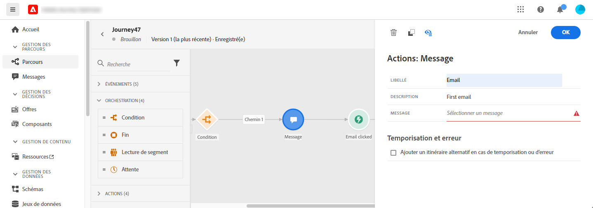
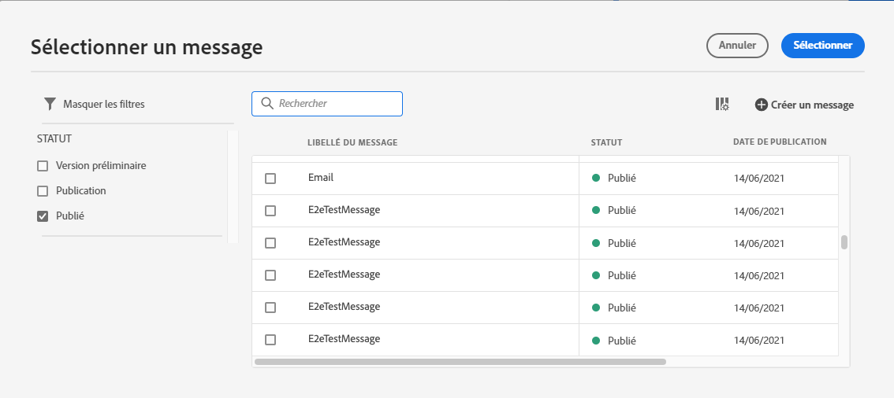
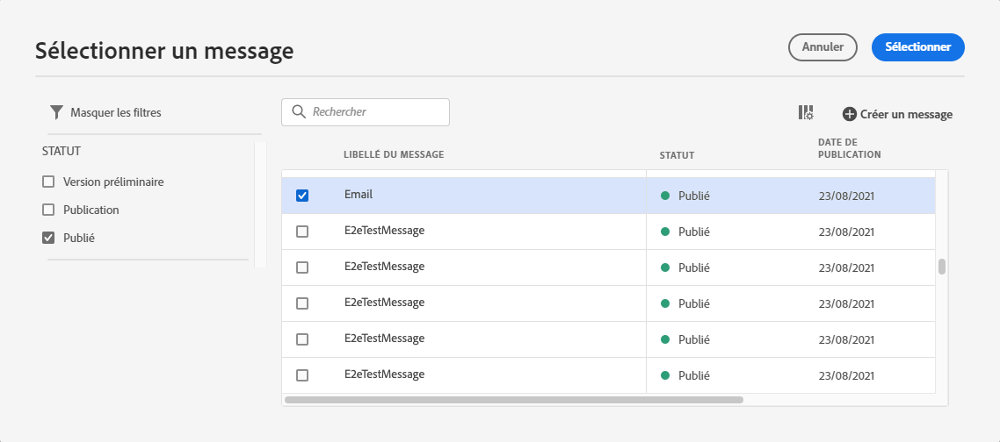
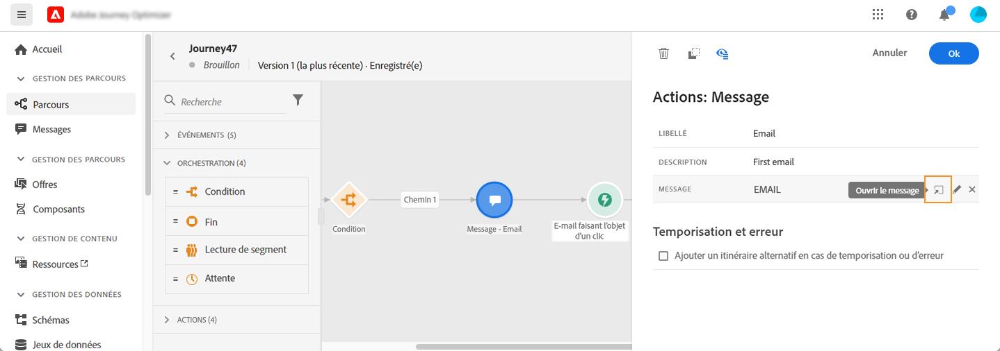
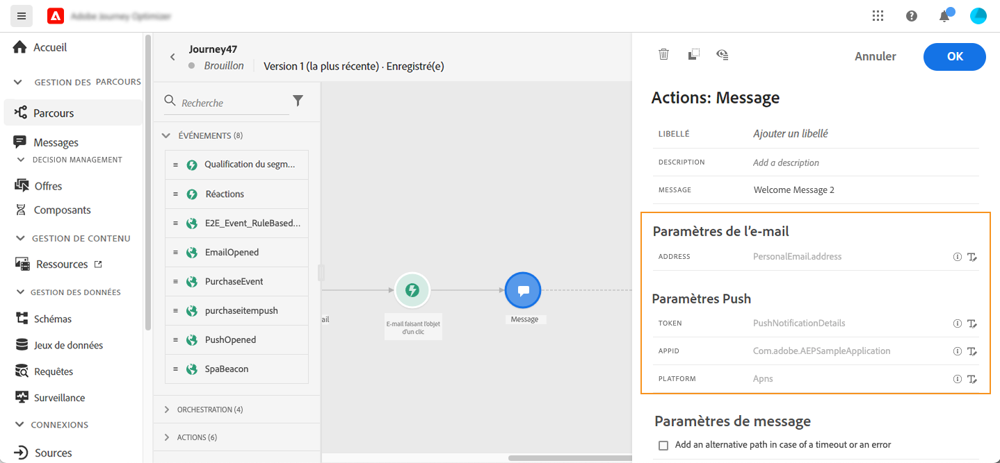

# Ajout d&#39;un message dans un parcours{#add-a-message-in-a-journey}

Les fonctionnalités de message [!DNL Journey Optimizer] sont intégrées, il vous suffit de concevoir votre contenu et de publier votre message. Consultez [cette section](../messages/get-started-content.md). Ensuite, vous ajoutez simplement, dans votre parcours, un message push ou e-mail conçu à l&#39;aide de Journey Optimizer.

Si vous utilisez un système tiers pour envoyer vos messages, vous pouvez créer une action personnalisée. En savoir plus dans cette [section](../action/action.md).

## Ajout d&#39;une activité de message

1. Comme toujours, débutez votre parcours avec un événement ou une activité **Lecture de segment**.

   

1. Dans la section **Actions** de la palette, faites glisser-déposer une activité **Message** dans la zone de travail.

   

1. Ajoutez un libellé et une description.

   

1. Cliquez dans le champ **Message**. La liste des messages disponibles conçus dans Journey Optimizer s’affiche. Vous pouvez filtrer la liste par état.

   

1. Choisissez un message et cliquez sur **Sélectionner**. Vous pouvez également créer un nouveau message directement à partir de cet écran en cliquant sur **Créer un message**.

   

   Si vous souhaitez vérifier votre message, vous pouvez cliquer sur l&#39;icône **Ouvrir le message** dans le champ **Message**. Le message s&#39;ouvre dans un nouvel onglet.

   

1. Ajoutez les étapes suivantes à votre parcours.

## Paramètres de l&#39;e-mail et paramètres Push

Les sections **[!UICONTROL Paramètres de l&#39;e-mail]** et **[!UICONTROL Paramètres Push]** affichent des champs en lecture seule. Cette configuration est généralement effectuée lors de la création du message. Consultez [cette section](../messages/get-started-content.md).

Pour forcer une valeur spécifique, vous pouvez utiliser l’icône **Activer la substitution de paramètre** à droite du champ. Cette option peut être utile à diverses fins :

* Par exemple, pour tester un e-mail, vous pouvez ajouter votre adresse e-mail. Une fois le parcours publié, l’e-mail vous est envoyé. 
* Vous pouvez vous référer à l’adresse e-mail des abonnés d’une liste. Voir [cas d’utilisation](message-to-subscribers-uc.md). 

## Optimisation de l’heure d’envoi{#send-time-optimization}

>[!CONTEXTUALHELP]
>id="jo_bestsendtime_disabled"
>title="À propos de l&#39;optimisation de l&#39;heure d&#39;envoi"
>abstract="La fonctionnalité d&#39;optimisation de l&#39;heure d&#39;envoi d&#39;Adobe Journey Optimizer, optimisée par les services d&#39;IA d&#39;Adobe, peut prévoir le meilleur moment pour envoyer un e-mail ou un message push afin de maximiser l&#39;engagement en fonction des taux d&#39;ouverture et de clic historiques."

La fonctionnalité d&#39;optimisation de l&#39;heure d&#39;envoi d&#39;Adobe Journey Optimizer, optimisée par les services d&#39;IA d&#39;Adobe, peut prévoir le meilleur moment pour envoyer un e-mail ou un message push afin de maximiser l&#39;engagement en fonction des taux d&#39;ouverture et de clic historiques. Utilisez notre modèle d&#39;apprentissage automatique pour planifier des heures d&#39;envoi personnalisées afin que chaque utilisateur augmente les taux d&#39;ouverture et de clic de vos messages.

>[!NOTE]
>
>Cette fonctionnalité est actuellement en version bêta et disponible uniquement pour les clients bêta. Pour rejoindre le programme bêta, contactez l’assistance clientèle d’Adobe.

Le modèle d&#39;optimisation de l&#39;heure d&#39;envoi ingère vos données Adobe Journey Optimizer et examine les taux d&#39;ouverture au niveau de l&#39;utilisateur (pour les e-mails et les notifications push) et de clics (pour les e-mails) afin de déterminer à quel moment vos clients sont les plus susceptibles d&#39;interagir avec vos messages. L&#39;optimisation de l&#39;heure d&#39;envoi nécessite au moins un mois de données de suivi des messages pour formuler des recommandations éclairées. Pour chaque utilisateur, le système sélectionne automatiquement la meilleure heure à l’aide des scores suivants :

* La meilleure heure de chaque jour de la semaine pour optimiser l&#39;engagement
* Le meilleur jour de la semaine pour optimiser l&#39;engagement
* La meilleure heure du meilleur jour de la semaine pour optimiser l&#39;engagement

Le modèle varie selon que vous parlez de notation ou de formation. La formation est dispensée une fois par semaine, puis une fois par trimestre. La notation est d&#39;abord hebdomadaire, puis mensuelle.

* Formation : développement de l&#39;algorithme utilisé pour calculer le score.
* Notation : application d&#39;un score à des profils individuels en fonction du modèle formé.

Ces informations sont stockées avec le profil de l&#39;utilisateur et sont référencées lors de l&#39;exécution du parcours pour indiquer à Adobe Journey Optimizer quand envoyer votre message.

>[!CAUTION]
>
>* Cette fonctionnalité est uniquement disponible pour les messages mono-canal sur les e-mails et les notifications push avec le suivi activé.
>* Le message doit être publié.
>* Cette fonctionnalité n&#39;est pas compatible avec le mode rafale.

### Activer l’optimisation de l’heure d’envoi{#activate-send-time-optimization}

>[!CONTEXTUALHELP]
>id="jo_bestsendtime_email"
>title="Activer l’optimisation de l’heure d’envoi"
>abstract="Choisissez si vous souhaitez optimiser les ouvertures d&#39;e-mail ou les clics sur e-mail en sélectionnant le bouton radio approprié. Vous pouvez également choisir de mettre entre crochets les heures d&#39;envoi utilisées par le système en saisissant une valeur pour l&#39;option Envoyer pendant."

>[!CONTEXTUALHELP]
>id="jo_bestsendtime_push"
>title="Activer l’optimisation de l’heure d’envoi"
>abstract="Les messages push sont définis par défaut sur l&#39;option d&#39;ouverture, car les clics ne s&#39;appliquent pas à la messagerie push. Vous pouvez également choisir de mettre entre crochets les heures d&#39;envoi utilisées par le système en saisissant une valeur pour l&#39;option Envoyer pendant."

Activez l&#39;optimisation de l&#39;heure d&#39;envoi sur un e-mail ou un message push en sélectionnant le commutateur **Optimisation de l&#39;heure d&#39;envoi** dans les paramètres de l&#39;activité Message.

Pour les e-mails, choisissez si vous souhaitez optimiser les ouvertures d&#39;e-mail ou les clics sur e-mail en sélectionnant le bouton radio approprié. Les messages push sont définis par défaut sur l&#39;option d&#39;ouverture, car les clics ne s&#39;appliquent pas à la messagerie push.

Vous pouvez également choisir de mettre entre crochets les heures d&#39;envoi utilisées par le système en saisissant une valeur pour l&#39;option **Envoyer pendant**. Si vous choisissez « six heures » comme valeur, [!DNL Journey Optimizer] vérifie chaque profil utilisateur et sélectionne l’heure d’envoi optimale dans les six heures suivant l’heure d’exécution du parcours.
