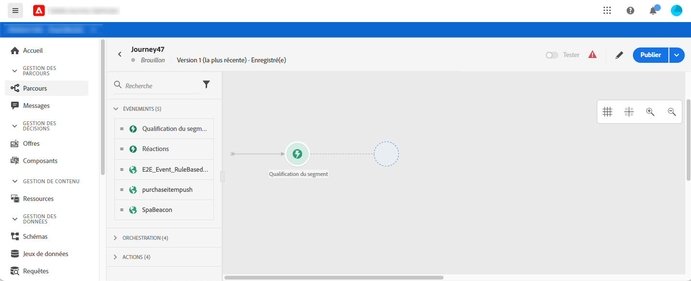
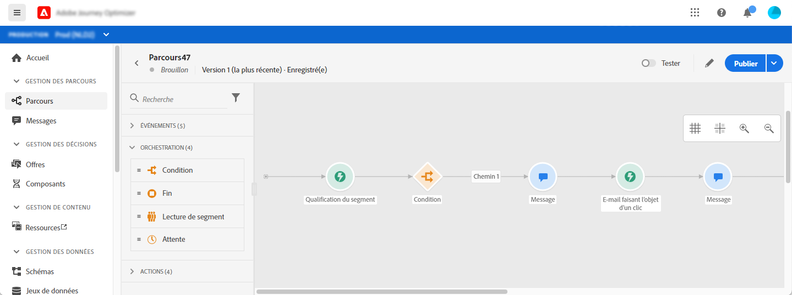
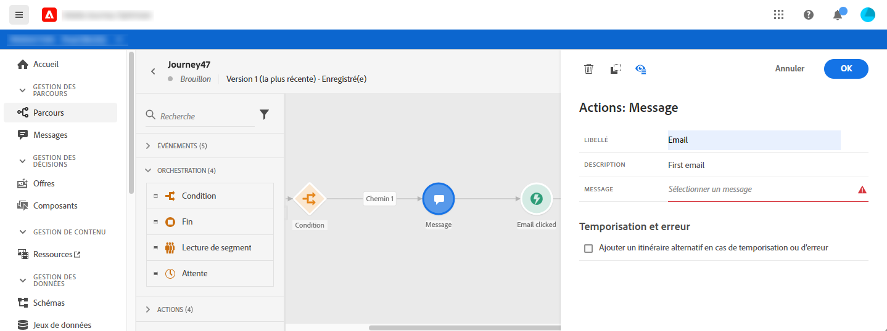
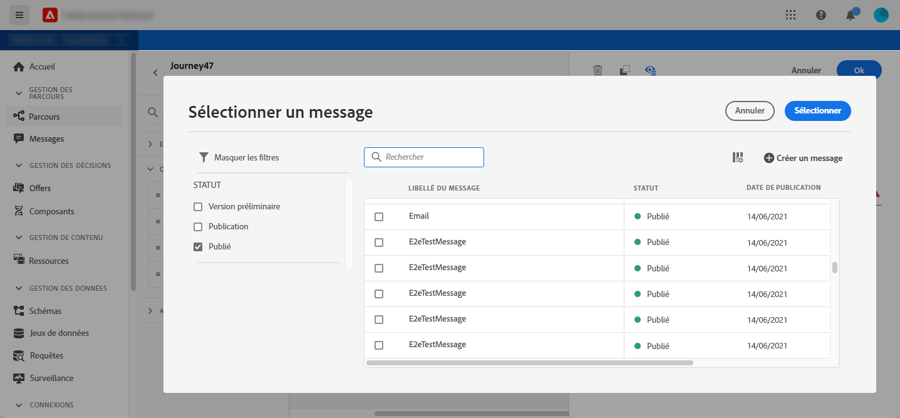
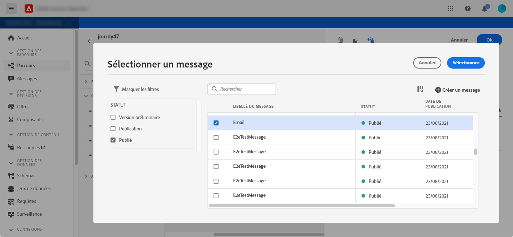
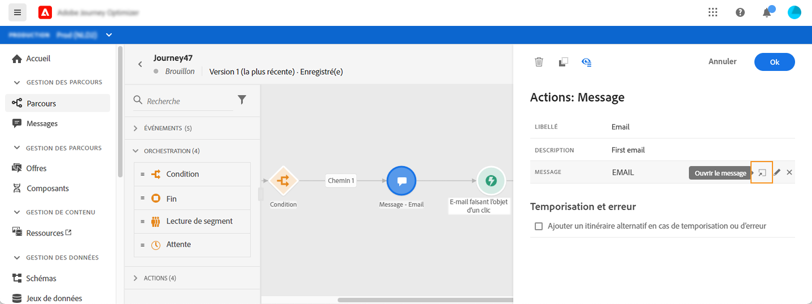
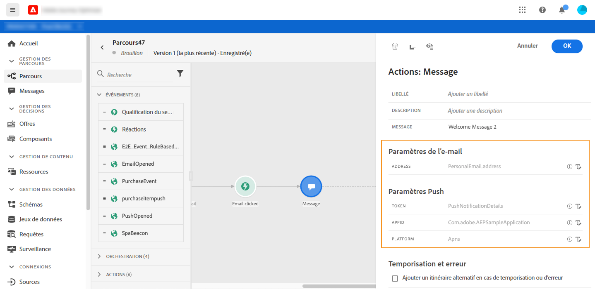

# Ajout d&#39;un message dans un parcours

Les fonctionnalités de message [!DNL Journey Optimizer] sont intégrées, il vous suffit de concevoir votre contenu et de publier votre message. Consultez [cette section](../get-started-content.md). Ensuite, vous ajoutez simplement, dans votre parcours, un message push ou e-mail conçu à l&#39;aide de Journey Optimizer.

Si vous utilisez un système tiers pour envoyer vos messages, vous pouvez créer une action personnalisée. En savoir plus dans cette [section](../action/action.md).

## Ajout d&#39;une activité de message

1. Comme toujours, débutez votre parcours avec un événement ou une activité **Lecture de segment**.

   

1. Dans la section **Actions** de la palette, faites glisser-déposer une activité **Message** dans la zone de travail.

   

1. Ajoutez un libellé et une description.

   

1. Cliquez dans le champ **Message**. La liste des messages disponibles conçus dans Journey Optimizer s&#39;affiche. Vous pouvez filtrer la liste par état.

   

1. Choisissez un message et cliquez sur **Sélectionner**. Vous pouvez également créer un nouveau message directement à partir de cet écran en cliquant sur **Créer un message**.

   

   Si vous souhaitez vérifier votre message, vous pouvez cliquer sur l&#39;icône **Ouvrir le message** dans le champ **Message**. Le message s&#39;ouvre dans un nouvel onglet.

   

1. Ajoutez les étapes suivantes à votre parcours.

## Paramètres de l&#39;e-mail et paramètres Push

Les sections **[!UICONTROL Paramètres de l&#39;e-mail]** et **[!UICONTROL Paramètres Push]** affichent des champs en lecture seule. Cette configuration est généralement effectuée lors de la création du message. Consultez [cette section](../get-started-content.md).

Pour forcer une valeur spécifique, vous pouvez utiliser l’icône **Activer la substitution de paramètre** à droite du champ. Cette option peut être utile à des fins de test. Par exemple, pour un e-mail, vous pouvez ajouter votre adresse e-mail. Une fois le parcours publié, l&#39;e-mail vous est envoyé.
