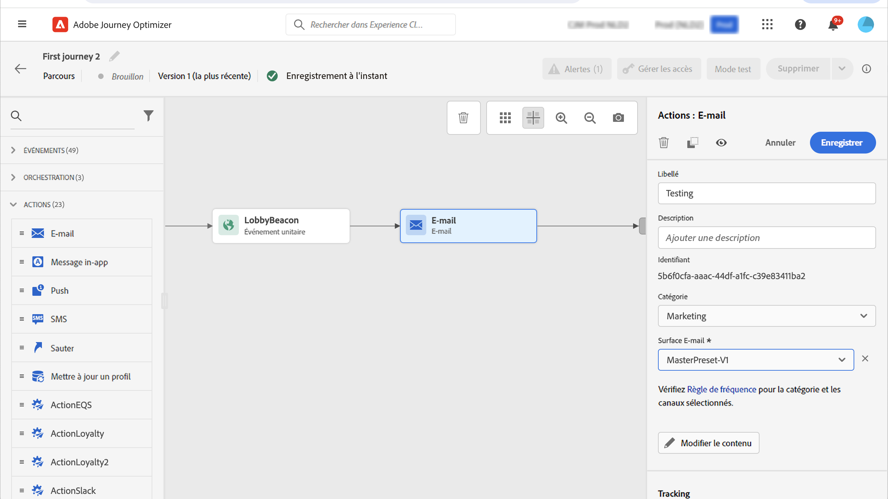

# Utiliser des actions de canal intégrées {#add-a-message-in-a-journey}

>[!CONTEXTUALHELP]
>id="ajo_message_activity"
>title="Action de canal intégrée"
>abstract="Journey Optimizer est fourni avec des fonctionnalités d’actions de canal intégrées. Vous pouvez simplement ajouter à votre parcours une activité de message (e-mail, message texte (SMS/MMS), push, courrier) ou une expérience entrante (expérience in-app, web, basée sur un code, carte de contenu), puis définir les paramètres et le contenu. Elle est ensuite exécutée et envoyée dans le contexte du parcours."

[!DNL Journey Optimizer] est fourni avec des fonctionnalités d’action de canal intégrées qui sont utilisées pour envoyer des messages : lorsqu’un profil entre dans cette activité, un message lui est envoyé.

Pour ajouter une action de canal intégrée à votre parcours, faites glisser et déposez une activité de canal, puis définissez ses paramètres et son contenu. Elle est ensuite exécutée et envoyée dans le contexte du parcours.

>[!NOTE]
>
>Vous pouvez également configurer des actions personnalisées pour envoyer vos messages dans [!DNL Journey Optimizer]. [En savoir plus](#recommendation)

## Ajout d’un message dans un parcours  {#add-msg-in-journey}

Avec les actions de canal intégrées, vous pouvez configurer les messages sortants ou entrants. Pour plus d’informations sur les canaux disponibles dans les parcours, reportez-vous au tableau de cette section : [Canaux dans les parcours et les campagnes](../channels/gs-channels.md#channels).

Pour ajouter une action de canal intégrée à un parcours, procédez comme suit :

1. Débutez votre parcours avec une activité [Événement](general-events.md) ou [Lecture d’audience](read-audience.md).

1. Dans la section **Actions** de la palette, faites glisser et déposez une activité de canal dans la zone de travail.

   

1. Vous pouvez également sélectionner l’activité **[!UICONTROL Action]**, qui permet de sélectionner plusieurs actions entrantes. [En savoir plus](journey-action.md)

1. Configurez votre activité. Des instructions de configuration détaillées sont disponibles dans les liens ci-dessous.

   * Découvrez ci-dessous les étapes détaillées pour créer votre action sortante :

     <table style="table-layout:fixed">
      <tr style="border: 0;">
      <td>
      
      
<a href="../email/create-email.md"><strong>Créer des e-mails</strong>
      

      

      </td>
      <td>
      
      

      <a href="../push/create-push.md"><strong>Créer des notifications push<strong></a>
      

      

      </td>
      <td>
      
      

      <a href="../sms/create-sms.md"><strong>Créer des messages texte (SMS/MMS)</strong></a>
      

      

      </td>
      <td>
      
      

      <a href="../direct-mail/create-direct-mail.md"><strong>Créer des messages par courrier</strong></a>
      

      

      </td>
      </tr>
      </table>

   * Découvrez ci-dessous les étapes détaillées pour créer votre action entrante :

     <table style="table-layout:fixed">
      <tr style="border: 0;">
      <td>
      
      
<a href="../in-app/create-in-app.md"><strong>Créer des messages in-app</strong>
      

      

      </td>
      <td>
      
      
<a href="../web/create-web.md"><strong>Créer des expériences web</strong>
      

      

      </td>
      <td>
      
      
<a href="../content-card/create-content-card.md"><strong>Créer des cartes de contenu</strong>
      

      

      </td>
      <td>
      
      

      <a href="../code-based/create-code-based.md"><strong>Créer des expériences basées sur le code<strong></a>
      

      

      </td>
      </tr>
      </table>

   >[!NOTE]
   >
   >* Chaque activité d’expérience entrante est accompagnée d’une activité **Attente** de 3 jours. [En savoir plus](wait-activity.md#auto-wait-node)
   >
   >* Pour les notifications push et les e-mails, vous pouvez activer l’optimisation de l’heure d’envoi. [En savoir plus](send-time-optimization.md)

1. Selon l’activité, vous pouvez afficher des paramètres avancés spécifiques au canal sélectionné et remplacer certaines valeurs par défaut telles que l’adresse d’exécution. [En savoir plus](about-journey-activities.md#advanced-parameters)

   >[!NOTE]
   >
   >Si les paramètres avancés sont masqués, cliquez sur le bouton **[!UICONTROL Afficher les champs en lecture seule]** en haut du volet de droite.

## Mise à jour du contenu dynamique {#update-live-content}

Vous pouvez mettre à jour le contenu d’une action de canal intégrée dans un parcours dynamique.

Pour ce faire, ouvrez votre parcours dynamique, sélectionnez l’activité de canal et cliquez sur **Modifier le contenu**.

Cependant, vous ne pouvez pas modifier les attributs utilisés dans la personnalisation, qu’il s’agisse d’attributs de profil ou de données contextuelles (à partir des propriétés d’événement ou de parcours).

Si vous avez modifié des données contextuelles, le message d’erreur suivant s’affiche : `ERR_AUTHORING_JOURNEYVERSION_201`.

Si vous avez modifié des attributs de profil, le message d’erreur suivant s’affiche : `ERR_AUTHORING_JOURNEYVERSION_202`.

Notez que pour l’activité in-app, des modifications peuvent être apportées au contenu pendant que le parcours est actif, mais les déclencheurs in-app ne peuvent pas être modifiés.

## Envoi avec des actions personnalisées {#recommendation}

Au lieu d’utiliser les fonctionnalités de message intégrées, vous pouvez utiliser des actions personnalisées pour configurer la connexion d’un système tiers afin d’envoyer des messages ou des appels API.

* Si vous utilisez un système tiers pour envoyer vos messages, vous pouvez créer une action personnalisée. [En savoir plus](../action/action.md)

* Si vous utilisez Adobe Campaign, reportez-vous aux sections suivantes :

   * [[!DNL Journey Optimizer] et Campaign v7/v8](../action/acc-action.md)
   * [[!DNL Journey Optimizer] et Campaign Standard](../action/acs-action.md)