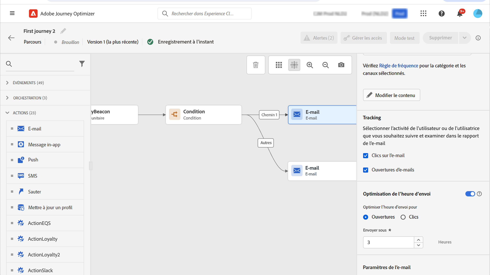

# Email, SMS, Push{#add-a-message-in-a-journey}

[!DNL Journey Optimizer] est fourni avec des fonctionnalités de message intégrées. Vous pouvez simplement ajouter, dans votre parcours, une activité push, SMS ou email et définir des paramètres et du contenu. Il est ensuite exécuté et envoyé dans le contexte du parcours.

Vous pouvez également configurer des actions spécifiques pour vous envoyer des messages :

* Si vous utilisez un système tiers pour envoyer vos messages, vous pouvez créer une action personnalisée. En savoir plus à ce sujet [section](../action/action.md).

* Si vous utilisez Campaign et Journey Optimizer, reportez-vous aux sections suivantes :

   * [[!DNL Journey Optimizer] et Campaign Classic v7/Campaign v8](../action/acc-action.md)
   * [[!DNL Journey Optimizer] et Campaign Standard](../action/acs-action.md)

Pour ajouter un message dans un parcours, procédez comme suit :

1. Commencez votre parcours par une [Événement](general-events.md) ou [Lecture de segment](read-segment.md) activité.

1. Dans la **Actions** de la palette, effectuez un glisser-déposer d’une **email**, un **SMS** ou **Push** dans la zone de travail.

1. Configurez votre activité. Découvrez les étapes détaillées pour créer le contenu de votre message dans les pages suivantes :

   <table style="table-layout:fixed">
   <tr style="border: 0;">
   <td>
   
   
<a href="../email/create-email.md"><strong>Créer des emails</strong>
   

   

   </td>
   <td>
   
   

   <a href="../push/create-push.md"><strong>Créer des notifications push<strong></a>
   

   

   </td>
   <td>
   
   

   <a href="../sms/create-sms.md"><strong>Créer des SMS</strong></a>
   

   

   </td>
   </tr>
   </table>

## Mettre à jour le contenu en direct{#update-live-content}

Vous pouvez mettre à jour le contenu d’un message (email, sms, push) dans un parcours actif.

Pour ce faire, ouvrez votre parcours actif, sélectionnez l’activité de message et cliquez sur **Modifier le contenu**.

Cependant, vous ne pouvez pas modifier les attributs utilisés dans la personnalisation, qu’il s’agisse d’attributs de profil ou de données contextuelles (à partir des propriétés d’événement ou de parcours).

## Optimisation de l’heure d’envoi{#send-time-optimization}

>[!CONTEXTUALHELP]
>id="jo_bestsendtime_disabled"
>title="A propos de l&#39;optimisation de l&#39;heure d&#39;envoi"
>abstract="La fonction d’optimisation du temps d’envoi d’Adobe Journey Optimizer, optimisée par les services d’IA d’Adobe, peut prévoir le meilleur moment pour envoyer un email ou un message push afin d’optimiser l’engagement en fonction des taux d’ouverture et de clic historiques."

### À propos de l’optimisation du temps d’envoi {#about-send-time}

La fonction d’optimisation du temps d’envoi d’Adobe Journey Optimizer, optimisée par les services d’IA d’Adobe, peut prévoir le meilleur moment pour envoyer un email ou un message push afin d’optimiser l’engagement en fonction des taux d’ouverture et de clic historiques. Utilisez notre modèle d’apprentissage automatique pour planifier des heures d’envoi personnalisées pour que chaque utilisateur augmente les taux d’ouverture et de clic de vos messages.

Le modèle d’optimisation du temps d’envoi ingère vos données Adobe Journey Optimizer et examine les taux d’ouverture au niveau de l’utilisateur (pour les e-mails et les notifications push) et de clics (pour les e-mails) afin de déterminer quand vos clients sont les plus susceptibles d’interagir avec vos messages. L’optimisation du temps d’envoi nécessite au moins un mois de données de suivi des messages pour formuler des recommandations éclairées. Pour chaque utilisateur, le système sélectionne automatiquement la meilleure heure à l’aide des scores suivants :

* La meilleure heure de chaque jour de la semaine pour optimiser l’engagement
* Le meilleur jour de la semaine pour optimiser l’engagement
* La meilleure heure du meilleur jour de la semaine pour optimiser l’engagement

Le modèle varie selon que vous parlez de notation ou de formation. La formation est dispensée une fois par semaine, puis une fois par trimestre. La notation est d’abord hebdomadaire, puis mensuelle.

* Formation : développement de l’algorithme utilisé pour effectuer le score.
* Notation : application d’un score à des profils individuels en fonction du modèle formé.

Ces informations sont stockées avec le profil de l’utilisateur et sont référencées lors de l’exécution du parcours pour indiquer à Adobe Journey Optimizer quand envoyer votre message.

>[!CAUTION]
>
>Cette fonctionnalité n’est pas compatible avec le mode d’éclatement.

### Activer l’optimisation du temps d’envoi{#activate-send-time-optimization}

>[!CONTEXTUALHELP]
>id="jo_bestsendtime_email"
>title="Activer l’optimisation du temps d’envoi"
>abstract="Choisissez si vous souhaitez optimiser les ouvertures d’email ou les clics publicitaires par email en sélectionnant le bouton radio approprié. Vous pouvez également choisir de mettre entre crochets les heures d’envoi utilisées par le système en saisissant une valeur pour l’option Envoyer dans la suivante."

>[!CONTEXTUALHELP]
>id="jo_bestsendtime_push"
>title="Activer l’optimisation du temps d’envoi"
>abstract="Les messages push sont définis par défaut sur l’option d’ouverture, car les clics ne s’appliquent pas à la messagerie push. Vous pouvez également choisir de mettre entre crochets les heures d’envoi utilisées par le système en saisissant une valeur pour l’option Envoyer dans la suivante."

Activez l’optimisation de l’heure d’envoi sur un email ou un message push en sélectionnant l’option **Optimisation de l’heure d’envoi** basculez depuis les paramètres de l’activité.

Pour les emails, choisissez d’optimiser les ouvertures d’email ou les clics publicitaires par email en sélectionnant le bouton radio approprié. Les messages push sont définis par défaut sur l’option d’ouverture, car les clics ne s’appliquent pas à la messagerie push.

Vous pouvez également choisir de mettre entre crochets les heures d’envoi utilisées par le système en saisissant une valeur pour la variable **Envoyer dans le suivant** . Si vous choisissez &quot;six heures&quot; comme valeur, [!DNL Journey Optimizer] vérifie chaque profil utilisateur et sélectionne l’heure d’envoi optimale dans les six heures suivant l’heure d’exécution du parcours.
