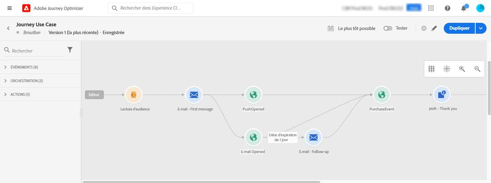
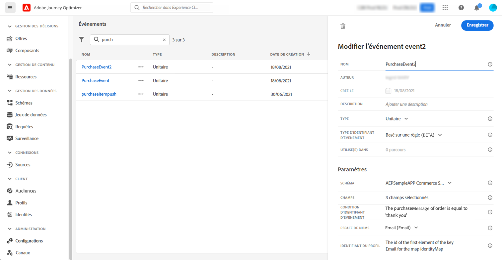
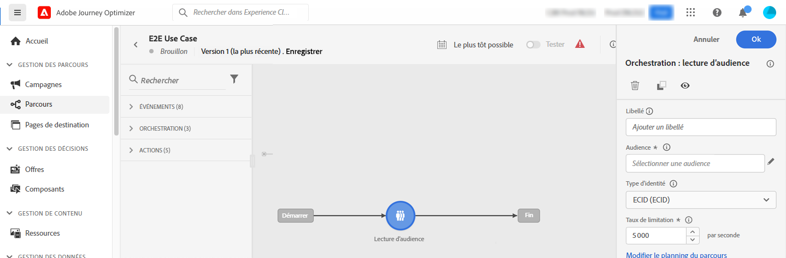
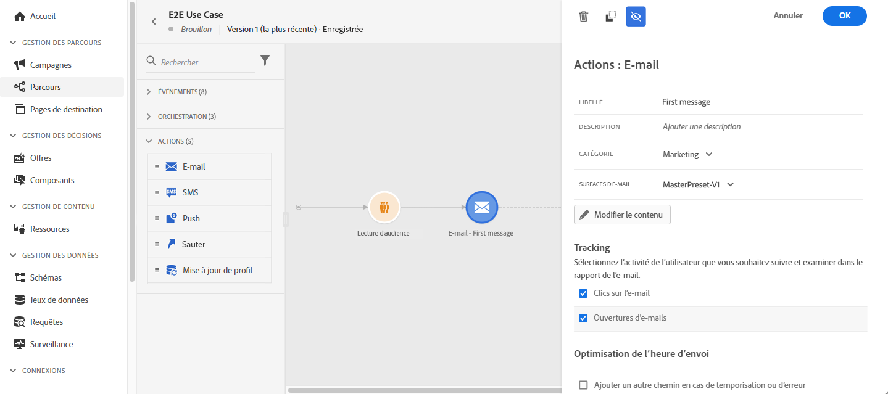

# Envoyer des messages multicanaux {#send-multi-channel-messages}

Cette section présente un cas d’utilisation qui combine une lecture d’audience, un événement, des événements de réaction et des e-mails/messages push.

## Description du cas d’utilisation

Dans ce cas d’utilisation, l’objectif est d’envoyer un premier e-mail à l’ensemble des clientes et clients appartenant à une audience spécifique.

En fonction de leur réaction au premier message, des messages spécifiques de suivi sont envoyés.

Si le client ou la cliente ouvre l’e-mail, le système attend un achat et envoie une notification push pour le ou la remercier.

En l’absence de réaction, un e-mail de relance est envoyé.

## Conditions préalables

Pour que ce cas d’utilisation fonctionne, vous devez configurer les éléments suivants :

* Une audience pour la clientèle qui réside à Atlanta, à San Francisco ou à Seattle et qui est née après 1980.
* Un événement d’achat.

### Créer l’audience

Dans ce parcours, une audience spécifique de clientes et de clients est utilisée. Toutes les personnes appartenant à l’audience rejoignent le parcours et suivent les différentes étapes. Dans cet exemple, l’audience cible la clientèle qui réside à Atlanta, à San Francisco ou à Seattle et qui est née après 1980.

Pour plus d’informations sur les audiences, [consultez cette page](../audience/about-audiences.md).

1. Dans la section du menu CLIENT OU CLIENTE, sélectionnez **[!UICONTROL Audiences]**.
1. Cliquez sur le bouton **[!UICONTROL Créer une audience]** situé en haut à droite de la liste des audiences.
1. Dans le volet **[!UICONTROL Propriétés de l’audience]**, saisissez le nom de l’audience.
1. Effectuez un glisser-déposer des champs de votre choix à partir du volet de gauche vers l’espace de travail central, puis configurez-les en fonction de vos besoins. Dans cet exemple, utilisez les champs d’attributs **Ville** et **Année de naissance**.
1. Cliquez sur **[!UICONTROL Enregistrer]**.

   

L’audience est maintenant créée et prête à être utilisée dans votre parcours. Avec l’activité **Lecture d’audience**, toutes les personnes appartenant à l’audience peuvent rejoindre le parcours.

### Configurer l’événement

Configurez un événement qui est envoyé au parcours lorsqu’un client ou une cliente effectue un achat. Lorsque le parcours reçoit l’événement, il déclenche le message de remerciement.

Pour cela, utilisez un [événement basé sur des règles](../event/about-events.md).

1. Dans la section du menu ADMINISTRATION, sélectionnez **[!UICONTROL Configurations]**, puis cliquez sur **[!UICONTROL Événements]**. Cliquez sur **[!UICONTROL Créer un événement]** pour créer un événement.

1. Saisissez le nom de l’événement.

1. Dans le champ **[!UICONTROL Type d&#39;identifiant d&#39;événement]**, sélectionnez **[!UICONTROL Basé sur des règles]**.

1. Définissez les champs **[!UICONTROL Schéma]** et **[!UICONTROL Payload]**. Utilisez plusieurs champs, par exemple, le produit acheté, la date d’achat et l’identifiant d’achat.

1. Dans le champ **[!UICONTROL Condition d’identifiant d’événement]**, définissez la condition utilisée par le système pour identifier les événements qui déclenchent le parcours. Par exemple, ajoutez un champ `purchaseMessage` et définissez la règle suivante : `purchaseMessage="thank you"`

1. Définissez l&#39;**[!UICONTROL espace de noms]** et l&#39;**[!UICONTROL identifiant du profil]**.

1. Cliquez sur **[!UICONTROL Enregistrer]**.

   

L’événement est maintenant configuré et prêt à être utilisé dans votre parcours. À l’aide de l’activité d’événement correspondante, une action peut être déclenchée à chaque fois qu’un client ou une cliente effectue un achat.

## Concevoir le parcours

1. Débutez le parcours avec une activité **Lecture d’audience**. Sélectionnez l’audience que vous venez de créer. Toutes les personnes appartenant à l’audience rejoignent le parcours.

   

1. Déposez une activité d’action **E-mail** et définissez le contenu du « premier message ». Ce message est envoyé à tous individus dans le parcours. Consultez cette [section](../email/create-email.md) pour savoir comment configurer et concevoir un e-mail.

   

1. Ajoutez un événement **Réaction** et sélectionnez **E-mail ouvert**. L’événement est déclenché lorsqu’une personne appartenant à l’audience ouvre l’e-mail.

1. Cochez la case **Définir la temporisation de l’événement**, définissez une durée (1 jour dans notre exemple) et cochez **Définir un chemin de temporisation**. Cela crée un autre chemin pour les personnes qui n’ouvrent pas le premier message par notification push ou par e-mail.

1. Dans le chemin de temporisation, déposez une activité d’action **E-mail** et définissez le contenu du message de « relance ». Ce message est envoyé aux personnes qui n’ouvrent pas le premier e-mail ou la première notification push dans les 24 heures. [Découvrez comment configurer et concevoir un e-mail](../email/create-email.md).

1. Dans le premier chemin, ajoutez l’événement d’achat créé précédemment. L&#39;événement est déclenché lorsqu&#39;un individu effectue un achat.

1. Après l’événement, déposez une activité d’action **Push** et définissez le contenu du message « merci ». Consultez cette section [section](../push/create-push.md) pour savoir comment configurer et concevoir une notification push.

## Tester et publier le parcours

1. Avant de tester votre parcours, vérifiez qu’il est valide et qu’il ne comporte aucune erreur.

1. Cliquez sur le bouton **Test** situé dans le coin supérieur droit pour activer le mode test. Reportez-vous à cette [section](testing-the-journey.md) pour savoir comment utiliser le mode test.

1. Lorsque le parcours est prêt, publiez-le à l&#39;aide du bouton **Publier** situé dans le coin supérieur droit.
