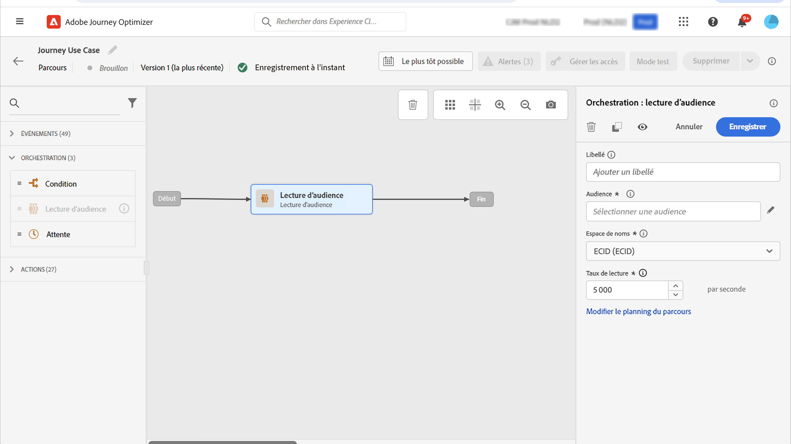
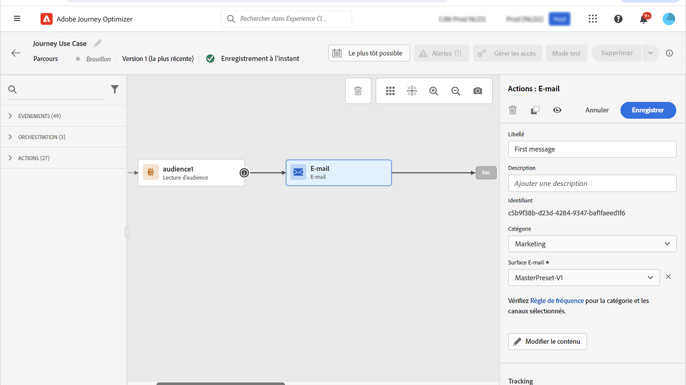

# Cas d’utilisation : envoyer des messages multicanaux{#send-multi-channel-messages}

Cette section présente un cas d’utilisation qui combine une lecture d’audience, un événement, des événements de réaction et des e-mails/messages push.

## Description du cas d’utilisation

Dans ce cas d’utilisation, nous souhaitons envoyer un premier e-mail à l’ensemble des clientes et clients appartenant à une audience spécifique.

Sur la base de leur réaction au premier message, nous souhaitons envoyer des messages spécifiques.

Si le client ou la cliente ouvre l’e-mail, nous attendons un achat et envoyons une notification push pour le ou la remercier.

S’il n’y a pas de réaction, nous leur envoyons un e-mail de relance.

## Conditions préalables

Pour que ce cas d&#39;utilisation fonctionne, vous devez configurer les éléments suivants :

* une audience pour tous les clientes et clients qui habitent à Atlanta, San Francisco ou Seattle et qui sont nés après 1980 ;
* un événement d’achat.

### Créer l’audience

Dans notre parcours, nous voulons utiliser une audience spécifique de clientes et clients. Toutes les personnes appartenant à l’audience rejoignent le parcours et suivent les différentes étapes. Dans notre exemple, nous avons besoin d’une audience qui cible tous les clientes et clients qui vivent à Atlanta, San Francisco ou Seattle et qui sont nés après 1980.

Pour plus d’informations sur les audiences, reportez-vous à cette [page](../audience/about-audiences.md).

1. Dans la section du menu CLIENT, sélectionnez **[!UICONTROL Audiences]**.

1. Cliquez sur le bouton **[!UICONTROL Créer une audience]** situé en haut à droite de la liste d’audiences.

1. Dans le volet **[!UICONTROL Propriétés de l’audience]**, saisissez le nom de l’audience.

1. Réalisez un glisser-déposer dans les champs de votre choix depuis le volet de gauche vers l&#39;espace de travail central, puis configurez-les en fonction de vos besoins. Dans cet exemple, nous utilisons les champs d&#39;attributs **Ville** et **Année de naissance**.

1. Cliquez sur **[!UICONTROL Enregistrer]**.

   

L’audience est maintenant configurée et prête à être utilisée dans votre parcours. Grâce à une activité **Lecture d’audience**, vous pouvez faire en sorte que toutes les personnes appartenant à l’audience rejoignent le parcours.

### Configurer l&#39;événement

Vous devez configurer un événement qui est envoyé à votre parcours lorsqu&#39;un client effectue un achat. Lorsque le parcours reçoit l&#39;événement, il déclenche le message de remerciement.

Pour cela, nous utilisons un événement basé sur des règles. Pour plus d&#39;informations sur les événements, consultez cette [page](../event/about-events.md).

1. Dans la section du menu ADMINISTRATION, sélectionnez **[!UICONTROL Configurations]**, puis cliquez sur **[!UICONTROL Événements]**. Cliquez sur **[!UICONTROL Créer un événement]** pour créer un événement.

1. Saisissez le nom de votre événement.

1. Dans le champ **[!UICONTROL Type d&#39;identifiant d&#39;événement]**, sélectionnez **[!UICONTROL Basé sur des règles]**.

1. Définissez les champs **[!UICONTROL Schéma]** et **[!UICONTROL Payload]**. Vous pouvez utiliser plusieurs champs, par exemple, le produit acheté, la date d&#39;achat et l&#39;identifiant d&#39;achat.

1. Dans le champ **[!UICONTROL Condition d&#39;identifiant d&#39;événement]**, définissez la condition utilisée par le système pour identifier les événements qui déclenchent votre parcours. Par exemple, vous pouvez ajouter un champ `purchaseMessage` et définir la règle suivante : `purchaseMessage="thank you"`

1. Définissez l&#39;**[!UICONTROL espace de noms]** et l&#39;**[!UICONTROL identifiant du profil]**.

1. Cliquez sur **[!UICONTROL Enregistrer]**.

   

L&#39;événement maintenant configuré et prêt à être utilisé dans votre parcours. À l&#39;aide de l&#39;activité d&#39;événement correspondante, vous pouvez déclencher une action chaque fois qu&#39;un client effectue un achat.

## Concevoir le parcours

1. Débutez le parcours avec une activité **Lecture d’audience**. Sélectionnez l’audience que vous venez de créer. Toutes les personnes appartenant à l’audience rejoignent le parcours.

   

1. Déposez une activité d’action **E-mail** et définissez le contenu du « premier message ». Ce message est envoyé à tous individus dans le parcours. Consultez cette [section](../email/create-email.md) pour savoir comment configurer et concevoir un e-mail.

   

1. Ajoutez un événement **Réaction** et sélectionnez **E-mail ouvert**. L’événement est déclenché lorsqu’une personne appartenant à l’audience ouvre l’e-mail.

1. Cochez la case **Définir la temporisation de l’événement**, définissez une durée (1 jour dans notre exemple) et cochez **Ajouter un chemin de temporisation**. Cela crée un autre chemin pour les personnes qui n’ouvrent pas le premier message par notification push ou par e-mail.

1. Dans le chemin de temporisation, déposez une activité d’action **E-mail** et définissez le contenu du message de « relance ». Ce message est envoyé aux individus qui n’ouvrent pas le premier email ou la première notification push le lendemain. Consultez cette [section](../email/create-email.md) pour savoir comment configurer et concevoir un e-mail.

1. Dans le premier chemin, ajoutez l’événement d’achat créé précédemment. L&#39;événement est déclenché lorsqu&#39;un individu effectue un achat.

1. Après l’événement, déposez une activité d’action **Push** et définissez le contenu du message « merci ». Consultez cette section [section](../push/create-push.md) pour savoir comment configurer et concevoir une notification push.

## Tester et publier le parcours

1. Avant de tester votre parcours, vérifiez qu&#39;il est valide et qu&#39;il ne comporte aucune erreur,

1. Cliquez sur la bascule **Test** située dans le coin supérieur droit pour activer le mode test. Reportez-vous à cette [section](testing-the-journey.md) pour savoir comment utiliser le mode test.

1. Lorsque le parcours est prêt, publiez-le à l&#39;aide du bouton **Publier** situé dans le coin supérieur droit.
