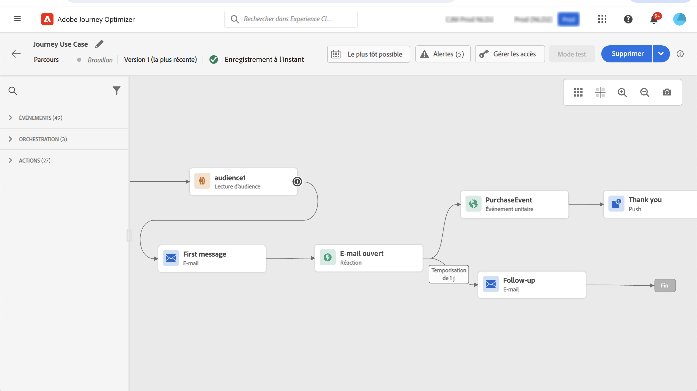

# Cas pratique : envoyer des messages multicanaux ;{#send-multi-channel-messages}

Cette section présente un cas pratique qui combine un segment de lecture, un événement, des événements de réaction et des messages électroniques/push.

## Description du cas d’utilisation

Dans ce cas pratique, nous souhaitons envoyer un premier message (email et notification push) à tous les clients appartenant à un segment spécifique.

En fonction de leur réaction au premier message, nous souhaitons envoyer des messages spécifiques.

Après le premier message, nous attendons un jour que les clients ouvrent la notification push ou l’email. S&#39;il n&#39;y a pas de réaction, nous leur envoyons un email de relance.

Ensuite, nous attendons un achat et envoyons un message push pour remercier le client.

## Conditions préalables

Pour que ce cas pratique fonctionne, vous devez configurer les éléments suivants :

* un segment pour tous les clients qui vivent à Atlanta, San Francisco ou Seattle et qui sont nés après 1980.
* un événement d’achat

### Création du segment

Dans notre parcours, nous voulons utiliser un segment spécifique de clients. Toutes les personnes appartenant au segment rejoignent le parcours et suivent les différentes étapes. Dans notre exemple, nous avons besoin d’un segment qui cible tous les clients vivant à Atlanta, San Francisco ou Seattle et nés après 1980.

Pour plus d’informations sur les segments, reportez-vous à cette section [page](../segment/about-segments.md).

1. Dans la section du menu CLIENT , sélectionnez **[!UICONTROL Segments]**.

1. Cliquez sur le bouton **[!UICONTROL Create segment]** qui se trouve en haut à droite de la liste de segments.

1. Dans le **[!UICONTROL Segment properties]** , saisissez un nom pour le segment.

1. Faites glisser les champs de votre choix depuis le volet de gauche vers l’espace de travail central, puis configurez-les selon vos besoins. Dans cet exemple, nous utilisons le **Ville** et **Année de naissance** Attributs .

1. Cliquez sur **[!UICONTROL Save]**.

   

Le segment est maintenant créé et prêt à être utilisé dans votre parcours. Utilisation d’une **Lecture de segment** vous pouvez faire entrer dans le parcours toutes les personnes appartenant au segment.

### Configuration de l’événement

Vous devez configurer un événement qui est envoyé à votre parcours lorsqu’un client effectue un achat. Lorsque le parcours reçoit l’événement, il déclenche le message de remerciement.

Pour ce faire, nous utilisons un événement basé sur des règles. Pour plus d&#39;informations sur les événements, reportez-vous à cette section [page](../event/about-events.md).

1. Dans la section du menu ADMINISTRATION, sélectionnez **[!UICONTROL Configurations]**, puis cliquez sur **[!UICONTROL Events]**. Cliquez sur **[!UICONTROL Create event]** pour créer un événement.

1. Saisissez le nom de votre événement.

1. Dans le **[!UICONTROL Event ID type]** champ, sélectionnez **[!UICONTROL Rule Based]**.

1. Définissez la variable **[!UICONTROL Schema]** et payload **[!UICONTROL Fields]**. Vous pouvez utiliser plusieurs champs, par exemple le produit acheté, la date d’achat et l’identifiant d’achat.

1. Dans le **[!UICONTROL Event ID condition]** , définissez la condition utilisée par le système pour identifier les événements qui déclenchent votre parcours. Par exemple, vous pouvez ajouter une `purchaseMessage` et définissez la règle suivante : `purchaseMessage="thank you"`

1. Définissez la variable **[!UICONTROL Namespace]** et **[!UICONTROL Profile Identifier]**.

1. Cliquez sur **[!UICONTROL Save]**.

   

L’événement est maintenant configuré et prêt à être utilisé dans votre parcours. À l’aide de l’activité d’événement correspondante, vous pouvez déclencher une action chaque fois qu’un client effectue un achat.

## Concevoir le parcours

1. Commencez le parcours par une **Lecture de segment** activité. Sélectionnez le segment créé précédemment. Toutes les personnes appartenant au segment rejoignent le parcours.

   

1. Déposer une **Email** activité d&#39;action et définir le contenu du &quot;premier message&quot;. Ce message est envoyé à tous les individus du parcours. Consultez cette section [section](../email/create-email.md) pour savoir comment configurer et concevoir un email.

   

1. Positionnez-vous sur l&#39;activité email et cliquez sur le symbole &quot;+&quot; pour créer un nouveau chemin.

1. Dans le premier chemin, ajoutez une **Réaction** et sélectionnez **Ouverture push**. L’événement est déclenché lorsqu’une personne appartenant au segment ouvre la version push du premier message.

1. Dans le deuxième chemin, ajoutez une **Réaction** et sélectionnez **Email ouvert**. L’événement est déclenché lorsque l’individu ouvre l’e-mail.

1. Dans l&#39;une des activités de réaction, vérifiez la variable **Définition du délai d’expiration de l’événement** , définissez une durée (1 jour dans notre exemple) et cochez la case **Définition d’un chemin d’accès au délai d’expiration**. Cela crée un autre chemin pour les personnes qui n’ouvrent pas le premier message push ou email.

   >[!NOTE]
   >
   >Lors de la configuration d’un délai d’expiration sur plusieurs événements (les deux réactions dans ce cas), il vous suffit de configurer le délai d’expiration sur l’un de ces événements.

1. Dans le chemin d’accès au délai d’expiration, déposez une **Email** activité d&#39;action et définir le contenu du message &quot;relance&quot;. Ce message est envoyé aux personnes qui n’ouvrent pas l’email ou ne le premier message push le lendemain. Consultez cette section [section](../email/create-email.md) pour savoir comment configurer et concevoir un email.

1. Connectez les trois chemins d’accès à l’événement d’achat créé précédemment. L’événement est déclenché lorsqu’un individu effectue un achat.

1. Après l’événement, déposez une **Push** activité d’action et définir le contenu du message &quot;merci&quot;. Consultez cette section [section](../push/create-push.md) pour savoir comment configurer et concevoir une notification push.

## Test et publication du parcours

1. Avant de tester votre parcours, vérifiez qu’il est valide et qu’il ne comporte aucune erreur.

1. Cliquez sur le bouton **Test** bascule, situé dans le coin supérieur droit, pour activer le mode test. Définissez la manière dont vous souhaitez que les profils de test entrent dans le test : un seul profil, ou jusqu’à 100 à la fois. Consultez cette section [section](testing-the-journey.md) pour apprendre à utiliser le mode test.

1. Lorsque le parcours est prêt, publiez-le à l’aide de la fonction **Publier** , situé dans le coin supérieur droit.
