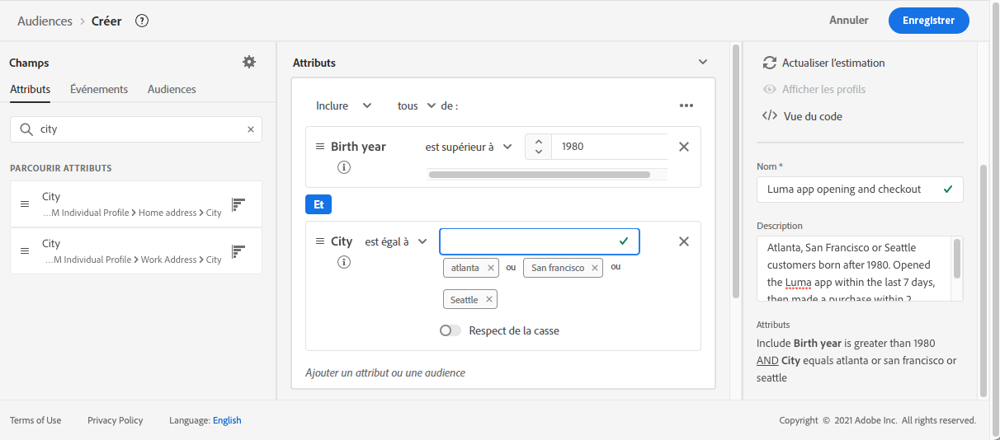

# Cas d’utilisation : envoyer des messages multicanaux{#send-multi-channel-messages}

Cette section présente un cas pratique qui combine une audience de lecture, un événement, des événements de réaction et des messages électroniques/push.

## Description du cas d’utilisation

Dans ce cas pratique, nous souhaitons envoyer un premier message (email et push) à tous les clients appartenant à une audience spécifique.

Sur la base de leur réaction au premier message, nous voulons envoyer des messages spécifiques.

Après le premier message, nous attendons un jour que les clients ouvrent le message push ou l&#39;email. S&#39;il n&#39;y a pas de réaction, nous leur envoyons un email de relance.

Ensuite, nous attendons un achat et envoyons un message push pour remercier le client.

## Conditions préalables

Pour que ce cas d&#39;utilisation fonctionne, vous devez configurer les éléments suivants :

* une audience pour tous les clients qui vivent à Atlanta, San Francisco ou Seattle et qui sont nés après 1980.
* un événement d&#39;achat

### Création de l’audience

Dans notre parcours, nous voulons exploiter une audience spécifique de clients. Tous les individus appartenant à l&#39;audience entrent dans le parcours et suivent les différentes étapes. Dans notre exemple, nous avons besoin d’une audience qui cible tous les clients vivant à Atlanta, San Francisco ou Seattle et nés après 1980.

Pour plus d&#39;informations sur les audiences, reportez-vous à cette section [page](../audience/about-audiences.md).

1. Dans la section du menu CLIENT , sélectionnez **[!UICONTROL Audiences]**.

1. Cliquez sur le bouton **[!UICONTROL Créer une audience]** qui se trouve en haut à droite de la liste des audiences.

1. Dans le **[!UICONTROL Propriétés d’audience]** , saisissez un nom pour l’audience.

1. Réalisez un glisser-déposer dans les champs de votre choix depuis le volet de gauche vers l&#39;espace de travail central, puis configurez-les en fonction de vos besoins. Dans cet exemple, nous utilisons les champs d&#39;attributs **Ville** et **Année de naissance**.

1. Cliquez sur **[!UICONTROL Enregistrer]**.

   

L’audience est maintenant créée et prête à être utilisée dans votre parcours. Utilisation d’une **Lecture d’audience** activité, vous pouvez faire entrer dans le parcours toutes les personnes appartenant à l’audience.

### Configurer l&#39;événement

Vous devez configurer un événement qui est envoyé à votre parcours lorsqu&#39;un client effectue un achat. Lorsque le parcours reçoit l&#39;événement, il déclenche le message de remerciement.

Pour cela, nous utilisons un événement basé sur des règles. Pour plus d&#39;informations sur les événements, consultez cette [page](../event/about-events.md).

1. Dans la section du menu ADMINISTRATION, sélectionnez **[!UICONTROL Configurations]**, puis cliquez sur **[!UICONTROL Événements]**. Cliquez sur **[!UICONTROL Créer un événement]** pour créer un événement.

1. Saisissez le nom de votre événement.

1. Dans le champ **[!UICONTROL Type d&#39;identifiant d&#39;événement]**, sélectionnez **[!UICONTROL Basé sur des règles]**.

1. Définissez les champs **[!UICONTROL Schéma]** et **[!UICONTROL Payload]**. Vous pouvez utiliser plusieurs champs, par exemple, le produit acheté, la date d&#39;achat et l&#39;identifiant d&#39;achat.

1. Dans le champ **[!UICONTROL Condition d&#39;identifiant d&#39;événement]**, définissez la condition utilisée par le système pour identifier les événements qui déclenchent votre parcours. Par exemple, vous pouvez ajouter un champ `purchaseMessage` et définir la règle suivante : `purchaseMessage="thank you"`

1. Définissez l&#39;**[!UICONTROL espace de noms]** et l&#39;**[!UICONTROL identifiant du profil]**.

1. Cliquez sur **[!UICONTROL Enregistrer]**.

   

L&#39;événement maintenant configuré et prêt à être utilisé dans votre parcours. À l&#39;aide de l&#39;activité d&#39;événement correspondante, vous pouvez déclencher une action chaque fois qu&#39;un client effectue un achat.

## Concevoir le parcours

1. Commencez le parcours par un **Lecture d’audience** activité. Sélectionnez l&#39;audience créée précédemment. Tous les individus appartenant à l&#39;audience entrent dans le parcours.

   

1. Déposez une activité d’action **E-mail** et définissez le contenu du « premier message ». Ce message est envoyé à tous individus dans le parcours. Consultez cette [section](../email/create-email.md) pour savoir comment configurer et concevoir un e-mail.

   

1. Placez votre curseur sur l’activité d’e-mail et cliquez sur le symbole «␣+␣» pour créer un nouveau chemin.

1. Dans le premier chemin, ajoutez un événement **Réaction** et sélectionnez **Notification push ouverte**. L’événement est déclenché lorsqu’une personne appartenant à l’audience ouvre la version push du premier message.

1. Dans le second chemin, ajoutez un événement **Réaction** et sélectionnez **Email ouvert**. L&#39;événement est déclenché lorsque l&#39;individu ouvre l&#39;email.

1. Dans l&#39;une des activités de la réaction, cochez la case **Définir la temporisation de l&#39;événement**, définissez une durée (1 jour dans notre exemple) et cochez **Ajouter un itinéraire de temporisation**. Cela crée un autre itinéraire pour les individus qui n&#39;ouvrent pas le premier message push ou l&#39;email.

   >[!NOTE]
   >
   >Lors de la configuration d&#39;une temporisation sur plusieurs événements (les deux réactions dans ce cas), il vous suffit de configurer la temporisation sur l&#39;un de ces événements.

1. Dans l’itinéraire de temporisation, déposez une activité d’action **E-mail** et définissez le contenu du message de « relance ». Ce message est envoyé aux individus qui n’ouvrent pas le premier email ou la première notification push le lendemain. Consultez cette [section](../email/create-email.md) pour savoir comment configurer et concevoir un e-mail.

1. Connectez les trois chemins à l&#39;événement d&#39;achat créé précédemment. L&#39;événement est déclenché lorsqu&#39;un individu effectue un achat.

1. Après l’événement, déposez une activité d’action **Push** et définissez le contenu du message « merci ». Consultez cette section [section](../push/create-push.md) pour savoir comment configurer et concevoir une notification push.

## Tester et publier le parcours

1. Avant de tester votre parcours, vérifiez qu&#39;il est valide et qu&#39;il ne comporte aucune erreur,

1. Cliquez sur la bascule **Test** située dans le coin supérieur droit pour activer le mode test. Définissez comment vous souhaitez que les profils de test rejoignent le test : un seul profil, ou jusqu&#39;à 100 à la fois. Reportez-vous à cette [section](testing-the-journey.md) pour savoir comment utiliser le mode test.

1. Lorsque le parcours est prêt, publiez-le à l&#39;aide du bouton **Publier** situé dans le coin supérieur droit.
