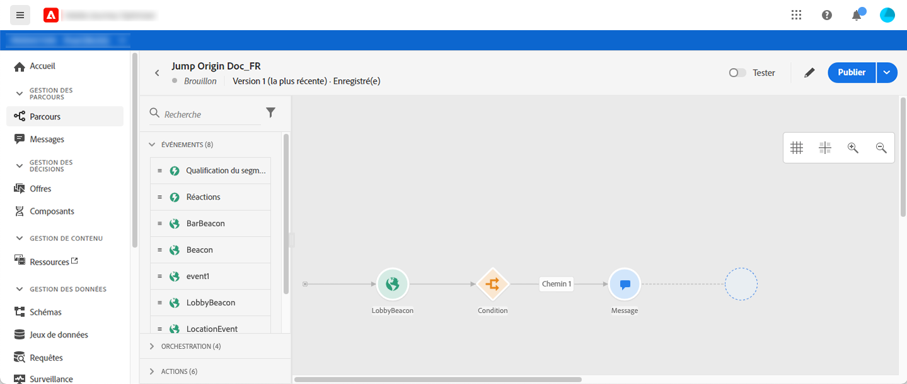
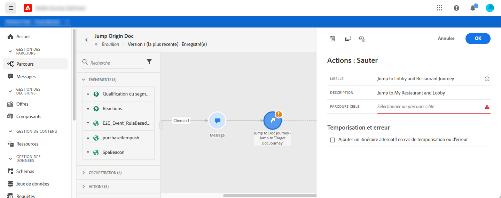
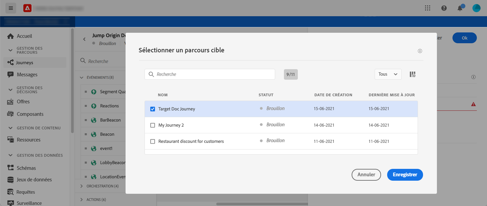
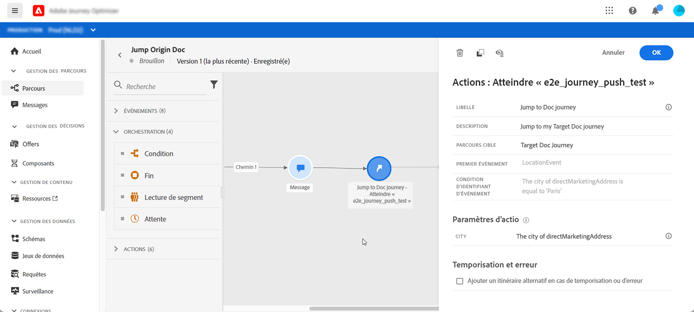
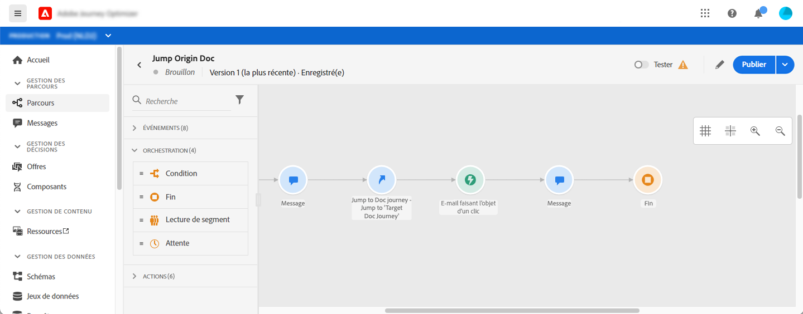
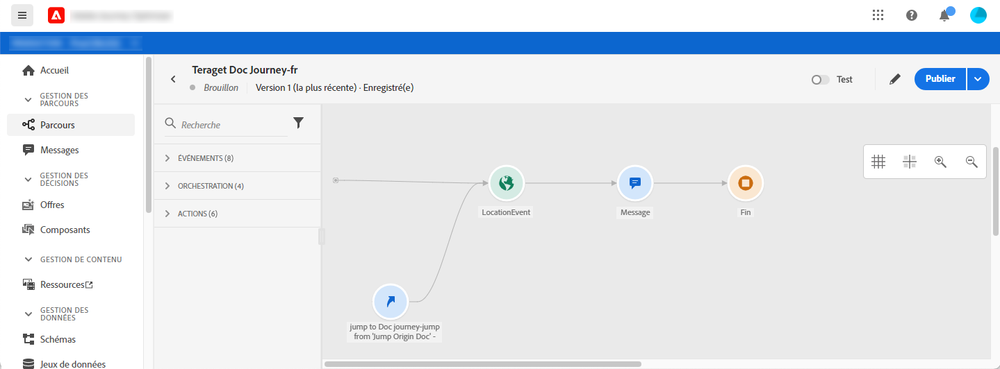
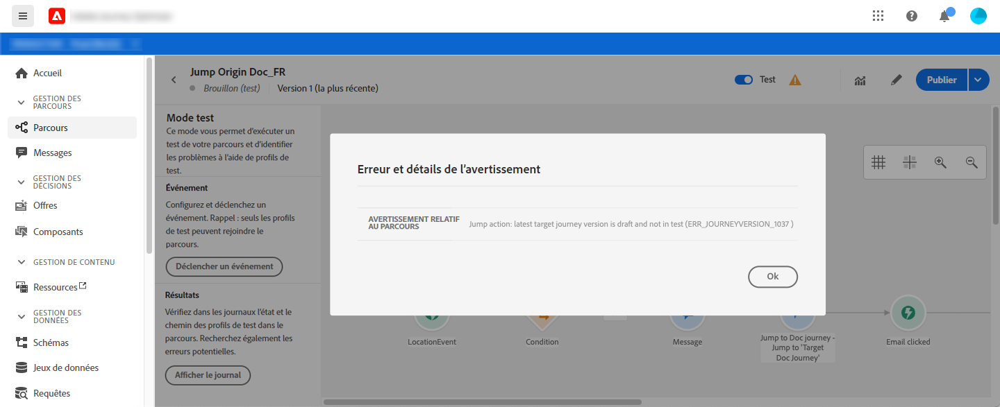

# Passer d&#39;un parcours à un autre {#jump}

L&#39;activité d&#39;action **[!UICONTROL Sauter]** vous permet de pousser des individus d&#39;un parcours à l&#39;autre. Cette fonctionnalité vous permet d’effectuer les opérations suivantes :

* simplifier la conception de parcours très complexes en les divisant en plusieurs
* créer des parcours basés sur des modèles de parcours communs et réutilisables

Dans le parcours d’origine, il vous suffit d’ajouter une activité **[!UICONTROL Sauter]** et de sélectionner un parcours de cible. Lorsque l&#39;individu entre dans l&#39;étape **[!UICONTROL Sauter]**, un événement interne est envoyé au premier événement du parcours de cible. Si l&#39;action **[!UICONTROL Sauter]** réussit, l&#39;individu continue à progresser dans le parcours. Le comportement est similaire aux autres actions.

Dans le parcours de la cible, le premier événement déclenché en interne par l&#39;activité **[!UICONTROL Sauter]** fera déborder le parcours individuellement.

>[!NOTE]
>
>Reportez-vous également à la vidéo du didacticiel [ici](https://experienceleague.adobe.com/docs/journey-orchestration-learn/tutorials/building-a-journey/jumping-to-another-journey.html)

## Cycle de vie

Supposons que vous ayez ajouté une activité **[!UICONTROL Sauter]** dans un parcours A à un parcours B. Parcours A correspond au **parcours d&#39;origine** et parcours B, au **de cible**.
Voici les différentes étapes du processus d’exécution :

**Parcours** Ais déclenché à partir d’un événement externe :

1. Le parcours A reçoit un événement externe lié à une personne.
1. L&#39;individu atteint l&#39;étape **[!UICONTROL Sauter]**.
1. La personne est poussée au Parcours B et passe aux étapes suivantes du Parcours A, après l’étape **[!UICONTROL Sauter]**.

Dans le parcours B, le premier événement est déclenché en interne, par l&#39;activité **[!UICONTROL Sauter]** du parcours A :

1. Le parcours B a reçu un événement interne du Parcours A.
1. Les débuts individuels circulant dans le Parcours B.

>[!NOTE]
>
>Le parcours B peut également être déclenché par un événement externe.

## Meilleures pratiques et limites

### Création

* L&#39;activité **[!UICONTROL Sauter]** n&#39;est disponible que dans les parcours qui utilisent un espace de nommage.
* Vous ne pouvez accéder qu’à un parcours qui utilise le même espace de nommage que le parcours d’origine.
* Vous ne pouvez pas accéder à un parcours qui début avec un événement **Qualification de segment** ou **Lire le segment**.
* Vous ne pouvez pas avoir une activité **[!UICONTROL Sauter]** et un événement **Qualification de segment** ou **Lire le segment** dans le même parcours.
* Vous pouvez inclure autant d&#39;activités **[!UICONTROL Sauter]** que nécessaire dans un parcours. Après un **[!UICONTROL saut]**, vous pouvez ajouter toute activité nécessaire.
* Vous pouvez avoir autant de niveaux de sauts que nécessaire. Par exemple, le Parcours A passe au parcours B, qui passe au parcours C, etc.
* Le parcours de cible peut également inclure autant d&#39;activités **[!UICONTROL Sauter]** que nécessaire.
* Les modèles de boucle ne sont pas pris en charge. Il n&#39;y a aucun moyen de lier deux ou plusieurs parcours ensemble qui créerait une boucle infinie. L&#39;écran de configuration de l&#39;activité **[!UICONTROL Sauter]** vous empêche de faire cela.

### Exécution

* Lorsque l&#39;activité **[!UICONTROL Sauter]** est exécutée, la dernière version du parcours de cible est déclenchée.
* Comme d&#39;habitude, un individu unique ne peut être présent qu&#39;une seule fois dans un même parcours. Par conséquent, si l&#39;individu expulsé du parcours de l&#39;origine est déjà sur le parcours de la cible, il n&#39;entrera pas dans le parcours de la cible. Aucune erreur ne sera signalée sur l&#39;activité **[!UICONTROL Sauter]** car il s&#39;agit d&#39;un comportement normal.

## Configuration de l’activité de vidage

1. Concevez votre **parcours d&#39;origine**.

   

1. À chaque étape du parcours, ajoutez une activité **[!UICONTROL Sauter]**, à partir de la catégorie **[!UICONTROL ACTIONS]**. Ajoutez une étiquette et une description.

   

1. Cliquez dans le champ **parcours de Cible**.
La liste affiche toutes les versions de parcours en mode version préliminaire, en direct ou en mode test. Les parcours qui utilisent un autre espace de nommage ou ce début avec une **qualification de segment** événement ne sont pas disponibles. Les parcours de cible qui créeraient un modèle de boucle sont également filtrés.

   

   >[!NOTE]
   >
   >Vous pouvez cliquer sur l&#39;icône **Ouvrir le parcours de cible**, sur le côté droit, pour ouvrir le parcours de cible dans un nouvel onglet.

1. Sélectionnez le parcours de cible auquel vous souhaitez passer.
Le champ **Premier événement** est prérempli avec le nom du premier événement du parcours de cible. Si votre parcours de cible comprend plusieurs événements, le saut **[!UICONTROL sauter]** n&#39;est autorisé que le premier événement.

   

1. La section **Paramètres d&#39;action** affiche tous les champs du événement de cible. De la même manière que pour les autres types d’actions, mappez chaque champ avec les champs du événement d’origine ou de la source de données. Ces informations seront transmises au parcours de la cible au moment de l’exécution.
1. Ajoutez les activités suivantes pour terminer votre parcours d&#39;origine.

   

   >[!NOTE]
   >
   >L&#39;identité de l&#39;individu est automatiquement cartographiée. Ces informations ne sont pas visibles dans l’interface.

Votre activité **[!UICONTROL Sauter]** est configurée. Dès que votre parcours est en direct ou en mode test, les individus qui atteignent l’étape **[!UICONTROL Sauter]** seront poussés de vers le parcours de cible.

Lorsqu&#39;une activité **[!UICONTROL Saut]** est configurée dans un parcours, une icône **[!UICONTROL Saut]** d&#39;entrée est automatiquement ajoutée au début du parcours de cible. Cela vous permet d’identifier que le parcours peut être déclenché en externe mais aussi en interne à partir d’une activité **[!UICONTROL Jump]**.

## Dépannage

Lorsque le parcours est publié ou en mode test, des erreurs se produisent si :
* le parcours de cible n&#39;existe plus
* le parcours de cible est brouillon, fermé ou arrêté
* si le premier événement du parcours de cible a changé et si le mappage est rompu

