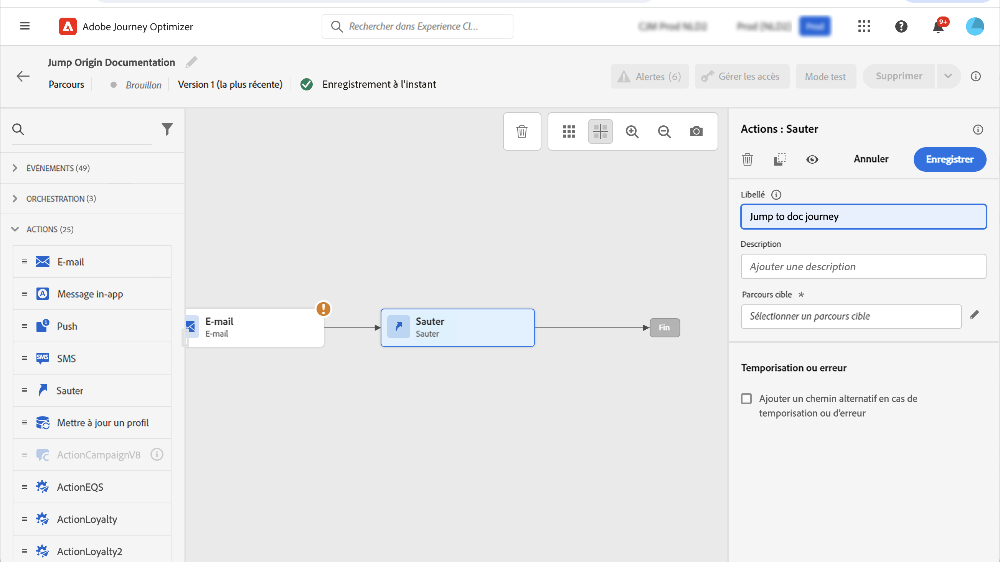
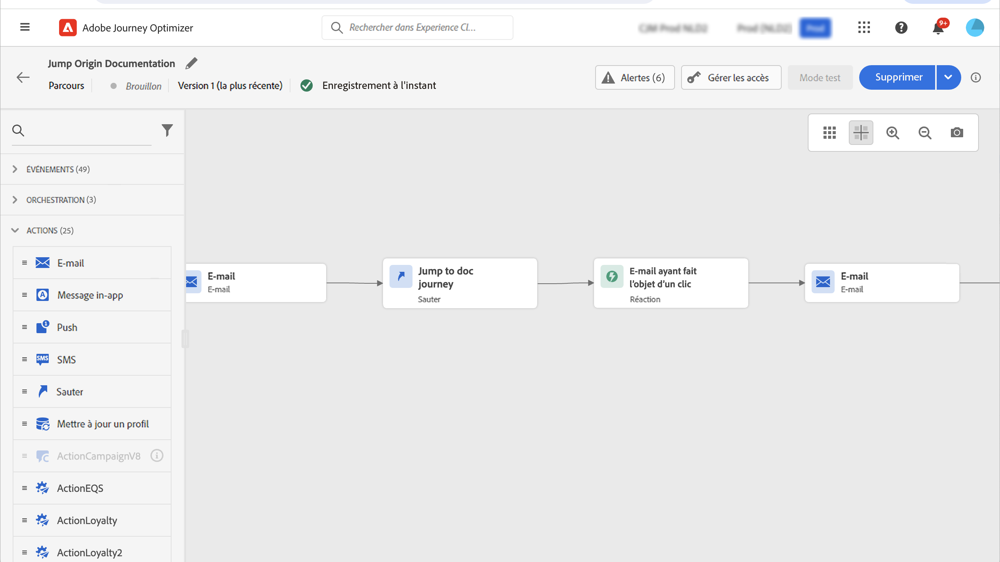

# Passage d’un parcours à un autre {#jump}

>[!CONTEXTUALHELP]
>id="ajo_journey_jump"
>title="Activité Saut"
>abstract="L’activité d’action Saut permet de pousser des individus d’un parcours vers un autre. Cette fonctionnalité vous permet de simplifier la conception de parcours très complexes et de créer des parcours basés sur des schémas de parcours communs et réutilisables."

Le **[!UICONTROL Jump]** l’activité d’action vous permet de pousser des individus d’un parcours vers un autre. Cette fonctionnalité vous permet d’effectuer les opérations suivantes :

* simplifier la conception de parcours très complexes en les divisant en plusieurs autres ;
* créer des parcours basés sur des schémas de parcours communs et réutilisables ;

Dans le parcours d’origine, ajoutez simplement une **[!UICONTROL Jump]** et sélectionnez un parcours cible. Lorsque l’individu saisit la variable **[!UICONTROL Jump]** , un événement interne est envoyé au premier événement du parcours cible. Si la variable **[!UICONTROL Jump]** l’action est réussie, l’individu continue à progresser dans le parcours. Le comportement est similaire aux autres actions.

Dans le parcours cible, le premier événement déclenché en interne par la variable **[!UICONTROL Jump]** l’activité permet à chaque individu de s’insérer dans le parcours.

## Cycle de vie

Supposons que vous ayez ajouté une **[!UICONTROL Jump]** une activité dans un parcours A à un parcours B. Le parcours A correspond à la variable **parcours d’origine** et parcours B, le **parcours cible**.
Voici les différentes étapes du processus d’exécution :

**Parcours A** est déclenché à partir d’un événement externe :

1. Le parcours A reçoit un événement externe associé à un individu.
1. L’individu atteint le **[!UICONTROL Jump]** étape .
1. L’individu est amené au parcours B et passe aux étapes suivantes du parcours A, après la **[!UICONTROL Jump]** étape .

Dans le parcours B, le premier événement est déclenché en interne, via la variable **[!UICONTROL Jump]** activité du parcours A :

1. Le parcours B a reçu un événement interne du parcours A.
1. L’individu commence à effectuer le parcours B.

>[!NOTE]
>
>Le parcours B peut également être déclenché par un événement externe.

## Bonnes pratiques et limites

### Création

* Le **[!UICONTROL Jump]** L’activité n’est disponible que dans les parcours qui utilisent un espace de noms.
* Vous ne pouvez accéder qu’à un parcours qui utilise le même espace de noms que le parcours d’origine.
* Vous ne pouvez pas accéder à un parcours qui commence par un **Qualification de segment** ou **Lecture de segment**.
* Vous ne pouvez pas avoir **[!UICONTROL Jump]** activité et une **Qualification de segment** ou **Lecture de segment** dans le même parcours.
* Vous pouvez inclure autant de **[!UICONTROL Jump]** activités dont vous avez besoin dans un parcours. Après une **[!UICONTROL Jump]**, vous pouvez ajouter toute activité nécessaire.
* Vous pouvez avoir autant de niveaux de saut que nécessaire. Par exemple, le parcours A passe au parcours B, qui passe au parcours C, etc.
* Le parcours cible peut également comporter autant de **[!UICONTROL Jump]** activités selon les besoins.
* Les modèles de boucle ne sont pas pris en charge. Il n’est pas possible de lier deux parcours ou plus ensemble, ce qui créerait une boucle infinie. Le **[!UICONTROL Jump]** l’écran de configuration des activités vous empêche de le faire.

### Exécution

* Lorsque la variable **[!UICONTROL Jump]** est exécutée, la dernière version du parcours cible est déclenchée.
* Comme d’habitude, un individu unique ne peut être présent qu’une seule fois dans un même parcours. Par conséquent, si l’individu provenant du parcours d’origine figure déjà dans le parcours cible, il ne rejoindra pas le parcours cible. Aucune erreur ne sera signalée sur la variable **[!UICONTROL Jump]** car il s’agit d’un comportement normal.

## Configuration de l’activité Saut

1. Concevez vos **parcours d’origine**.

   

1. À chaque étape du parcours, ajoutez une **[!UICONTROL Jump]** de l’activité **[!UICONTROL ACTIONS]** catégorie. Ajoutez un libellé et une description.

   

1. Cliquez dans le **Parcours Target** champ .
La liste affiche toutes les versions de parcours qui sont en version préliminaire, en direct ou en mode test. Parcours qui utilisent un autre espace de noms ou qui commencent par un **Qualification de segment** ne sont pas disponibles. Les parcours Target qui créeraient un modèle de boucle sont également filtrés.

   

   >[!NOTE]
   >
   >Vous pouvez cliquer sur le bouton **Ouvrir le parcours cible** sur le côté droit pour ouvrir le parcours cible dans un nouvel onglet.

1. Sélectionnez le parcours cible auquel vous souhaitez accéder.
Le **Premier événement** est prérempli avec le nom du premier événement du parcours cible. Si votre parcours cible comprend plusieurs événements, la variable **[!UICONTROL Jump]** n’est autorisé que lors du premier événement.

   

1. Le **Paramètres d’action** affiche tous les champs de l’événement cible. De la même manière que pour les autres types d’actions, mappez chaque champ avec les champs de l’événement ou de la source de données d’origine. Ces informations seront transmises au parcours cible au moment de l’exécution.
1. Ajoutez les activités suivantes pour terminer votre parcours d’origine.

   

   >[!NOTE]
   >
   >L’identité de l’individu est automatiquement mappée. Ces informations ne sont pas visibles dans l’interface.

Votre **[!UICONTROL Jump]** activité est configurée. Dès que votre parcours est actif ou en mode test, des individus atteignent la variable **[!UICONTROL Jump]** est transmise du au parcours cible.

Lorsqu’une **[!UICONTROL Jump]** est configurée dans un parcours, une activité **[!UICONTROL Jump]** l’icône d’entrée est automatiquement ajoutée au début du parcours cible. Cela vous permet d’identifier que le parcours peut être déclenché en externe mais aussi en interne à partir d’un **[!UICONTROL Jump]** activité.

## Dépannage

Lorsque le parcours est publié ou en mode test, des erreurs se produisent dans les cas suivants :
* le parcours cible n’existe plus
* le parcours cible est en version brouillon, fermé ou arrêté ;
* si le premier événement du parcours cible a changé et que le mappage est rompu

