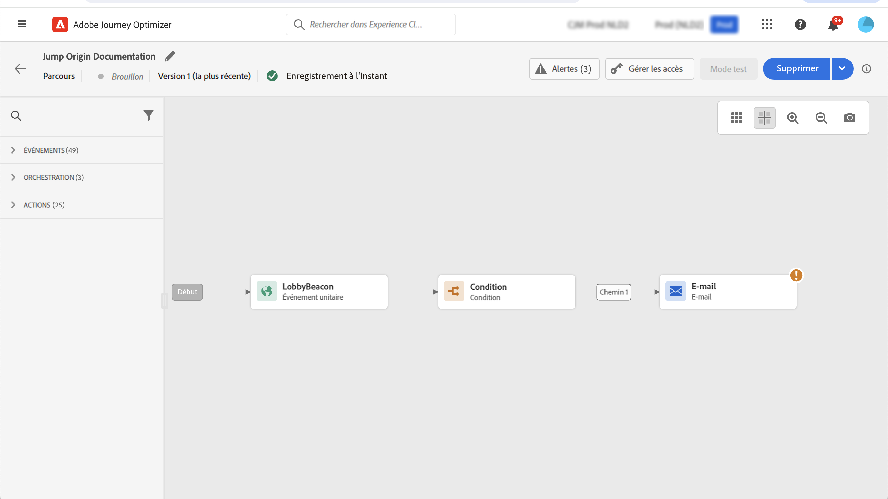
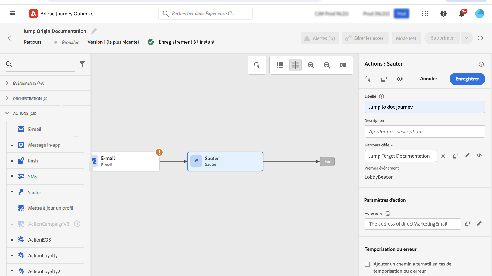
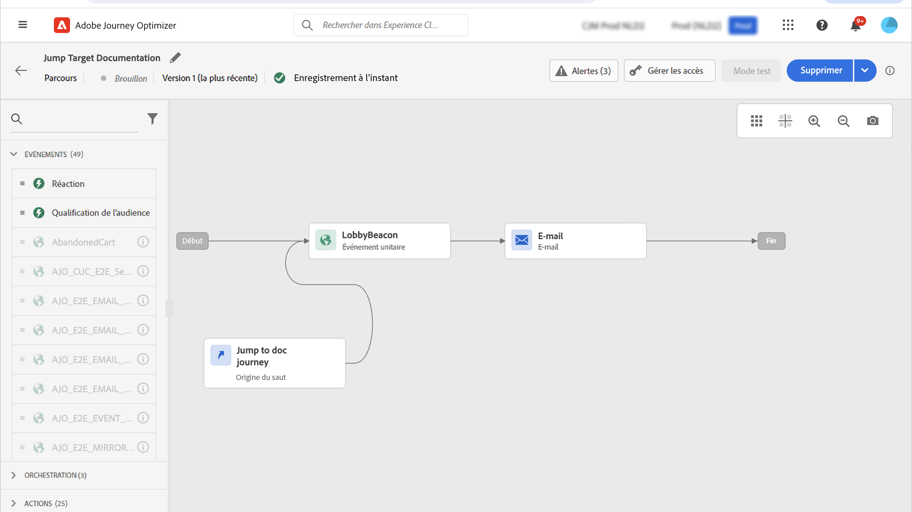
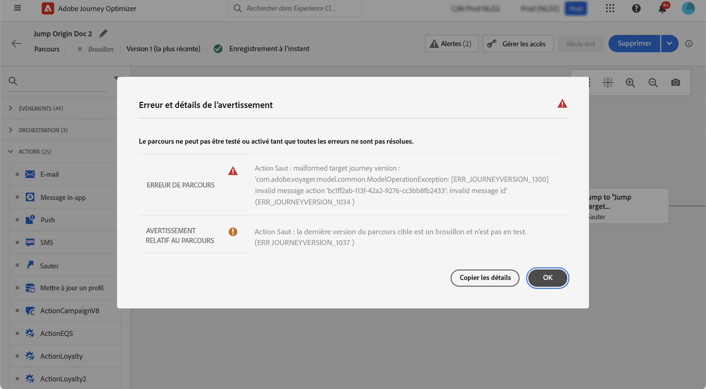

# Sauter d’un parcours à un autre {#jump}

>[!CONTEXTUALHELP]
>id="ajo_journey_jump"
>title="Activité Saut"
>abstract="L’activité d’action Saut permet d’inviter des individus à passer d’un parcours à un autre. Cette fonctionnalité vous permet de simplifier la conception de parcours très complexes et de créer des parcours basés sur des modèles de parcours communs et réutilisables."

L’activité d’action **[!UICONTROL Saut]** permet d’inviter des individus à passer d’un parcours à un autre. Cette fonctionnalité permet d’effectuer les opérations suivantes :

* simplifier la conception de parcours très complexes en les divisant en plusieurs autres ;
* créer des parcours basés sur des schémas de parcours communs et réutilisables.

Dans le parcours d’origine, ajoutez une activité **[!UICONTROL Saut]** et sélectionnez un parcours cible. Lorsque la personne parvient à l’étape de **[!UICONTROL saut]**, un événement interne est envoyé au premier événement du parcours cible. Si l’action **[!UICONTROL Saut]** réussit, la personne continue à progresser dans le parcours. Le comportement est similaire aux autres actions.

Dans le parcours cible, le premier événement déclenché en interne par l’activité **[!UICONTROL Saut]** permet à la personne de s’insérer dans le parcours.

## Cycle de vie {#jump-lifecycle}

Supposons que vous ayez ajouté une activité **[!UICONTROL Saut]** d’un parcours A à un parcours B. Le parcours A est le **parcours d’origine** et le parcours B, le **parcours cible**.

Voici les différentes étapes du processus d’exécution :

Le **parcours A** est déclenché par un événement externe :

1. Le parcours A reçoit un événement externe lié à un individu.
1. L’individu atteint l’étape du **[!UICONTROL saut]**.
1. La personne est amenée au parcours B et passe aux étapes suivantes du parcours A, situées après l’étape **[!UICONTROL Saut]**.

Dans le parcours B, le premier événement est déclenché en interne via l’activité **[!UICONTROL Saut]** à partir du parcours A :

1. Le parcours B reçoit un événement interne du parcours A.
1. La personne commence à effectuer le parcours B.

>[!NOTE]
>
>Le parcours B peut également être déclenché par un événement externe.

## Bonnes pratiques et limites {#jump-limitations}

Suivez ces instructions pour que le comportement de l’activité Saut reste prévisible et sûr.

### Création {#jump-limitations-authoring}

* L’activité **[!UICONTROL Saut]** n’est disponible que dans les parcours utilisant un espace de noms.
* Vous ne pouvez accéder qu’à un parcours qui utilise le même espace de noms que le parcours d’origine.
* Vous ne pouvez pas accéder à un parcours commençant par un événement **Qualification d’audience** ou **Lecture d’audience**.
* Un même parcours ne peut pas contenir une activité **[!UICONTROL Saut]** et un événement **Qualification d’audience** ou **Lecture d’audience**.
* Vous pouvez inclure autant d’activités **[!UICONTROL Saut]** que nécessaire dans un parcours. Après un **[!UICONTROL saut]**, vous pouvez ajouter toutes les activités nécessaires.
* Vous pouvez avoir autant de niveaux de saut que nécessaire. Par exemple, un saut du parcours A vers le parcours B, puis un saut du parcours B vers le parcours C, etc.
* Le parcours cible peut également comporter autant d’activités **[!UICONTROL Saut]** que nécessaire.
* Les schémas de boucle ne sont pas pris en charge. Il n’est pas possible de relier deux parcours ou plus entre eux, car cela entraînerait une boucle infinie. L’écran de configuration de l’activité **[!UICONTROL Saut]** vous empêche de le faire.

### Exécution {#jump-limitations-exec}

* Lorsque l’activité **[!UICONTROL Saut]** est exécutée, la dernière version du parcours cible est déclenchée.
* Une personne unique ne peut être présente qu’une seule fois dans un même parcours. Ainsi, si une personne provenant d’un parcours d’origine se trouve déjà dans le parcours cible, elle ne rejoindra pas le parcours cible. Aucune erreur ne sera signalée lors de l’activité **[!UICONTROL Saut]**, car il s’agit d’un comportement normal.

## Configuration de l’activité Saut {#jump-configure}

1. Concevez votre **parcours d’origine**.

   

1. À chaque étape du parcours, ajoutez une activité **[!UICONTROL Saut]**, depuis la catégorie **[!UICONTROL ACTIONS]**. Ajoutez un libellé et une description.

   

1. Cliquez dans le champ **Parcours cible**.
La liste contient toutes les versions de parcours en version brouillon, version active ou en mode test. Les parcours qui utilisent un autre espace de noms ou commençant par un événement **Qualification d’audience** ne sont pas disponibles. Les parcours cible qui créeraient un schéma de boucle sont également filtrés.

   

   >[!NOTE]
   >
   >Vous pouvez cliquer sur l’icône **Ouvrir le parcours cible**, sur le côté droit, pour ouvrir le parcours cible dans un nouvel onglet.

1. Sélectionnez le parcours cible auquel vous souhaitez accéder.
Le champ **Premier événement** est prérenseigné avec le nom du premier événement du parcours cible. Si votre parcours cible comporte plusieurs événements, le **[!UICONTROL saut]** n’est autorisé que pour le premier.

   

1. La section **Paramètres d’action** affiche tous les champs de l’événement cible. Mappez chaque champ aux champs de l’événement d’origine ou de la source de données, comme pour les autres types d’actions. Ces informations seront transmises au parcours cible au moment de l’exécution.
1. Ajoutez les activités suivantes pour terminer le parcours d’origine.

   

   >[!NOTE]
   >
   >L’identité de l’individu est automatiquement mappée. Ces informations ne sont pas visibles dans l’interface.

Votre activité **[!UICONTROL Saut]** est configurée. Dès que votre parcours est actif ou en mode de test, les personnes qui atteignent l’étape **[!UICONTROL Saut]** sont amenées au parcours cible.

Lorsqu’une activité **[!UICONTROL Saut]** est configurée dans un parcours, une icône d’entrée **[!UICONTROL Saut]** est automatiquement ajoutée au début du parcours cible. Vous pouvez ainsi identifier que le parcours peut être déclenché depuis l’extérieur mais aussi en interne par le biais d’une activité **[!UICONTROL Saut]**.

## Dépannage {#jump-troubleshoot}

Des erreurs se produisent si :

* Le parcours cible n’existe plus.
* Le parcours cible est une version brouillon, fermé ou arrêté.
* Le premier événement du parcours cible a changé et le mappage est interrompu.

