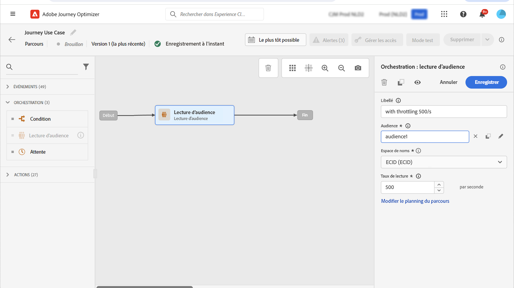

# Cas d’utilisation : limiter le débit avec des sources de données externes et des actions personnalisées{#limit-throughput}

Utilisez ce cas d’utilisation pour ralentir le traitement du parcours lorsque des systèmes externes doivent gérer un nombre limité de requêtes par seconde.

## Description du cas d’utilisation

[!DNL Adobe Journey Optimizer] permet aux utilisateurs d’envoyer des appels d’API à des systèmes externes par le biais d’actions personnalisées et de sources de données.

Cela est possible grâce aux éléments suivants :

* **Sources de données** : pour collecter des informations à partir de systèmes externes et les utiliser dans le contexte du parcours, par exemple pour obtenir des informations météorologiques sur la ville du profil et avoir un flux du parcours dédié basé sur ces informations.

* **Actions personnalisées** : pour envoyer des informations à des systèmes externes, par exemple pour envoyer des e-mails par le biais d’une solution externe à l’aide des fonctionnalités d’orchestration de Journey Optimizer avec des informations de profil, des données d’audience et un contexte de parcours.

>[!NOTE]
>
>Les réponses étant désormais prises en charge, vous devez utiliser des actions personnalisées au lieu de sources de données pour les cas d’utilisation de sources de données externes. Pour plus d’informations sur les réponses, voir [cette section](../action/action-response.md)

Si vous utilisez des sources de données externes ou des actions personnalisées, il peut être judicieux de protéger vos systèmes externes en limitant le débit des parcours : jusqu’à 5 000 instances/seconde pour les parcours unitaires et jusqu’à 20 000 instances/seconde pour les parcours déclenchés par une audience. Pour en savoir plus sur les débits et les taux de traitement des parcours, consultez [cette section](entry-management.md#journey-processing-rate).

Pour les actions personnalisées, les fonctionnalités de ralentissement existent au niveau du produit. Voir cette [page](../configuration/external-systems.md#capping).

Pour les sources de données externes, vous pouvez définir des limites maximum au niveau du point d’entrée afin d’éviter de surcharger ces systèmes externes par le biais des API de plafonnement de Journey Optimizer. Toutefois, toutes les requêtes restantes une fois la limite atteinte seront ignorées. Dans cette section, vous trouverez des solutions de contournement que vous pouvez utiliser pour optimiser votre débit.

Pour plus d’informations sur l’intégration aux systèmes externes, référez-vous à cette [page](../configuration/external-systems.md).

## Mise en œuvre

Pour les **parcours déclenchés par une audience**, vous pouvez définir le taux de lecture de votre activité Lecture d’audience qui aura une incidence sur le débit des parcours. [En savoir plus](../building-journeys/read-audience.md)

>[!NOTE]
>
> Il s’agit du nombre maximum de profils pouvant entrer dans le parcours par seconde. Ce taux s’applique uniquement à cette activité et non aux autres activités du parcours. [En savoir plus](../building-journeys/read-audience.md)

Vous pouvez modifier cette valeur de 500 à 20 000 instances par seconde. Si vous devez descendre en dessous de 500/s, vous pouvez également ajouter des conditions de « partage en pourcentage » avec des activités d’attente pour fractionner votre parcours en plusieurs branches et les faire s’exécuter à un moment spécifique.

Prenons l’exemple d’un **parcours déclenché par une audience** s’exécutant avec une population de **10 000 profils** et envoyant des données à un système externe prenant en charge **100 requêtes/seconde**.

1. Vous pouvez définir votre Lecture d’audience pour lire les profils avec un débit de 500 profils/seconde, ce qui signifie que la lecture de tous vos profils prendra 20 secondes. Lors de la seconde 1, vous lirez 500 d’entre eux, lors de la seconde 2, 500 de plus, etc.

1. Vous pouvez ensuite ajouter une activité de condition de « partage en pourcentage » avec un partage de 20 % afin d’avoir à chaque seconde 100 profils dans chaque branche.

1. Ensuite, ajoutez les activités d’attente avec un retardateur spécifique dans chaque branche. Nous avons configuré ici une attente de 30 secondes pour chacune d’elles. À chaque seconde, un flux de 100 profils ira dans chaque branche.

   * Sur la branche 1, ils attendront 30 secondes, ce qui signifie que :
      * lors de la seconde 1, 100 profils attendront la seconde 31
      * lors de la seconde 2, 100 profils attendront la seconde 32, etc.

   * Sur la branche 2, ils attendront 60 secondes, ce qui signifie que :
      * Lors de la seconde 1, 100 profils attendront la seconde 61 (1 min 01 s)
      * Lors de la seconde 2, 100 profils attendront la seconde 62 (1 min 02 s), etc.

   * Sachant que nous prévoyons 20 secondes au maximum pour lire tous les profils, il n’y aura pas de chevauchement entre chaque branche, la seconde 20 étant la dernière durant laquelle les profils entreront dans la condition. Entre les secondes 31 et 51, tous les profils de la branche 1 seront traités. Entre la seconde 61 (1 min 01 s) et la seconde 81 (1 min 21 s), tous les profils de la branche 2 seront traités, etc.

   * Comme mécanisme de sécurisation, vous pouvez également ajouter une sixième branche pour avoir moins de 100 profils par branche, en particulier si votre système externe ne prend en charge que 100 requêtes/seconde.

>[!IMPORTANT]
>
>Comme pour toute solution de contournement, testez minutieusement cette solution avant de passer en production pour vous assurer qu’elle fonctionne comme vous le voulez.

Comme autre mécanisme de sécurisation, vous pouvez également utiliser les fonctionnalités de limitation.

>[!NOTE]
>
>Contrairement aux fonctionnalités de limitation, qui protègent un point d’entrée en étant global sur tous les parcours d’un sandbox, cette solution de contournement fonctionne uniquement au niveau du parcours. Cela signifie que si plusieurs parcours s’exécutent en parallèle et ciblent le même point d’entrée, vous devrez en tenir compte lors de la conception de votre parcours. Cette solution de contournement ne convient donc pas à tous les cas d’utilisation.
