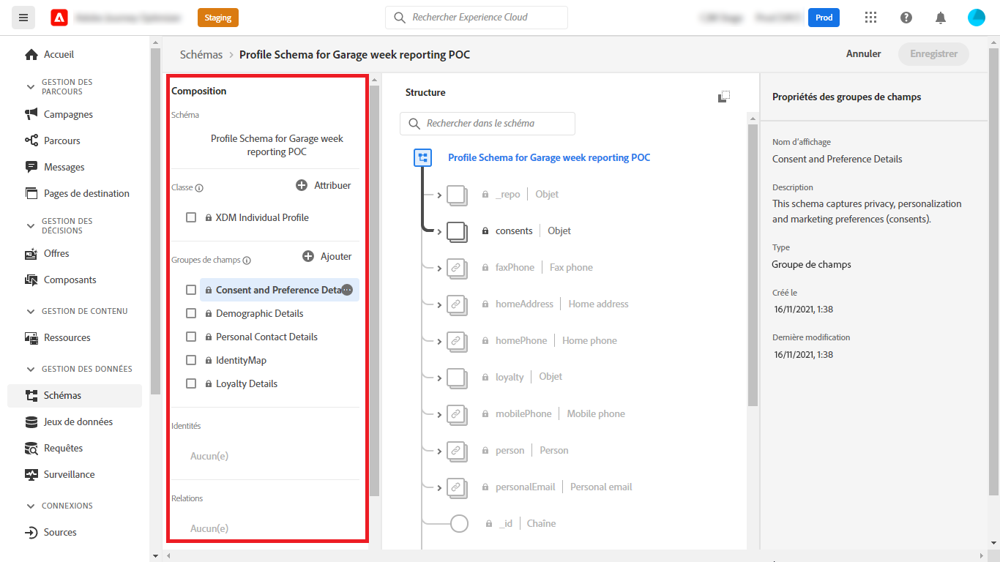
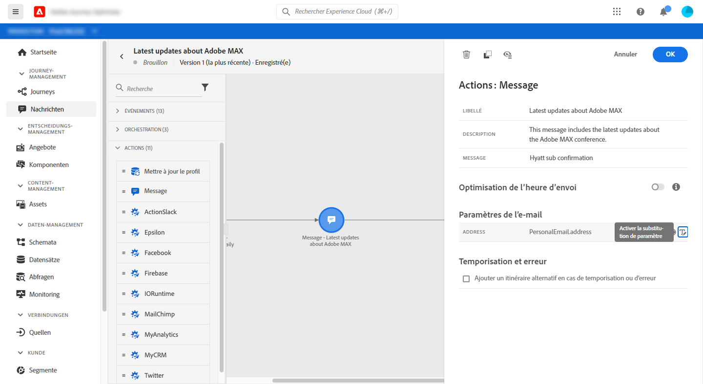
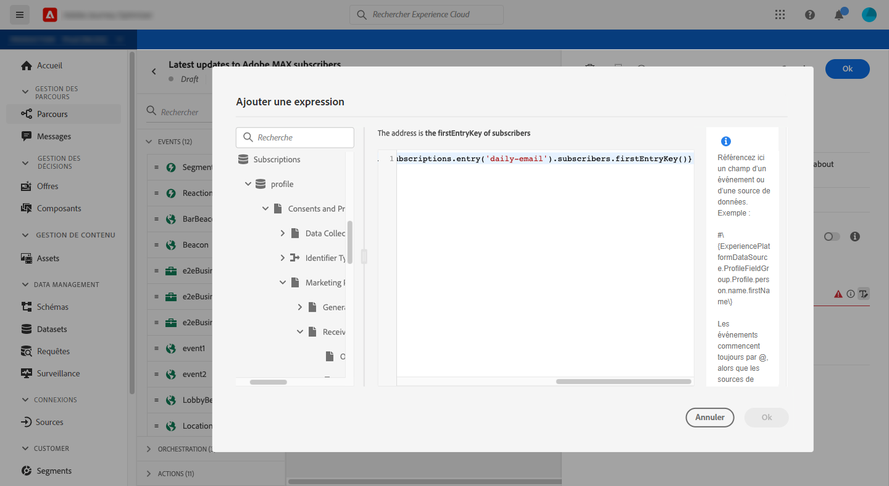
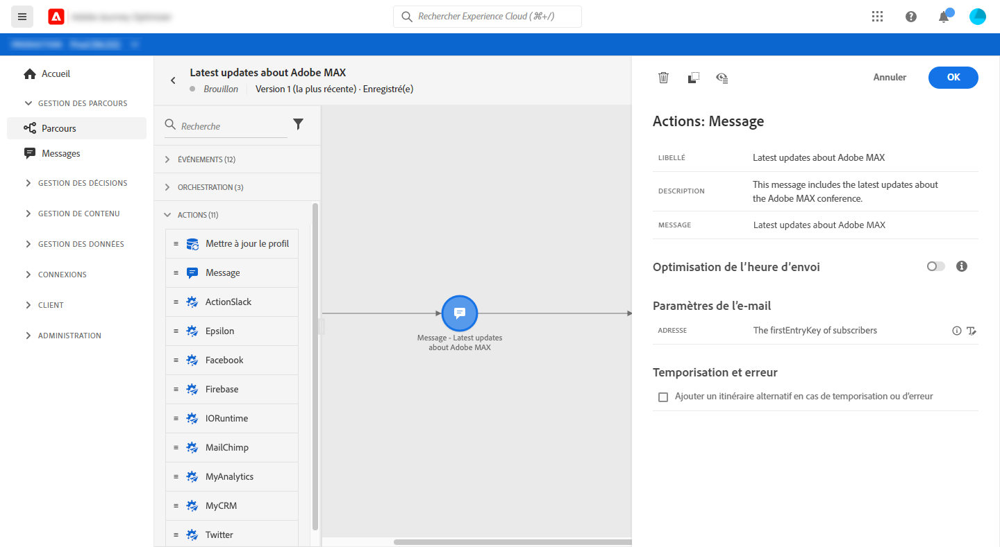

# Envoyer un message aux abonnés d&#39;une liste

Ce cas pratique a pour but de créer un parcours pour envoyer un message aux abonnés d&#39;une liste.

Dans cet exemple, la variable **[!UICONTROL Détails du consentement et des préférences]** groupe de champs de [!DNL Adobe Experience Platform] est utilisée. Pour trouver ce groupe de champs, à partir du **[!UICONTROL Data Management]** menu, choisissez **[!UICONTROL Schémas]**. Sur le **[!UICONTROL Groupes de champs]** , saisissez le nom du groupe de champs dans le champ de recherche.



Pour configurer ce parcours, procédez comme suit :

1. Créez un parcours commençant par un **[!UICONTROL Lecture]** activité. [En savoir plus](journey-gs.md).
1. Ajouter un **[!UICONTROL Message]** activité, avec un email, au parcours. [En savoir plus](journeys-message.md).
1. Dans le **[!UICONTROL Paramètres de messagerie]** de la section **[!UICONTROL Message]** paramètres d’activité, remplacez l’adresse électronique par défaut (`PersonalEmail.adress`) avec l&#39;adresse email des abonnés à la liste :

   1. Cliquez sur le bouton **[!UICONTROL Activer le remplacement de paramètre]** à droite de l’icône **[!UICONTROL Adresse]** , puis cliquez sur le champ **[!UICONTROL Modifier]** icône .

      

      Pour pouvoir modifier l&#39;adresse email, vous devez avoir publié le message précédemment.

   1. Dans l&#39;éditeur d&#39;expression, saisissez l&#39;expression permettant de récupérer les adresses email des abonnés. [En savoir plus](https://experienceleague.adobe.com/docs/journeys/using/building-advanced-conditions-journeys/expressionadvanced.html?lang=fr){target=&quot;_blank&quot;}.

      Cet exemple illustre une expression qui comprend des références aux champs de mappage :

      ```json
      #{ExperiencePlatform.Subscriptions.profile.consents.marketing.email.subscriptions.entry('daily-email').subscribers.firstEntryKey()}
      ```

      Dans cet exemple, les fonctions suivantes sont utilisées :

      | Fonction | Description | Exemple |
      | --- | --- | --- |
      | `entry` | Reportez-vous à un élément map en fonction de l’espace de noms sélectionné. | Reportez-vous à une liste d’abonnements spécifique |
      | `firstEntryKey` | Récupération de la première clé d’entrée d’une carte | Récupérer la première adresse email des abonnés |

      Dans cet exemple, la liste des abonnements est nommée `daily-email`. Les adresses électroniques sont définies comme clés dans la variable `subscribers` map, qui est liée à la carte de la liste d’abonnements.

      En savoir plus sur [références aux champs](https://experienceleague.adobe.com/docs/journeys/using/building-advanced-conditions-journeys/syntax/field-references.html) dans les expressions.

      

   1. Dans le **[!UICONTROL Ajouter une expression]** boîte de dialogue, cliquez sur **[!UICONTROL Ok]**.

   

1. Terminez le parcours par une **[!UICONTROL Fin]** activité.


