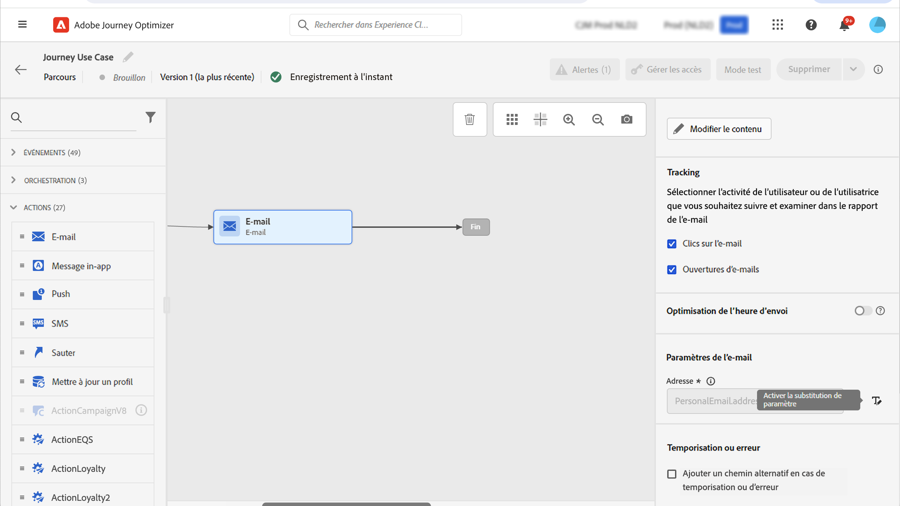

# Envoyer un message aux abonnés d’une liste {#send-a-message-to-the-subscribers-of-a-list}

Ce cas d’utilisation a pour but de créer un parcours pour envoyer un message aux abonnés d’une liste.

Dans cet exemple, le groupe de champs **[!UICONTROL Détails du consentement et des préférences]** de [!DNL Adobe Experience Platform] est utilisé. Pour trouver ce groupe de champs, à partir du menu **[!UICONTROL Gestion des données]**, choisissez **[!UICONTROL Schémas]**. Dans l’onglet **[!UICONTROL Groupes de champs]**, saisissez le nom du groupe de champs dans le champ de recherche.

.

Pour configurer ce parcours, procédez comme suit:

1. Créez un parcours commençant par une activité **[!UICONTROL Lecture]**. En savoir plus dans [Création de votre premier parcours &#x200B;](journey-gs.md).
1. Ajoutez une activité d’action **[!UICONTROL E-mail]** au parcours. Découvrez comment [utiliser les actions de canal](journeys-message.md).
1. Dans la section **[!UICONTROL Paramètres de l’e-mail]** des paramètres d’activité **[!UICONTROL E-mail]**, remplacez l’adresse e-mail par défaut (`PersonalEmail.adress`) par l’adresse e-mail des abonnés à la liste :

   1. Cliquez sur le bouton **[!UICONTROL Activer le remplacement de paramètre]** à droite du champ **[!UICONTROL Adresse]**, puis cliquez sur l’icône **[!UICONTROL Modifier]**.

      

   1. Dans l’éditeur d’expression, saisissez l’expression permettant de récupérer les adresses e-mail des abonnés. [En savoir plus](expression/expressionadvanced.md).

      Cet exemple illustre une expression qui comprend des références aux champs de mappage :

      ```json
      #{ExperiencePlatform.Subscriptions.profile.consents.marketing.email.subscriptions.entry('daily-email').subscribers.firstEntryKey()}
      ```

      Dans cet exemple, les fonctions suivantes sont utilisées :

      | Fonction | Description | Exemple |
      | --- | --- | --- |
      | `entry` | Renvoie à un élément de mappage selon l’espace de noms sélectionné. | Renvoyer à une liste d’abonnements spécifique |
      | `firstEntryKey` | Récupère la première clé d’entrée d’un mappage. | Récupérer la première adresse e-mail des abonnés |

      Dans cet exemple, la liste d’abonnements est nommée `daily-email`. Les adresses e-mail sont définies comme des clés dans le mappage `subscribers`, qui est lié au mappage de la liste d’abonnements.

      En savoir plus sur les [références aux champs](expression/field-references.md) dans les expressions.

      

   1. Dans la boîte de dialogue **[!UICONTROL Ajouter une expression]**, cliquez sur **[!UICONTROL OK]**.

>[!CAUTION]
>
>Le remplacement de l’adresse e-mail ne doit être utilisé que pour des cas d’utilisation spécifiques. La plupart du temps, il n’est pas nécessaire de modifier l’adresse e-mail, car la valeur définie comme adresse principale dans les **[!UICONTROL Champs d&#39;exécution]** est celle qui doit être utilisée. [En savoir plus](../configuration/primary-email-addresses.md)
