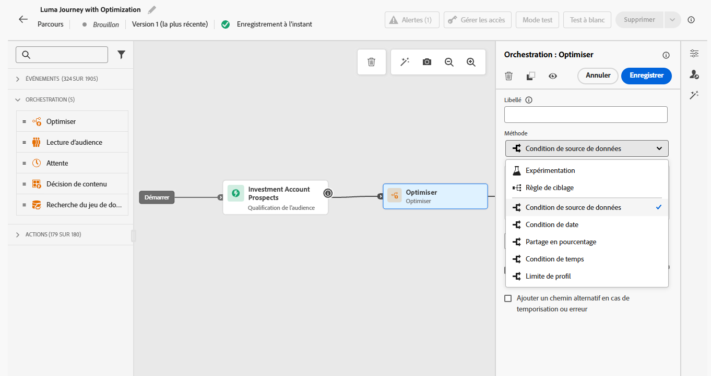

# Prise en main de l’activité d’optimisation {#journey-path-optimization}

>[!CONTEXTUALHELP]
>id="ajo_journey_optimize"
>title="Activité Optimiser"
>abstract="L’activité **Optimiser** vous permet de définir la progression des individus dans votre parcours en créant plusieurs chemins d’accès en fonction de critères spécifiques, notamment l’expérimentation, le ciblage et des conditions spécifiques. Notez que l’activité **Optimiser** est le nouveau moyen de créer des chemins conditionnels dans les parcours. Elle remplace l’ancienne activité **Condition**."

>[!IMPORTANT]
>
>L’activité **Optimiser** est le nouveau moyen de créer des chemins conditionnels dans les parcours. Elle remplace l’ancienne activité **Condition**, qui a été supprimée de l’interface utilisateur. Toute la logique conditionnelle est conservée et est désormais gérée via les **conditions** de l’activité [Optimize](conditions.md).
>
>Si des parcours existants utilisent des activités **[!UICONTROL Condition]**, vous pouvez continuer à les utiliser comme auparavant. Elles s’affichent désormais avec une nouvelle icône en tant qu’activités **[!UICONTROL Optimiser]** à l’aide de la méthode **[!UICONTROL Condition]**, mais le comportement reste inchangé. Toute étiquette personnalisée que vous avez définie sur le nœud est conservée.

L’activité **Optimiser** vous permet de définir la progression des individus dans votre parcours en créant plusieurs **chemins** en fonction de critères spécifiques, notamment l’expérimentation, le ciblage et des conditions spécifiques, garantissant ainsi un engagement et un succès optimaux pour créer des parcours hautement personnalisés et efficaces.

## Qu’est-ce qu’un chemin de parcours ? {#journey-path}

Un **chemin** de parcours peut être constitué de l’un des éléments suivants : séquencement des communications, intervalle entre celles-ci, nombre de communications ou toute combinaison de ces trois variables.

Par exemple, un chemin peut contenir un e-mail, un autre peut contenir deux SMS et un troisième peut contenir un e-mail, un nœud d’attente de deux heures, puis un SMS.

## Trois façons d’optimiser vos parcours {#optimization-methods}

Grâce à l’activité **Optimiser**, vous pouvez effectuer les actions suivantes sur vos chemins de parcours :

* [Exécuter des expériences de chemin](path-experimentation.md) - Testez différents chemins en fonction de divisions aléatoires afin de déterminer celui qui fonctionne le mieux en fonction des mesures de succès prédéfinies (par exemple : taux de conversion, chiffre d’affaires, engagement).

* [Tirer parti des règles de ciblage](path-targeting.md) - Définissez des règles spécifiques qui doivent être respectées pour qu’un client puisse accéder à l’un des chemins de parcours, en fonction des segments d’audience, des attributs de profil ou des données contextuelles. Cela permet de s’assurer que l’audience appropriée entre dans le chemin spécifié.

  >[!AVAILABILITY]
  >
  >Cette fonctionnalité est actuellement en disponibilité limitée. Pour obtenir l’accès, contactez votre représentant ou représentante Adobe.

* [Appliquer des conditions](conditions.md) - Créez des chemins d’accès conditionnels en fonction de critères spécifiques tels que les sources de données, l’heure, la date, les divisions en pourcentage ou les limites de profil. Il s’agit de l’équivalent de l’ancienne activité Condition .

## Fonctionnement {#how-it-works}

Une fois le parcours actif, les profils sont évalués en fonction des critères définis. Puis, en fonction des critères correspondants, ils sont envoyés vers le chemin approprié du parcours.

## Étapes suivantes {#next-steps}

Sélectionnez la méthode d’optimisation qui correspond le mieux à votre cas d’utilisation :

* Vous souhaitez tester et savoir quel chemin est le plus performant ? → Accéder à [Expérimentation de chemin](path-experimentation.md)
* Vous souhaitez envoyer différentes audiences sur des chemins spécifiques ? → Accéder au [Ciblage des chemins](path-targeting.md)
* Vous souhaitez créer une logique conditionnelle (scénarios if/then) ? → Accéder à [&#x200B; Conditions &#x200B;](conditions.md)
