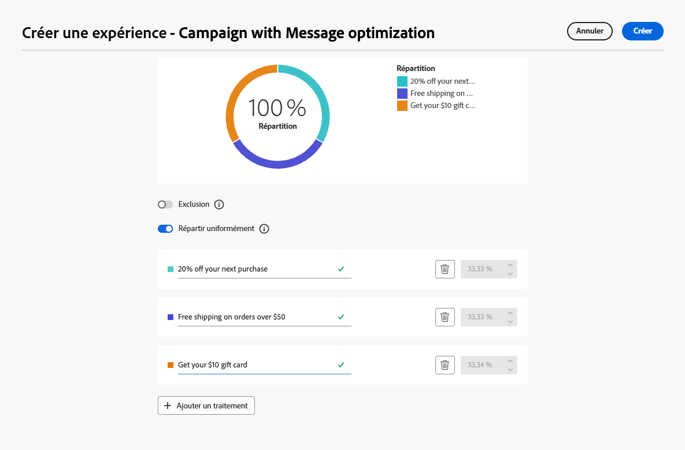

# Optimiser l’activité {#journey-path-optimization}

>[!CONTEXTUALHELP]
>id="ajo_journey_optimize"
>title="Optimiser l’activité"
>abstract="L’activité **Optimiser** vous permet de définir la progression des individus dans votre parcours en créant plusieurs chemins d’accès en fonction de critères spécifiques, notamment l’expérimentation, le ciblage et des conditions spécifiques."

>[!AVAILABILITY]
>
>Cette fonctionnalité est en disponibilité limitée. Contactez votre représentant ou représentante Adobe pour obtenir l’accès.

L’activité **Optimiser** vous permet de définir la progression des individus dans votre parcours en créant plusieurs **chemins d’accès** en fonction de critères spécifiques, notamment l’expérimentation, le ciblage et des conditions spécifiques, afin d’assurer un engagement et une réussite optimaux pour la création de parcours hautement personnalisés et efficaces.

Un chemin de parcours **&#x200B;**&#x200B;peut être constitué de l’un des éléments suivants :

* le séquencement des communications ;
* temps intermédiaire ;
* le nombre de communications ;
* ou toute combinaison de ces trois variables.

Par exemple, un chemin peut contenir un e-mail, un autre peut contenir deux SMS et un troisième peut contenir un e-mail, un nœud [Attente](wait-activity.md) de deux heures, puis un SMS.

<!--With this feature, [!DNL Journey Optimizer] empowers you with the tools to deliver personalized and optimized paths to your audience, ensuring maximum engagement and success to create highly customized and effective journeys.-->

Grâce à l’activité **Optimiser**, vous pouvez :

* Exécutez [expériences de chemin](#experimentation)
* Utilisation des règles [de ciblage](#targeting) dans chaque chemin de parcours
* Application de [ conditions ](#conditions) à vos chemins d’accès

Une fois le parcours actif, les profils sont évalués en fonction des critères définis. Ensuite, en fonction des critères correspondants, ils sont envoyés vers le chemin approprié à partir du parcours.

## Utiliser l’expérimentation {#experimentation}

L’expérimentation vous permet de tester différents chemins en fonction d’une répartition aléatoire afin de déterminer celui qui fonctionne le mieux en fonction de mesures de succès prédéfinies.

Pour configurer l’expérimentation dans un parcours, procédez comme suit.

Supposons que vous souhaitiez comparer trois chemins :

* un chemin avec un e-mail ;
* un deuxième chemin avec un nœud Attente de deux jours et un e-mail ;
* un troisième chemin avec un e-mail, puis un SMS.

1. Déposez l’activité **[!UICONTROL Optimiser]** dans la zone de travail du parcours.

1. Ajoutez un libellé facultatif pour identifier l’activité dans les journaux des modes de reporting et de test.

1. Sélectionnez **[!UICONTROL Expérience]** dans la liste déroulante **[!UICONTROL Méthode]**.

   {width=85%}

1. Cliquez sur **[!UICONTROL Paramètres de l’expérience]**.

1. Concevez et configurez votre expérience selon vos besoins. [Voici comment procéder](../content-management/content-experiment.md)

   <!--
    {width=85%}
    Replace with appropriate screenshot
    The experiment applies to all the activities in the journey.TBC
   -->

Une fois le parcours actif, les utilisateurs sont affectés de manière aléatoire à suivre différents chemins. [!DNL Journey Optimizer] permet de suivre le chemin qui entraîne le plus d’achats et fournit des informations exploitables.

<!--Follow the success of your journey with the [Experimentation journey report](../reports/campaign-global-report-cja-experimentation.md). Is there a report specific to experimentation in journey?-->

### Cas d’utilisation avec l’expérience {#uc-experiment}

Les exemples suivants montrent comment utiliser l’activité **[!UICONTROL Optimiser]** avec la méthode **[!UICONTROL Expérience]** pour déterminer le chemin qui fonctionne le mieux globalement.

**Efficacité des canaux**

Tester si l’envoi du premier message par e-mail ou SMS entraîne des conversions plus élevées.

* Utilisez le taux de conversion comme mesure d’optimisation (par exemple : achats, inscriptions).

**Fréquence des messages**

Exécutez une expérience pour vérifier si l’envoi d’un e-mail plutôt que de trois e-mails sur une semaine entraîne plus d’achats.

* Utilisez les achats ou le taux de désabonnement comme mesure d’optimisation.

**Temps d’attente entre deux communications**

Comparez une attente de 24 heures à une attente de 72 heures avant un suivi afin de déterminer quel délai maximise l&#39;engagement.

* Utilisez le taux de clic publicitaire ou le chiffre d’affaires comme mesure d’optimisation.

## Utiliser le ciblage {#targeting}

Le ciblage vous permet de déterminer les règles ou qualifications spécifiques qui doivent être remplies pour qu’un client soit éligible pour accéder à l’un des chemins de parcours, en fonction de segments d’audience spécifiques<!-- depending on profile attributes or contextual attributes-->.

Contrairement à l’expérimentation, qui est une affectation aléatoire d’un chemin donné, le ciblage est déterministe en termes de garantie que l’audience ou le profil approprié accède au chemin spécifié.

Avec le ciblage, des règles spécifiques peuvent être définies en fonction des éléments suivants :

* **Attributs de profil utilisateur** tels que l’emplacement (par exemple, le géociblage), l’âge ou les préférences. Par exemple, aux États-Unis, les utilisateurs voient une promotion « Golden Gate », tandis qu’en France, ils voient une promotion « Tour Eiffel ».

* **Données contextuelles** telles que le type d’appareil (par exemple, ciblage de l’appareil), l’heure de la journée ou les détails de la session. Par exemple, les utilisateurs d’ordinateurs de bureau reçoivent du contenu optimisé pour les ordinateurs de bureau, tandis que les utilisateurs mobiles reçoivent du contenu optimisé pour les appareils mobiles.

* **Audiences** qui peuvent être utilisées pour inclure ou exclure les profils ayant une appartenance à une audience particulière.

Pour configurer le ciblage dans un parcours, procédez comme suit.

1. Déposez l’activité **[!UICONTROL Optimiser]** dans la zone de travail du parcours.

1. Ajoutez un libellé facultatif pour identifier l’activité dans les journaux des modes de reporting et de test.

1. Sélectionnez **[!UICONTROL Ciblage]** dans la liste déroulante **[!UICONTROL Méthode]**.

   {width=85%}

1. Cliquez sur **[!UICONTROL Créer une règle de ciblage]**.

1. Utilisez le créateur de règles pour définir vos critères. Par exemple, définissez une règle pour les résidents des États-Unis, une règle pour les résidents de la France et une règle pour les résidents de l’Inde.

   

1. Sélectionnez l’option **[!UICONTROL Activer le contenu de secours]** selon vos besoins. Le contenu de secours permet à votre audience de recevoir un contenu par défaut lorsqu’aucune règle de ciblage n’est qualifiée. Si vous ne sélectionnez pas cette option, toute audience qui ne remplit pas les critères d’une règle de ciblage définie ci-dessus n’accédera pas à un chemin de secours.

1. Enregistrez les paramètres de votre règle de ciblage.

1. De retour dans le parcours, déposez des actions spécifiques pour personnaliser chaque chemin. Par exemple, vous pouvez créer un e-mail spécifique pour les résidents des États-Unis, un autre pour les résidents de la France, etc.

   

1. Concevez le contenu approprié pour chaque groupe défini par les paramètres de vos règles de ciblage. Vous pouvez naviguer facilement entre les différents chemins d’accès.

   

   Dans cet exemple, concevez un chemin spécifique pour les résidents américains, un chemin différent pour les résidents français et un autre pour les résidents indiens.

Une fois le parcours actif, le chemin d’accès spécifié pour chaque segment est traité afin que les résidents des États-Unis rejoignent un chemin spécifique, les résidents de la France rejoignent un chemin différent, etc.

### Cas d’utilisation du ciblage {#uc-targeting}

Les exemples suivants montrent comment utiliser l&#39;activité **[!UICONTROL Optimize]** avec la méthode **[!UICONTROL Targeting]** afin de personnaliser les chemins d&#39;accès pour différentes sous-audiences.

**Canaux spécifiques au segment**

Les membres fidèles au statut Gold peuvent recevoir des offres personnalisées par e-mail, tandis que tous les autres membres sont redirigés vers des rappels par SMS.

* Utilisez le chiffre d’affaires par profil ou le taux de conversion comme mesure d’optimisation.

**Ciblage basé sur le comportement**

Les clients qui ont ouvert un e-mail mais n’ont pas cliqué peuvent recevoir une notification push, tandis que ceux qui ne l’ont pas ouvert du tout reçoivent un SMS.

* Utilisez le taux de clic publicitaire ou les conversions en aval comme mesure d’optimisation.

**Ciblage de l’historique des achats**

Les clients qui ont récemment acheté des produits peuvent choisir un chemin court « Merci + vente croisée », tandis que ceux qui n’ont pas d’historique d’achat rejoignent un parcours de maturation plus long.

* Utilisez le taux d’achat de répétition ou le taux d’engagement comme mesure d’optimisation.

## Ajouter une condition {#conditions}

Vous pouvez ajouter une condition pour définir la progression des individus dans votre parcours en créant plusieurs chemins d’accès en fonction de critères spécifiques. Vous pouvez également configurer un autre chemin pour gérer les temporisations ou les erreurs, assurant ainsi une expérience fluide.

Découvrez comment définir une condition dans [cette section](conditions.md).

Les types de condition disponibles sont les suivants :

* [Condition de source de données](condition-activity.md#data_source_condition)
* [Condition de temps](condition-activity.md#time_condition)
* [Partage en pourcentage](condition-activity.md#percentage_split)
* [Condition de date](condition-activity.md#date_condition)
* [Limite de profils](condition-activity.md#profile_cap)
