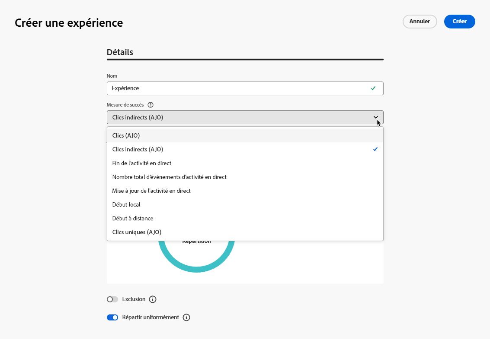
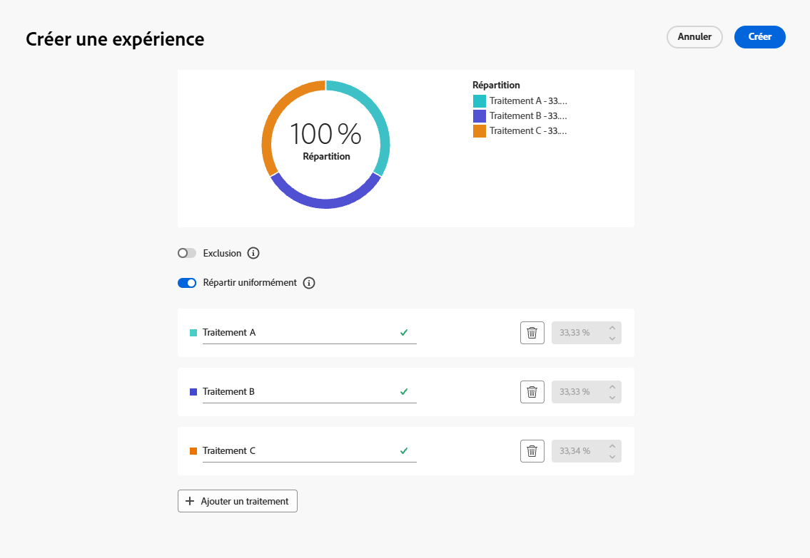

# Activité Optimiser {#journey-path-optimization}

>[!CONTEXTUALHELP]
>id="ajo_journey_optimize"
>title="Activité Optimiser"
>abstract="L’activité **Optimiser** vous permet de définir la progression des individus dans votre parcours en créant plusieurs chemins en fonction de critères spécifiques, y compris l’expérimentation, le ciblage et des conditions spécifiques."

>[!AVAILABILITY]
>
>Cette fonctionnalité est en disponibilité limitée. Contactez votre représentant ou représentante Adobe pour en obtenir l’accès.

L’activité **Optimiser** vous permet de définir la progression des individus dans votre parcours en créant plusieurs **chemins** en fonction de critères spécifiques, notamment l’expérimentation, le ciblage et des conditions spécifiques, garantissant ainsi un engagement et un succès optimaux pour créer des parcours hautement personnalisés et efficaces.

Un **chemin** de parcours peut être constitué de l’un des éléments suivants : séquencement des communications, intervalle entre celles-ci, nombre de communications ou toute combinaison de ces trois variables.

Par exemple, un chemin peut contenir un e-mail, un autre peut contenir deux SMS et un troisième peut contenir un e-mail, un nœud d’attente de deux heures, puis un SMS.

<!--With this feature, [!DNL Journey Optimizer] empowers you with the tools to deliver personalized and optimized paths to your audience, ensuring maximum engagement and success to create highly customized and effective journeys.-->

Avec l’activité **Optimiser**, vous pouvez effectuer les actions suivantes sur les chemins obtenus :

* exécuter des [expériences de chemin](#experimentation) ;
* utiliser des règles de [ciblage](#targeting) dans chaque chemin de parcours ;
* appliquer des [conditions](#conditions) à vos chemins.

Une fois le parcours actif, les profils sont évalués en fonction des critères définis. Puis, en fonction des critères correspondants, ils sont envoyés vers le chemin approprié du parcours.

## Utiliser l’expérimentation {#experimentation}

>[!CONTEXTUALHELP]
>id="ajo_path_experiment_success_metric"
>title="Mesure de succès"
>abstract="La mesure de succès permet de suivre et d’évaluer le traitement le plus performant dans une expérience."
>additional-url="https://experienceleague.adobe.com/fr/docs/journey-optimizer/using/orchestrate-journeys/create-journey/success-metrics" text="Configurer et suivre les mesures de votre parcours"

L’expérimentation permet de tester plusieurs chemins selon un partage aléatoire afin de déterminer celui qui offre les meilleures performances en fonction de mesures de succès prédéfinies.

Pour configurer l’expérimentation des chemins dans un parcours, suivez les étapes ci-après.

Supposons que vous souhaitiez comparer trois chemins :

* Un chemin avec un e-mail
* Un deuxième chemin avec un nœud d’**[!UICONTROL attente]** de deux jours et un e-mail
* Un troisième chemin avec un e-mail, puis un SMS

1. Dans la section **[!UICONTROL Orchestration]**, faites glisser l’activité **[!UICONTROL Optimiser]** et déposez-la dans la zone de travail du parcours.

1. Ajoutez un libellé facultatif qui peut servir à identifier l’activité dans les journaux en mode de test et les rapports.

1. Sélectionnez **[!UICONTROL Expérience]** dans la liste déroulante **[!UICONTROL Méthode]**.

   {width=65%}

1. Cliquez sur **[!UICONTROL Créer une expérience]**.

1. Sélectionnez les **[!UICONTROL mesures de succès]** que vous souhaitez définir pour votre expérience. En savoir plus sur les mesures disponibles et sur la configuration de la liste dans [cette section](success-metrics.md).

   {width=80%}

1. Vous pouvez ajouter un groupe d’**[!UICONTROL exclusion]** à votre diffusion. Ce groupe ne rejoindra aucun chemin de cette expérience.

   >[!NOTE]
   >
   >Le fait d’activer le bouton (bascule) retirera automatiquement 10 % de votre population. Vous pouvez ajuster ce pourcentage si nécessaire.

   <!--
    DOES THIS APPLY TO PATH EXPERIMENT?
    IMPORTANT: When a holdout group is used in an action for path experimentation, the holdout assignment only applies to that specific action. After the action is completed, profiles in the holdout group will continue down the journey path and can receive messages from other actions. Therefore, ensure that any subsequent messages do not rely on the receipt of a message by a profile that might be in a holdout group. If they do, you may need to remove the holdout assignment.-->

1. Vous pouvez ensuite choisir d’attribuer un pourcentage précis à chaque **[!UICONTROL Traitement]** ou simplement ou simplement activer le bouton (bascule) **[!UICONTROL Répartir proportionnellement]**.

   {width=80%}

1. Cliquez sur **[!UICONTROL Créer]**.

1. Définissez les éléments de chaque branche résultant de l’expérience, par exemple :

   * Effectuez un glisser-déposer d’une activité [E-mail](../email/create-email.md) sur la première branche (**Traitement A**).

   * Effectuez un glisser-déposer d’une activité [Attente](wait-activity.md) de deux jours sur la première branche, suivie d’une activité [E-mail](../email/create-email.md) (**Traitement B**).

   * Effectuez un glisser-déposer d’une activité [E-mail](../email/create-email.md) sur la troisième branche, suivie d’une activité [SMS](../sms/create-sms.md) (**Traitement C**).

   {width=100%}

1. Vous pouvez éventuellement utiliser l’option **[!UICONTROL Ajouter un chemin alternatif en cas de temporisation ou d’erreur]** pour définir une action de remplacement. [En savoir plus](using-the-journey-designer.md#paths)

1. Sélectionnez une action de canal et utilisez le bouton **[!UICONTROL Modifier le contenu]** pour accéder aux outils de conception.

   {width=70%}

1. À partir de là, dans le volet de gauche, vous pouvez naviguer entre les différents contenus de chaque action de votre expérience. Sélectionnez chaque contenu et personnalisez-le selon vos besoins.

   {width=100%}

1. [Publiez](publish-journey.md) votre parcours.

Une fois le parcours actif, les utilisateurs et utilisatrices sont affectés de manière aléatoire à différents chemins. [!DNL Journey Optimizer] suit le chemin le plus performant et fournit des informations exploitables.

Suivez le succès de votre parcours avec le rapport d’expérience de chemin de parcours. [En savoir plus](../reports/journey-global-report-cja-experimentation.md)

### Cas d’utilisation des expériences {#uc-experiment}

Les exemples suivants montrent comment utiliser l’activité **[!UICONTROL Optimiser]** avec la méthode **[!UICONTROL Expérience]** pour déterminer le chemin qui fonctionne le mieux globalement.

+++Efficacité des canaux

Testez si l’envoi du premier message par e-mail plutôt que par SMS génère un taux de conversion plus élevé.

➡️ Utilisez le taux de conversion comme mesure de succès (par exemple : achats, inscriptions).

+++

+++Fréquence des messages

Exécutez une expérience pour vérifier si l’envoi d’un e-mail plutôt que de trois e-mails sur une semaine entraîne plus d’achats.

➡️ Utilisez les achats ou le taux de désabonnement comme mesure de succès.

+++

+++Temps d’attente entre deux communications

Comparez une attente de 24 heures à une attente de 72 heures avant une relance afin de déterminer quel délai maximise l’engagement.

➡️ Utilisez le taux de clics ou le chiffre d’affaires comme mesure de succès.

+++

## Tirer profit du ciblage {#targeting}

>[!CONTEXTUALHELP]
>id="ajo_path_targeting_fallback"
>title="Qu’est-ce que le chemin de remplacement ?"
>abstract="Le chemin de remplacement permet à une audience de rejoindre un chemin alternatif lorsqu’aucune règle de ciblage ne s’applique.  Si vous ne sélectionnez pas cette option, toute audience qui ne remplit pas les critères d’une règle de ciblage ne pourra pas rejoindre le chemin de remplacement et quittera le parcours."

Le ciblage vous permet de déterminer les règles ou qualifications qu’un client ou une cliente doit remplir pour pouvoir suivre l’un des chemins de parcours, en fonction de segments d’audience spécifiques<!-- depending on profile attributes or contextual attributes-->.

Contrairement à l’expérimentation, qui est une affectation aléatoire d’un chemin donné, le ciblage est déterministe dans la mesure où il garantit que l’audience ou le profil approprié rejoint le chemin spécifié.

<!--With targeting, specific rules can be defined based on:

* **User profile attributes** such as location (eg. geo-targeting), age, or preferences. For example, users in the US receive a "Golden Gate" promotion, while users in France receive an "Eiffel Tower" promotion.

* **Contextual data** such as device type (eg. device-targeting), time of day, or session details. For example, desktop users receive desktop-optimized content, while mobile users receive mobile-optimized content.

* **Audiences** which can be used to include or exclude profiles that have a particular audience membership.-->

Pour configurer le ciblage dans un parcours, suivez les étapes ci-après.

1. Dans la section **[!UICONTROL Orchestration]**, faites glisser l’activité **[!UICONTROL Optimiser]** et déposez-la dans la zone de travail du parcours.

1. Ajoutez un libellé facultatif qui peut servir à identifier l’activité dans les journaux en mode de test et les rapports.

1. Sélectionnez **[!UICONTROL Règle de ciblage]** dans la liste déroulante **[!UICONTROL Méthode]**.

   {width=60%}

1. Cliquez sur **[!UICONTROL Créer une règle de ciblage]**.

1. Cliquez sur **[!UICONTROL Créer une règle]** > **[!UICONTROL Créer]** et utilisez le créateur de règles pour définir vos critères.

   {width=100%}

   Par exemple, définissez une règle pour les membres Gold du programme de fidélité (`loyalty.status.equals("Gold", false)`) et une règle pour les autres membres (`loyalty.status.notEqualTo("Gold", false)`).

   

1. Vous pouvez également cliquer sur **[!UICONTROL Créer une règle]** > **[!UICONTROL Sélectionner une règle]** pour sélectionner une règle de ciblage existante créée à partir du menu **[!UICONTROL Règles]**. [En savoir plus](../experience-decisioning/rules.md)

   {width=70%}

   Dans ce cas, la formule qui constitue la règle est simplement copiée dans l’activité de parcours. Toute modification ultérieure apportée à cette règle à partir du menu **[!UICONTROL Règles]** n’aura aucune incidence sur la copie du parcours.

   >[!AVAILABILITY]
   >
   >La fonction [Création de règles de ciblage](../experience-decisioning/rules.md#create) à partir du menu [!DNL Journey Optimizer] dédié est actuellement disponible pour les organisations qui ont acheté le module complémentaire Decisioning. Elle est disponible à la demande pour les autres organisations (disponibilité limitée).
   >
   >Cette fonctionnalité sera progressivement déployée pour l’ensemble de la clientèle. En attendant, contactez votre représentant ou votre représentante Adobe pour obtenir l’accès.

1. Après avoir ajouté une règle, vous pouvez toujours la modifier. Choisissez **[!UICONTROL Modifier directement]** pour effectuer la mise à jour directement à l’aide du créateur de règles, ou **[!UICONTROL Sélectionner une règle]** pour sélectionner une autre règle.

   {width=100%}

   >[!NOTE]
   >
   >La modification directe d’une règle n’a aucune incidence sur la règle d’où elle provient.

1. Sélectionnez l’option **[!UICONTROL Activer le chemin de remplacement]** si nécessaire. Cette action crée un chemin de remplacement pour l’audience qui ne répond à aucune des règles de ciblage définies ci-dessus.

   >[!NOTE]
   >
   >Si vous ne sélectionnez pas cette option, toute audience qui ne remplit pas les critères d’une règle de ciblage ne pourra pas suivre le chemin de remplacement et quittera le parcours.

1. Cliquez sur **[!UICONTROL Créer]** pour enregistrer les paramètres de votre règle de ciblage.

1. De retour dans le parcours, déposez des actions spécifiques pour personnaliser chaque chemin. Par exemple, créez un e-mail contenant des offres personnalisées pour les membres du programme de fidélité Gold et un rappel SMS pour l’ensemble des autres membres.

   

1. Si vous avez sélectionné l’option **[!UICONTROL Activer le contenu de secours]** lors de la définition des paramètres de la règle, définissez une ou plusieurs actions pour le chemin de remplacement qui a été automatiquement ajouté.

   {width=70%}

1. Vous pouvez éventuellement utiliser l’option **[!UICONTROL Ajouter un chemin alternatif en cas de temporisation ou d’erreur]** pour définir une autre action en cas de problème. [En savoir plus](using-the-journey-designer.md#paths)

1. Créez un contenu adapté pour chaque action correspondant à chaque groupe défini par les paramètres de règle de ciblage. Vous pouvez naviguer facilement entre les différents contenus de chaque action.

   

   Dans cet exemple, créez un e-mail contenant des offres spéciales pour les membres Gold et un SMS de rappel pour les autres membres.

1. [Publiez](publish-journey.md) votre parcours.

Une fois le parcours actif, le chemin spécifié pour chaque segment est traité afin que les membres Gold rejoignent le chemin avec les offres par e-mail, tandis que les autres membres rejoignent le chemin avec le SMS de rappel.

Suivez le succès de votre parcours avec le rapport de parcours. [En savoir plus](../reports/journey-global-report-cja.md#targeting)

### Cas d’utilisation des règles de ciblage {#uc-targeting}

Les exemples suivants montrent comment utiliser l’activité **[!UICONTROL Optimiser]** avec la méthode **[!UICONTROL Règle de ciblage]** afin de personnaliser les chemins pour différentes sous-audiences.

+++Canaux spécifiques au segment

Les membres Gold peuvent recevoir des offres personnalisées par e-mail, tandis que les autres membres sont redirigés vers des rappels par SMS.

<!--➡️ Use the revenue per profile or conversion rate as the optimization metric.-->

+++

+++Ciblage basé sur le comportement

Les clientes et clients qui ont ouvert un e-mail mais qui n’ont pas cliqué peuvent recevoir une notification push, tandis que ceux et celles qui ne l’ont pas ouvert du tout reçoivent un SMS.

<!--➡️ Use the click-through rate or downstream conversions as the optimization metric.-->

+++

+++Ciblage de l’historique des achats

Les clientes et clients qui ont récemment acheté des produits peuvent choisir un chemin court « Merci + vente croisée », tandis que ceux et celles qui n’ont pas d’historique d’achat rejoignent un parcours d’accompagnement plus long.

<!--➡️ Use the repeat purchase rate or engagement rate as the optimization metric.-->

+++

### Ajouter une condition {#conditions}

Les conditions sont un type de règles de [ciblage](#targeting) qui permet de définir la progression d’une personne dans un parcours en créant plusieurs chemins selon des critères spécifiques.

Découvrez comment définir une condition dans [cette section](conditions.md).

Les types de condition disponibles sont les suivants :

* [Condition de source de données](condition-activity.md#data_source_condition)
* [Condition de temps](condition-activity.md#time_condition)
* [Partage en pourcentage](condition-activity.md#percentage_split)
* [Condition de date](condition-activity.md#date_condition)
* [Limite de profils](condition-activity.md#profile_cap)
