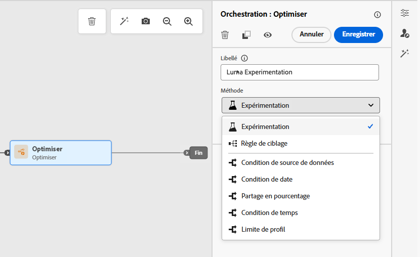
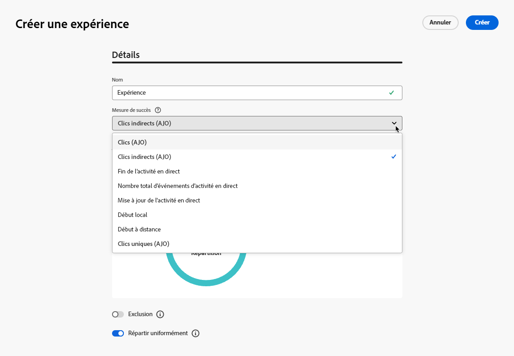
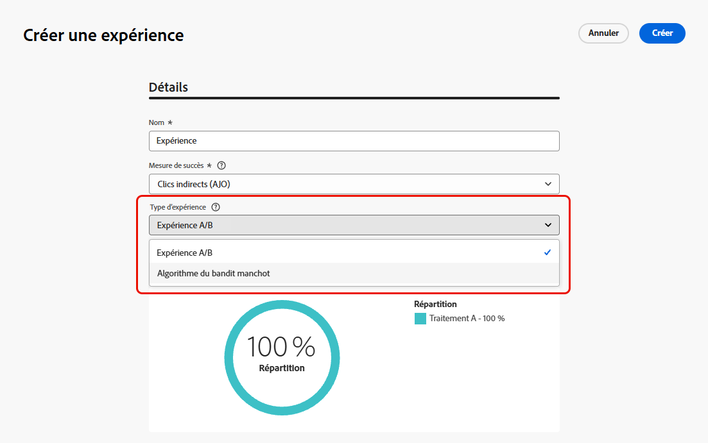
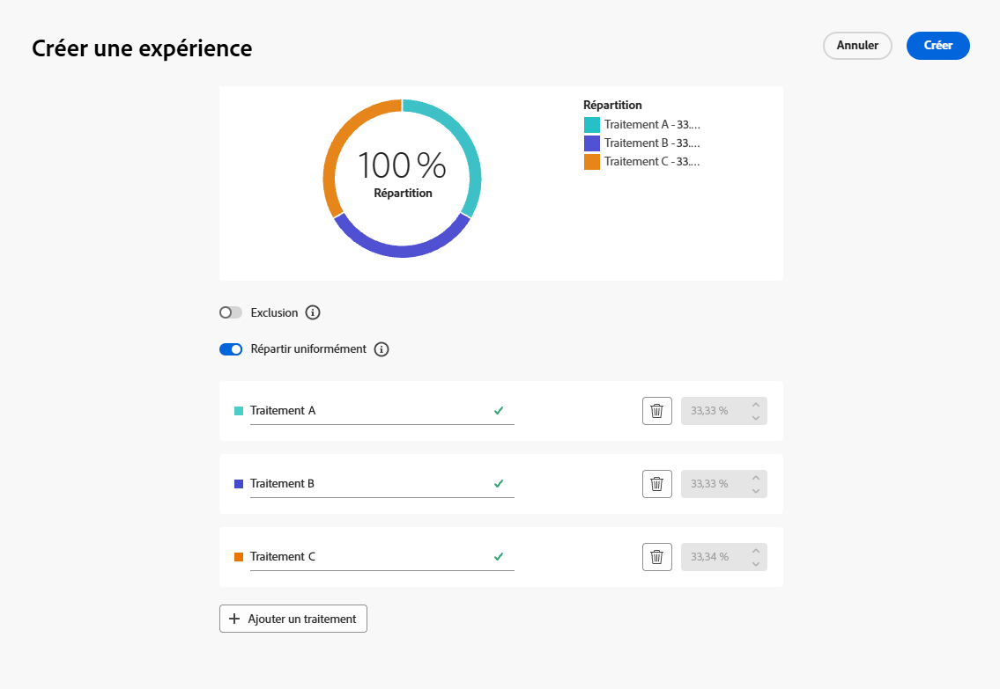
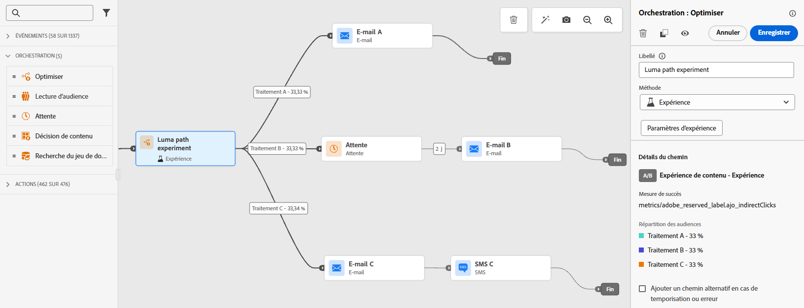
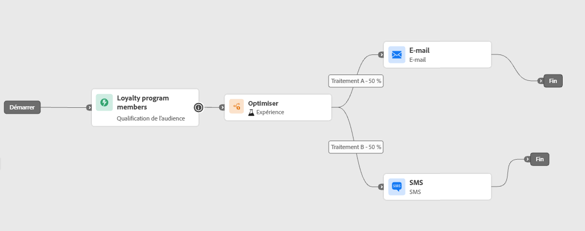
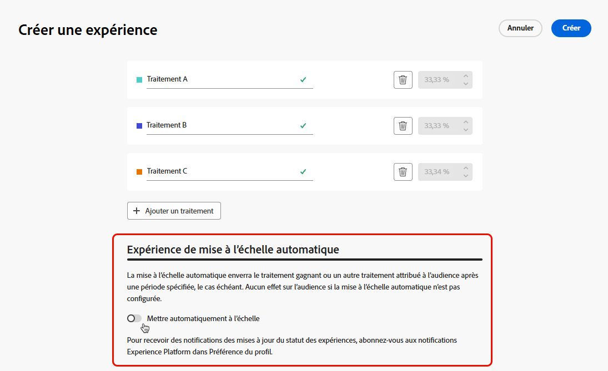
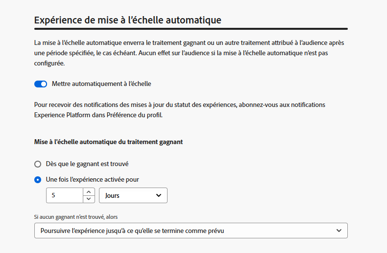
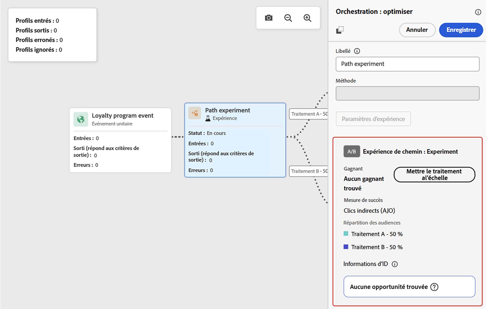
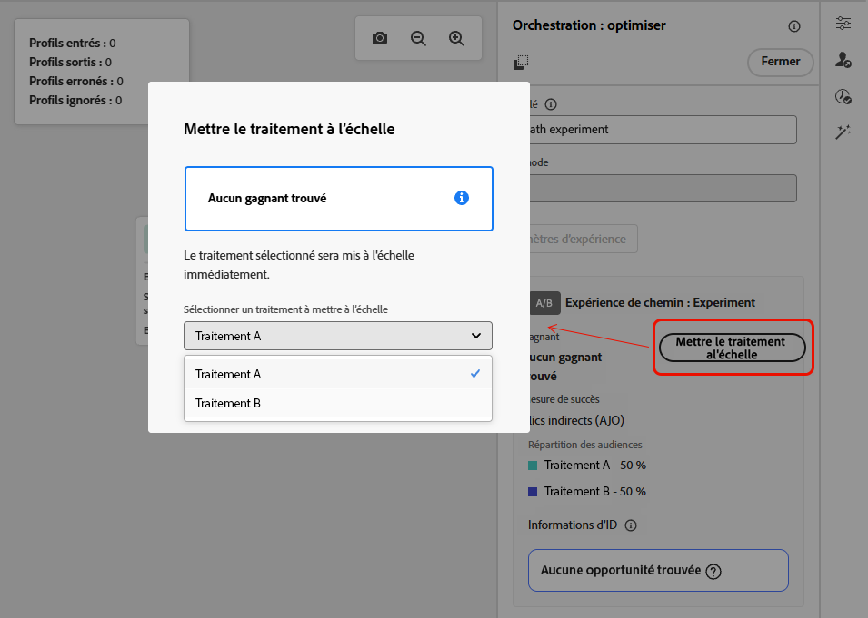

# Utiliser l’expérimentation des chemins {#experimentation}

>[!BEGINSHADEBOX]

**Sur cette page :** découvrez comment configurer l’expérimentation de chemin avec l’activité Optimiser pour tester différents chemins de parcours à l’aide d’expériences A/B ou de bandit manchot, identifier le traitement le plus performant par mesure de succès et mettre à l’échelle le gagnant.

>[!ENDSHADEBOX]

>[!CONTEXTUALHELP]
>id="ajo_path_experiment_success_metric"
>title="Mesure de succès"
>abstract="La mesure de succès permet de suivre et d’évaluer le traitement le plus performant dans une expérience."
>additional-url="https://experienceleague.adobe.com/fr/docs/journey-optimizer/using/orchestrate-journeys/create-journey/success-metrics" text="Configurer et suivre les mesures de votre parcours"

L’expérimentation permet de tester plusieurs chemins selon un partage aléatoire afin de déterminer celui qui offre les meilleures performances en fonction de mesures de succès prédéfinies.

Pour configurer l’expérimentation des chemins dans un parcours, suivez les étapes ci-après.

Supposons que vous souhaitiez comparer trois chemins :

* Un chemin avec un e-mail
* Un deuxième chemin avec un nœud d’**[!UICONTROL attente]** de deux jours et un e-mail
* Un troisième chemin avec un e-mail, puis un SMS

1. Dans la section **[!UICONTROL Orchestration]**, faites glisser l’activité **[!UICONTROL Optimiser]** et déposez-la dans la zone de travail du parcours.

1. Ajoutez un libellé facultatif qui peut servir à identifier l’activité dans les journaux en mode de test et les rapports.

1. Sélectionnez **[!UICONTROL Expérience]** dans la liste déroulante **[!UICONTROL Méthode]**.

   {width=65%}

1. Cliquez sur **[!UICONTROL Créer une expérience]**.

1. Sélectionnez les **[!UICONTROL mesures de succès]** que vous souhaitez définir pour votre expérience. En savoir plus sur les mesures disponibles et sur la configuration de la liste dans [cette section](success-metrics.md).

   {width=80%}

1. Sélectionnez le **[!UICONTROL Type d’expérience]** pour votre expérience de chemin d’accès :

   * **[!UICONTROL Expérience A/B]** — Définissez la répartition du trafic entre les traitements au début du test. Les performances sont évaluées en fonction de la mesure principale que vous avez choisie. Les rapports montrent l’effet élévateur observé entre les traitements.

   * **[!UICONTROL Bandit manchot]** — La répartition du trafic entre les traitements est gérée automatiquement. Tous les 7 jours, les performances de la mesure principale sont examinées et les pondérations sont ajustées en conséquence. La création de rapports continue d’afficher une courbe d’élévation, comme pour les tests A/B.

   {width=80%}

   ➡️ [En savoir plus sur la différence entre les expériences A/B et le bandit manchot](../content-management/mab-vs-ab.md)

1. Vous pouvez ajouter un groupe d’**[!UICONTROL exclusion]** à votre diffusion. Ce groupe ne rejoindra aucun chemin de cette expérience.

   >[!NOTE]
   >
   >Le fait d’activer le bouton (bascule) retirera automatiquement 10 % de votre population. Vous pouvez ajuster ce pourcentage si nécessaire.

1. Vous pouvez ensuite choisir d’attribuer un pourcentage précis à chaque **[!UICONTROL Traitement]** ou simplement ou simplement activer le bouton (bascule) **[!UICONTROL Répartir proportionnellement]**.

   {width=80%}

1. Activez l’expérience avec mise à l’échelle automatique pour déployer automatiquement la variation gagnante de votre expérience. [Découvrir comment mettre à l’échelle le gagnant](#scale-winner)

1. Cliquez sur **[!UICONTROL Créer]**.

1. Définissez les éléments de chaque branche résultant de l’expérience, par exemple :

   * Effectuez un glisser-déposer d’une activité [E-mail](../email/create-email.md) sur la première branche (**Traitement A**).

   * Effectuez un glisser-déposer d’une activité [Attente](wait-activity.md) de deux jours sur la première branche, suivie d’une activité [E-mail](../email/create-email.md) (**Traitement B**).

   * Effectuez un glisser-déposer d’une activité [E-mail](../email/create-email.md) sur la troisième branche, suivie d’une activité [SMS](../mobile/create-mobile-message.md) (**Traitement C**).

   {width=100%}

1. Vous pouvez éventuellement utiliser l’**[!UICONTROL Ajouter un itinéraire alternatif en cas de temporisation ou d’erreur]** pour définir une action de remplacement. [En savoir plus](using-the-journey-designer.md#paths)

1. [Publiez](publish-journey.md) votre parcours.

Une fois le parcours actif, les utilisateurs et utilisatrices sont affectés de manière aléatoire à différents chemins. [!DNL Journey Optimizer] suit le chemin le plus performant et fournit des informations exploitables.

Suivez le succès de votre parcours avec le rapport d’expérience de chemin de parcours. [En savoir plus](../reports/journey-global-report-cja-experimentation.md)

## Affectation de chemin à la rentrée du parcours {#path-assignment}

L’affectation de chemin est persistante pour un profil sur plusieurs entrées dans la même version de parcours. Par exemple, si un profil entre dans un parcours le jour 1 et est affecté au chemin A, puis entre à nouveau dans le parcours le jour 2, il sera à nouveau affecté au chemin A. Cela garantit une expérience cohérente pour l’utilisateur et est nécessaire à la création de rapports et à l’analyse statistiquement valides.

Toutefois, les affectations ne sont persistantes que dans une version de parcours donnée. Une fois que vous avez publié une nouvelle version de parcours, la randomisation change et un profil peut finir par être affecté à un autre chemin d’accès.

Si un parcours comporte plusieurs activités d’expérimentation de chemin d’accès, chacune d’elles applique une affectation aléatoire indépendante.

## Cas d’utilisation des expériences {#uc-experiment}

Les exemples suivants montrent comment utiliser l’activité **[!UICONTROL Optimiser]** avec la méthode **[!UICONTROL Expérience]** pour déterminer le chemin qui fonctionne le mieux globalement.

+++Efficacité des canaux

Testez si l’envoi du premier message par e-mail plutôt que par SMS génère un taux de conversion plus élevé.

➡️ Utilisez le taux de conversion comme mesure de succès (par exemple : achats, inscriptions).

+++

+++Fréquence des messages

Exécutez une expérience pour vérifier si l’envoi d’un e-mail plutôt que de trois e-mails sur une semaine entraîne plus d’achats.

➡️ Utilisez les achats ou le taux de désabonnement comme mesure de succès.

+++

+++Temps d’attente entre deux communications

Comparez une attente de 24 heures à une attente de 72 heures avant une relance afin de déterminer quel délai maximise l’engagement.

➡️ Utilisez le taux de clics ou le chiffre d’affaires comme mesure de succès.

+++

## Mettre à l’échelle le gagnant {#scale-winner}

>[!AVAILABILITY]
>
>Pour les expériences de parcours, la fonction Mettre à l’échelle le gagnant est disponible uniquement dans les parcours unitaires (qualifications déclenchées par un événement et audience).
>
>Elle n’est pas disponible pour les parcours Lecture d’audience.

Mettre à l’échelle le gagnant vous permet de déployer automatiquement ou manuellement la variation gagnante d’une expérience sur l’ensemble de votre audience. Cette fonctionnalité vous permet, une fois un gagnant déterminé, d’en amplifier la portée et l’efficacité sans avoir à surveiller continuellement l’expérience.

Vous pouvez choisir entre deux modes :

* **Mise à l’échelle automatique** : configurez les paramètres de mise à l’échelle automatique lors de la création de votre expérience, en définissant le moment et les conditions de mise à l’échelle du traitement gagnant ou d’une solution de secours si aucun gagnant n’émerge.

* **Mise à l’échelle manuelle** : examinez manuellement les résultats de l’expérience et déclenchez le déploiement du traitement gagnant en gardant un contrôle total sur le moment et les décisions.

### Mise à l’échelle automatique {#autoscaling}

La mise à l’échelle automatique vous permet de définir des règles prédéfinies pour déterminer quand déployer le traitement gagnant ou une solution de secours en fonction des résultats de l’expérience.

Remarque : une fois la mise à l’échelle automatique effectuée, la mise à l’échelle manuelle n’est plus disponible.

Pour activer la mise à l’échelle automatique dans vos expériences :

1. Configurez votre parcours et configurez votre expérience selon les besoins. [En savoir plus](#experimentation)

1. Activez l’option de mise à l’échelle automatique pendant la configuration de l’expérience.

   

1. Définissez le moment où le gagnant doit être déployé :

   * Dès qu’un gagnant est identifié.
   * Après que l’expérience est active depuis une durée donnée.

   Le moment de la mise à l’échelle doit obligatoirement être planifié avant la date de fin de l’expérience. Si elle est définie pour une heure postérieure à la date de fin, un avertissement de validation s’affiche et le parcours n’est pas publié.

   

1. Définissez le comportement de secours si aucun gagnant n’est identifié au moment de la mise à l’échelle :

   * Poursuivre l’expérience jusqu’à la fin prévue.
   * Mettre à l’échelle le traitement alternatif après un délai spécifié.

Une fois tous les paramètres remplis, le gagnant ou le traitement alternatif est envoyé à votre audience.

### Mise à l’échelle manuelle {#manual-scaling}

La mise à l’échelle manuelle vous permet d’examiner les résultats de l’expérience et de décider quand déployer le traitement gagnant selon votre propre planning.

Remarque : si vous effectuez manuellement la mise à l’échelle du gagnant avant le moment prévu pour la mise à l’échelle automatique, cette dernière est annulée.

Pour effectuer la mise à l’échelle manuelle du gagnant de vos expériences :

1. Configurez votre parcours et configurez votre expérience selon les besoins. [En savoir plus](#experimentation)

1. Laissez l’expérience se dérouler jusqu’à ce qu’un gagnant soit identifié ou qu’une signification statistique soit atteinte.

1. Ouvrez votre parcours et sélectionnez l’activité **[!UICONTROL Optimiser]** contenant l’expérience de chemin d’accès.

   Passez en revue les résultats dans la vue **[!UICONTROL Expérience de chemin]** pour identifier le traitement le plus performant.

   

1. Cliquez sur **[!UICONTROL Mettre à l’échelle le traitement]** pour envoyer le traitement gagnant au reste de votre audience.

   <!---->

1. Dans le menu déroulant, sélectionnez le traitement que vous souhaitez mettre à l’échelle, puis cliquez sur **[!UICONTROL Mettre à l’échelle]**.

   {width=80%}

Remarque : la mise à l’échelle du traitement peut prendre jusqu’à une heure. Vous recevrez une notification une fois la mise à l’échelle manuelle terminée.

+++ Référence des connaissances sur l’IA

Cette section contient des connaissances structurées destinées à soutenir l’interprétation, la récupération et la réponse aux questions liées à ce sujet.

Pour une compréhension totale, ces informations doivent être combinées avec la documentation de cette page. Aucune des sources n’est conçue pour être autonome. La page décrit la fonctionnalité, tandis que cette section fournit un contexte supplémentaire qui permet de clarifier la terminologie, l’intention, l’applicabilité et les contraintes.

* **TL;DR:** Cette page explique comment configurer et exécuter l’expérimentation de chemin dans les parcours Adobe Journey Optimizer à l’aide de méthodes de bandit A/B ou manchot, et comment mettre à l’échelle le traitement gagnant automatiquement ou manuellement.

**Intentions:**
* Configurer une expérience de chemin A/B ou de bandit manchot dans un parcours
* Définir des mesures de succès pour évaluer les performances de l’expérience
* Répartissez le trafic entre les chemins de traitement de manière uniforme ou par pourcentage personnalisé
* Ajoutez un groupe d’exclusion pour exclure une partie de l’audience de tous les traitements
* Activer la mise à l’échelle automatique pour déployer automatiquement le traitement gagnant
* Mettez à l’échelle manuellement le traitement gagnant après avoir examiné les résultats de l’expérience

**Glossaire:**
* **Activité d’optimisation** : activité de zone de travail de parcours utilisée pour diviser les profils en différents chemins d’accès à des *d’expérimentation ou de ciblage (spécifiques au produit)*
* **Traitement** : variante à chemin unique dans une expérience de chemin (par exemple, traitement A, traitement B) *(spécifique au produit)*
* **Mesure de succès** : indicateur clé de performance utilisé pour évaluer le traitement le plus performant dans une *d’expérience (spécifique au produit)*
* **Bandit manchot** : type d’expérience où la répartition du trafic est ajustée automatiquement tous les 7 jours en fonction des *de performances des mesures principales (spécifiques au produit)*
* **Mettre à l’échelle le gagnant** : une fonctionnalité qui déploie le traitement gagnant sur l’audience restante complète, automatiquement ou manuellement *(spécifique au produit)*
* **Groupe d’exclusion** : segment de l’audience exclu de tous les traitements expérimentaux, utilisé comme groupe témoin *(spécifique au produit)*

**Mécanismes de sécurisation :**
* L’option Mettre à l’échelle le gagnant n’est disponible que pour les parcours unitaires (déclenchés par un événement et qualification d’audience) ; elle n’est pas disponible pour les parcours Lecture d’audience.
* La mise à l’échelle automatique doit être planifiée avant la date de fin de l’expérience, sinon le parcours ne sera pas publié.
* Une fois la mise à l’échelle automatique effectuée, la mise à l’échelle manuelle n’est plus disponible.
* La mise à l’échelle manuelle du gagnant avant l’heure de mise à l’échelle automatique planifiée annule la mise à l’échelle automatique.
* La mise à l’échelle du traitement peut prendre jusqu’à une heure.

**Terminologie:**
* Nom canonique : Expérience de chemin — Acronyme : aucun — Variantes : Expérience de parcours, Test de chemin A/B
* Synonymes : « Optimiser l’activité » = « Activité d’expérience » = « Activité de partage de chemin »
* Ne les confondez pas : « Expérience A/B » ≠ « Bandit manchot » (A/B a une répartition fixe du trafic ; le bandit manchot ajuste les poids de manière dynamique tous les 7 jours)

**FAQ:**
* **Q : Quelle est la différence entre une expérience A/B et un bandit manchot ?** — L’expérience A/B utilise une répartition du trafic fixe définie au début, tandis que le bandit manchot ajuste automatiquement les poids du trafic tous les 7 jours en fonction des performances de la mesure principale.
* **Q : Puis-je utiliser Mettre à l’échelle le gagnant dans un parcours Lecture d’audience ?** — Non ; l’option Mettre à l’échelle le gagnant n’est disponible que pour les parcours unitaires (déclenchés par un événement et qualification d’audience).
* **Q : Que se passe-t-il si aucun gagnant n’est trouvé par l’heure de mise à l’échelle automatique ?** — Vous pouvez configurer une version de secours : poursuivre l’expérience jusqu’à sa fin prévue ou mettre à l’échelle un autre traitement après une heure spécifiée.
* **Q : Comment le trafic est-il distribué si je ne configure pas manuellement les pourcentages de traitement ?** : activez le bouton (bascule) Répartir uniformément pour répartir équitablement le trafic entre tous les traitements.
* **Q : Puis-je modifier une expérience de chemin d’accès après la publication du parcours ?** — Le parcours passe en mode lecture seule après publication ; pour apporter des modifications, créez une nouvelle version du parcours.

+++
