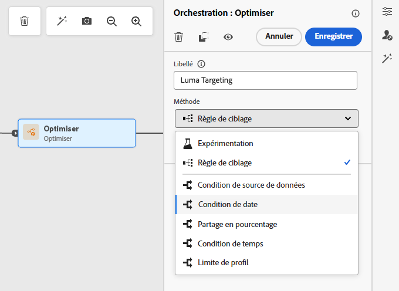
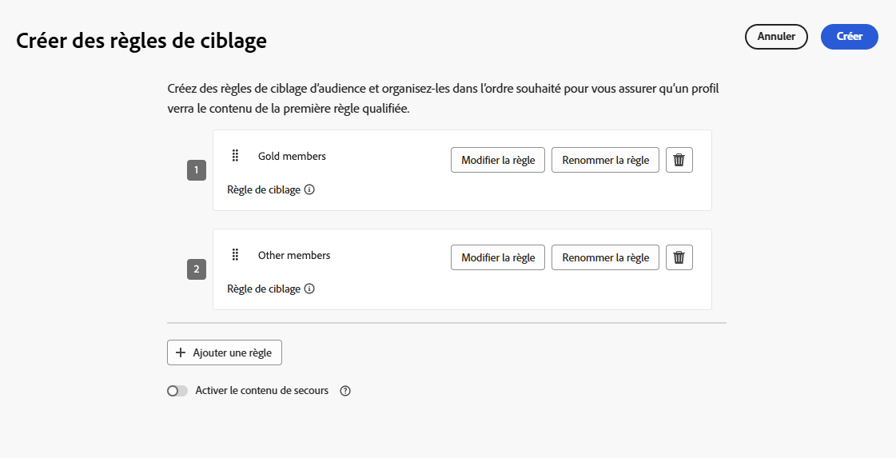
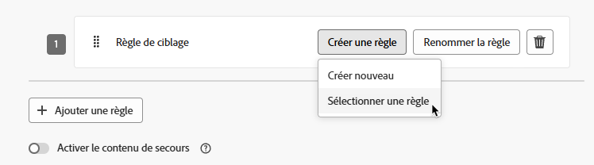
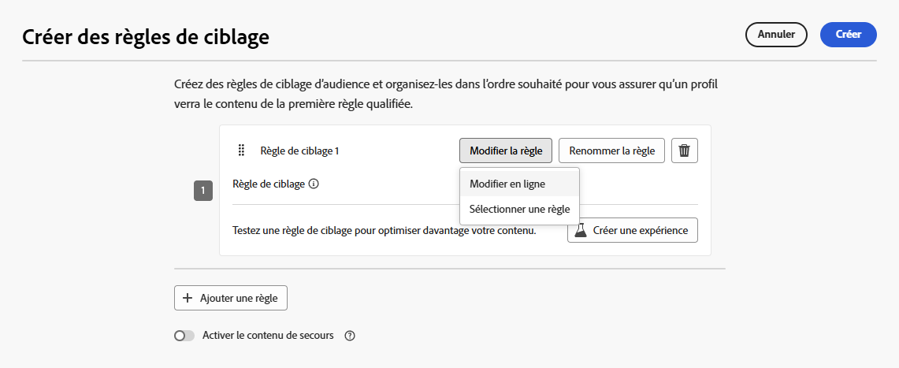
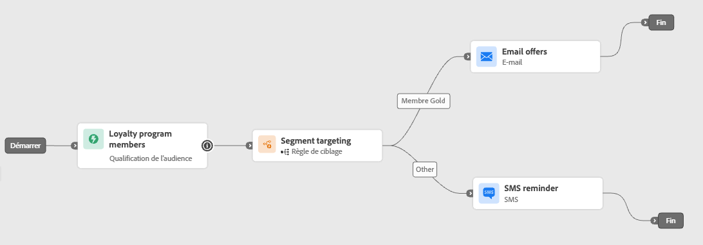
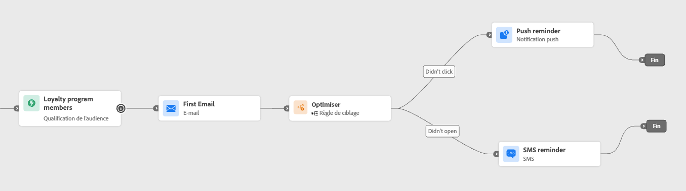
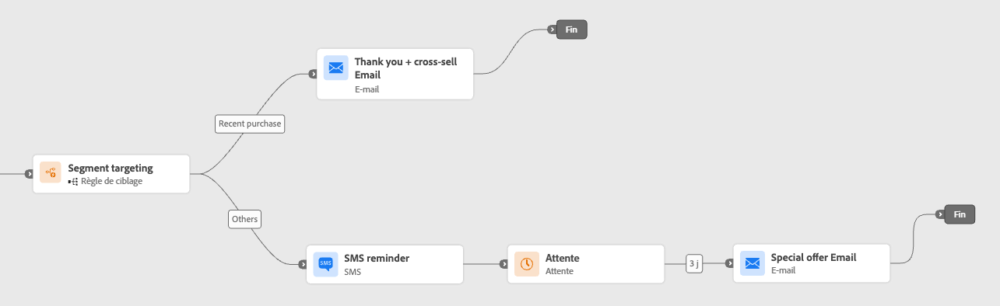

# Utilisation du ciblage des chemins d’accès {#targeting}

>[!CONTEXTUALHELP]
>id="ajo_path_targeting_fallback"
>title="Qu’est-ce que le chemin de remplacement ?"
>abstract="Le chemin de remplacement permet à une audience de rejoindre un chemin alternatif lorsqu’aucune règle de ciblage ne s’applique.  Si vous ne sélectionnez pas cette option, toute audience qui ne remplit pas les critères d’une règle de ciblage ne pourra pas rejoindre le chemin de remplacement et quittera le parcours."

>[!AVAILABILITY]
>
>Cette fonctionnalité est actuellement en disponibilité limitée. Pour obtenir l’accès, contactez votre représentant ou représentante Adobe.

Le ciblage vous permet de déterminer les règles ou qualifications qu’un client ou une cliente doit remplir pour pouvoir suivre l’un des chemins de parcours, en fonction de segments d’audience spécifiques<!-- depending on profile attributes or contextual attributes-->.

Contrairement à l’expérimentation, qui est une affectation aléatoire d’un chemin donné, le ciblage est déterministe dans la mesure où il garantit que l’audience ou le profil approprié rejoint le chemin spécifié.

<!--
With targeting, specific rules can be defined based on:

* **User profile attributes** such as location (eg. geo-targeting), age, or preferences. For example, users in the US receive a "Golden Gate" promotion, while users in France receive an "Eiffel Tower" promotion.

* **Contextual data** such as device type (eg. device-targeting), time of day, or session details. For example, desktop users receive desktop-optimized content, while mobile users receive mobile-optimized content.

* **Audiences** which can be used to include or exclude profiles that have a particular audience membership.
-->

Pour configurer le ciblage dans un parcours, suivez les étapes ci-après.

1. Dans la section **[!UICONTROL Orchestration]**, faites glisser l’activité **[!UICONTROL Optimiser]** et déposez-la dans la zone de travail du parcours.

1. Ajoutez un libellé facultatif qui peut servir à identifier l’activité dans les journaux en mode de test et les rapports.

1. Sélectionnez **[!UICONTROL Règle de ciblage]** dans la liste déroulante **[!UICONTROL Méthode]**.

   {width=60%}

1. Cliquez sur **[!UICONTROL Créer une règle de ciblage]**.

1. Cliquez sur **[!UICONTROL Créer une règle]** > **[!UICONTROL Créer]** et utilisez le créateur de règles pour définir vos critères.

   {width=100%}

   Par exemple, définissez une règle pour les membres Gold du programme de fidélité (`loyalty.status.equals("Gold", false)`) et une règle pour les autres membres (`loyalty.status.notEqualTo("Gold", false)`).

   

1. Vous pouvez également cliquer sur **[!UICONTROL Créer une règle]** > **[!UICONTROL Sélectionner une règle]** pour sélectionner une règle de ciblage existante créée à partir du menu **[!UICONTROL Règles]**. [En savoir plus](../experience-decisioning/rules.md)

   {width=70%}

   Dans ce cas, la formule qui constitue la règle est simplement copiée dans l’activité de parcours. Toute modification ultérieure apportée à cette règle à partir du menu **[!UICONTROL Règles]** n’aura aucune incidence sur la copie du parcours.

   >[!AVAILABILITY]
   >
   >La fonction [Création de règles de ciblage](../experience-decisioning/rules.md#create) à partir du menu [!DNL Journey Optimizer] dédié est actuellement disponible pour les organisations qui ont acheté le module complémentaire Decisioning. Elle est disponible à la demande pour les autres organisations (disponibilité limitée).
   >
   >Cette fonctionnalité sera progressivement déployée pour l’ensemble de la clientèle. En attendant, contactez votre représentant ou votre représentante Adobe pour obtenir l’accès.

1. Après avoir ajouté une règle, vous pouvez toujours la modifier. Choisissez **[!UICONTROL Modifier directement]** pour effectuer la mise à jour directement à l’aide du créateur de règles, ou **[!UICONTROL Sélectionner une règle]** pour sélectionner une autre règle.

   {width=100%}

   >[!NOTE]
   >
   >La modification directe d’une règle n’a aucune incidence sur la règle d’où elle provient.

1. Sélectionnez l’option **[!UICONTROL Activer le chemin de remplacement]** si nécessaire. Cette action crée un chemin de remplacement pour l’audience qui ne répond à aucune des règles de ciblage définies ci-dessus.

   >[!NOTE]
   >
   >Si vous ne sélectionnez pas cette option, toute audience qui ne remplit pas les critères d’une règle de ciblage ne pourra pas suivre le chemin de remplacement et quittera le parcours.

1. Cliquez sur **[!UICONTROL Créer]** pour enregistrer les paramètres de votre règle de ciblage.

1. De retour dans le parcours, déposez des actions spécifiques pour personnaliser chaque chemin. Par exemple, créez un e-mail contenant des offres personnalisées pour les membres du programme de fidélité Gold et un rappel SMS pour l’ensemble des autres membres.

   

1. Si vous avez sélectionné l’option **[!UICONTROL Activer le contenu de secours]** lors de la définition des paramètres de la règle, définissez une ou plusieurs actions pour le chemin de remplacement qui a été automatiquement ajouté.

   {width=70%}

1. Vous pouvez éventuellement utiliser l’option **[!UICONTROL Ajouter un itinéraire alternatif en cas de temporisation ou d’erreur]** pour définir une autre action en cas de problème. [En savoir plus](using-the-journey-designer.md#paths)

1. Concevez le contenu approprié pour chaque action correspondant à chaque groupe défini par les paramètres de vos règles de ciblage.

   Dans cet exemple, concevez un e-mail avec des offres spéciales pour les membres Gold et un rappel SMS pour les autres membres.<!--You can seamlessly navigate between the different contents for each action. -->

1. [Publiez](publish-journey.md) votre parcours.

Une fois le parcours actif, le chemin spécifié pour chaque segment est traité afin que les membres Gold rejoignent le chemin avec les offres par e-mail, tandis que les autres membres rejoignent le chemin avec le SMS de rappel.

Suivez le succès de votre parcours avec le rapport de parcours. [En savoir plus](../reports/journey-global-report-cja.md#targeting)

## Cas d’utilisation des règles de ciblage {#uc-targeting}

Les exemples suivants montrent comment utiliser l’activité **[!UICONTROL Optimiser]** avec la méthode **[!UICONTROL Règle de ciblage]** afin de personnaliser les chemins pour différentes sous-audiences.

+++Canaux spécifiques au segment

Les membres Gold peuvent recevoir des offres personnalisées par e-mail, tandis que les autres membres sont redirigés vers des rappels par SMS.

<!--➡️ Use the revenue per profile or conversion rate as the optimization metric.-->

+++

+++Ciblage basé sur le comportement

Les clientes et clients qui ont ouvert un e-mail mais qui n’ont pas cliqué peuvent recevoir une notification push, tandis que ceux et celles qui ne l’ont pas ouvert du tout reçoivent un SMS.

<!--➡️ Use the click-through rate or downstream conversions as the optimization metric.-->

+++

+++Ciblage de l’historique des achats

Les clientes et clients qui ont récemment acheté des produits peuvent choisir un chemin court « Merci + vente croisée », tandis que ceux et celles qui n’ont pas d’historique d’achat rejoignent un parcours d’accompagnement plus long.

<!--➡️ Use the repeat purchase rate or engagement rate as the optimization metric.-->

+++
