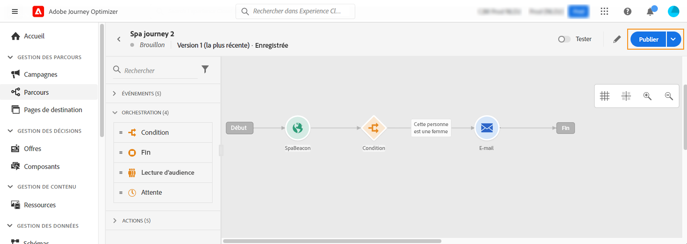
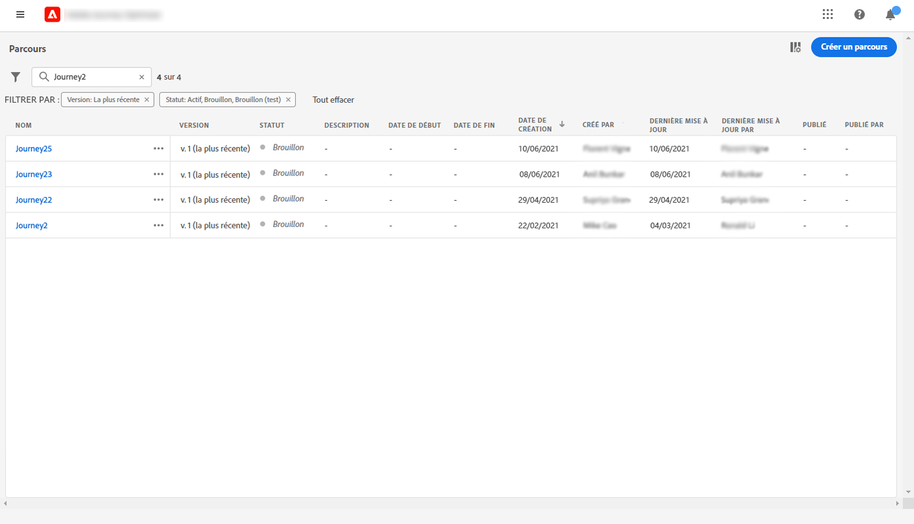
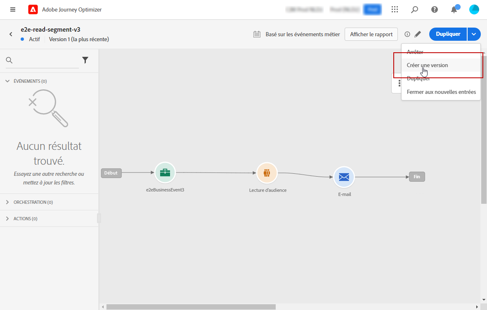

# Publier votre parcours {#publishing-the-journey}

Vous devez publier un parcours pour l’activer et le rendre disponible pour que de nouveaux profils puissent le rejoindre. Avant de publier votre parcours, vérifiez qu’il est valide et qu’il ne comporte aucune erreur. Vous ne pouvez pas publier un parcours comportant des erreurs.

>[!NOTE]
>
>Lorsque vous enregistrez ou publiez un parcours, Journey Optimizer valide la taille totale de la payload du parcours et peut avertir ou bloquer la publication si vous approchez ou dépassez cette limite. En savoir plus sur la validation de la taille de la payload du Parcours [&#128279;](../start/guardrails.md#journey-payload-size).

➡️ [Découvrez cette fonctionnalité en vidéo.](#video)

## Processus de publication {#journey-publication}

Les étapes de publication d’un parcours sont présentées en détail ci-dessous :

1. Avant de publier votre parcours, vérifiez qu’il est valide et qu’il ne comporte aucune erreur. Vous ne pouvez pas publier un parcours comportant des erreurs.

   * Découvrez comment tester votre parcours sur [cette page](testing-the-journey.md).
   * Découvrez comment résoudre les erreurs présentes dans votre parcours dans [cette section](../building-journeys/troubleshooting.md#activity-errors).

1. Pour publier le parcours, cliquez sur l’option **[!UICONTROL Publier]** dans le menu déroulant situé en haut à droite.

   >[!NOTE]
   >
   > Si votre parcours est soumis à une politique d’approbation, vous devez effectuer une demande d’approbation afin de pouvoir le publier. [En savoir plus](../test-approve/gs-approval.md)

   

Une fois le parcours publié, il est en **lecture seule**. En lecture seule, vous ne pouvez modifier que les libellés et les descriptions des activités, ainsi que le nom et la description du parcours. Si vous devez apporter des modifications à un parcours publié, créez [une nouvelle version](journey-ui.md#journey-filter) de votre parcours.

Si vous arrêtez un parcours, l’arrêt est définitif. Toutes les personnes progressant dans le parcours s’arrêteront définitivement et le parcours n’autorisera plus aucune entrée. Si vous devez exécuter le parcours à nouveau, vous devez le dupliquer et publier le nouveau parcours.

>[!IMPORTANT]
>
>* Si des modifications sont apportées à une décision d’offres utilisée dans le message d’un parcours, vous devez dépublier le parcours et le republier. Cela permet de s’assurer que les modifications sont intégrées au message du parcours et que le message est cohérent avec les dernières mises à jour.
>
>* Les ressources/images sont accessibles dans le contenu diffusé pendant un maximum de 2 ans (730 jours) depuis leur première publication dans un fragment ou un message intégré. Une nouvelle publication est nécessaire après cette période d’expiration (à tout moment après 730 jours) pour prolonger leur accessibilité pendant 2 ans supplémentaires. Toute nouvelle publication effectuée dans les 730 jours suivant la première publication ne prolongera pas la validité des ressources/images aux 730 jours suivants.

## Versions de parcours {#journey-versions}

Dans la liste des parcours, toutes les versions de parcours sont accompagnées d’un numéro. Lorsque vous recherchez un parcours, les versions les plus récentes apparaissent en haut de la liste la première fois que vous ouvrez l&#39;application. Vous pouvez ensuite définir l&#39;ordre de tri souhaité ; l&#39;application le conservera en tant que préférence utilisateur. La version du parcours est également affichée en haut de l&#39;interface d&#39;édition des parcours, au-dessus de la zone de travail.

>[!NOTE]
>
>En règle générale, un profil ne peut pas être présent plusieurs fois dans le même parcours et au même moment. Cela s’applique à toutes les versions actives du parcours. Si la rentrée est activée, un profil peut rejoindre à nouveau un parcours, mais ne peut pas le faire tant qu’il n’a pas complètement quitté cette instance précédente du parcours. [En savoir plus](entry-management.md).

### Créer une nouvelle version d’un parcours {#journey-create-new-version}

Si vous devez apporter des modifications à un parcours publié, vous devez en créer une nouvelle version. Pour créer une nouvelle version d’un parcours existant, procédez comme suit :

1. Ouvrez la dernière version de votre parcours actif, puis cliquez sur **[!UICONTROL Créer une version]**, puis confirmez.

   

   >[!NOTE]
   >
   >Vous ne pouvez créer une version qu&#39;à partir de la dernière version d&#39;un parcours.

1. Apportez vos modifications, cliquez sur **[!UICONTROL Publier]** et confirmez.

Dès la publication du parcours, les personnes vont accéder à la dernière version du parcours. Les clients qui ont déjà accédé à une version antérieure y restent jusqu&#39;à la fin du parcours. Si les personnes entrent à nouveau dans le même parcours par la suite, elles accéderont à la dernière version.

Les versions de parcours peuvent être arrêtées individuellement. Toutes les versions de parcours portent le même nom.

Lorsque vous publiez une nouvelle version d&#39;un parcours, la version précédente se termine automatiquement et passe au statut **Fermé**. Aucune entrée dans le parcours ne peut se produire. Même si vous arrêtez la dernière version, la version précédente reste fermée.

>[!NOTE]
>
>Des mécanismes de sécurisation et des limitations spécifiques s’appliquent au contrôle de version des parcours. En savoir plus sur [cette page](../start/guardrails.md#journey-versions-g).

## Vidéo pratique {#video}

Découvrez comment publier un parcours dans cette vidéo :

>[!VIDEO](https://video.tv.adobe.com/v/3424998?quality=12)