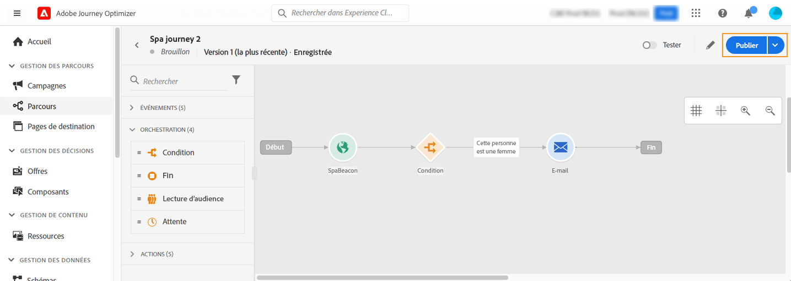
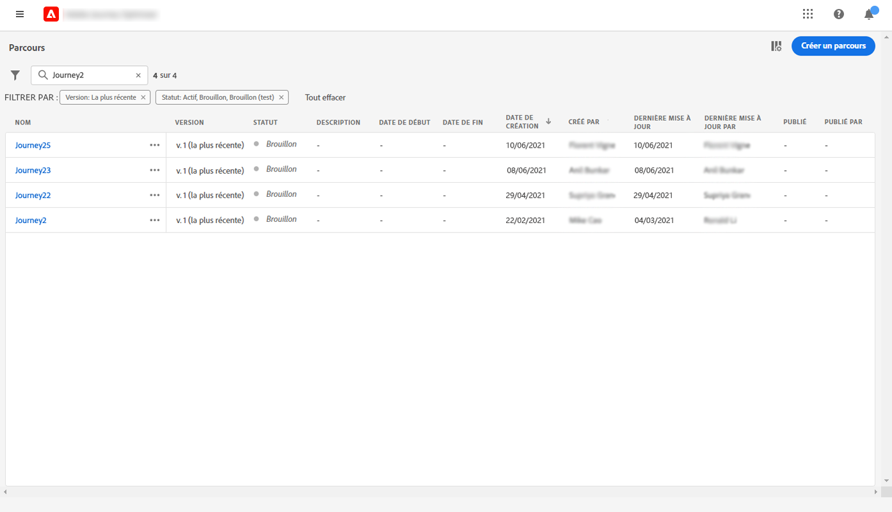
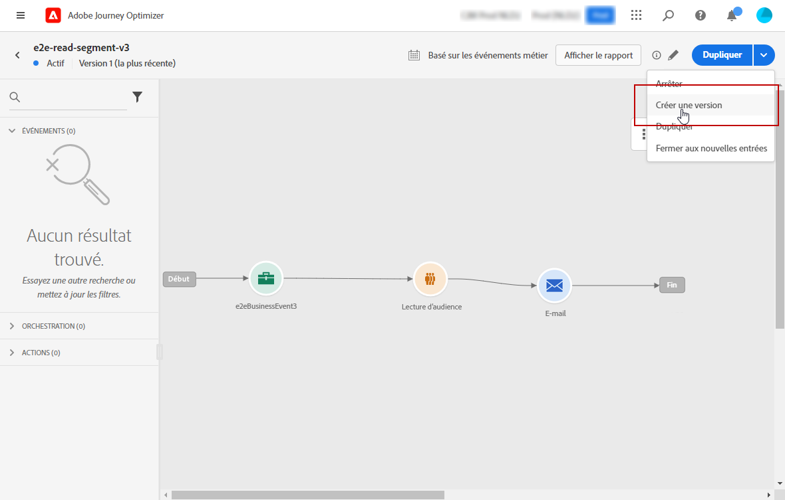

# Publier votre parcours {#publishing-the-journey}

>[!BEGINSHADEBOX]

**Sur cette page :** découvrez comment publier un parcours pour le mettre en ligne, y compris les conditions préalables, le processus de publication, la gestion des versions et les exigences de republication.

>[!ENDSHADEBOX]

La publication d&#39;un parcours l&#39;active : elle passe au statut **[!UICONTROL En ligne]**, devient disponible pour les nouveaux profils et passe en mode lecture seule. Vous ne pouvez pas publier un parcours contenant des erreurs.

>[!NOTE]
>
>Lorsque vous enregistrez ou publiez un parcours, Journey Optimizer valide la taille totale de la payload du parcours et peut avertir ou bloquer la publication si vous approchez ou dépassez cette limite. En savoir plus sur la validation de la taille de la payload du Parcours [&#128279;](../start/guardrails.md#journey-payload-size).

➡️ [Découvrez cette fonctionnalité en vidéo.](#video)

## Avant la publication {#before-you-publish}

Avant de publier, vérifiez que votre parcours remplit les conditions préalables suivantes :

* **Aucune erreur de validation** — Vous ne pouvez pas publier un parcours contenant des erreurs. [Testez d’abord votre parcours &#x200B;](testing-the-journey.md) puis [résolvez les erreurs d’activité](../building-journeys/troubleshooting.md#activity-errors).
* **Autorisation Publier** — La publication nécessite l&#39;autorisation **[!DNL Publish journeys]** de haut niveau. En savoir plus sur la [gestion des droits d’accès](../administration/permissions-overview.md).
* **Payload dans la limite** — La payload du parcours doit être dans la limite configurée (4 Mo par défaut). Voir la validation de la taille de la payload du Parcours [&#128279;](../start/guardrails.md#journey-payload-size).
* **Approbation obtenue** — Si votre parcours est soumis à une politique d&#39;approbation, demandez et obtenez l&#39;approbation avant de le publier. [En savoir plus](../test-approve/gs-approval.md).

>[!TIP]
>
>Avant de publier, validez votre parcours à l’aide de l’une des options de test disponibles :
>
>* [Simulation](simulate-journey-gs.md) — effectuez des tests avec des utilisateurs simulés, sans utiliser de profils de test persistants dans Adobe Experience Platform.
>* [Mode test](testing-the-journey.md) — Testez avec des profils persistants marqués comme profils de test dans Adobe Experience Platform.
>* [Exécution d’essai](journey-dry-run.md) — Testez avec des données de production réelles, sans contacter les profils.

## Processus de publication {#journey-publication}

Les étapes de publication d’un parcours sont présentées en détail ci-dessous :

1. Vérifiez que le parcours est valide, qu’il ne comporte aucune erreur et qu’il remplit les [&#x200B; conditions préalables ci-dessus](#before-you-publish).

1. Pour publier le parcours, cliquez sur l’option **[!UICONTROL Publier]** dans le menu déroulant situé en haut à droite.

   >[!NOTE]
   >
   > Si votre parcours est soumis à une politique d’approbation, vous devez effectuer une demande d’approbation afin de pouvoir le publier. [En savoir plus](../test-approve/gs-approval.md)

   

Une fois le parcours publié, il est en **lecture seule**. En lecture seule, vous ne pouvez modifier que les libellés et les descriptions des activités, ainsi que le nom et la description du parcours. Si vous devez apporter des modifications à un parcours publié, créez [une nouvelle version](journey-ui.md#journey-filter) de votre parcours.

### Statuts des parcours {#journey-statuses}

Après la publication, un parcours passe par plusieurs statuts :

* **[!UICONTROL En direct]** — Le parcours est publié et les profils peuvent le saisir.
* **[!UICONTROL Fermé]** — Version précédente qui s&#39;arrêtait automatiquement lorsqu&#39;une nouvelle version était publiée. Aucune entrée ne peut se produire.
* **[!UICONTROL Terminé]** — Le parcours s&#39;est terminé selon ses critères d&#39;achèvement. Pour obtenir la définition exacte du moment où un parcours est considéré comme terminé, voir [Fin des parcours &#x200B;](end-journey.md#journey-finished-definition).

### Arrêt d’un parcours {#stop-journey}

Si vous arrêtez un parcours, l’arrêt est définitif. Toutes les personnes progressant dans le parcours s’arrêteront définitivement et le parcours n’autorisera plus aucune entrée. Si vous devez exécuter le parcours à nouveau, vous devez le dupliquer et publier le nouveau parcours. Pour plus d’informations sur la façon dont les parcours se terminent, voir [Comment les parcours se terminent](end-journey.md).

### Exigences de republication {#republishing}

Dans certains cas, vous devez republier un parcours pour que les modifications ou les ressources restent effectives :

>[!IMPORTANT]
>
>* Si des modifications sont apportées à une décision d’offres utilisée dans le message d’un parcours, vous devez dépublier le parcours et le republier. Cela permet de s’assurer que les modifications sont intégrées au message du parcours et que le message est cohérent avec les dernières mises à jour.
>
>* Les ressources/images sont accessibles dans le contenu diffusé pendant un maximum de 2 ans (730 jours) depuis leur première publication dans un fragment ou un message intégré. Une nouvelle publication est nécessaire après cette période d’expiration (à tout moment après 730 jours) pour prolonger leur accessibilité pendant 2 ans supplémentaires. Toute nouvelle publication effectuée dans les 730 jours suivant la première publication ne prolongera pas la validité des ressources/images aux 730 jours suivants.

## Versions de parcours {#journey-versions}

Dans la liste des parcours, toutes les versions de parcours sont accompagnées d’un numéro. Lorsque vous recherchez un parcours, les versions les plus récentes apparaissent en haut de la liste la première fois que vous ouvrez l&#39;application. Vous pouvez ensuite définir l&#39;ordre de tri souhaité ; l&#39;application le conservera en tant que préférence utilisateur. La version du parcours est également affichée en haut de l&#39;interface d&#39;édition des parcours, au-dessus de la zone de travail.

>[!NOTE]
>
>En règle générale, un profil ne peut pas être présent plusieurs fois dans le même parcours et au même moment. Cela s’applique à toutes les versions actives du parcours. Si la rentrée est activée, un profil peut rejoindre à nouveau un parcours, mais ne peut pas le faire tant qu’il n’a pas complètement quitté cette instance précédente du parcours. [En savoir plus](entry-management.md).

### Créer une nouvelle version d’un parcours {#journey-create-new-version}

Si vous devez apporter des modifications à un parcours publié, vous devez en créer une nouvelle version. Pour créer une nouvelle version d’un parcours existant, procédez comme suit :

1. Ouvrez la dernière version de votre parcours actif, puis cliquez sur **[!UICONTROL Créer une version]**, puis confirmez.

   

   >[!NOTE]
   >
   >Vous ne pouvez créer une version qu&#39;à partir de la dernière version d&#39;un parcours.

1. Apportez vos modifications, cliquez sur **[!UICONTROL Publier]** et confirmez.

Dès la publication du parcours, les personnes vont accéder à la dernière version du parcours. Les clients qui ont déjà accédé à une version antérieure y restent jusqu&#39;à la fin du parcours. Si les personnes entrent à nouveau dans le même parcours par la suite, elles accéderont à la dernière version.

Les versions de parcours peuvent être arrêtées individuellement. Toutes les versions de parcours portent le même nom.

Lorsque vous publiez une nouvelle version d&#39;un parcours, la version précédente se termine automatiquement et passe au statut **Fermé**. Aucune entrée dans le parcours ne peut se produire. Même si vous arrêtez la dernière version, la version précédente reste fermée.

>[!NOTE]
>
>Des mécanismes de sécurisation et des limitations spécifiques s’appliquent au contrôle de version des parcours. En savoir plus sur [cette page](../start/guardrails.md#journey-versions-g).

## Questions fréquentes {#faq}

**Pourquoi ne puis-je pas publier mon parcours ?**

La raison la plus courante est que le parcours contient des erreurs de validation : vous ne pouvez pas publier de parcours contenant des erreurs. D’autres bloqueurs incluent le dépassement de la [limite de taille de la payload](../start/guardrails.md#journey-payload-size), l’absence de l’autorisation **[!DNL Publish journeys]** ou une [approbation](../test-approve/gs-approval.md) en attente. Voir [Avant de publier](#before-you-publish) et [Résolution des problèmes liés aux erreurs d’activité](../building-journeys/troubleshooting.md#activity-errors).

**Puis-je modifier un parcours après sa publication ?**

Un parcours publié est en mode lecture seule. Vous pouvez uniquement modifier les libellés et les descriptions des activités, le nom du parcours et la description du parcours. Pour toute autre modification, [créez une nouvelle version](#journey-create-new-version) du parcours.

**Qu’advient-il des profils déjà présents dans le parcours lorsque je publie une nouvelle version ?**

Les nouveaux profils arrivent dans la dernière version. Les profils qui se trouvent déjà dans une version précédente y restent jusqu’à la fin ; s’ils rejoignent ultérieurement cette version, ils accèdent à la dernière version. La version précédente passe automatiquement à **[!UICONTROL Fermée]** et n’accepte aucune nouvelle entrée. Voir [versions de Parcours &#x200B;](#journey-versions).

**Comment réexécuter un parcours arrêté ?**

L’arrêt d’un parcours est permanent. Pour l’exécuter à nouveau, dupliquez-le et publiez le nouveau parcours. Voir [Arrêter un parcours &#x200B;](#stop-journey).

**Dois-je republier après avoir modifié une décision d’offre ou mis à jour des ressources ?**

Oui. Si vous modifiez une décision d’offres utilisée dans le message d’un parcours, dépubliez et republiez le parcours afin que la modification soit appliquée. Assets et les images expirent 730 jours après la première publication ; republiez après cette période pour les garder accessibles. Voir [Conditions requises pour la republication](#republishing).

**Puis-je publier un parcours qui nécessite une approbation ?**

Si votre parcours est soumis à une politique d’approbation, vous devez demander une approbation avant de le publier. [En savoir plus sur la validation](../test-approve/gs-approval.md).

## Rubriques connexes {#related-topics}

* [Tester le parcours &#x200B;](testing-the-journey.md) - Validez le parcours avec des profils de test avant de le publier
* [simulation de Parcours &#x200B;](simulate-journey-gs.md) - Validez votre parcours avec des utilisateurs simulés avant de le publier
* [Exécution d’essai en Parcours &#x200B;](journey-dry-run.md) - Tester avec des données de production réelles sans contacter les profils
* [Dépannage](../building-journeys/troubleshooting.md#activity-errors) - Résoudre les erreurs d’activité et de publication
* [Fin des parcours &#x200B;](end-journey.md#journey-finished-definition) - Comprendre l’achèvement et les statuts du parcours
* [Gestion de l’entrée des profils](entry-management.md) - Configurer la manière dont les profils entrent et rentrent dans les parcours
* [Mécanismes de sécurisation et limitations de Parcours &#x200B;](../start/guardrails.md#journeys-guardrails-journeys) - Consultez les mécanismes de sécurisation de publication et de contrôle de version

## Vidéo pratique {#video}

Découvrez comment publier un parcours dans cette vidéo :

>[!VIDEO](https://video.tv.adobe.com/v/3424998?quality=12)

+++ Référence des connaissances sur l’IA

Cette section contient des connaissances structurées destinées à soutenir l’interprétation, la récupération et la réponse aux questions liées à ce sujet.

Pour une compréhension totale, ces informations doivent être combinées avec la documentation de cette page. Aucune des sources n’est conçue pour être autonome. La page décrit la fonctionnalité, tandis que cette section fournit un contexte supplémentaire qui permet de clarifier la terminologie, l’intention, l’applicabilité et les contraintes.

* **TL;DR:** Cette page explique comment publier un parcours Adobe Journey Optimizer, gérer les versions de parcours et comprendre les contraintes qui s’appliquent une fois qu’un parcours est actif.

**Intentions:**
* Publier un parcours pour le rendre actif et disponible pour l’entrée de profil
* Vérifier la validité du parcours et résoudre les erreurs avant la publication
* Création d’une nouvelle version d’un parcours dynamique pour y apporter des modifications
* Comprendre les restrictions en lecture seule qui s’appliquent après la publication d’un parcours
* Arrêter un parcours de manière permanente ou gérer les transitions entre les versions

**Glossaire:**
* **version de Parcours** : itération numérotée d’un parcours ; de nouvelles versions sont créées pour modifier un parcours actif sans interrompre les profils déjà en cours *(spécifiques au produit)*
* **Statut Fermé** : le statut d’une version de parcours précédente est automatiquement renseigné lorsqu’une nouvelle version est publiée ; aucun nouveau profil ne peut entrer dans un *de parcours Fermé (spécifique au produit)*
* **Politique d’approbation** : workflow de gouvernance facultatif nécessitant une approbation explicite avant qu’un parcours puisse être publié *(spécifique au produit)*

**Mécanismes de sécurisation :**
* Un parcours contenant des erreurs ne peut pas être publié.
* Journey Optimizer valide la taille totale de la payload du parcours au moment de l’enregistrement et de la publication ; la publication peut être bloquée si la limite est dépassée.
* Après la publication, un parcours est en mode lecture seule ; seuls les libellés, les descriptions et le nom du parcours peuvent être modifiés.
* Une nouvelle version ne peut être créée qu’à partir de la dernière version d’un parcours.
* Lorsqu’un parcours est arrêté, il est définitivement arrêté ; il doit être dupliqué pour s’exécuter à nouveau.
* Assets et les images du contenu diffusé sont accessibles pendant 730 jours au maximum à compter de la première publication ; une republication est nécessaire après cette période.
* Si une décision d’offre utilisée dans un message de parcours est modifiée, le parcours doit être dépublié et republié.
* Des mécanismes de sécurisation spécifiques s’appliquent au contrôle de version des parcours (voir page Mécanismes de sécurisation).

**Terminologie:**
* Nom canonique : Parcours de publication — Acronyme : aucun — variantes : activer le parcours, activer le contenu
* Synonymes : « Publier » = « Activer » = « Activer »
* Ne les confondez pas : « Arrêter le parcours » ≠ « Fermer le parcours » (l’arrêt est une action manuelle ; le statut Fermé est un statut automatique appliqué aux versions précédentes lorsqu’une nouvelle version est publiée)

**FAQ:**
* **Q : Puis-je modifier un parcours après sa publication ?** — Seuls les libellés, les descriptions et le nom du parcours peuvent être modifiés. Pour apporter d’autres modifications, créez une nouvelle version du parcours.
* **Q : Qu’advient-il des profils d’une ancienne version de parcours lorsqu’une nouvelle version est publiée ?** — Les profils déjà présents dans la version précédente y restent jusqu’à la fin ; les nouveaux profils entrent la dernière version.
* **Q : Puis-je republier une version en parcours fermé ?** — Non. Une fois qu’une version précédente est fermée, elle reste fermée même si la dernière version est arrêtée.
* **Q : Que dois-je faire si une décision d’offre utilisée dans le parcours change ?** — Dépubliez le parcours et republiez-le pour incorporer la décision d’offre mise à jour.
* **Q : L’approbation est-elle requise avant la publication ?** — Uniquement si votre parcours est soumis à une politique d&#39;approbation ; dans ce cas, vous devez d&#39;abord demander l&#39;approbation.

+++
