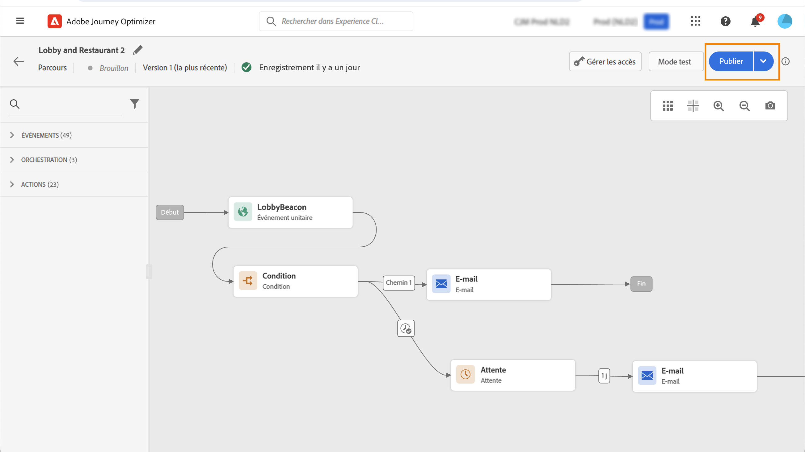

# Publier votre parcours {#publishing-the-journey}

Vous devez publier un parcours pour l’activer et le rendre disponible pour que de nouveaux profils puissent le rejoindre. Avant de publier votre parcours, vérifiez qu’il est valide et qu’il ne comporte aucune erreur. Vous ne pouvez pas publier un parcours comportant des erreurs.

➡️ [Découvrez cette fonctionnalité en vidéo.](#video)

Les étapes de publication d’un parcours sont détaillées ci-dessous :

1. Avant de publier votre parcours, vérifiez qu’il est valide et qu’il ne comporte aucune erreur. Le cas échéant, la publication s’avérera impossible.

   * Découvrez comment tester votre parcours sur [cette page](testing-the-journey.md).
   * Découvrez comment résoudre les erreurs présentes dans votre parcours dans [cette section](../building-journeys/troubleshooting.md#checking-for-errors-before-testing).

1. Pour publier le parcours, cliquez sur l’option **[!UICONTROL Publier]** située dans le menu déroulant qui se trouve en haut à droite.

   >[!NOTE]
   >
   > Si votre parcours est soumis à une politique d’approbation, vous devrez effectuer une demande d’approbation afin de pouvoir le publier. [En savoir plus](../test-approve/gs-approval.md)

   

Une fois le parcours publié, il est en **lecture seule**. Lorsqu’un parcours est en lecture seule, vous ne pouvez modifier que les libellés et les descriptions d’activité, ainsi que le nom et la description du parcours. Si vous devez apporter des modifications à un parcours publié, vous devez en créer [une nouvelle version](journey-ui.md#journey-versions).

Lorsque vous arrêtez un parcours, il est définitivement arrêté : toutes les personnes présentes dans le parcours sont définitivement arrêtées, et le parcours cesse d’autoriser de nouvelles entrées. Si vous devez réexécuter le parcours, vous devez le dupliquer et publier le nouveau parcours.

>[!IMPORTANT]
>
>Si des modifications sont apportées à une décision d’offres qui est utilisée dans le message d’un parcours, vous devez dépublier le parcours et le republier. Cela permet de s’assurer que les modifications sont intégrées au message du parcours et que le message est cohérent avec les dernières mises à jour.

## Vidéo pratique {#video}

Découvrez comment publier un parcours dans cette vidéo :

>[!VIDEO](https://video.tv.adobe.com/v/3427934?quality=12&captions=fre_fr)