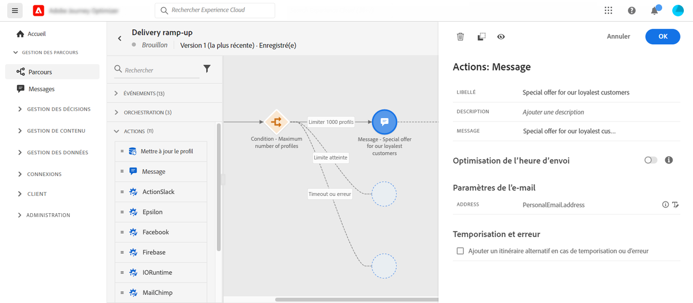

# Cas d’utilisation : améliorez vos diffusions{#use-case-ramp-up-your-deliveries}

Si vous avez récemment migré vers un autre fournisseur de services de messagerie, dʼadresse IP ou de domaine ou sous-domaine de messagerie, vous devez asseoir votre réputation d’expéditeur. Dans le cas contraire, vos diffusions risquent dʼêtre bloquées voire déplacées dans le dossier des courriers indésirables de la boîte aux lettres des destinataires. Découvrez comment accroître la réputation de vos e-mails grâce au préchauffage dʼadresses IP dans le [Guide des bonnes pratiques en matière de délivrabilité](https://experienceleague.adobe.com/docs/deliverability-learn/deliverability-best-practice-guide/additional-resources/generic-resources/increase-reputation-with-ip-warming.html?lang=fr){target="_blank"}.

Pour préchauffer votre adresse IP, vous pouvez augmenter progressivement le nombre de vos diffusions. En savoir plus sur lʼ[optimisation de la délivrabilité dans Journey Optimizer](../reports/deliverability.md).

Ce cas d’utilisation vise à créer un parcours afin dʼaccélérer vos diffusions e-mail. Pour configurer ce parcours, procédez comme suit :

1. Créez un parcours. [En savoir plus](journey-gs.md).

1. Ajoutez une activité de **[!UICONTROL Condition]** au parcours. [En savoir plus](condition-activity.md).

1. Dans les paramètres de lʼactivité de **[!UICONTROL Condition]**, définissez le nombre maximal de destinataires pour votre diffusion :

   1. Dans les paramètres de lʼactivité de **[!UICONTROL Condition]**, définissez le champ **[!UICONTROL Type]** sur **[!UICONTROL Limite du profil]**. [En savoir plus](condition-activity.md#profile_cap).

   1. Définissez le champ **[!UICONTROL Limite]** sur le nombre maximal de destinataires pour cette diffusion.

   

   Vous pouvez augmenter progressivement cette limite jusqu’au nombre total dʼabonnés.

1. Ajoutez une activité d’action **[!UICONTROL E-mail]** au chemin nominal après lʼactivité **[!UICONTROL Condition]**.

   

   Lors de lʼexécution du parcours, le message est envoyé aux profils entrants, dans la limite du nombre maximal de profils que vous avez spécifié. Lorsque cette limite est atteinte, les profils entrants empruntent lʼautre chemin.

1. Complétez le parcours avec les activités de votre choix.

Une fois votre adresse IP préchauffée, vous pouvez supprimer cette condition.
