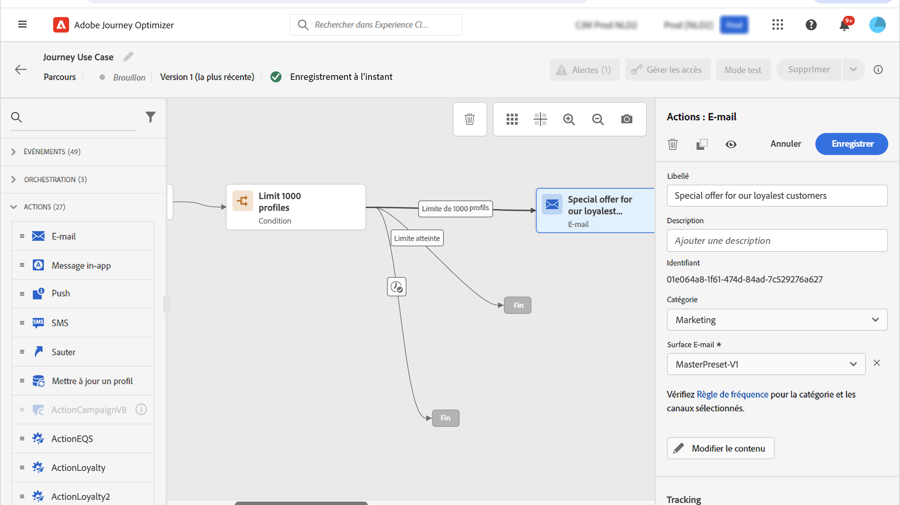

# Cas pratique : augmenter vos diffusions ;{#use-case-ramp-up-your-deliveries}

Si vous avez récemment migré vers un autre fournisseur de services de messagerie, une adresse IP, un domaine de messagerie ou un sous-domaine, vous devez établir votre réputation en tant qu’expéditeur. Sinon, vos diffusions peuvent être bloquées ou déplacées dans le dossier spam de la boîte aux lettres des destinataires. Découvrez comment améliorer la réputation de vos emails grâce au réchauffement des adresses IP dans la section [Guide des bonnes pratiques de délivrabilité](https://experienceleague.adobe.com/docs/deliverability-learn/deliverability-best-practice-guide/additional-resources/generic-resources/increase-reputation-with-ip-warming.html){target=&quot;_blank&quot;}.

Pour réchauffer votre adresse IP, vous pouvez augmenter progressivement le nombre de vos diffusions. En savoir plus sur [optimisation de la délivrabilité dans Journey Optimizer](../reports/deliverability.md).

Ce cas pratique a pour but de créer un parcours pour accélérer vos diffusions email. Pour configurer ce parcours, procédez comme suit :

1. Créez un parcours. [En savoir plus](journey-gs.md).

1. Ajouter un **[!UICONTROL Condition]** de l’activité au parcours. [En savoir plus](condition-activity.md).

1. Dans le **[!UICONTROL Condition]** paramètres d&#39;activité, définissez le nombre maximum de destinataires pour votre diffusion :

   1. Dans le **[!UICONTROL Condition]** paramètres d’activité, définissez **[!UICONTROL Type]** champ à **[!UICONTROL Profile cap]**. [En savoir plus](condition-activity.md#profile_cap).

   1. Définissez la variable **[!UICONTROL Limit]** au nombre maximum de destinataires pour cette diffusion.

   

   Vous pouvez augmenter progressivement cette limite jusqu’au nombre total d’abonnés.

1. Ajoutez un **[!UICONTROL Email]** l’activité d’action sur le chemin d’accès nominal après la **[!UICONTROL Condition]** activité.

   

   Lorsque le parcours s’exécute, le message est envoyé aux profils de saisie, jusqu’au nombre maximal de profils que vous avez spécifiés. Lorsque cette limite est atteinte, les profils entrant prennent le chemin alternatif.

1. Terminez le parcours avec les activités de votre choix.

Une fois votre adresse IP réchauffée, vous pouvez supprimer cette condition.
