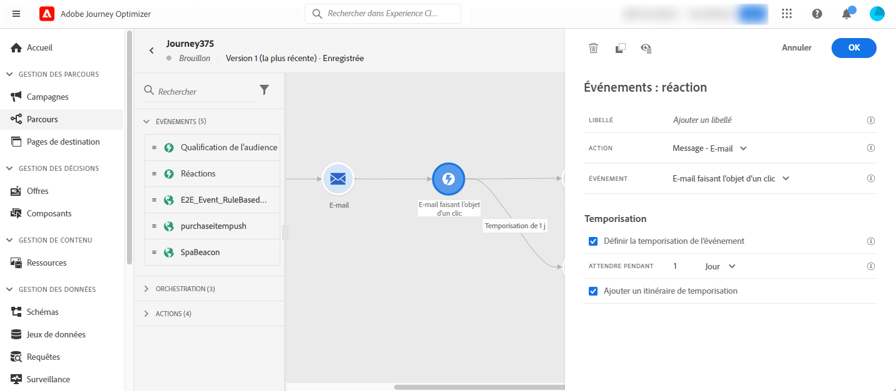

# Événements de réaction {#reaction-events}

>[!CONTEXTUALHELP]
>id="ajo_journey_event_reaction"
>title="Événements de réaction"
>abstract="Cette activité vous permet de réagir aux données de suivi liées à un message envoyé au sein du même parcours. Nous recueillons ces informations en temps réel au moment où elles sont partagées avec [!DNL Adobe Experience Platform]."

## Vue d’ensemble {#overview}

Parmi les différentes activités d’événement disponibles dans la palette, vous trouverez l’événement **[!UICONTROL Réactions]** intégré. Cette activité vous permet de réagir aux données de suivi liées à un message envoyé au sein du même parcours. Nous recueillons ces informations en temps réel au moment où elles sont partagées avec [!DNL Adobe Experience Platform].

Vous pouvez réagir aux messages ouverts ou qui ont fait l’objet d’un clic. Par exemple, vous pouvez envoyer un autre message si un individu a ouvert l’e-mail précédent ou cliqué dessus, ou envoyer un autre message de relance si elle n’a pas interagi avec votre communication.

Voir [Activités d’action](../building-journeys/about-journey-activities.md#action-activities).

Vous pouvez également utiliser l’activité de **[!UICONTROL réaction]** pour effectuer une action en l’absence de réaction à vos messages. Pour ce faire, créez un deuxième chemin parallèlement à l’activité de **[!UICONTROL réaction]** et ajoutez une activité d’**[!UICONTROL attente]**. En l’absence de réaction au cours de la période définie dans l’activité d’**[!UICONTROL attente]**, ce deuxième chemin sera choisi. Vous pouvez opter, par exemple, pour l’envoi d’un message de relance.

## Configuration des événements de réaction {#configure}

Pour configurer les événements de réaction, procédez comme suit :

1. Placez une activité de **[!UICONTROL réaction]** **immédiatement** après une [activité d’action de canal](journey-action.md) sur la zone de travail du parcours.
1. Ajoutez un **[!UICONTROL libellé]** à la réaction. Cette étape est facultative.
1. Dans la liste déroulante, sélectionnez l’activité d’action à laquelle vous souhaitez réagir. Vous pouvez sélectionner toute activité d’action figurant dans les étapes précédentes du chemin.
1. Selon l’action que vous avez sélectionnée, choisissez ce à quoi vous souhaitez réagir.
1. Vous pouvez définir une temporisation de l’événement (entre 40 secondes et 90 jours), ainsi qu’un chemin de temporisation. Cette opération crée un deuxième chemin pour les personnes qui n’ont pas réagi pendant la durée définie. Lors du test d’un parcours qui a recours à un événement de réaction, la **[!UICONTROL Durée d’attente]** du mode test par défaut ainsi que sa valeur minimale sont de 40 secondes. Consultez [cette section](../building-journeys/testing-the-journey.md).

## Mécanismes de sécurisation et limitations {#guardrails-limitations}

* Une activité de **[!UICONTROL réaction]** doit être placée **immédiatement** après une [activité d’action de canal](journey-action.md) dans la zone de travail du parcours.
* Vous ne pouvez pas utiliser une activité de **[!UICONTROL réaction]** s’il n’y a aucune activité d’action de canal placée avant elle.
* Le placement d’une activité d’**[!UICONTROL attente]** ou de toute autre activité entre l’action de canal et l’activité de **[!UICONTROL réaction]** n’est pas pris en charge et peut entraîner un dysfonctionnement de la réaction.
* Les événements de réaction ne peuvent suivre que les messages envoyés dans le même parcours. Ils ne peuvent pas suivre les messages qui se produisent dans un autre parcours.
* Ils effectuent le suivi des clics sur les liens de type « suivi ». Les liens de désabonnement et de page miroir ne sont pas pris en compte.
* Le suivi des ouvertures d’e-mail est effectué à l’aide d’une image de 0 pixel incluse dans l’e-mail. Si les clients de messagerie (tels que Gmail) bloquent les images, les ouvertures d’e-mail ne sont pas prises en compte.
