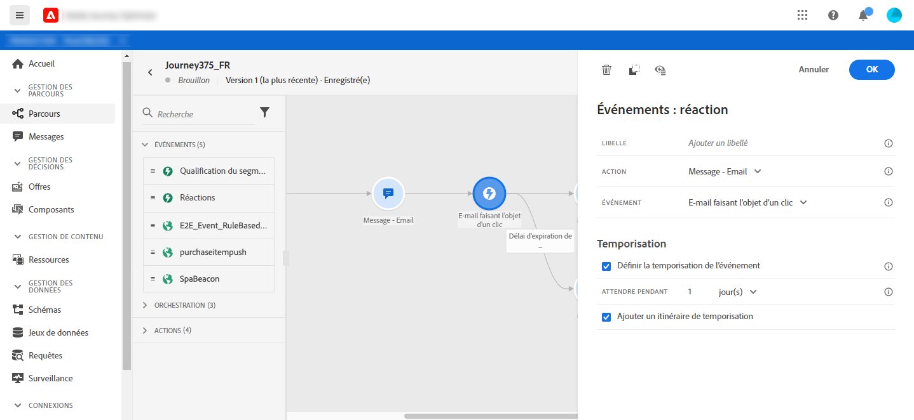

# Événements de réaction {#section_dhx_gss_dgb}

Parmi les différentes activités de événement disponibles dans la palette, vous trouverez le événement intégré **[!UICONTROL Réactions]**. Cette activité vous permet de réagir au suivi des données liées à un message envoyé dans le même parcours. Nous capturons ces informations en temps réel au moment où elles sont partagées avec Adobe Experience Platform. Pour les notifications Push, vous pouvez réagir aux messages sur lesquels vous avez cliqué, envoyés ou qui ont échoué. Pour les messages SMS, vous pouvez réagir aux messages envoyés ou échoués. Pour les courriers électroniques, vous pouvez réagir aux messages sur lesquels vous avez cliqué, envoyés, ouverts ou qui ont échoué.

Vous pouvez également utiliser ce mécanisme pour effectuer une action lorsqu&#39;il n&#39;y a aucune réaction à vos messages. Pour ce faire, créez un second chemin parallèle à l’activité de la réaction et ajoutez une activité d’attente. S&#39;il n&#39;y a pas de réaction pendant la période définie dans l&#39;activité d&#39;attente, la deuxième voie sera choisie. Vous pouvez choisir d’envoyer, par exemple, un message de suivi.

Notez que vous ne pouvez utiliser une activité de réaction dans la trame que si une activité **Message** est antérieure.

Voir [A propos des activités d&#39;action](../building-journeys/about-journey-activities.md#action-activities).

Voici les différentes étapes de configuration des événements de réaction :

1. Ajouter une **[!UICONTROL étiquette]** à la réaction. Cette étape est facultative.
1. Dans la liste déroulante, sélectionnez l’activité d’action à laquelle vous souhaitez réagir. Vous pouvez sélectionner toute activité d’action positionnée dans les étapes précédentes du chemin.
1. Selon l’action que vous avez sélectionnée, choisissez ce à quoi vous souhaitez réagir.
1. Vous pouvez définir un délai d’expiration par événement (entre 40 et 30 jours) et un délai d’expiration. Cela créera une deuxième voie pour les personnes qui n&#39;ont pas réagi dans les délais définis. Lors du test d&#39;un parcours qui utilise un événement de réaction, le mode de test **[!UICONTROL Durée d&#39;attente]** par défaut et la valeur minimale sont de 40 secondes. Voir [cette section](../building-journeys/testing-the-journey.md).

>[!NOTE]
>
>
>Les événements de réaction ne peuvent pas suivre les messages qui se produisent dans un autre parcours.
>
>Les événements de réaction effectuent le suivi des clics sur les liens de type &quot;suivi&quot;. Les liens de désinscription et de page miroir ne sont pas pris en compte.

>[!IMPORTANT]
>
>Les clients de messagerie tels que Gmail autorisent le blocage des images. Le suivi des ouvertures des courriers électroniques s’effectue à l’aide d’une image de 0 pixel incluse dans le courrier électronique. Si les images sont bloquées, les ouvertures des courriels ne seront pas prises en compte.
