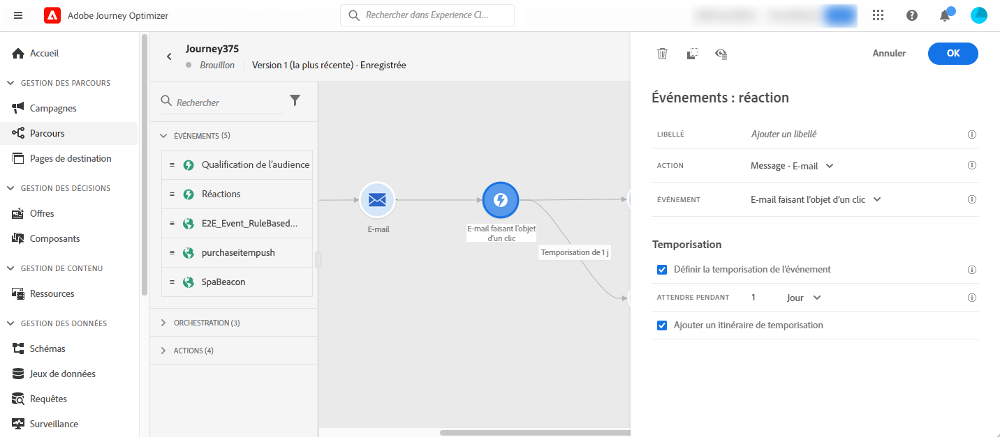

# Événements de réaction {#reaction-events}

>[!BEGINSHADEBOX]

**Sur cette page :** découvrez comment utiliser l’activité Réaction pour répondre aux données de suivi des messages telles que les ouvertures et les clics dans le même parcours, et comment configurer des chemins de temporisation pour les individus qui ne s’engagent pas.

>[!ENDSHADEBOX]

>[!CONTEXTUALHELP]
>id="ajo_journey_event_reaction"
>title="Événements de réaction"
>abstract="Cette activité vous permet de réagir aux données de suivi liées à un message envoyé au sein du même parcours. Elles sont collectées en temps réel au moment de leur partage avec [!DNL Adobe Experience Platform]."

## Vue d’ensemble {#overview}

Parmi les différentes activités d’événement disponibles dans la palette, vous trouverez l’événement **[!UICONTROL Réactions]** intégré. Cette activité vous permet de réagir aux données de suivi liées à un message envoyé au sein du même parcours. Elles sont collectées en temps réel au moment de leur partage avec [!DNL Adobe Experience Platform].

Vous pouvez réagir aux messages ouverts ou qui ont fait l’objet d’un clic. Par exemple, vous pouvez envoyer un autre message si un individu a ouvert l’e-mail précédent ou cliqué dessus, ou envoyer un autre message de relance si elle n’a pas interagi avec votre communication.

Voir [Activités d’action](../building-journeys/about-journey-activities.md#action-activities).

Vous pouvez également utiliser l’activité de **[!UICONTROL réaction]** pour effectuer une action en l’absence de réaction à vos messages. Pour ce faire, créez un deuxième chemin parallèlement à l’activité de **[!UICONTROL réaction]** et ajoutez une activité d’**[!UICONTROL attente]**. En l’absence de réaction au cours de la période définie dans l’activité d’**[!UICONTROL attente]**, ce deuxième chemin sera choisi. Vous pouvez opter, par exemple, pour l’envoi d’un message de relance.

## Configuration des événements de réaction {#configure}

Pour configurer les événements de réaction, procédez comme suit :

1. Placez une activité de **[!UICONTROL réaction]** **immédiatement** après une [activité d’action de canal](journey-action.md) sur la zone de travail du parcours.
1. Ajoutez un **[!UICONTROL libellé]** à la réaction. Cette étape est facultative.
1. Dans la liste déroulante, sélectionnez l’activité d’action à laquelle vous souhaitez réagir. Vous pouvez sélectionner toute activité d’action figurant dans les étapes précédentes du chemin.
1. Selon l’action que vous avez sélectionnée, choisissez ce à quoi vous souhaitez réagir.
1. Vous pouvez définir une temporisation de l’événement (entre 40 secondes et 90 jours), ainsi qu’un chemin de temporisation. Cette opération crée un deuxième chemin pour les personnes qui n’ont pas réagi pendant la durée définie. Lors du test d’un parcours qui a recours à un événement de réaction, la **[!UICONTROL Durée d’attente]** du mode test par défaut ainsi que sa valeur minimale sont de 40 secondes. Consultez [cette section](../building-journeys/testing-the-journey.md).

## Mécanismes de sécurisation et limitations {#guardrails-limitations}

* Une activité de **[!UICONTROL réaction]** doit être placée **immédiatement** après une [activité d’action de canal](journey-action.md) dans la zone de travail du parcours.
* Vous ne pouvez pas utiliser une activité de **[!UICONTROL réaction]** s’il n’y a aucune activité d’action de canal placée avant elle.
* Le placement d’une activité d’**[!UICONTROL attente]** ou de toute autre activité entre l’action de canal et l’activité de **[!UICONTROL réaction]** n’est pas pris en charge et peut entraîner un dysfonctionnement de la réaction.
* Les événements de réaction ne peuvent suivre que les messages envoyés dans le même parcours. Ils ne peuvent pas suivre les messages qui se produisent dans un autre parcours.
* Ils effectuent le suivi des clics sur les liens de type « suivi ». Les liens de désabonnement et de page miroir ne sont pas pris en compte.
* Le suivi des ouvertures d’e-mail est effectué à l’aide d’une image de 0 pixel incluse dans l’e-mail. Si les clients de messagerie (tels que Gmail) bloquent les images, les ouvertures d’e-mail ne sont pas prises en compte.

+++ Référence des connaissances sur l’IA

Cette section contient des connaissances structurées destinées à soutenir l’interprétation, la récupération et la réponse aux questions liées à ce sujet.

Pour une compréhension totale, ces informations doivent être combinées avec la documentation de cette page. Aucune des sources n’est conçue pour être autonome. La page décrit la fonctionnalité, tandis que cette section fournit un contexte supplémentaire qui permet de clarifier la terminologie, l’intention, l’applicabilité et les contraintes.

* **TL;DR:** Cette page explique comment utiliser l’activité d’événement de réaction intégrée dans Adobe Journey Optimizer pour créer des branches dans les chemins de parcours en fonction des données d’engagement des messages en temps réel telles que les ouvertures d’e-mail et les clics sur les liens.

**Intentions:**
* Ajoutez une activité d’événement de réaction pour répondre aux ouvertures de messages ou aux clics dans un parcours
* Configurer une durée de temporisation et un chemin d’accès de secours pour les profils qui n’engagent pas
* Créez un chemin parallèle avec une activité Attente pour gérer les non-répondeurs
* Sélectionner une activité d’action de canal en amont spécifique à écouter

**Glossaire:**
* **Événement de réaction** : activité d’événement de parcours intégrée qui écoute les données de suivi en temps réel (ouvertures, clics) d’un message envoyé plus tôt dans le même *de parcours (spécifique au produit)*
* **Chemin de temporisation** : branche de parcours secondaire que les profils suivent s’ils ne produisent pas la réaction attendue dans le délai de temporisation défini *(spécifique au produit)*

**Mécanismes de sécurisation :**
* L’activité Réaction doit être placée immédiatement après une activité d’action de canal ; aucune autre activité ne peut être placée entre elles.
* Une activité Réaction ne peut pas être utilisée si aucune activité d’action de canal ne la précède dans le chemin d’accès.
* Les événements de réaction ne peuvent suivre que les messages envoyés dans le même parcours. Le suivi entre parcours n’est pas pris en charge.
* Les liens de désinscription et de page miroir ne sont pas suivis par les événements de réaction.
* Les ouvertures d’e-mails reposent sur une image de suivi de 0 pixel ; si le client de messagerie bloque les images (par exemple, Gmail), les ouvertures ne sont pas enregistrées.
* La plage de temporisation de l’événement est comprise entre 40 secondes et 90 jours ; la valeur minimale en mode test est également de 40 secondes.

**Terminologie:**
* Nom canonique : Événements de réaction — Acronyme : aucun — variantes : activité de réaction, événement de suivi d’engagement
* Synonymes : « Événement de réaction » = « Événement d’engagement du message » = « Événement de suivi »
* Ne les confondez pas : « Événement de réaction » ≠ « Événement externe » (les événements de réaction sont intégrés et liés à des messages du même parcours ; les événements externes proviennent de l’extérieur du parcours)

**FAQ:**
* **Q : Un événement de réaction peut-il suivre un message envoyé dans un autre parcours ?** — Non ; les événements de réaction ne suivent que les messages envoyés dans le même parcours.
* **Q : Comment gérer les profils qui ne s’ouvrent pas ou ne cliquent pas sur un message ?** — Ajoutez un chemin parallèle à l’activité Réaction avec une activité Attente ; les profils qui ne réagissent pas pendant la durée d’attente suivront ce deuxième chemin.
* **Q : Les clics sur les liens de désabonnement sont-ils suivis par les événements de réaction ?** — Non ; seuls les types de liens suivis sont capturés. Les liens de désabonnement et de page miroir sont exclus.
* **Q : Que se passe-t-il si un client de messagerie bloque les images ?** — Les ouvertures d’e-mail suivies via l’image 0 pixel ne seront pas enregistrées pour les clients qui bloquent les images, comme Gmail.
* **Q : Quelle est la plage de temporisation valide pour un événement de réaction ?** — Entre 40 secondes et 90 jours.

+++
