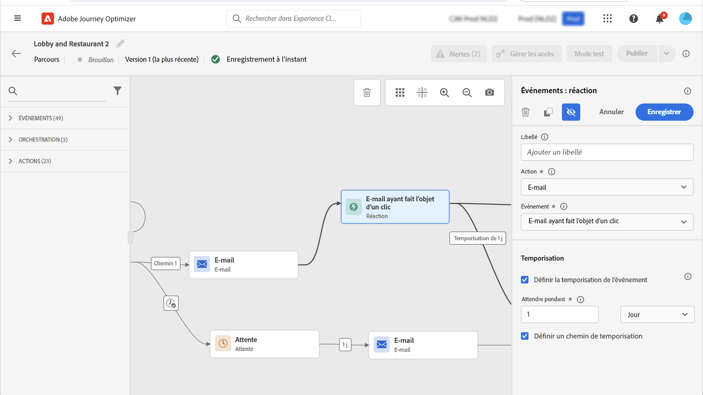

# Événements de réaction {#reaction-events}

>[!CONTEXTUALHELP]
>id="ajo_journey_event_reaction"
>title="Événements de réaction"
>abstract="Cette activité vous permet de réagir aux données de suivi liées à un message envoyé dans le même parcours. Nous capturons ces informations en temps réel au moment où elles sont partagées avec Adobe Experience Platform."

Parmi les différentes activités d’événement disponibles dans la palette, vous trouverez le **[!UICONTROL Reactions]** . Cette activité vous permet de réagir aux données de suivi liées à un message envoyé dans le même parcours. Nous capturons ces informations en temps réel au moment où elles sont partagées avec Adobe Experience Platform.

Vous pouvez réagir aux messages ouverts ou sur lesquels vous avez cliqué.

Vous pouvez également utiliser ce mécanisme pour effectuer une action lorsqu’il n’y a aucune réaction à vos messages. Pour ce faire, créez un deuxième chemin parallèlement à l’activité de réaction et ajoutez une activité d’attente. S’il n’y a aucune réaction pendant la période définie dans l’activité d’attente, le deuxième chemin est choisi. Vous pouvez choisir d’envoyer, par exemple, un message de relance.

Notez que vous ne pouvez utiliser une activité de réaction dans la zone de travail que si une activité d’action de canal est antérieure à (Email et push).

Voir [À propos des activités d’action](../building-journeys/about-journey-activities.md#action-activities).

Voici les différentes étapes de configuration des événements de réaction :

1. Ajouter un **[!UICONTROL Label]** à la réaction. Cette étape est facultative.
1. Dans la liste déroulante, sélectionnez l’activité d’action à laquelle vous souhaitez réagir. Vous pouvez sélectionner n’importe quelle activité d’action située aux étapes précédentes du chemin.
1. Selon l’action sélectionnée, choisissez ce à quoi vous souhaitez réagir.
1. Vous pouvez définir un délai d’expiration d’événement (entre 40 secondes et 30 jours) et un chemin d’expiration. Cela créera une deuxième voie pour les personnes qui n’ont pas réagi pendant la durée définie. Lors du test d’un parcours qui utilise un événement de réaction, le mode test **[!UICONTROL Wait time]** valeur par défaut et valeur minimale : 40 secondes. Voir [cette section](../building-journeys/testing-the-journey.md).

>[!NOTE]
>
>
>Les événements de réaction ne peuvent pas effectuer le suivi des messages qui se produisent dans un autre parcours.
>
>Les événements de réaction effectuent le suivi des clics sur les liens de type &quot;tracké&quot;. Les liens de désinscription et de page miroir ne sont pas pris en compte.

>[!IMPORTANT]
>
>Les clients de messagerie tels que Gmail autorisent le blocage des images. Le suivi des ouvertures d’email est effectué à l’aide d’une image de 0 pixel incluse dans l’email. Si les images sont bloquées, les ouvertures d&#39;email ne seront pas prises en compte.
