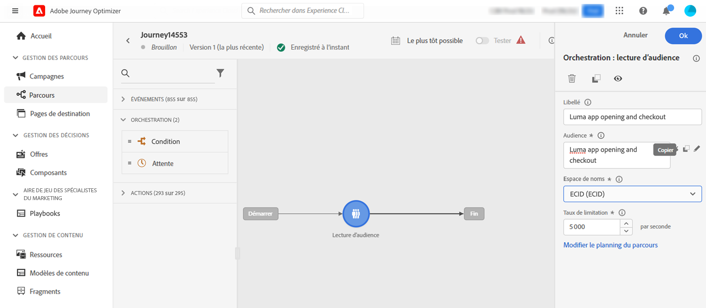
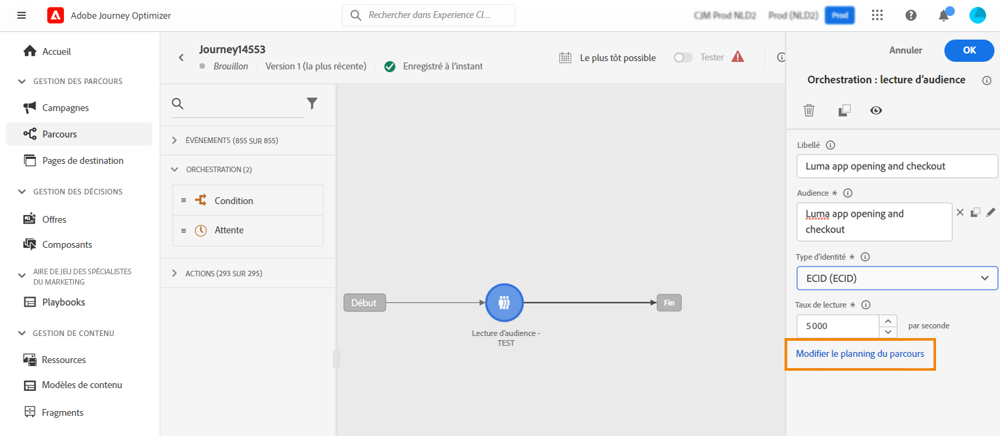
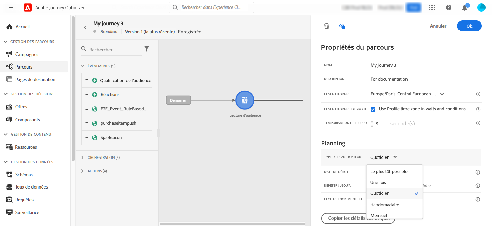
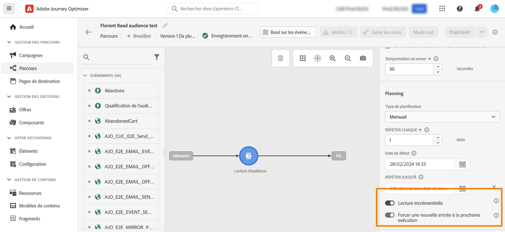
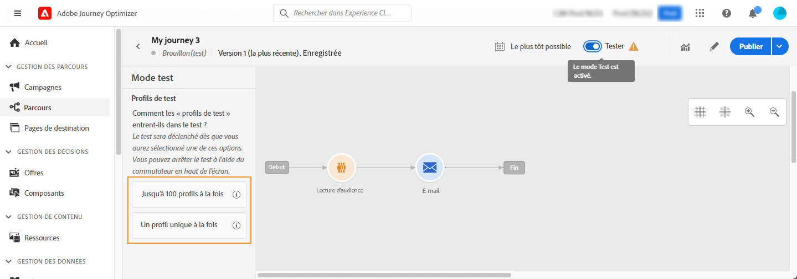
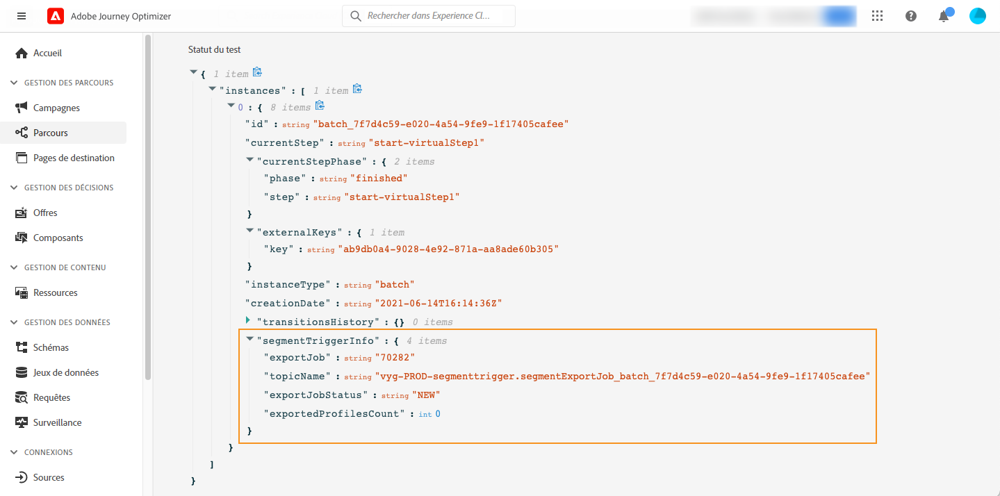
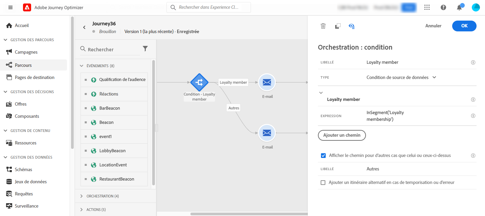
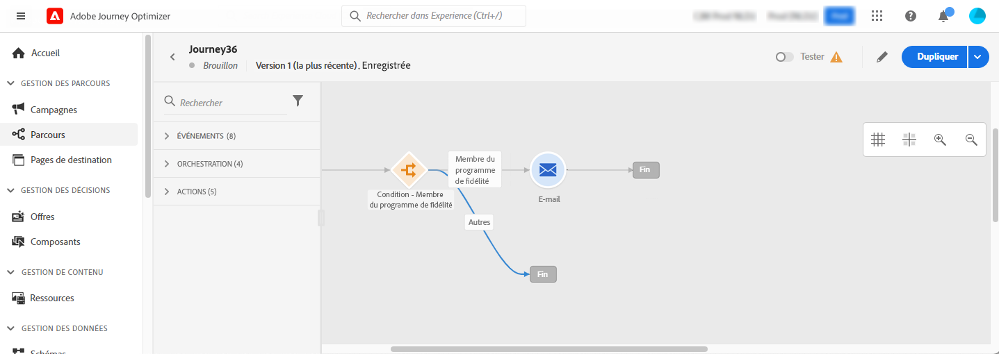
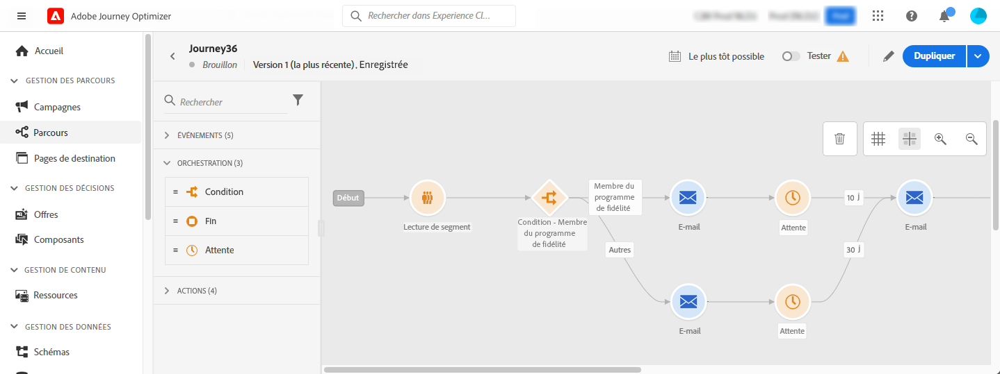

# Utilisation d’une audience dans un parcours {#segment-trigger-activity}

Utilisez l’activité Lecture d’audience pour démarrer des parcours avec des audiences définies.

## À propos de l’activité Lecture d’audience {#about-segment-trigger-actvitiy}

>[!CONTEXTUALHELP]
>id="ajo_journey_read_segment"
>title="Activité Lecture d’audience"
>abstract="L’activité Lecture d’audience vous permet de faire en sorte que toutes les personnes appartenant à une audience [!DNL Adobe Experience Platform] rejoignent un parcours. L’entrée dans un parcours peut être effectuée une fois, ou régulièrement."

Utilisez l’activité **Lecture d’audience** pour que toutes les personnes appartenant à une audience rejoignent le parcours. L’entrée dans un parcours peut être effectuée une fois, ou régulièrement.

Prenons l’exemple de l’audience « Ouverture et passage en caisse de l’application Luma » créée dans le cas d’utilisation de [Création d’audiences](../audience/about-audiences.md). Avec l’activité Lecture d’audience, vous pouvez faire en sorte que toutes les personnes appartenant à l’audience rejoignent un parcours. Elles évolueront dans des parcours individualisés qui utilisent toutes les fonctionnalités du parcours : conditions, minuteurs, événements, actions.

➡️ [Découvrez cette fonctionnalité en vidéo.](#video)

>[!NOTE]
>
>Lorsqu’une activité Lecture d’audience s’exécute, le système génère des événements internes (appelés événements `segmentExportJob`) pour suivre le cycle de vie de l’opération d’export d’audience. Ces événements sont enregistrés au niveau de l’activité, et non par profil, et peuvent être interrogés à des fins de surveillance et de dépannage. Découvrez comment [interroger des événements Lecture d’audience](../reports/query-examples.md#read-segment-queries).

>[!CAUTION]
>
>* Avant de commencer à utiliser l’activité Lecture d’audience, [lisez la section relative aux mécanismes de sécurisation et aux limitations](#must-read).

## Configurer l’activité {#configuring-segment-trigger-activity}

Les étapes de configuration de l’activité Lecture d’audience sont les suivantes :

### Ajoutez une activité Lecture d’audience et sélectionnez l’audience.

1. Développez la catégorie **[!UICONTROL Orchestration]** et déposez une activité **[!UICONTROL Lecture d’audience]** dans votre zone de travail.

   L’activité doit être la première étape d’un parcours.

1. Ajoutez un **[!UICONTROL libellé]** à l’activité (facultatif).

1. Dans le champ **[!UICONTROL Audience]**, sélectionnez l’audience [!DNL Adobe Experience Platform] qui va rejoindre le parcours, puis cliquez sur **[!UICONTROL Enregistrer]**. Vous pouvez sélectionner n’importe quelle audience [!DNL Adobe Experience Platform] générée à l’aide des [définitions de segment](../audience/creating-a-segment-definition.md).

   >[!NOTE]
   >
   >En outre, vous pouvez cibler des audiences [!DNL Adobe Experience Platform] créées à l’aide de [compositions d’audience](../audience/get-started-audience-orchestration.md).
   >Vous pouvez également cibler des audiences [téléchargées à partir d’un fichier CSV](https://experienceleague.adobe.com/docs/experience-platform/segmentation/ui/overview.html?lang=fr#import-audience){target="_blank"}.
   >[En savoir plus sur la manière de générer et de cibler des audiences dans Journey Optimizer](../audience/about-audiences.md).

   Notez que vous pouvez personnaliser les colonnes affichées dans la liste et les trier.

   ![Interface de sélection des audiences affichant les audiences [!DNL Adobe Experience Platform] disponibles](assets/read-segment-selection.png)

   Une fois l’audience ajoutée, le bouton **[!UICONTROL Copier]** permet de copier son nom et son ID :

   `{"name":"Luma app opening and checkout","id":"8597c5dc-70e3-4b05-8fb9-7e938f5c07a3"}`

   

   >[!NOTE]
   >
   >Seules les personnes ayant le statut de participation d’audience **Réalisé** rejoignent le parcours. Pour plus d’informations sur l’évaluation d’une audience, consultez la [documentation du service de segmentation](https://experienceleague.adobe.com/fr/docs/experience-platform/segmentation/tutorials/evaluate-a-segment.html?lang=fr#interpret-segment-results){target="_blank"}.

1. Dans le champ **[!UICONTROL Espace de noms]**, choisissez l’espace de noms à utiliser pour identifier les personnes. Par défaut, le champ est prérempli avec le dernier espace de noms utilisé. [En savoir plus sur les espace de noms](../event/about-creating.md#select-the-namespace).

   >[!NOTE]
   >
   >Les personnes appartenant à une audience qui n’a pas l’identité sélectionnée (espace de noms) parmi leurs différentes identités ne peuvent pas rejoindre le parcours. Vous pouvez uniquement sélectionner un espace de noms d’identité basé sur les personnes. Si vous avez défini un espace de noms pour une table de correspondance (par exemple : espace de noms ProductID pour une recherche de produit), il ne sera pas disponible dans la liste déroulante **Espace de noms**.

### Mécanismes de sécurisation et recommandations {#must-read}

* Vous ne pouvez utiliser qu’une seule activité **[!UICONTROL Lecture d’audience]** dans un parcours. Il doit s’agir de la première activité de la zone de travail.

* L’activité **[!UICONTROL Lecture d’audience]** ne peut cibler qu’une seule audience. Si vous souhaitez cibler plusieurs audiences, envisagez de les fusionner avant de les utiliser. [Découvrir comment combiner des audiences à l’aide de workflows de composition](../audience/get-started-audience-orchestration.md)

* Pour les parcours qui utilisent une activité **Lecture d’audience**, il y a un nombre maximal de parcours pouvant commencer exactement au même moment. Les reprises seront effectuées par le système. Toutefois, évitez d’avoir plus de cinq parcours (avec l’activité **Lecture d’audience** planifiée ou commençant « le plus tôt possible ») commençant exactement au même moment. La bonne pratique consiste à les espacer au fil du temps, par exemple avec une intervalle de 5 à 10 minutes.

* Les groupes de champs d’événement d’expérience ne peuvent pas être utilisés dans les parcours commençant par une activité **Lecture d’audience**, **[Qualification d’audience](audience-qualification-events.md)** ou événement métier.

* En guise de bonne pratique, il est recommandé d’utiliser uniquement des audiences par lots dans une activité **Lecture d’audience**. Cela permet un comptage fiable et cohérent des audiences utilisées dans un parcours. La lecture d’audience est conçue pour les cas d’utilisation par lots. Si votre cas d’utilisation nécessite des données en temps réel, utilisez l’activité **[Qualification de l’audience](audience-qualification-events.md)**.

* Les audiences [importées d’un fichier CSV](https://experienceleague.adobe.com/docs/experience-platform/segmentation/ui/overview.html?lang=fr#import-audience) ou résultant de [workflows de composition](../audience/get-started-audience-orchestration.md) peuvent être sélectionnées dans l’activité **Lecture d’audience**. Ces audiences ne sont pas disponibles dans l’activité **Qualification de l’audience**.

* Limite de lecture d’audience simultanée par organisation : chaque organisation peut exécuter jusqu’à cinq instances de lecture d’audience simultanées. Cela inclut les exécutions planifiées et celles déclenchées par des événements métier. Cette limite s’applique à tous les sandbox et parcours. Cette limite est appliquée afin d’assurer une répartition juste et équilibrée des ressources entre toutes les organisations.

* Gestion du débit des sandbox : le système gère dynamiquement le débit de traitement par sandbox avec une limite maximale de 20 000 profils par seconde partagés sur toutes les activités Lecture d’audience. Les activités individuelles Lecture d’audience peuvent être configurées avec un taux minimal de 500 profils par seconde. Si les limites de débit au niveau du sandbox sont atteintes, les traitements peuvent être mis en file d’attente pour garantir une attribution équitable des ressources.

* Délai d’expiration du traitement des tâches : les tâches de lecture d’audience qui ne peuvent pas être traitées dans les 12 heures en raison des limites du mécanisme de sécurisation seront automatiquement nettoyées et ne s’exécuteront jamais. Cela empêche l’accumulation des tâches et assure la stabilité du système.

* Lorsque vous utilisez des segments par lots, assurez-vous que l’ingestion et les mises à jour quotidiennes des instantanés se terminent bien avant le début du parcours. Prévoyez une période d’attente supplémentaire si les segments doivent refléter les données ingérées le même jour. Si l’actualisation immédiate des profils est essentielle, utilisez une approche basée sur les événements ou en flux continu au lieu d’une approche par lots quotidienne. Vous pouvez également insérer un mécanisme d’attente pour permettre aux données mises à jour de se propager avant l’évaluation du parcours.

Les mécanismes de sécurisation liés à l’activité **Lecture d’audience** sont répertoriées dans [cette page](../start/guardrails.md#read-segment-g).

>[!CAUTION]
>
>[Les mécanismes de sécurisation pour la segmentation et les données du profil client en temps réel](https://experienceleague.adobe.com/docs/experience-platform/profile/guardrails.html?lang=fr){target="_blank"} s’appliquent également à [!DNL Adobe Journey Optimizer].

### Gérer les entrées des profils dans le parcours

Définissez le **[!UICONTROL taux de lecture]**. Il s’agit du nombre maximum de profils pouvant entrer dans le parcours par seconde. Ce taux s’applique uniquement à cette activité et non aux autres activités du parcours. Si vous souhaitez définir un taux de limitation pour les actions personnalisées, par exemple, vous devez utiliser l’API de limitation. Voir cette [page](../configuration/throttling.md).

Cette valeur est stockée dans la payload de version du parcours. La valeur par défaut est de 5 000 profils par seconde. Vous pouvez modifier cette valeur de 500 à 20 000 profils par seconde.

>[!NOTE]
>
>Le taux de lecture global par sandbox est défini sur 20 000 profils par seconde. Par conséquent, le taux de lecture de toutes les lectures d’audiences qui s’exécutent simultanément dans la même sandbox s’élève à 20 000 profils par seconde au maximum. Vous ne pouvez pas modifier cette limite. Pour en savoir plus sur les débits et les taux de traitement des parcours, consultez [cette section](entry-management.md#journey-processing-rate).

### Planifier le parcours {#schedule}

>[!CONTEXTUALHELP]
>id="ajo_journey_read_segment_scheduler_start_date"
>title="Date et heure de début"
>abstract="Définissez la date et l’heure de déclenchement de ce parcours."

>[!CONTEXTUALHELP]
>id="ajo_journey_read_segment_scheduler_repeat_until"
>title="Répéter jusqu’à"
>abstract="Définissez la date de fin de la récurrence."

>[!CONTEXTUALHELP]
>id="ajo_journey_read_segment_scheduler_repeat_every"
>title="Répéter chaque"
>abstract="Définissez une fréquence de planificateur récurrent."

>[!CONTEXTUALHELP]
>id="ajo_journey_read_segment_scheduler_incremental_read"
>title="Lecture incrémentielle"
>abstract="Seuls les nouveaux profils depuis la dernière lecture peuvent rejoindre un parcours."

>[!CONTEXTUALHELP]
>id="ajo_journey_read_segment_scheduler_force_reentrance"
>title="Forcer une rentrée"
>abstract="Retirez tous les participants du parcours avant chaque lecture d’audience."

>[!CONTEXTUALHELP]
>id="ajo_journey_read_segment_scheduler_synchronize_audience"
>title="Déclencher après l’évaluation de l’audience par lots"
>abstract="Activez cette option pour déclencher l’exécution du parcours après une nouvelle évaluation de l’audience par lots."

>[!CONTEXTUALHELP]
>id="ajo_journey_read_segment_scheduler_synchronize_audience_wait_time"
>title="Temps d’attente pour une nouvelle évaluation d’audience"
>abstract="Indiquez la durée pendant laquelle le parcours attendra que l’audience par lots soit réévaluée. La période d’attente est limitée à des valeurs entières, peut être spécifiée en minutes ou en heures et doit être comprise entre 1 et 6 heures."

Par défaut, les parcours sont configurés pour une seule exécution. Pour définir une date/heure et une fréquence spécifiques d’exécution du parcours, procédez comme suit.

>[!NOTE]
>
>Les parcours de lecture d’audience en une seule fois passent au statut **Terminé**, 91 jours ([temporisation de parcours globale](journey-properties.md#global_timeout)) après l’exécution du parcours. Pour les parcours Lecture d’audience planifiés, cela se passe 91 jours après l’exécution de la dernière occurrence.

1. Dans les propriétés de l’activité **[!UICONTROL Lecture d’audience]**, sélectionnez **[!UICONTROL Modifier le planning du parcours]**.

   

1. Les propriétés du parcours s’affichent. Dans la liste déroulante **[!UICONTROL Type de planificateur]**, sélectionnez la fréquence d’exécution du parcours.

   

Pour les parcours récurrents, des options spécifiques sont disponibles pour vous permettre de gérer l’entrée des profils dans le parcours. Développez les sections ci-dessous pour plus d’informations sur chaque option.

+++**[!UICONTROL Lecture incrémentielle]**

Lorsqu’un parcours avec une activité **Lecture d’audience** récurrente s’exécute pour la première fois, tous les profils de l’audience rejoignent le parcours. Cette option vous permet de cibler, après la première occurrence, seulement les personnes qui sont entrées dans l’audience depuis la dernière exécution du parcours.

En sélectionnant cette option, le système revient **24 heures** en arrière à partir du dernier traitement d’évaluation d’audience effectué par le service de segmentation d’[!DNL Adobe Experience Platform].

Une fois la segmentation terminée, un traitement d’export d’instantané de profil commence, ce qui permet à Journey Optimizer de détecter et de traiter les nouveaux profils. Si le parcours est planifié entre ces deux tâches, la lecture incrémentielle ne récupère pas les profils qui sont devenus membres de l’audience depuis la dernière exécution du parcours.

Pour minimiser le risque de profils manquants :
* Activez l’option **[!UICONTROL Déclencheur après l’évaluation de l’audience par lots]** pour étendre la période d’analyse à l’heure de la dernière exécution réussie du parcours, quelle que soit la date à laquelle elle s’est produite
* Planifiez le bon fonctionnement des parcours une fois les traitements de segmentation par lots quotidiens terminés (généralement 2 à 3 heures de buffer).
* Pour les cas d’utilisation critiques nécessitant une inclusion immédiate de profil, pensez à utiliser des activités [Qualification d’audience](audience-qualification-events.md) avec des audiences en streaming.

>[!CAUTION]
>
>Si vous ciblez une [&#x200B; audience de chargement personnalisée &#x200B;](../audience/about-audiences.md#about-segments) dans votre parcours, les profils ne sont récupérés que lors de la première périodicité lorsque cette option est activée dans un parcours récurrent. Ces audiences sont corrigées.

+++

+++**[!UICONTROL Forcer une rentrée sur une périodicité]**

Cette option permet de faire en sorte que tous les profils toujours présents dans le parcours le quittent automatiquement lors de la prochaine exécution.

Par exemple, si vous avez une attente de 2 jours dans un parcours récurrent quotidien, l’activation de cette option déplace les profils vers l’exécution de parcours suivante. Cela se produit le lendemain, qu’ils se trouvent ou non dans l’audience d’exécution suivante.

Si la durée de vie de vos profils dans ce parcours peut être supérieure à la fréquence de périodicité, n’activez pas cette option pour vous assurer que les profils puissent terminer leur parcours.

+++

+++**[!UICONTROL Déclencher après l’évaluation de l’audience par lots]**

Pour les parcours planifiés quotidiennement et le ciblage des audiences par lots, vous pouvez définir une fenêtre temporelle allant jusqu’à 6 heures pour que le parcours attende les nouvelles données d’audience des tâches de segmentation par lots. Si la tâche de segmentation se termine dans la fenêtre temporelle, le parcours se déclenche. Sinon, le parcours est ignoré jusqu’à sa prochaine occurrence. Cette option garantit que les parcours s’exécutent avec des données d’audience précises et à jour.

Par exemple, si un parcours est planifié à 18 h tous les jours, vous pouvez spécifier un nombre de minutes ou d’heures d’attente avant son exécution. Lorsque le parcours se réactive à 18 heures, il recherche une nouvelle audience, c’est-à-dire une audience plus récente que celle utilisée dans l’exécution précédente du parcours. Pendant la fenêtre temporelle spécifiée, le parcours s’exécute immédiatement lors de la détection de la nouvelle audience. Si aucune nouvelle audience n’est détectée, l’exécution du parcours est ignorée pour la journée.

+++

<!--

### Segment filters {#segment-filters}

[!CONTEXTUALHELP]
>id="jo_segment_filters"
>title="About segment filters"
>abstract="You can choose to target only the individuals who entered or exited a specific segment during a specific time window. For example, you can decide to only retrieve all the customers who entered the VIP segment since last week."

You can choose to target only the individuals who entered or exited a specific segment during a specific time window. For example, you can decide to only retrieve all the customers who entered the VIP segment since last week. Only the new VIP customers will be targeted. All the customers who were already part of the VIP segment before will be excluded.

To activate this mode, click the **Segment Filters** toggle. Two fields are displayed:

**Segment membership**: choose whether you want to listen to segment entrances or exits. 

**Lookback window**: define when you want to start to listen to entrances or exits. This lookback window is expressed in hours, starting from the moment the journey is triggered.  If you set this duration to 0, the journey will target all members of the segment. For recurring journeys, it will take into account all entrances/exits since the last time the journey was triggered.

-->

## Tester et publier le parcours {#testing-publishing}

L’activité **[!UICONTROL Lecture d’audience]** vous permet de tester le parcours sur un profil unitaire.

Pour cela, activez le mode test.

Configurez et exécutez le mode test comme vous le faites habituellement. [Découvrez comment tester un parcours](testing-the-journey.md).

Une fois le test en cours d’exécution, le bouton **[!UICONTROL Afficher les logs]** vous permet d’afficher les résultats du test. Voir à ce propos [cette section](testing-the-journey.md#viewing_logs).

Une fois les tests réussis, vous pouvez publier votre parcours (voir [Publication du parcours](../building-journeys/publish-journey.md)). Les personnes appartenant à l’audience rejoindront le parcours à la date et à l’heure spécifiées dans la section **[!UICONTROL Planificateur]** des propriétés du parcours.

>[!NOTE]
>
>Pour les parcours récurrents basés sur des audiences, le parcours se ferme automatiquement une fois sa dernière occurrence exécutée. Si aucune date/heure de fin n’a été spécifiée, vous devrez fermer manuellement le parcours à de nouvelles entrées pour le terminer.

## Ciblage des audiences dans les parcours basés sur des audiences

Les parcours basés sur des audiences débutent toujours par une activité **Lecture d’audience** pour récupérer les personnes appartenant à une audience [!DNL Adobe Experience Platform].

L’audience appartenant à l’audience est récupérée une fois ou régulièrement.

Après l’entrée dans le parcours, vous pouvez créer des cas d’utilisation d’orchestration des audiences, ce qui permet aux personnes du flux d’audience initiale de progresser dans différentes branches du parcours.

**Segmentation**

Vous pouvez utiliser des conditions pour effectuer la segmentation à l’aide de l’activité **Condition**. Vous pouvez, par exemple, faire en sorte que les personnes VIP empruntent un chemin particulier et que les personnes non VIP suivent un autre chemin.

La segmentation peut être basée sur :

* des données de source de données
* le contexte des événements faisant partie des données du parcours, par exemple : est-ce qu’une personne a cliqué sur le message reçu il y a une heure ?
* une date, par exemple : sommes-nous en juin lorsque la personne évolue dans le parcours ?
* une heure, par exemple : est-ce le matin dans le fuseau horaire de la personne ?
* un algorithme partageant l’audience circulant dans le parcours en fonction d’un pourcentage, par exemple : 90 à 10 % pour exclure une population témoin

>[!NOTE]
>
>Lors de l’utilisation du type de planificateur « Quotidien » avec une activité **[!UICONTROL Lecture d’audience]**, vous pouvez définir une fenêtre temporelle pour que le parcours attende les nouvelles données d’audience. Cela permet de garantir un ciblage précis et d’éviter les problèmes causés par des retards dans les tâches de segmentation par lots. [Découvrir comment planifier un parcours](#schedule)

**Exclusion**

La même activité **Condition** utilisée pour la segmentation (voir ci-dessus) vous permet également d’exclure une partie de la population. Par exemple, vous pouvez exclure les personnes VIP en les faisant glisser dans une branche avec une étape de fin juste après.

Cette exclusion peut se produire juste après la récupération des audiences, à des fins de comptage de population ou sur un parcours à plusieurs étapes.

**Union**

Les parcours vous permettent de créer des branches N et de les associer après une segmentation. Par conséquent, vous pouvez faire en sorte que deux audiences reviennent à une expérience commune.

Par exemple, après avoir suivi une expérience différente pendant dix jours dans un parcours, les clients et clientes VIP et non VIP peuvent revenir sur le même chemin. Après une union, vous pouvez partager à nouveau l’audience en exécutant une segmentation ou une exclusion.

## Résolution des problèmes liés aux incohérences de tailles d’audiences {#audience-count-mismatch}

Si vous constatez des incohérences entre les estimations de tailles d’audiences, les profils qualifiés et les profils réels qui rejoignent votre parcours, tenez compte des points suivants :

### Calendrier et propagation des données

* **Fin du traitement de segmentation par lots** : pour les audiences par lots, assurez-vous que le traitement de segmentation par lots quotidien est terminé et que les instantanés sont mis à jour avant l’exécution du parcours. Les audiences par lots sont prêtes à l’emploi environ **2 heures** après la fin du traitement de segmentation. En savoir plus sur les [méthodes d’évaluation d’audience](https://experienceleague.adobe.com/docs/experience-platform/segmentation/home.html?lang=fr#evaluate-segments){target="_blank"}.

* **Calendrier d’ingestion des données** : vérifiez que l’ingestion des données de profil est terminée avant l’exécution du parcours. Si des profils ont été ingérés peu de temps avant le début du parcours, ils ne sont peut-être pas encore pris en compte dans l’audience. En savoir plus sur l’ingestion de données [&#x200B; dans  [!DNL Adobe Experience Platform]](https://experienceleague.adobe.com/docs/experience-platform/ingestion/home.html?lang=fr){target="_blank"}.

* **Utiliser l’option « Déclencher après l’évaluation de l’audience par lots »** : pour les parcours planifiés quotidiens utilisant des audiences par lots, envisagez d’activer l’option **[!UICONTROL Déclencher après l’évaluation de l’audience par lots]**. Cela permet de s’assurer que le parcours attend les nouvelles données d’audience (jusqu’à 6 heures) avant de s’exécuter. [En savoir plus sur la planification](#schedule)

* **Ajouter une activité Attente** : pour les audiences en streaming avec des données récemment ingérées, pensez à ajouter une activité **Attente** au début du parcours pour laisser le temps nécessaire à la propagation des données et à la qualification des profils. [En savoir plus sur l’activité Attente](wait-activity.md)

### Validation et surveillance des données

* **Vérification de l’état de la tâche de segmentation** : surveillez les temps d’achèvement de la tâche de segmentation par lots dans le [!DNL Adobe Experience Platform] [tableau de bord de surveillance](https://experienceleague.adobe.com/docs/experience-platform/dataflows/ui/monitor-segments.html?lang=fr){target="_blank"}. Utilisez-le pour vérifier quand les données d’audience sont prêtes.

* **Vérifier les politiques de fusion** : assurez-vous que la politique de fusion configurée pour votre audience correspond au comportement attendu pour combiner des données de profil provenant de différentes sources. En savoir plus sur les [&#x200B; politiques de fusion dans  [!DNL Adobe Experience Platform]](https://experienceleague.adobe.com/docs/experience-platform/profile/merge-policies/overview.html?lang=fr){target="_blank"}.

* **Vérifier les définitions de segment** : vérifiez que les définitions de segment sont correctement configurées et incluez tous les critères de qualification attendus. En savoir plus sur la [création d’audiences](../audience/creating-a-segment-definition.md). Accordez une attention particulière aux éléments suivants :
   * Conditions de temps pouvant exclure des profils en fonction des dates et heures des événements.
   * Qualifications des attributs qui dépendent des données récemment mises à jour.
   * Méthodes d’évaluation par lots ou en streaming.

* **Valider la configuration des espaces de noms** : assurez-vous que l’espace de noms sélectionné dans l’activité **Lecture d’audience** correspond à l’identité principale utilisée par les profils de votre audience. Les profils sans l’espace de noms sélectionné ne rejoindront pas le parcours. En savoir plus sur les [espaces de noms d’identité](../event/about-creating.md#select-the-namespace).

### Bonnes pratiques pour éviter les incohérences

* **Planifier les parcours après la segmentation** : pour les audiences par lots, planifiez l’exécution des parcours au moins 2 à 3 heures après l’heure habituelle d’achèvement du traitement de segmentation par lots. [En savoir plus sur la planification des parcours](#schedule)

* **Utiliser les audiences en streaming pour les cas d’utilisation en temps réel** : si vous avez besoin d’une qualification de profil et d’une entrée de parcours immédiates, utilisez les activités [Qualification d’audience](audience-qualification-events.md) avec les audiences en streaming plutôt que **Lecture d’audience** avec les audiences par lots.

* **Effectuer d’abord un test avec des audiences plus petites** : avant de lancer des parcours à grande échelle, effectuez un test avec un sous-ensemble plus petit pour vérifier que les nombres correspondent aux attentes. [Découvrir comment tester un parcours](testing-the-journey.md)

* **Surveiller régulièrement** : configurez une surveillance régulière des tailles d’audience et des mesures d’entrée dans les parcours pour détecter rapidement les incohérences. Découvrez les [taux de traitement des parcours et la gestion des entrées](entry-management.md).

Si des incohérences de nombre persistent après avoir suivi ces étapes, contactez l’assistance Adobe pour obtenir des détails sur votre audience, la configuration des parcours et les incohérences observées.

## Reprises {#read-audience-retry}

Les reprises sont appliquées par défaut sur les parcours déclenchés par l’audience (commençant par une **lecture d’audience** ou un **événement métier**) lors de la récupération du traitement d’export. Si une erreur se produit lors de la création du traitement d’export, des reprises sont effectuées toutes les 10 minutes, pendant 1 heure au maximum. Après cela, nous considérerons cela comme un échec. Ces types de parcours peuvent donc être exécutés jusqu’à 1 heure après l’heure planifiée.

Échec **Lecture d’audience** les déclencheurs sont capturés et affichés dans **Alertes**. L’alerte **Lecture d’audience** vous avertit si une activité **Lecture d’audience** n’a traité aucun profil 10 minutes après l’heure d’exécution planifiée. Cet échec peut être dû à des problèmes techniques ou à une audience vide. Si l’échec est dû à des problèmes techniques, des reprises peuvent toujours se produire en fonction du type de problème. Par exemple, si la création de tâche d’exportation échoue, nous réessayons toutes les 10 minutes pendant une heure au maximum. [En savoir plus](../reports/alerts.md#alert-read-audiences)

## Rubriques connexes

* [Créer des audiences](../audience/about-audiences.md)
* [Activité Qualification d’audience](audience-qualification-events.md)
* [Propriétés du parcours et mécanismes de sécurisation](../start/guardrails.md#read-segment-g)
* [Test d’un parcours](testing-the-journey.md)
* [Publication d’un parcours](../building-journeys/publish-journey.md)

## Vidéo pratique {#video}

Comprenez les cas d’utilisation applicables pour un parcours déclenché par l’activité de lecture d’audience. Découvrez comment créer des parcours basés sur des lots et les bonnes pratiques à appliquer.

>[!VIDEO](https://video.tv.adobe.com/v/3430370?captions=fre_fr&quality=12)
