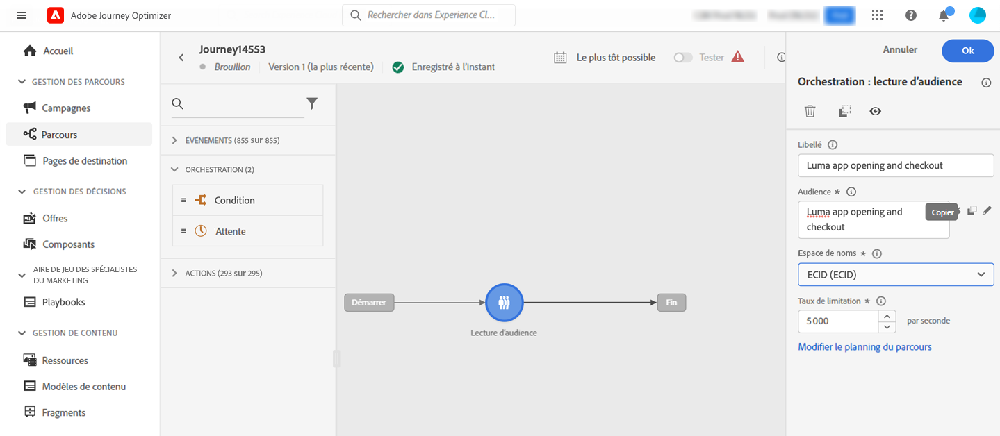
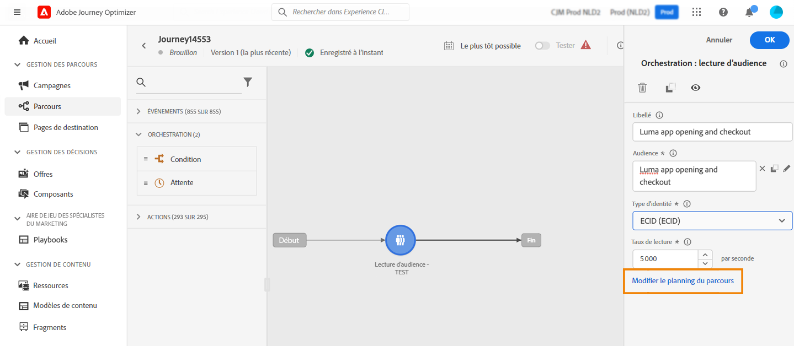
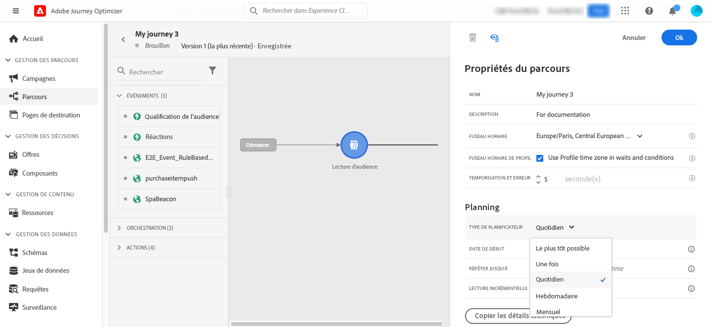
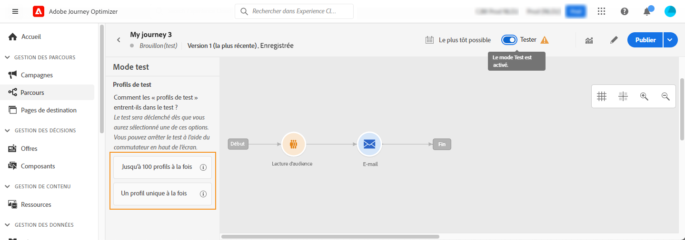
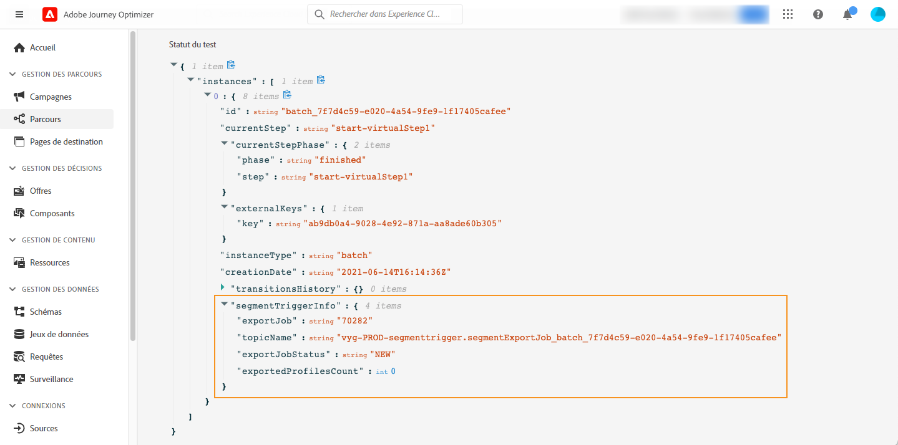
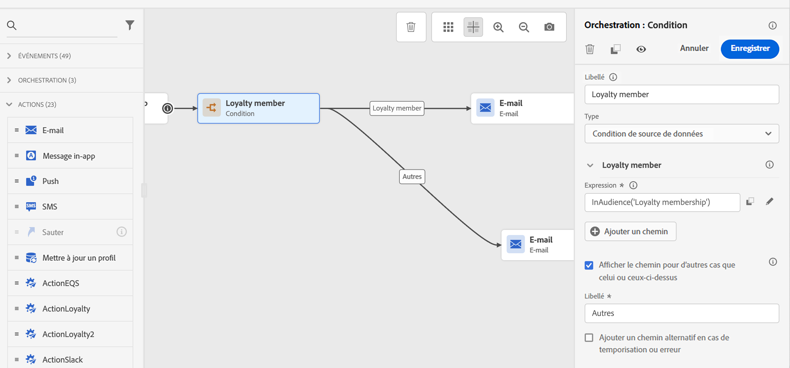
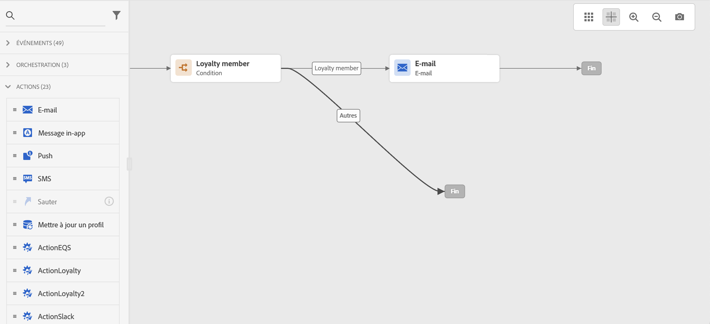
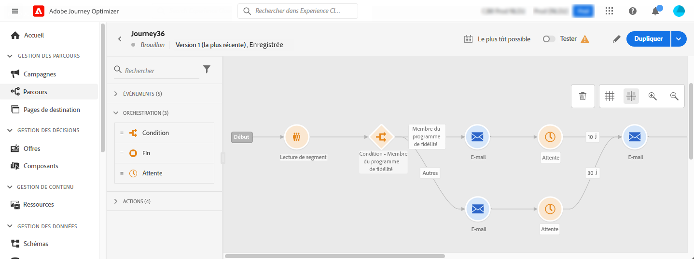

# Utiliser une audience dans un parcours {#segment-trigger-activity}

Utilisez l’activité Lecture d’audience pour démarrer des parcours avec des audiences définies. Vous choisissez l’audience et le moment de son exécution, puis vous utilisez des [conditions](#audience-targeting-in-journeys), des minuteurs et des actions pour personnaliser le chemin d’accès de chaque profil.

## À propos de l’activité Lecture d’audience {#about-segment-trigger-activity}

>[!CONTEXTUALHELP]
>id="ajo_journey_read_segment"
>title="Activité Lecture d’audience"
>abstract="Ajoutez à ce parcours tous les profils qualifiés d’une audience [!DNL Adobe Experience Platform] sélectionnée. Exécuter une fois ou selon un planning."

L’activité **Lecture d’audience** est l’activité de point d’entrée du parcours qui ajoute tous les profils d’une audience [!DNL Adobe Experience Platform] sélectionnée à un parcours. Vous pouvez exécuter l’entrée une fois ou selon une planification récurrente. Dans les API et les références techniques, cette activité est également appelée entrée de parcours déclenchée par un segment ou basée sur une audience.

**Quand utiliser Lecture d’audience ou Qualification d’audience**

| Utilisez **Lecture d’audience** lorsque | Utilisez **[qualification d’audience](audience-qualification-events.md)** lorsque |
|----------------------------|-----------------------------------------------------------------------|
| Vous souhaitez exécuter un parcours une fois ou selon un planning (lot). | Vous avez besoin que les profils rejoignent le parcours en temps réel lorsqu’ils remplissent les critères. |
| Votre audience est évaluée par lots (par exemple, instantané quotidien). | Votre audience est en flux continu ou basée sur un événement. |
| Un délai entre l’évaluation de l’audience et l’entrée sur le parcours ne vous pose pas de problème. | Vous avez besoin d’une entrée immédiate lorsqu’un profil se qualifie. |

>[!TIP]
>
>**Exemples réels**
>* **Newsletter hebdomadaire** → Lecture d’audience. Votre audience est un instantané de lot quotidien. Tu programmes le parcours tous les lundis à 9 h. Tous les profils qualifiés entrent ensemble.
>* **Mise à niveau du niveau de fidélité** → Qualification de l’audience. Dès qu’un profil atteint le statut Gold dans une audience en flux continu, il accède immédiatement au parcours pour recevoir un e-mail de félicitations.
>* **Série de réengagement** → Lecture d’audience. Vous exécutez un parcours récurrent tous les 30 jours ciblant les profils inactifs depuis plus de 90 jours.

**Limites clés :** une lecture d’audience par parcours (doit être la première activité) ; une audience par activité ; jusqu’à cinq exécutions de lecture d’audience simultanées par organisation ; 20 000 profils par seconde par sandbox ; délai d’expiration de la tâche de 12 heures. Informations complètes dans [Mécanismes de sécurisation et limitations](../start/guardrails.md#read-segment-g).

**Conditions préalables** une audience [!DNL Adobe Experience Platform] créée et évaluée (statut Réalisé), un espace de noms d’identité basé sur les personnes sélectionné pour le parcours et, pour les exécutions récurrentes, une compréhension des [planification et limites de débit](../start/guardrails.md#read-segment-g).

Par exemple, l’audience `Luma app opening and checkout` créée dans le cas d’utilisation [Créer des audiences](../audience/about-audiences.md) peut être utilisée comme point d’entrée. Tous les profils qualifiés entrent dans le parcours et progressent par le biais de chemins personnalisés à l’aide de conditions, de minuteurs, d’événements et d’actions.

➡️ [Découvrez cette fonctionnalité en vidéo](#video)

>[!CAUTION]
>
>* Avant d’utiliser l’activité Lecture d’audience , [lisez la section Mécanismes de sécurisation et limites](#must-read).

## Configuration de l’activité {#configuring-segment-trigger-activity}

Vous définissez les éléments suivants : **Audience** (obligatoire), **Espace de noms** (obligatoire), **Taux de lecture** (obligatoire, 5 000/s par défaut) et **Planification** (lors de l’exécution du parcours). Vous pouvez éventuellement ajouter un **Libellé** et **Identifiant supplémentaire**. Les étapes ci-dessous vous guident à travers chaque paramètre.

### Ajouter une activité et sélectionner une audience {#add-activity-and-select-audience}

>[!CONTEXTUALHELP]
>id="ajo_journey_read_segment_label"
>title="Libellé"
>abstract="Libellé facultatif permettant d’identifier cette activité dans les journaux du mode reporting et test."

>[!CONTEXTUALHELP]
>id="ajo_journey_read_segment_audience"
>title="Audience"
>abstract="Sélectionnez l’audience [!DNL Adobe Experience Platform] dont les profils entreront dans ce parcours."

>[!CONTEXTUALHELP]
>id="ajo_journey_read_segment_namespace"
>title="Espace de noms"
>abstract="Choisissez l’identité (e-mail, ECID, etc.) utilisée pour identifier les personnes qui accèdent au parcours. Par défaut, le champ est prérempli avec le dernier espace de noms utilisé."

1. Développez la catégorie **[!UICONTROL Orchestration]** et déposez une activité **[!UICONTROL Lecture d’audience]** dans la zone de travail.

   L’activité doit être considérée comme la première étape d’un parcours.

1. Ajoutez un **[!UICONTROL libellé]** à l’activité (facultatif). Un libellé facultatif vous permet d’identifier l’activité dans les rapports et dans les journaux du mode test.

1. Dans le champ **[!UICONTROL Audience]**, choisissez l&#39;audience [!DNL Adobe Experience Platform] qui va entrer dans le parcours, puis cliquez sur **[!UICONTROL Enregistrer]**. Vous pouvez sélectionner n’importe quelle audience [!DNL Adobe Experience Platform] générée à l’aide des [définitions de segment](../audience/creating-a-segment-definition.md).

   >[!NOTE]
   >
   >En outre, vous pouvez cibler des audiences [!DNL Adobe Experience Platform] créées à l’aide de [compositions d’audience](../audience/get-started-audience-orchestration.md).
   >Vous pouvez également cibler des audiences [téléchargées à partir d’un fichier CSV](https://experienceleague.adobe.com/docs/experience-platform/segmentation/ui/overview.html?lang=fr#import-audience){target="_blank"}.
   >[En savoir plus sur comment générer et cibler des audiences dans Journey Optimizer](../audience/about-audiences.md).

   Notez que vous pouvez personnaliser les colonnes affichées dans la liste et les trier.

   ![Interface de sélection des audiences affichant les audiences [!DNL Adobe Experience Platform] disponibles](assets/read-segment-selection.png)

   Une fois l’audience ajoutée, le bouton **[!UICONTROL Copier]** permet de copier son nom et son identifiant :

   `{"name":"Luma app opening and checkout","id":"8597c5dc-70e3-4b05-8fb9-7e938f5c07a3"}`

   

   >[!NOTE]
   >
   >Seuls les individus présentant le statut de participation **Réalisé** à l’audience accéderont au parcours. Pour plus d&#39;informations sur l&#39;évaluation d&#39;une audience, consultez la [documentation de Segmentation Service](https://experienceleague.adobe.com/docs/experience-platform/segmentation/tutorials/evaluate-a-segment.html?lang=fr#interpret-segment-results){target="_blank"}.

1. Dans le champ **[!UICONTROL Espace de noms]**, choisissez l’espace de noms à utiliser pour identifier les personnes. Par défaut, le champ est prérempli avec le dernier espace de noms utilisé. [En savoir plus sur les espaces de noms](../event/about-creating.md#select-the-namespace).

   >[!NOTE]
   >
   >Les individus appartenant à une audience qui n’a pas l’identité sélectionnée (espace de noms) parmi leurs différentes identités ne peuvent pas entrer dans le parcours. Vous pouvez uniquement sélectionner un espace de noms d’identité basé sur les personnes. Si vous avez défini un espace de noms pour une table de choix (par exemple : espace de noms ProductID pour une recherche de produit), il ne sera pas disponible dans la liste déroulante **Espace de noms**.

### Identifiant supplémentaire {#read-audience-supplemental-id}

Vous pouvez éventuellement activer l’option **Utiliser un identifiant supplémentaire** pour exécuter le parcours dans le cadre d’un identifiant secondaire (par exemple, un identifiant de commande ou d’enregistrement) en plus de l’identifiant de profil. Cela permet plusieurs entrées du même profil lorsque l’identifiant supplémentaire diffère.

[Découvrez comment utiliser des identifiants supplémentaires dans parcours](supplemental-identifier.md). Pour les parcours Lecture d’audience , l’identifiant supplémentaire doit être un attribut de profil ; le taux de lecture est limité à 500 profils par seconde lorsque l’identifiant supplémentaire est utilisé.

### Mécanismes de sécurisation et recommandations {#must-read}

Tous les mécanismes de sécurisation et les limitations de l’activité **Lecture d’audience** (simultanéité, débit, une audience par activité, délai d’expiration de la tâche, reprises, etc.) sont répertoriés dans la section [Mécanismes de sécurisation et limitations](../start/guardrails.md#read-segment-g).

**Recommandations**

* Il est recommandé d’utiliser les audiences par lot dans une activité **Lecture d’audience** pour obtenir des décomptes fiables et cohérents. L’audience de lecture est conçue pour les cas d’utilisation par lots. Si votre cas d’utilisation nécessite des données en temps réel, utilisez plutôt l’activité [Qualification d’audience](audience-qualification-events.md).
* Les audiences [importées depuis un fichier CSV](https://experienceleague.adobe.com/docs/experience-platform/segmentation/ui/overview.html?lang=fr#import-audience) ou issues des [workflows de composition](../audience/get-started-audience-orchestration.md) peuvent être sélectionnées dans l’activité **Lecture d’audience**. Ces audiences ne sont pas disponibles dans l’activité **Qualification d’audience**.
* Pour plus d’informations sur la synchronisation des instantanés d’audience, les fenêtres de fin de la segmentation par lots et la manière de s’assurer que votre parcours s’exécute toujours sur les données les plus récentes, consultez [Synchronisation et propagation des données](#timing-and-data-propagation). Pour les parcours récurrents, envisagez d’activer l’option **[!UICONTROL Déclencheur après l’évaluation de l’audience par lots]** pour retarder automatiquement l’exécution jusqu’à ce que le dernier instantané de l’audience soit prêt. [En savoir plus](#schedule).

>[!CAUTION]
>
>[Les mécanismes de sécurisation pour les données et la segmentation du profil client en temps réel](https://experienceleague.adobe.com/docs/experience-platform/profile/guardrails.html?lang=fr){target="_blank"} s’appliquent également aux [!DNL Adobe Journey Optimizer].

**Suivant :** définissez le [taux de lecture](#profile-entry-and-reading-rate) et [planning](#schedule), puis [tester et publier](#testing-publishing).

### Taux d’entrée et de lecture de profil {#profile-entry-and-reading-rate}

>[!CONTEXTUALHELP]
>id="ajo_journey_read_segment_reading_rate"
>title="Taux de lecture"
>abstract="Nombre maximal de profils entrant dans le parcours par seconde (500 à 20 000). La valeur par défaut est de 5 000."

Définissez le paramètre **[!UICONTROL Taux de lecture]** (obligatoire). Il s’agit du nombre maximal de profils qui peuvent entrer dans le parcours par seconde. Ce taux s&#39;applique uniquement à cette activité et à aucune autre du parcours. Si vous souhaitez définir un taux de limitation pour les actions personnalisées, par exemple, vous devez utiliser l’API de limitation. Voir cette [page](../configuration/throttling.md).

Cette valeur est stockée dans la payload de version du parcours. La valeur par défaut est de 5 000 profils par seconde. Vous pouvez modifier cette valeur de 500 à 20 000 profils par seconde.

>[!NOTE]
>
>Le taux de lecture global par sandbox est défini sur 20 000 profils par seconde. Par conséquent, le taux de lecture de toutes les audiences lues qui s’exécutent simultanément dans le même sandbox s’élève à 20 000 profils par seconde au maximum. Vous ne pouvez pas modifier cette limite. Pour en savoir plus sur les taux de traitement et le débit des parcours, consultez [cette section](entry-management.md#journey-processing-rate).

### Planifier le parcours {#schedule}

>[!CONTEXTUALHELP]
>id="ajo_journey_read_segment_scheduler_start_date"
>title="Date/heure de début"
>abstract="Définissez quand démarrer ce parcours."

>[!CONTEXTUALHELP]
>id="ajo_journey_read_segment_scheduler_repeat_until"
>title="Répéter jusqu’à"
>abstract="Définissez la date de fin des exécutions récurrentes."

>[!CONTEXTUALHELP]
>id="ajo_journey_read_segment_scheduler_repeat_every"
>title="Répéter tous les"
>abstract="Fréquence d’exécution du parcours (par exemple, quotidienne, hebdomadaire)."

>[!CONTEXTUALHELP]
>id="ajo_journey_read_segment_scheduler_incremental_read"
>title="Lecture incrémentielle"
>abstract="Après la première exécution, seuls les nouveaux profils ajoutés à l’audience rejoignent le parcours."

>[!CONTEXTUALHELP]
>id="ajo_journey_read_segment_scheduler_force_reentrance"
>title="Forcer une rentrée"
>abstract="Effacez tous les participants du parcours avant chaque nouvelle lecture d’audience."

>[!CONTEXTUALHELP]
>id="ajo_journey_read_segment_scheduler_synchronize_audience"
>title="Déclencheur après l’évaluation de l’audience par lots"
>abstract="Exécutez le parcours uniquement après la nouvelle évaluation de l’audience par lots."

>[!CONTEXTUALHELP]
>id="ajo_journey_read_segment_scheduler_synchronize_audience_wait_time"
>title="Temps d’attente pour une nouvelle évaluation de l’audience"
>abstract="Durée pendant laquelle le parcours attend les nouvelles données d’audience (1 à 6 heures, en minutes ou en heures)."

Par défaut, les parcours sont configurés pour s’exécuter une seule fois. Pour définir une date/heure et une fréquence spécifiques d’exécution du parcours, procédez comme suit.

>[!NOTE]
>
>Statut du Parcours **et délai d’expiration global de 91 jours :**
>
>* **PONCTUEL** Les parcours d’audience de lecture passent au statut **Terminé** 91 jours ([délai d’expiration global du parcours &#x200B;](journey-properties.md#global_timeout)) après l’exécution du parcours.
>* **Récurrent** Lire les parcours d’audience sans date de fin **restent actifs** tant que le parcours est publié. Ils passent au statut **Terminé** 91 jours après l’exécution de leur **dernière occurrence**.
>* La temporisation de 91 jours s’applique aux **profils** individuels traversant le parcours (durée maximale pendant laquelle un profil peut rester actif), et non au statut Actif du parcours.
>* Le créneau de rapport de 91 jours **fenêtre de création de rapports** est un concept distinct : l’interface utilisateur affiche les données de performance d’environ 91 jours. Les données plus anciennes ne sont pas accessibles dans l’interface utilisateur, mais le parcours continue de s’exécuter. [&#x200B; En savoir plus &#x200B;](journey-properties.md#global_timeout)

1. Dans les propriétés de l’activité **[!UICONTROL Lecture d’audience]**, sélectionnez **[!UICONTROL Modifier le planning du parcours]**.

   

1. Les propriétés du parcours s’affichent. Dans la liste déroulante **[!UICONTROL Type de planificateur]**, sélectionnez la fréquence d’exécution du parcours.

   

Pour les parcours récurrents, des options spécifiques sont disponibles pour vous aider à gérer la saisie de profils dans le parcours. Développez les sections ci-dessous pour plus d’informations sur chaque option.

+++**[!UICONTROL Lecture incrémentielle]**

Lorsqu&#39;un parcours avec une activité récurrente **Lecture d&#39;audience** s&#39;exécute pour la première fois, tous les profils de l&#39;audience rejoignent le parcours. Cette option vous permet de cibler, après la première occurrence, uniquement les individus qui sont entrés dans l’audience depuis la dernière exécution du parcours.

Lors de l’utilisation de cette option, le système revient 24 heures en arrière **24** à partir de la dernière tâche d’évaluation d’audience effectuée par le service de segmentation de [!DNL Adobe Experience Platform].

Une fois la segmentation terminée, une tâche d’exportation d’instantané de profil commence, ce qui permet à Journey Optimizer de détecter et de traiter les nouveaux profils. Si le parcours est planifié entre ces deux tâches, la lecture incrémentielle ne récupère pas les profils qui sont devenus membres de l’audience depuis la dernière exécution du parcours.

Pour minimiser le risque de profils manquants :
* Activez l’option **[!UICONTROL Déclencheur après l’évaluation de l’audience par lots]** pour étendre la période d’analyse à l’heure de la dernière exécution réussie du parcours, quelle que soit la date à laquelle elle s’est produite
* Planifiez le bon fonctionnement des parcours une fois les tâches de segmentation par lots quotidiennes terminées (généralement 2 à 3 heures de mémoire tampon)
* Pour les cas d’utilisation urgents nécessitant une inclusion immédiate de profil, pensez à utiliser des activités [Qualification d’audience](audience-qualification-events.md) avec des audiences en flux continu

>[!CAUTION]
>
>Si vous ciblez une [&#x200B; audience de chargement personnalisée &#x200B;](../audience/about-audiences.md#about-segments) dans votre parcours, les profils ne sont récupérés que lors de la première périodicité lorsque cette option est activée dans un parcours récurrent. Ces audiences sont corrigées.

+++

+++**[!UICONTROL Forcer une reprise sur une périodicité]**

Cette option permet de faire en sorte que tous les profils toujours présents dans le parcours le quittent automatiquement lors de la prochaine exécution.

Par exemple, si vous avez une attente de 2 jours dans un parcours récurrent quotidien, l’activation de cette option déplace les profils vers l’exécution de parcours suivante. Cela se produit le lendemain, qu’ils se trouvent ou non dans l’audience d’exécution suivante.

Si la durée de vie de vos profils dans ce parcours peut être supérieure à la fréquence de périodicité, n’activez pas cette option pour vous assurer que les profils puissent terminer leur parcours.

+++

+++**[!UICONTROL Déclencheur après l’évaluation de l’audience par lots]**

Pour les parcours planifiés quotidiennement et le ciblage des audiences par lots, vous pouvez définir une fenêtre temporelle allant jusqu’à 6 heures pour que le parcours attende les nouvelles données d’audience des tâches de segmentation par lots. Si la tâche de segmentation se termine dans la fenêtre temporelle , le parcours se déclenche. Sinon, le parcours est ignoré jusqu’à sa prochaine occurrence. Cette option garantit que les parcours s’exécutent avec des données d’audience précises et à jour.

Par exemple, si un parcours est planifié pour 18 h tous les jours, vous pouvez spécifier un nombre de minutes ou d’heures à attendre avant que le parcours ne s’exécute. Lorsque le parcours se réveille à 18 heures, il recherche une nouvelle audience, c’est-à-dire une audience plus récente que celle utilisée dans l’exécution de parcours précédente. Pendant la période spécifiée, le parcours s’exécute immédiatement lors de la détection de la nouvelle audience. Si aucune nouvelle audience n’est détectée, l’exécution du parcours est ignorée pour ce jour-là.

+++

<!--
### Segment filters {#segment-filters}

[!CONTEXTUALHELP]
>id="jo_segment_filters"
>title="About segment filters"
>abstract="You can choose to target only the individuals who entered or exited a specific segment during a specific time window. For example, you can decide to only retrieve all the customers who entered the VIP segment since last week."

You can choose to target only the individuals who entered or exited a specific segment during a specific time window. For example, you can decide to only retrieve all the customers who entered the VIP segment since last week. Only the new VIP customers will be targeted. All the customers who were already part of the VIP segment before will be excluded.

To activate this mode, click the **Segment Filters** toggle. Two fields are displayed:

**Segment membership**: choose whether you want to listen to segment entrances or exits. 

**Lookback window**: define when you want to start to listen to entrances or exits. This lookback window is expressed in hours, starting from the moment the journey is triggered.  If you set this duration to 0, the journey will target all members of the segment. For recurring journeys, it will take into account all entrances/exits since the last time the journey was triggered.
-->

## Tester et publier le parcours {#testing-publishing}

L&#39;activité **[!UICONTROL Lecture d&#39;audience]** permet de tester le parcours sur un profil unitaire.

Pour cela, activez le mode test.

Configurez et exécutez le mode test comme vous le faites habituellement. [Découvrez comment tester un parcours &#x200B;](testing-the-journey.md).

Une fois le test en cours d’exécution, le bouton **[!UICONTROL Afficher les journaux]** vous permet d’afficher les résultats du test. Voir à ce propos [cette section](testing-the-journey.md#viewing_logs)

Une fois les tests réussis, vous pouvez publier votre parcours (voir [&#x200B; Publication du parcours &#x200B;](../building-journeys/publish-journey.md)). Les personnes appartenant à l’audience rejoindront le parcours à la date/heure spécifiée dans la section Propriétés du parcours **[!UICONTROL Planificateur]**.

>[!NOTE]
>
>Pour les parcours récurrents basés sur une audience, le parcours se ferme automatiquement une fois sa dernière occurrence exécutée. Si aucune date/heure de fin n&#39;a été spécifiée, vous devrez fermer manuellement le parcours à de nouvelles entrées pour le terminer.

## Ciblage des audiences dans parcours {#audience-targeting-in-journeys}

Les parcours basés sur l’audience commencent toujours par une activité **Lecture d’audience** pour récupérer les individus appartenant à une audience [!DNL Adobe Experience Platform]. Ces profils sont lus une fois ou selon un planning récurrent.

Une fois qu’ils sont entrés dans le parcours, vous pouvez les orchestrer à l’aide des activités **Condition** : segmenter par attributs ou comportement, exclure une partie de la population ou fusionner les branches (union). Les sections ci-dessous décrivent chaque modèle.

**Segmentation**

Vous pouvez utiliser des conditions pour effectuer la segmentation à l’aide de l’activité **Condition**. Par exemple, vous pouvez faire en sorte que les personnes VIP empruntent un chemin spécifique et que les personnes autres que VIP suivent un autre chemin.

La segmentation peut être basée sur :

* données de la source de données
* le contexte des événements faisant partie des données de parcours, par exemple : est-ce qu&#39;une personne a cliqué sur le message reçu il y a une heure ?
* une date, par exemple : sommes-nous en juin lorsqu&#39;une personne passe par le parcours?
* une heure, par exemple : est-ce le matin dans le fuseau horaire de la personne ?
* un algorithme fractionnant l’audience circulant dans le parcours en fonction d’un pourcentage, par exemple : 90 à 10 % pour exclure une population témoin

>[!NOTE]
>
>Lors de l’utilisation du type de planificateur « Quotidien » avec une activité **[!UICONTROL Lecture d’audience]**, vous pouvez définir une fenêtre temporelle pour que le parcours attende les nouvelles données d’audience. Cela permet de garantir un ciblage précis et d’éviter les problèmes causés par des retards dans les tâches de segmentation par lots. [Découvrez comment planifier un parcours &#x200B;](#schedule)

**Exclusion**

La même activité **Condition** utilisée pour la segmentation (voir ci-dessus) vous permet également d’exclure une partie de la population. Par exemple, vous pouvez exclure les personnes VIP en les faisant glisser dans une branche avec une étape de fin juste après.

Cette exclusion peut se produire juste après la récupération de l’audience, à des fins de comptage de population ou le long d’un parcours à plusieurs étapes.

**Union**

Les parcours vous permettent de créer N branches et de les associer après une segmentation. Par conséquent, vous pouvez faire en sorte que deux audiences reviennent à une expérience commune.

Par exemple, après avoir suivi une expérience différente pendant dix jours dans un parcours, les clients VIP et hors VIP peuvent revenir sur le même chemin. Après une union, vous pouvez fractionner à nouveau l’audience en exécutant une segmentation ou une exclusion.

## Résolution des problèmes {#audience-count-mismatch}

Cette section vous aide à résoudre les **incohérences de nombre de profils des audiences** (un nombre inférieur ou supérieur de profils entrants par rapport aux prévisions), **aucun profil traité** (lecture d’alerte d’audience ou aucune entrée) et **entrées retardées ou manquantes** (minutage et propagation des données).

>[!NOTE]
>
>Lorsqu’une activité Lecture d’audience s’exécute, le système génère des événements internes (appelés événements `segmentExportJob`) pour suivre le cycle de vie de l’opération d’exportation d’audience. Ces événements sont enregistrés au niveau de l’activité, et non par profil individuel, et peuvent être interrogés à des fins de surveillance et de dépannage. En savoir plus sur [requête d’événements Lecture d’audience](../reports/query-examples.md#read-segment-queries).

**Rechercher votre problème :**

| Symptôme | Accéder à |
|---------|--------|
| Moins de profils (ou plus) saisis que la taille de l’audience | [Planning et propagation des données](#timing-and-data-propagation), [Validation et surveillance des données](#data-validation-and-monitoring) |
| Lecture de zéro profil traité par l’audience ; alerte déclenchée | [Aucun profil traité](#zero-profiles-processed) |
| Entrées retardées ou manquantes pour les audiences par lots | [Synchronisation et propagation des données](#timing-and-data-propagation) |
| Nécessité de vérifier le statut de la tâche de segmentation ou l’espace de noms | [Validation et surveillance des données](#data-validation-and-monitoring) |

### Aucun profil traité {#zero-profiles-processed}

Si l’activité **Lecture d’audience** n’a traité aucun profil (par exemple, l’alerte [Lecture d’audience](../reports/alerts.md#alert-read-audiences) s’affiche) :

1. **Vérifier si l’audience est vide** - Dans [!DNL Adobe Experience Platform], vérifiez la taille de l’audience et que les profils ont le statut **Réalisé**. Une audience vide ou non encore évaluée n’entraînera aucune entrée.
2. **Vérifier l’espace de noms** - L’espace de noms sélectionné dans l’activité Lecture d’audience doit être présent sur les profils de votre audience. Les profils sans cette identité ne peuvent pas entrer dans le parcours. [En savoir plus sur les espaces de noms](../event/about-creating.md#select-the-namespace).
3. **Vérifier les alertes et les reprises** - Les échecs sont signalés dans **Alertes**. Le système tente à nouveau de créer une tâche d’exportation toutes les 10 minutes pendant une heure au maximum. [En savoir plus sur les reprises et les alertes](#read-audience-retry).

Si le problème persiste après ces vérifications, consultez les sections [Minutage et propagation des données](#timing-and-data-propagation) et [Validation et surveillance des données](#data-validation-and-monitoring) pour connaître les causes des lots et de la configuration.

### Synchronisation et propagation des données {#timing-and-data-propagation}

* **Fin de la tâche de segmentation par lots** : pour les audiences par lots, assurez-vous que la tâche de segmentation par lots quotidienne est terminée et que les instantanés sont mis à jour avant l’exécution du parcours. Les audiences par lots sont prêtes à l’emploi environ **2 heures** après la fin de la tâche de segmentation. En savoir plus sur les [&#x200B; méthodes d’évaluation d’audience &#x200B;](https://experienceleague.adobe.com/docs/experience-platform/segmentation/home.html?lang=fr#evaluate-segments){target="_blank"}.

* **Planning d’ingestion des données** : vérifiez que l’ingestion des données de profil est entièrement terminée avant l’exécution du parcours. Si les profils ont été ingérés peu de temps avant le début du parcours, ils peuvent ne pas encore être reflétés dans l’audience. En savoir plus sur l’ingestion de données [&#x200B; dans  [!DNL Adobe Experience Platform]](https://experienceleague.adobe.com/docs/experience-platform/ingestion/home.html?lang=fr){target="_blank"}.

* **Utiliser l’option « Déclencheur après l’évaluation de l’audience par lots »** : pour les parcours planifiés quotidiens utilisant des audiences par lots, envisagez d’activer l’option **[!UICONTROL Déclencheur après l’évaluation de l’audience par lots]**. Cela permet de s’assurer que le parcours attend les nouvelles données d’audience (jusqu’à 6 heures) avant de s’exécuter. [En savoir plus sur la planification](#schedule)

* **Ajouter une activité Attente** : pour les audiences en flux continu avec des données récemment ingérées, pensez à ajouter une activité **Attente** au début du parcours pour laisser le temps à la propagation des données et à la qualification du profil. [En savoir plus sur l’activité Attente &#x200B;](wait-activity.md)

* **`inAudience()`de condition de lecture :** lors de l’utilisation de `inAudience()` dans un nœud de condition dans un parcours Lecture d’audience, l’appartenance à un segment est lue à partir de la projection par lots du profil. Les données de cette projection sont actualisées dans les **2 heures** suivant l’ingestion. Pour plus d&#39;informations sur les scénarios de durée de propagation, consultez la documentation de la fonction [inAudience](functions/functioninaudience.md#propagation-timing).

### Validation des données {#data-validation-and-monitoring}

* **Vérification de l’état de la tâche de segmentation** : surveillez les temps d’achèvement de la tâche de segmentation par lots dans le [!DNL Adobe Experience Platform] [tableau de bord de surveillance](https://experienceleague.adobe.com/docs/experience-platform/dataflows/ui/monitor-segments.html?lang=fr){target="_blank"}. Utilisez-le pour vérifier quand les données d’audience sont prêtes.

* **Vérifier les politiques de fusion** : assurez-vous que la politique de fusion configurée pour votre audience correspond au comportement attendu pour combiner des données de profil provenant de différentes sources. En savoir plus sur les [&#x200B; politiques de fusion dans  [!DNL Adobe Experience Platform]](https://experienceleague.adobe.com/docs/experience-platform/profile/merge-policies/overview.html?lang=fr){target="_blank"}.

* **Vérifier les définitions de segment** : vérifiez que les définitions de segment sont correctement configurées et incluez tous les critères de qualification attendus. En savoir plus sur la [création d’audiences](../audience/creating-a-segment-definition.md). Accordez une attention particulière aux éléments suivants :
   * Conditions temporelles pouvant exclure des profils en fonction des horodatages d’événement
   * Qualifications des attributs qui dépendent des données récemment mises à jour
   * Méthodes d’évaluation par lots ou par flux

* **Valider la configuration des espaces de noms** : assurez-vous que l’espace de noms sélectionné dans l’activité **Lecture d’audience** correspond à l’identité principale utilisée par les profils de votre audience. Les profils sans l’espace de noms sélectionné n’entreront pas dans le parcours. En savoir plus sur les [&#x200B; espaces de noms d’identité &#x200B;](../event/about-creating.md#select-the-namespace).

### Bonnes pratiques

* **Planification des parcours après la segmentation** : pour les audiences par lots, planifiez l’exécution des parcours au moins 2 à 3 heures après l’heure d’achèvement standard de la tâche de segmentation par lots. [En savoir plus sur la planification des parcours &#x200B;](#schedule)

* **Utiliser les audiences en flux continu pour les cas d’utilisation en temps réel** : si vous avez besoin d’une qualification de profil et d’une entrée de parcours immédiates, utilisez les activités [Qualification d’audience](audience-qualification-events.md) avec les audiences en flux continu plutôt que **Lecture d’audience** avec les audiences par lots.

* **Tester d’abord avec des audiences plus petites** : avant de lancer des parcours à grande échelle, testez avec un sous-ensemble plus petit pour vérifier que les chiffres correspondent aux attentes. [Découvrez comment tester un parcours &#x200B;](testing-the-journey.md)

* **Surveiller régulièrement** : configurez une surveillance régulière des tailles d’audience et des mesures d’entrée sur le parcours pour détecter rapidement les incohérences. En savoir plus sur les [taux de traitement des parcours et la gestion des entrées](entry-management.md).

### Quand contacter l’assistance

Si des incohérences de nombre ou des exécutions de profil nul persistent après avoir suivi les étapes ci-dessus, contactez l’assistance Adobe. Préparez : nom/ID de l’audience, nom/ID du parcours, heure(s) d’exécution planifiée(s), sandbox et une brève description de l’incohérence (par exemple, « L’audience affiche 10 000 personnes réalisées, seulement 2 000 sont entrées dans le parcours à [date] »).

## Reprises {#read-audience-retry}

Les reprises sont effectuées par défaut sur les parcours déclenchés par une audience (en commençant par un **Lecture d’audience** ou un **Événement métier**) lors de la récupération de la tâche d’exportation. Si une erreur se produit lors de la création de la tâche d’exportation, des reprises seront effectuées toutes les 10 minutes, pendant 1 heure au maximum. Après cela, nous considérerons que c&#39;est un échec. Ces types de parcours peuvent donc être exécutés jusqu’à 1 heure après l’heure planifiée.

Échec **Lecture d’audience** les déclencheurs sont capturés et affichés dans **Alertes**. L’alerte **Lecture d’audience** vous avertit si une activité **Lecture d’audience** n’a traité aucun profil 10 minutes après l’heure d’exécution planifiée. Cet échec peut être dû à des problèmes techniques ou à une audience vide. Si l’échec est dû à des problèmes techniques, des reprises peuvent toujours se produire en fonction du type de problème. Par exemple, si la création de tâche d’exportation échoue, nous réessayons toutes les 10 minutes pendant une heure au maximum. [&#x200B; En savoir plus &#x200B;](../reports/alerts.md#alert-read-audiences)

Pour obtenir la liste complète des mécanismes de sécurisation de lecture d’audience (y compris les limites de reprise et de débit), voir [&#x200B; Mécanismes de sécurisation et limitations &#x200B;](../start/guardrails.md#read-segment-g).

## Rubriques connexes

* [Créer des audiences](../audience/about-audiences.md)
* [Activité Qualification de l’audience](audience-qualification-events.md)
* [Utilisation d’identifiants supplémentaires dans les parcours](supplemental-identifier.md)
* [Mécanismes de sécurisation et limitations](../start/guardrails.md#read-segment-g)
* [Taux de traitement des parcours et gestion des entrées](entry-management.md)
* [Tester un parcours](testing-the-journey.md)
* [Publication d’un parcours](../building-journeys/publish-journey.md)

## Vidéo pratique {#video}

Découvrez les cas d’utilisation applicables pour un parcours déclenché par l’activité Lecture d’audience . Découvrez comment créer des parcours basés sur des lots et les bonnes pratiques à appliquer.

>[!VIDEO](https://video.tv.adobe.com/v/3424997?quality=12)
