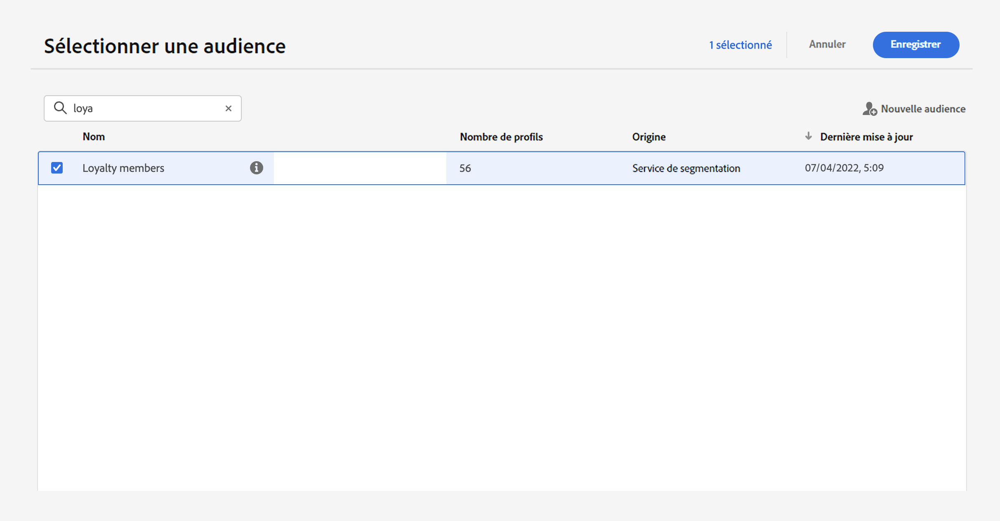
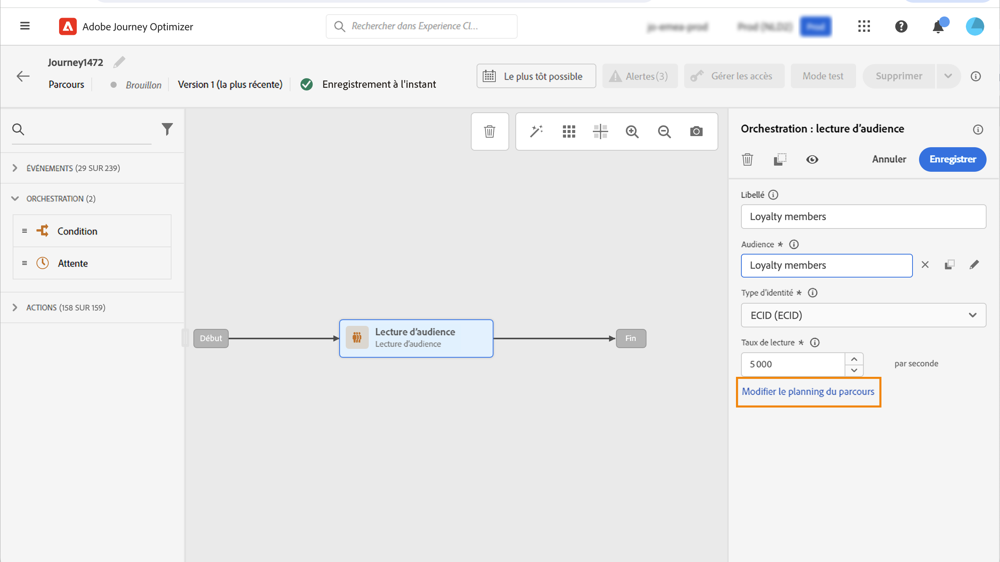
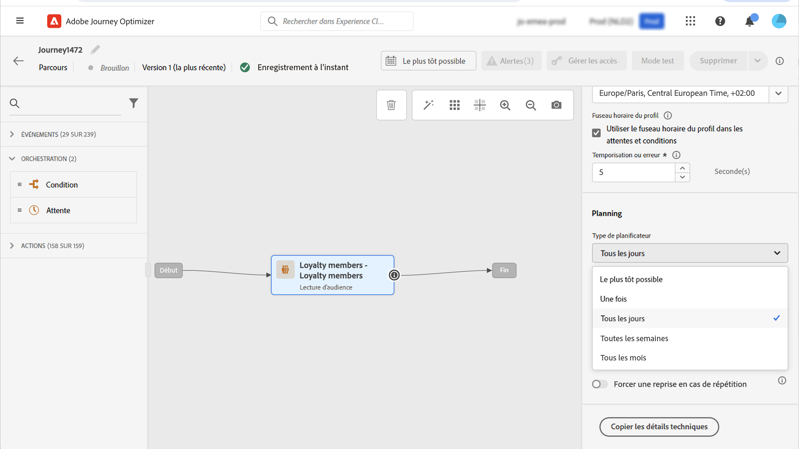
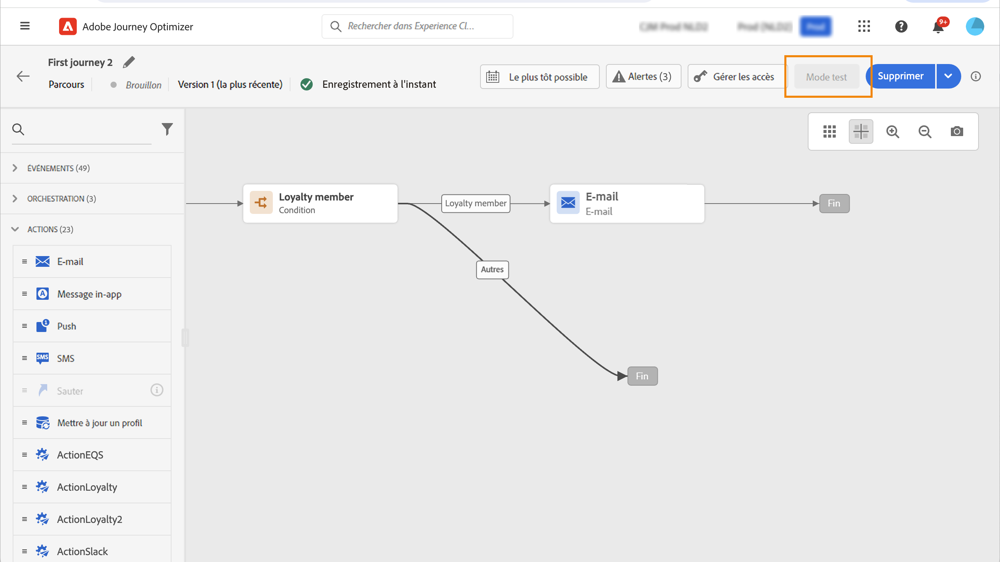
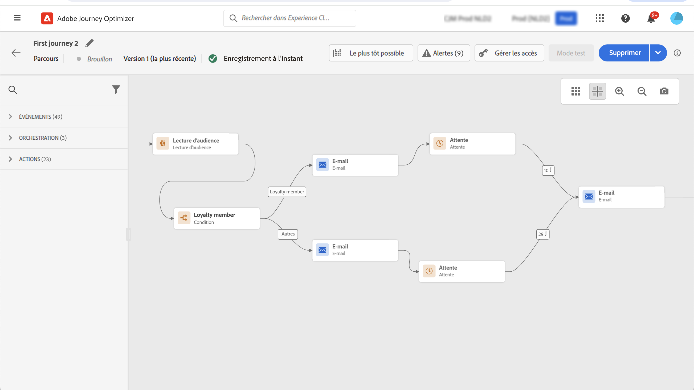

# Utiliser une audience dans un parcours {#segment-trigger-activity}

## Ajouter une activité Lecture d’audience {#about-segment-trigger-actvitiy}

>[!CONTEXTUALHELP]
>id="ajo_journey_read_segment"
>title="Activité Lecture d’audience"
>abstract="L’activité Lecture d’audience vous permet de faire entrer dans un parcours toutes les personnes appartenant à une audience Adobe Experience Platform. L’entrée dans un parcours peut être effectuée une fois, ou régulièrement."

Utilisez l’activité **Lecture d’audience** pour que toutes les personnes d’une audience rejoignent le parcours. L’entrée dans un parcours peut être effectuée une fois, ou régulièrement.

Prenons l’exemple de l’audience « Ouverture et passage en caisse de l’application Luma » créée dans le cas d’utilisation de [Création d’audiences](../audience/about-audiences.md). Avec l’activité Lecture d’audience, vous pouvez faire en sorte que toutes les personnes appartenant à cette audience rejoignent un parcours puis se dirigent vers des parcours personnalisés qui exploiteront toutes les fonctionnalités des parcours : conditions, retardateurs, événements, actions.

>[!NOTE]
>
>Pour les parcours qui utilisent une activité Lecture d’audience, il y a un nombre maximal de parcours pouvant commencer exactement au même moment. Les reprises seront effectuées par le système, mais évitez d’avoir plus de cinq parcours (avec Lecture d’audience, planifié ou commençant « le plus tôt possible ») commençant exactement au même moment en les répartissant dans le temps, par exemple à 5 ou 10 minutes d’intervalle.
>
>Les groupes de champs d’événement d’expérience ne peuvent pas être utilisés dans les parcours commençant par une activité Lecture d’audience, Qualification d’audience ou événement métier.

### Configurer l’activité {#configuring-segment-trigger-activity}

Les étapes de configuration de l’activité Lecture d’audience sont les suivantes :

1. Développez la catégorie **[!UICONTROL Orchestration]** et déposez une activité **[!UICONTROL Lecture d’audience]** dans votre zone de travail.

   L’activité doit être la première étape d’un parcours.

1. Ajoutez un **[!UICONTROL libellé]** à l’activité (facultatif).

1. Dans le champ **[!UICONTROL Audience]**, sélectionnez l’audience Adobe Experience Platform qui va rejoindre le parcours, puis cliquez sur **[!UICONTROL Enregistrer]**.

   Notez que vous pouvez personnaliser les colonnes affichées dans la liste et les trier.

   >[!NOTE]
   >
   >Seules les personnes présentant les statuts de participationd&#39;audience **Réalisé** et **Existant** rejoignent le parcours. Pour plus d’informations sur l’évaluation d’une audience, consultez la [documentation du service de segmentation](https://experienceleague.adobe.com/docs/experience-platform/segmentation/tutorials/evaluate-a-segment.html?lang=fr#interpret-segment-results){target="_blank"}.

   

   Une fois l’audience ajoutée, le bouton **[!UICONTROL Copier]** permet de copier son nom et son ID :

   `{"name":"Luma app opening and checkout",”id":"8597c5dc-70e3-4b05-8fb9-7e938f5c07a3"}`

   

1. Dans le champ **[!UICONTROL Espace de noms]**, choisissez l’espace de noms à utiliser pour identifier les personnes. Par défaut, le champ est prérempli avec le dernier espace de noms utilisé. [En savoir plus sur les espace de noms](../event/about-creating.md#select-the-namespace).

   >[!NOTE]
   >
   >Les personnes appartenant à une audience qui n’a pas l’identité sélectionnée (espace de noms) parmi leurs différentes identités ne peuvent pas rejoindre le parcours. Vous pouvez uniquement sélectionner un espace de noms d’identité basé sur les personnes. Si vous avez défini un espace de noms pour une table de correspondance (par exemple : espace de noms ProductID pour une recherche de produit), il ne sera pas disponible dans la liste déroulante **Espace de noms**.

1. Définissez le champ **[!UICONTROL Taux de limitation]** sur la limite du débit de l’activité Lecture d’audience.

   Cette valeur est stockée dans la payload de version du parcours. La valeur par défaut est de 5 000 messages par seconde. Vous pouvez modifier cette valeur de 500 à 20 000 messages par seconde.

   >[!NOTE]
   >
   >Le taux de limitation global par sandbox est défini sur 20 000 messages par seconde. Par conséquent, le taux de limitation de toutes les lectures d’audiences qui s’exécutent simultanément dans la même sandbox s’élève à 20 000 messages par seconde au maximum. Vous ne pouvez pas modifier cette limite.

1. L’activité **[!UICONTROL Lecture d’audience]** vous permet de spécifier l’heure à laquelle l’audience rejoindra le parcours. Pour cela, cliquez sur le lien **[!UICONTROL Modifier le planning du parcours]** pour accéder aux propriétés du parcours, puis configurez le champ **[!UICONTROL Type de planificateur]**.

   

   Par défaut, les audiences rejoignent le parcours **[!UICONTROL le plus tôt possible]**. Si vous souhaitez que l’audience rejoigne le parcours à une date et une heure spécifiques ou de façon récurrente, sélectionnez la valeur de votre choix dans la liste.

   >[!NOTE]
   >
   >Notez que la section **[!UICONTROL Planifier]** n’est disponible que lorsqu’une activité **[!UICONTROL Lecture d’audience]** a été déposée dans la zone de travail.

   

   Option **Lecture incrémentielle** : lorsqu’un parcours avec un événement récurrent **Lecture d’audience** s’exécute pour la première fois, tous les profils de l’audience rejoignent le parcours. Cette option vous permet de cibler, après la première occurrence, seulement les personnes qui sont entrées dans l’audience depuis la dernière exécution du parcours.

   **Forcer une reprise sur une périodicité** : cette option permet de faire en sorte que tous les profils toujours présents dans le parcours le quittent automatiquement lors de la prochaine exécution. Par exemple, si vous avez un délai d’attente de 2 jours dans un parcours récurrent quotidien, l’activation de cette option déplacera toujours les profils lors de la prochaine exécution du parcours (c’est-à-dire le lendemain), qu’ils se trouvent ou non dans l’audience d’exécution suivante. Si la durée de vie de vos profils dans ce parcours peut être supérieure à la fréquence de périodicité, n’activez pas cette option pour vous assurer que les profils puissent terminer leur parcours.

<!--

### Segment filters {#segment-filters}

[!CONTEXTUALHELP]
>id="jo_segment_filters"
>title="About segment filters"
>abstract="You can choose to target only the individuals who entered or exited a specific segment during a specific time window. For example, you can decide to only retrieve all the customers who entered the VIP segment since last week."

You can choose to target only the individuals who entered or exited a specific segment during a specific time window. For example, you can decide to only retrieve all the customers who entered the VIP segment since last week. Only the new VIP customers will be targeted. All the customers who were already part of the VIP segment before will be excluded.

To activate this mode, click the **Segment Filters** toggle. Two fields are displayed:

**Segment membership**: choose whether you want to listen to segment entrances or exits. 

**Lookback window**: define when you want to start to listen to entrances or exits. This lookback window is expressed in hours, starting from the moment the journey is triggered.  If you set this duration to 0, the journey will target all members of the segment. For recurring journeys, it will take into account all entrances/exits since the last time the journey was triggered.

-->

>[!NOTE]
>
>Les parcours de lecture d’audience en une fois passent au statut Terminé 30 jours après l’exécution du parcours. Pour la Lecture d’audience planifiée, cela se passe 30 jours après l’exécution de la dernière occurrence.

### Tester et publier le parcours {#testing-publishing}

L’activité **[!UICONTROL Lecture d’audience]** vous permet de tester le parcours sur un profil unitaire ou sur 100 profils de test aléatoires sélectionnés parmi les profils qualifiés pour l’audience.

Pour cela, activez le mode test, puis sélectionnez l’option de votre choix dans le volet de gauche.

Vous pouvez ensuite configurer et exécuter le mode test comme vous le faites habituellement. [Découvrez comment tester un parcours](testing-the-journey.md).

Une fois le test en cours d’exécution, le bouton **[!UICONTROL Afficher les journaux]** vous permet d’afficher les résultats du test en fonction de l’option de test sélectionnée :

* **[!UICONTROL Profil unique à la fois]** : les journaux de test affichent les mêmes informations que lors de l’utilisation du mode test unitaire. Voir à ce propos [cette section](testing-the-journey.md#viewing_logs)

* **[!UICONTROL Jusqu’à 100 profils à la fois]** : les journaux de test vous permettent de suivre l’avancement de l’exportation des audiences à partir d’Adobe Experience Platform, ainsi que la progression individuelle de toutes les personnes ayant rejoint le parcours.

  Notez que tester le parcours en utilisant jusqu’à 100 profils à la fois ne vous permet pas de suivre la progression des individus dans le parcours à l’aide du flux visuel.

  

Une fois les tests réussis, vous pouvez publier votre parcours (voir [Publication du parcours](publishing-the-journey.md)). Les personnes appartenant à l’audience rejoindront le parcours à la date et à l’heure spécifiées dans la section **[!UICONTROL Planificateur]** des propriétés du parcours.

>[!NOTE]
>
>Pour les parcours récurrents basés sur des audiences, le parcours se ferme automatiquement une fois sa dernière occurrence exécutée. Si aucune date/heure de fin n’a été spécifiée, vous devrez fermer manuellement le parcours à de nouvelles entrées pour le terminer.

## Ciblage des audiences dans les parcours basés sur des audiences

Les parcours basés sur des audiences débutent toujours avec une activité **Lecture d’audience** pour récupérer les personnes appartenant à une audience Adobe Experience Platform.

L’audience appartenant à l’audience est récupérée une fois ou régulièrement.

Après l’entrée dans le parcours, vous pouvez créer des cas d’utilisation d’orchestration des audiences, ce qui permet aux personnes du flux d’audience initiale de progresser dans différentes branches du parcours.

**Segmentation**

Vous pouvez utiliser des conditions pour effectuer la segmentation à l’aide de l’activité **Condition**. Vous pouvez, par exemple, faire en sorte que les personnes VIP empruntent un chemin particulier et que les personnes non VIP suivent un autre chemin.

La segmentation peut être basée sur :

* des données de source de données
* le contexte des événements faisant partie des données du parcours, par exemple : est-ce qu’une personne a cliqué sur le message reçu il y a une heure ?
* une date, par exemple : sommes-nous en juin lorsqu&#39;une personne traverse le parcours?
* une heure, par exemple : est-ce le matin dans le fuseau horaire de la personne ?
* un algorithme fractionnant l’audience circulant dans le parcours en fonction d’un pourcentage, par exemple : 90 à 10 % pour exclure une population témoin

**Exclusion**

La même activité **Condition** utilisée pour la segmentation (voir ci-dessus) vous permet également d’exclure une partie de la population. Par exemple, vous pouvez exclure les personnes VIP en les faisant glisser dans une branche avec une étape de fin juste après.

Cette exclusion peut se produire juste après la récupération des audiences, à des fins de comptage de population ou sur un parcours à plusieurs étapes.

**Union**

Les parcours vous permettent de créer des branches N et de les associer après une segmentation.

Par conséquent, vous pouvez faire en sorte que deux audiences reviennent à une expérience commune.

Par exemple, après avoir suivi une expérience différente pendant dix jours dans un parcours, les clients VIP et non VIP peuvent revenir sur le même chemin.

Après une union, vous pouvez fractionner à nouveau l’audience en exécutant une segmentation ou une exclusion.

