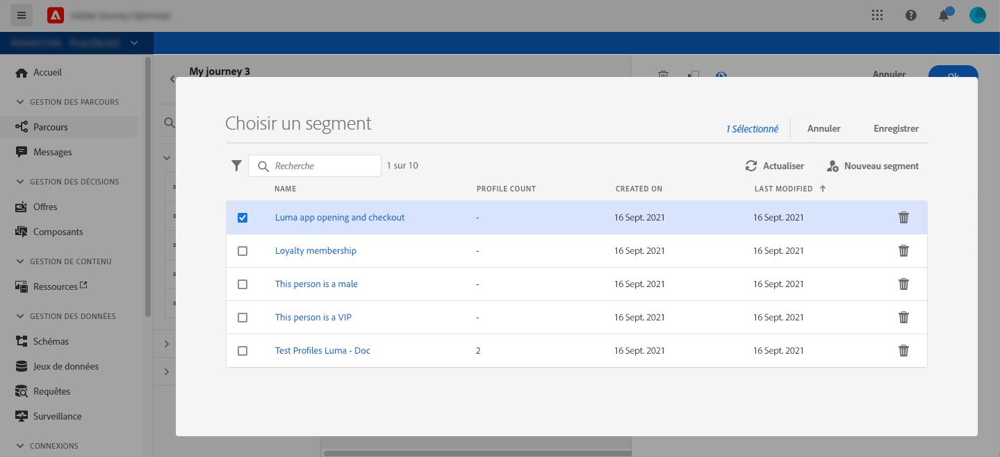
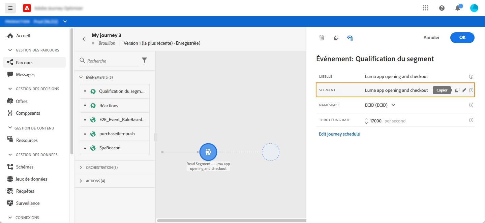
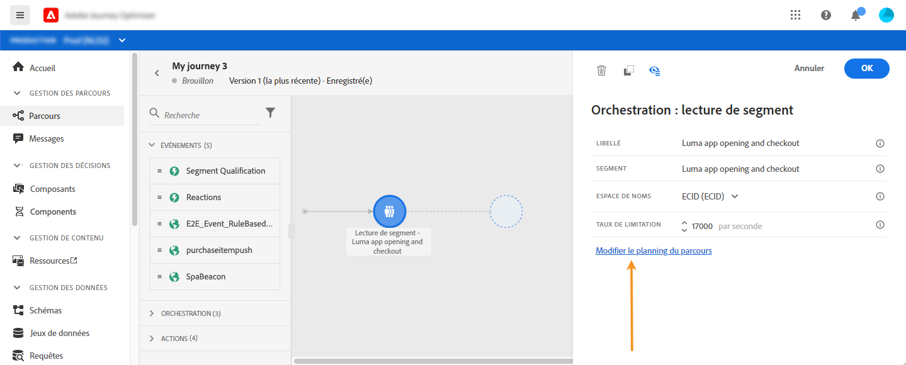
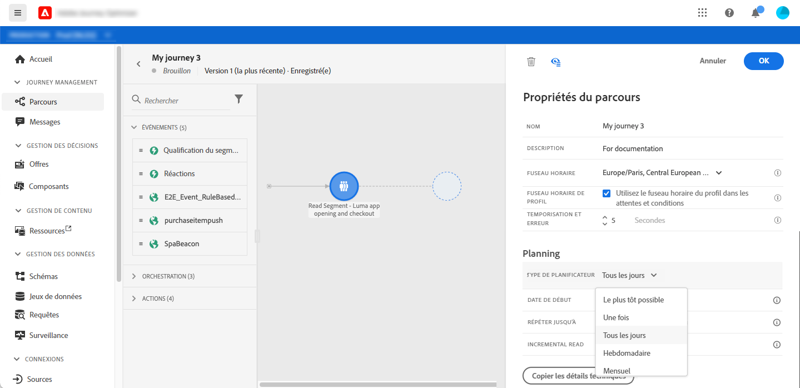
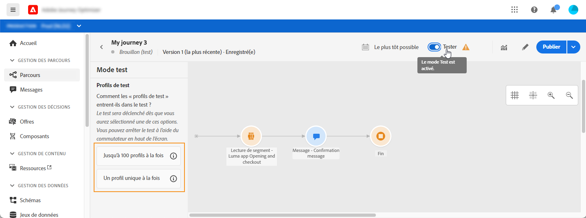
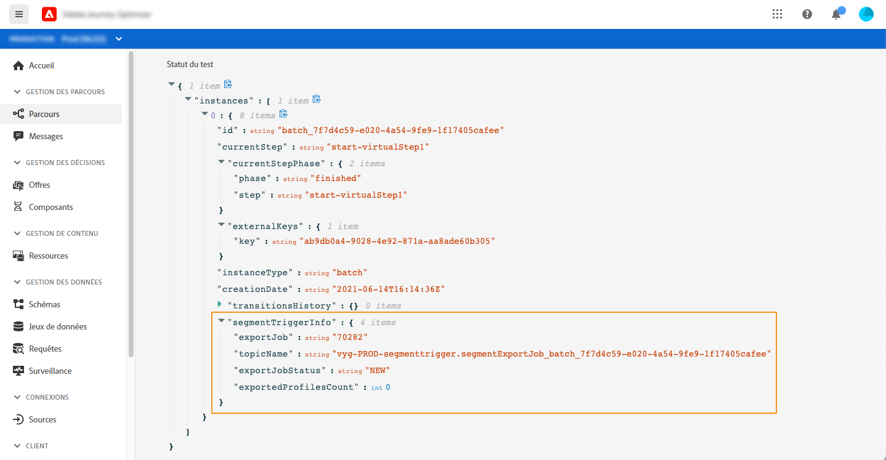
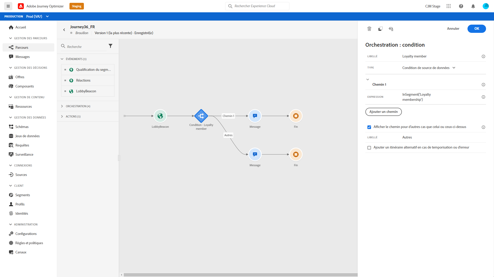
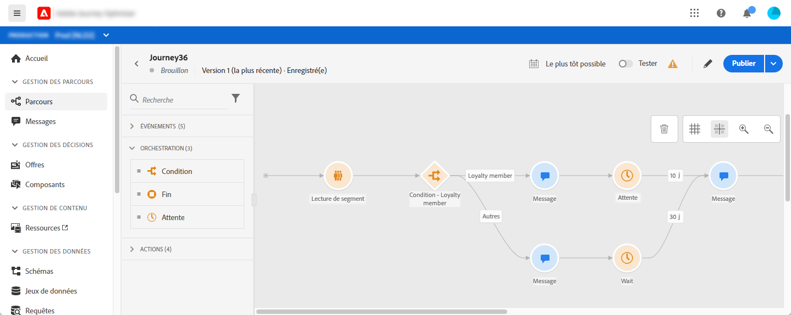

# Utiliser un segment dans un parcours {#segment-trigger-activity}

## À propos de l’activité Lecture de segment {#about-segment-trigger-actvitiy}

L’activité Lecture de segment vous permet de faire entrer dans un parcours tous les individus appartenant à un segment Adobe Experience Platform. L’entrée dans un parcours peut être effectuée une fois, ou régulièrement.

Prenons l’exemple du segment &quot;Ouverture et passage en caisse de l’application Luma&quot; créé dans le cas d’utilisation de [Créer des segments](../segment/about-segments.md). Avec l’activité Lire le segment, vous pouvez faire entrer toutes les personnes appartenant à ce segment dans un parcours et les faire s’enchaîner dans des parcours personnalisés qui exploiteront toutes les fonctionnalités de parcours : conditions, minuteries, événements, actions.

>[!NOTE]
>
>Il n’est pas possible de déclencher un parcours basé sur un segment dans une période plus courte que 1 heure.

### Configuration de l’activité {#configuring-segment-trigger-activity}

Les étapes de configuration de l’activité de segment Lu sont les suivantes :

1. Développez la catégorie **[!UICONTROL Orchestration]** et déposez une activité **[!UICONTROL Lecture de segment]** dans votre zone de travail.

   L’activité doit être la première étape d’un parcours.

1. Ajoutez un **[!UICONTROL libellé]** à l’activité (facultatif).

1. Dans le champ **[!UICONTROL Segment]**, sélectionnez le segment Adobe Experience Platform qui va entrer dans le parcours, puis cliquez sur **[!UICONTROL Enregistrer]**.

   Notez que vous pouvez personnaliser les colonnes affichées dans la liste et les trier.

   >[!NOTE]
   >
   >Seuls les individus présentant les états de participation **Réalisés** et **Existants** entrent dans le parcours. Pour plus d’informations sur l’évaluation d’un segment, consultez la [documentation du service de segmentation](https://experienceleague.adobe.com/docs/experience-platform/segmentation/tutorials/evaluate-a-segment.html?lang=fr#interpret-segment-results).

   

   Une fois le segment ajouté, le bouton **[!UICONTROL Copier]** permet de copier son nom et son ID :

   `{"name":"Luma app opening and checkout",”id":"8597c5dc-70e3-4b05-8fb9-7e938f5c07a3"}`

   

1. Dans le champ **[!UICONTROL Espace de noms]**, choisissez l’espace de noms à utiliser pour identifier les personnes. [En savoir plus sur les espaces de nommage](../event/about-creating.md#select-the-namespace).

   >[!NOTE]
   >
   >Les personnes appartenant à un segment qui n’a pas l’identité sélectionnée (espace de noms) parmi leurs différentes identités ne peuvent pas entrer dans le parcours.

1. L’activité **[!UICONTROL Lecture de segment]** vous permet de spécifier l’heure à laquelle le segment rejoindra le parcours. Pour cela, cliquez sur le lien **[!UICONTROL Modifier le planning du parcours]** pour accéder aux propriétés du parcours, puis configurez le champ **[!UICONTROL Type de Planificateur]**.

   

   Par défaut, les segments rejoignent le parcours **[!UICONTROL Dès que possible]**, c’est-à-dire 1 heure après la publication de celui-ci. Si vous souhaitez que le segment rejoigne le parcours à une date/heure spécifique ou de façon récurrente, sélectionnez la valeur de votre choix dans la liste.

   >[!NOTE]
   >
   >Notez que la section **[!UICONTROL Planificateur]** n’est disponible que lorsqu’une activité **[!UICONTROL Lecture de segment]** a été déposée dans la zone de travail.

   

### Tester et publier le parcours {#testing-publishing}

L’activité **[!UICONTROL Lecture de segment]** vous permet de tester le parcours sur un profil unitaire ou sur 100 profils de test aléatoires sélectionnés parmi les profils qualifiés pour le segment.

Pour cela, activez le mode test, puis sélectionnez l’option de votre choix dans le volet de gauche.

Vous pouvez ensuite configurer et exécuter le mode test comme vous le faites habituellement. [Apprenez à tester un parcours](testing-the-journey.md).

Une fois le test en cours d’exécution, le bouton **[!UICONTROL Afficher les journaux]** vous permet d’afficher les résultats du test en fonction de l’option de test sélectionnée :

* **[!UICONTROL Profil unique à la fois]** : les journaux de test affichent les mêmes informations que lors de l’utilisation du mode test unitaire. Voir à ce propos [cette section](testing-the-journey.md#viewing_logs)

* **[!UICONTROL Jusqu’à 100 profils à la fois]** : les journaux de test vous permettent de suivre l’avancement de l’export des segments à partir d’Adobe Experience Platform, ainsi que la progression individuelle de toutes les personnes ayant rejoint le parcours.

   Notez que tester le parcours en utilisant jusqu’à 100 profils à la fois ne vous permet pas de suivre la progression des individus dans le parcours à l’aide du flux visuel.

   

Une fois les tests réussis, vous pouvez publier votre parcours (voir [Publication du parcours](publishing-the-journey.md)). Les personnes appartenant au segment rejoindront le parcours à la date/heure spécifiée dans la section **[!UICONTROL Planificateur]** des propriétés du parcours.

>[!NOTE]
>
>Lorsqu’un parcours basé sur un segment qui n’est pas récurrent (&quot;en commençant dès que possible&quot; ou &quot;une fois&quot;) est exécuté, son état devient automatiquement &quot;fermé&quot;.
>
>Pour les parcours récurrents basés sur des segments, le parcours se ferme automatiquement une fois sa dernière occurrence exécutée. Si aucune date/heure de fin n&#39;a été spécifiée, vous devrez fermer manuellement le parcours à de nouvelles entrées pour le terminer.

## Ciblage des Audiences dans les parcours par segment

Les parcours basés sur les segments sont toujours débuts avec une activité **Lire le segment** pour récupérer les individus appartenant à un segment Adobe Experience Platform.

L’audience appartenant au segment est récupérée une fois ou régulièrement.

Une fois le parcours entré, vous pouvez créer des cas d’utilisation de l’orchestration des audiences, ce qui permet aux individus du segment initial de s’écouler dans différentes branches du parcours.

**Segmentation**

Vous pouvez utiliser des conditions pour effectuer la segmentation à l’aide de l’activité **Condition**. Vous pouvez, par exemple, faire en sorte que VIP personnes empruntent un chemin particulier et qu’elles ne suivent pas VIP flux dans un autre chemin.

La segmentation peut être basée sur :

* données de source de données
* le contexte des événements faisant partie des données du parcours, par exemple : est-ce qu&#39;une personne a cliqué sur le message qu&#39;elle a reçu il y a une heure ?
* une date, par exemple : sommes-nous en juin lorsqu&#39;une personne traverse le parcours?
* une heure, par exemple : est-ce le matin dans le fuseau horaire de la personne?
* un algorithme fractionnant l’audience circulant dans le parcours en fonction d’un pourcentage, par exemple : 90 à 10 % pour exclure une Population témoin

**Exclusion**

La même activité **Condition** utilisée pour la segmentation (voir ci-dessus) vous permet également d’exclure une partie de la population. Par exemple, vous pouvez exclure VIP personnes en les faisant glisser dans une branche avec une étape de fin juste après.

Cette exclusion peut se produire juste après la récupération des segments, à des fins de comptage de population ou le long d’un parcours à plusieurs étapes.

**Union**

Les parcours vous permettent de créer des branches N et de les associer après une segmentation.

Par conséquent, vous pouvez faire en sorte que deux audiences reviennent à une expérience commune.

Par exemple, après avoir suivi une expérience différente pendant dix jours dans un parcours, les clients VIP et non VIP peuvent revenir au même chemin.

Après une union, vous pouvez fractionner à nouveau l’audience en exécutant une segmentation ou une exclusion.

