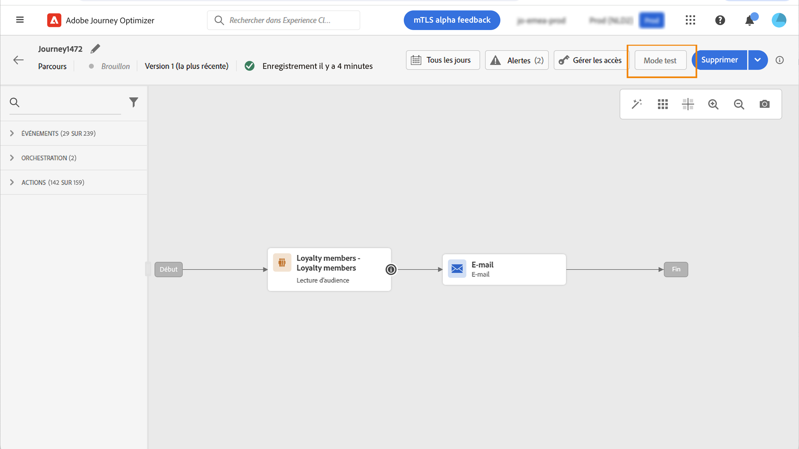

# Utilisation d’un segment dans un parcours {#segment-trigger-activity}

## Ajout d’une activité Lecture de segment {#about-segment-trigger-actvitiy}

>[!CONTEXTUALHELP]
>id="ajo_journey_read_segment"
>title="Activité Lecture de segment"
>abstract="L’activité Lecture de segment vous permet de faire entrer dans un parcours tous les individus appartenant à un segment Adobe Experience Platform. L’entrée dans un parcours peut être effectuée une fois, ou régulièrement."

L’activité Lecture de segment vous permet de faire entrer dans un parcours tous les individus appartenant à un segment Adobe Experience Platform. L’entrée dans un parcours peut être effectuée une fois, ou régulièrement.

Prenons l’exemple du segment « Ouverture et passage en caisse de l’application Luma » créé dans le cas d’utilisation de [Création de segments](../segment/about-segments.md). Avec l’activité Lecture de segment, vous pouvez faire en sorte que tous les individus appartenant à ce segment rejoignent un parcours puis se dirigent vers des parcours personnalisés qui exploiteront toutes les fonctionnalités des parcours : conditions, minuteurs, événements, actions.

>[!NOTE]
>
>Le module complémentaire payant Rafale permet d&#39;envoyer très rapidement des messages push en gros volumes pour des parcours simples comprenant une lecture de segment et un message push simple. Voir à ce sujet [cette section](../building-journeys/journey-gs.md#burst)

### Configuration de l’activité {#configuring-segment-trigger-activity}

Les étapes de configuration de l&#39;activité Lecture de segment sont les suivantes :

1. Développez la catégorie **[!UICONTROL Orchestration]** et déposez une activité **[!UICONTROL Lecture de segment]** dans votre zone de travail.

   L’activité doit être la première étape d’un parcours.

1. Ajoutez un **[!UICONTROL libellé]** à l’activité (facultatif).

1. Dans le champ **[!UICONTROL Segment]**, sélectionnez le segment Experience Platform qui va rejoindre le parcours, puis cliquez sur **[!UICONTROL Enregistrer]**.

   Notez que vous pouvez personnaliser les colonnes affichées dans la liste et les trier.

   >[!NOTE]
   >
   >Seuls les individus présentant les états de participation **Réalisés** et **Existants** rejoignent le parcours. Pour plus d&#39;informations sur l&#39;évaluation d&#39;un segment, consultez la [documentation du service de segmentation](https://experienceleague.adobe.com/docs/experience-platform/segmentation/tutorials/evaluate-a-segment.html?lang=fr#interpret-segment-results){target=&quot;_blank&quot;}.

   

   Une fois le segment ajouté, le bouton **[!UICONTROL Copier]** permet de copier son nom et son ID :

   `{"name":"Luma app opening and checkout",”id":"8597c5dc-70e3-4b05-8fb9-7e938f5c07a3"}`

   

1. Dans le champ **[!UICONTROL Espace de noms]**, choisissez l’espace de noms à utiliser pour identifier les personnes. [En savoir plus sur les espace de noms](../event/about-creating.md#select-the-namespace)

   >[!NOTE]
   >
   >Les individus appartenant à un segment qui n’a pas l’identité sélectionnée (espace de noms) parmi leurs différentes identités ne peuvent pas rejoindre le parcours.

1. Définissez le champ **[!UICONTROL Taux de limitation]** sur la limite du débit de l’activité Lecture de segment.

   Cette valeur est stockée dans la payload de version du parcours. La valeur par défaut est de 20 000 messages par seconde. Vous pouvez modifier cette valeur de 500 à 20 000 messages par seconde.

   >[!NOTE]
   >
   >Le taux de limitation global par environnement Sandbox est défini sur 20 000 messages par seconde. Par conséquent, le taux de limitation de toutes les lectures de segment qui s&#39;exécutent simultanément dans le même environnement Sandbox s&#39;élève à 20 000 messages par seconde au maximum. Vous ne pouvez pas modifier cette limite.

1. L’activité **[!UICONTROL Lecture de segment]** vous permet de spécifier l’heure à laquelle le segment rejoindra le parcours. Pour cela, cliquez sur le lien **[!UICONTROL Modifier le planning du parcours]** pour accéder aux propriétés du parcours, puis configurez le champ **[!UICONTROL Type de Planificateur]**.

   

   Par défaut, les segments rejoignent le parcours **[!UICONTROL Le plus tôt possible]**. Si vous souhaitez que le segment rejoigne le parcours à une date/heure spécifique ou de façon récurrente, sélectionnez la valeur de votre choix dans la liste.

   >[!NOTE]
   >
   >Notez que la section **[!UICONTROL Planificateur]** n’est disponible que lorsqu’une activité **[!UICONTROL Lecture de segment]** a été déposée dans la zone de travail.

   

   Lʼoption **Lecture incrémentielle** vous permet de cibler uniquement les individus qui sont entrés dans le segment depuis la dernière exécution du parcours. La première exécution cible toujours tous les membres du segment. Cette option n’est disponible que pour les activités **Lecture de segment** récurrentes.

<!--

### Segment filters {#segment-filters}

[!CONTEXTUALHELP]
>id="jo_segment_filters"
>title="About segment filters"
>abstract="You can choose to target only the individuals who entered or exited a specific segment during a specific time window. For example, you can decide to only retrieve all the customers who entered the VIP segment since last week."

You can choose to target only the individuals who entered or exited a specific segment during a specific time window. For example, you can decide to only retrieve all the customers who entered the VIP segment since last week. Only the new VIP customers will be targeted. All the customers who were already part of the VIP segment before will be excluded.

To activate this mode, click the **Segment Filters** toggle. Two fields are displayed:

**Segment membership**: choose whether you want to listen to segment entrances or exits. 

**Lookback window**: define when you want to start to listen to entrances or exits. This lookback window is expressed in hours, starting from the moment the journey is triggered.  If you set this duration to 0, the journey will target all members of the segment. For recurring journeys, it will take into account all entrances/exits since the last time the journey was triggered.

-->

>[!NOTE]
>
>Les parcours de lecture de segment en une fois passent à l’état Terminé 30 jours après l’exécution du parcours. Pour la lecture de segment planifiée, cela se passe 30 jours après l’exécution de la dernière occurrence.

### Tester et publier le parcours {#testing-publishing}

L’activité **[!UICONTROL Lecture de segment]** vous permet de tester le parcours sur un profil unitaire ou sur 100 profils de test aléatoires sélectionnés parmi les profils qualifiés pour le segment.

Pour cela, activez le mode test, puis sélectionnez l’option de votre choix dans le volet de gauche.

Vous pouvez ensuite configurer et exécuter le mode test comme vous le faites habituellement. [Découvrez comment tester un parcours](testing-the-journey.md).

Une fois le test en cours d’exécution, le bouton **[!UICONTROL Afficher les journaux]** vous permet d’afficher les résultats du test en fonction de l’option de test sélectionnée :

* **[!UICONTROL Profil unique à la fois]** : les journaux de test affichent les mêmes informations que lors de l’utilisation du mode test unitaire. Voir à ce propos [cette section](testing-the-journey.md#viewing_logs)

* **[!UICONTROL Jusqu’à 100 profils à la fois]** : les journaux de test vous permettent de suivre l’avancement de l’export des segments à partir d’Adobe Experience Platform, ainsi que la progression individuelle de toutes les personnes ayant rejoint le parcours.

   Notez que tester le parcours en utilisant jusqu’à 100 profils à la fois ne vous permet pas de suivre la progression des individus dans le parcours à l’aide du flux visuel.

   

Une fois les tests réussis, vous pouvez publier votre parcours (voir [Publication du parcours](publishing-the-journey.md)). Les personnes appartenant au segment rejoindront le parcours à la date/heure spécifiée dans la section **[!UICONTROL Planificateur]** des propriétés du parcours.

>[!NOTE]
>
>Pour les parcours récurrents basés sur des segments, le parcours se ferme automatiquement une fois sa dernière occurrence exécutée. Si aucune date/heure de fin n&#39;a été spécifiée, vous devrez fermer manuellement le parcours à de nouvelles entrées pour le terminer.

## Ciblage des audiences dans les parcours basés sur segment

Les parcours basés sur segments débutent toujours avec une activité **Lecture de segment** pour récupérer les individus appartenant à un segment Adobe Experience Platform.

L’audience appartenant au segment est récupérée une fois ou régulièrement.

Après l’entrée dans le parcours, vous pouvez créer des cas d’utilisation d’orchestration des audiences, ce qui permet aux individus du segment initial de progresser dans différentes branches du parcours.

**Segmentation**

Vous pouvez utiliser des conditions pour effectuer la segmentation à l’aide de l’activité **Condition**. Vous pouvez, par exemple, faire en sorte que les personnes VIP empruntent un chemin particulier et que les personnes non VIP suivent un autre chemin.

La segmentation peut être basée sur :

* des données de source de données
* le contexte des événements faisant partie des données du parcours, par exemple : est-ce qu’une personne a cliqué sur le message reçu il y a une heure ?
* une date, par exemple : sommes-nous en juin lorsqu&#39;une personne traverse le parcours?
* une heure, par exemple : est-ce le matin dans le fuseau horaire de la personne ?
* un algorithme fractionnant l’audience circulant dans le parcours en fonction d’un pourcentage, par exemple : 90 à 10 % pour exclure une population témoin

**Exclusion**

La même activité **Condition** utilisée pour la segmentation (voir ci-dessus) vous permet également d’exclure une partie de la population. Par exemple, vous pouvez exclure les personnes VIP en les faisant glisser dans une branche avec une étape de fin juste après.

Cette exclusion peut se produire juste après la récupération des segments, à des fins de comptage de population ou le long d’un parcours à plusieurs étapes.

**Union**

Les parcours vous permettent de créer des branches N et de les associer après une segmentation.

Par conséquent, vous pouvez faire en sorte que deux audiences reviennent à une expérience commune.

Par exemple, après avoir suivi une expérience différente pendant dix jours dans un parcours, les clients VIP et non VIP peuvent revenir sur le même chemin.

Après une union, vous pouvez fractionner à nouveau l’audience en exécutant une segmentation ou une exclusion.

