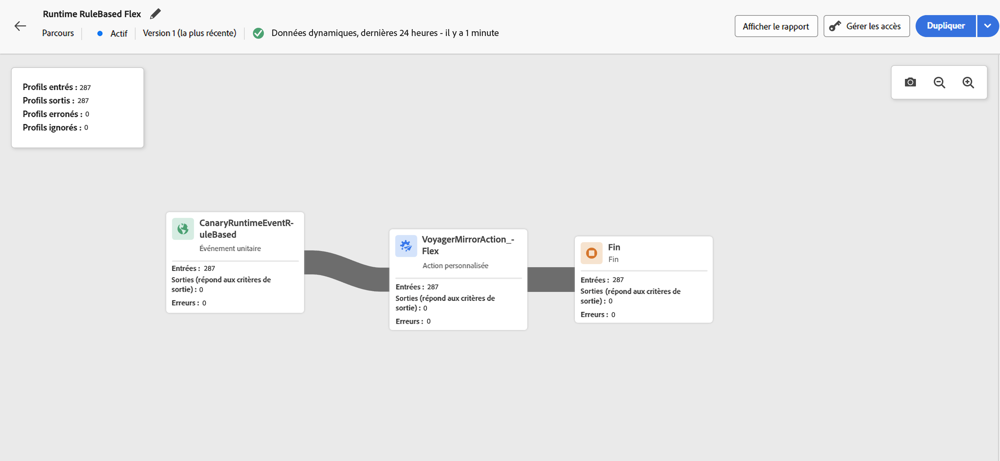

# Rapport dynamique dans la zone de travail du parcours {#report-journey}

Une fois votre parcours publié et une fois le [mode Test à blanc](journey-dry-run.md) activé, la fonction **Rapports dynamiques** fournit les mesures des dernières 24 heures, directement dans la zone de travail du parcours.

>[!AVAILABILITY]
>
>Si vous ne pouvez pas voir les données dans le rapport dynamique de votre parcours, vos droits d’accès doivent être étendus afin d’inclure l’autorisation **[!UICONTROL Afficher le rapport des parcours]**. [En savoir plus](../administration/permissions.md)

Les événements affichés se sont produits au cours des dernières 24 heures, avec un intervalle minimal de deux minutes entre l’événement et son affichage, généralement dans les cinq minutes.

Pour vos parcours actifs ou en mode [Test à blanc](journey-dry-run.md), vous pouvez vérifier les éléments suivants :

* **[!UICONTROL Profils entrés]** : nombre total de personnes ayant rejoint le parcours.
* **[!UICONTROL Profils sortis]** : nombre total de personnes ayant quitté le parcours (y compris les erreurs).
* **[!UICONTROL Profils en erreur]** : nombre total de personnes ayant rencontré une erreur au cours de leur parcours.
* **[!UICONTROL Profils rejetés]** : nombre total de personnes qui ont été exclues du parcours pour l’une des raisons suivantes :

   * Pour les activités **Qualification de l’audience**, un rejet peut survenir si le verbe attendu pour la qualification de l’audience ne correspond pas au parcours reçu (par exemple « sorti » au lieu de « réalisé »).
   * Pour les parcours **déclenchés par un événement**, un rejet peut survenir si la personne a tenté de rejoindre trop tôt le parcours ou si elle n’y a pas été autorisée.
   * Sur les parcours **récurrents**, un rejet est comptabilisé à chaque périodicité si la personne figure déjà dans le parcours et que la politique de rentrée n’est pas définie sur « Forcer une rentrée ».
   * Sur les activités **Lecture d’audience**, un rejet survient si aucune identité n’est définie pour la personne exportée ou si l’espace de noms d’identité reçu ne correspond pas à celui attendu pour le parcours.

Pour chaque activité de chaque parcours actif ou en [mode Test à blanc](journey-dry-run.md), vous avez accès aux éléments suivants :

* **[!UICONTROL Entrées]** : nombre total de personnes qui ont atteint cette activité. Pour les activités **Action**, étant donné qu’elles ne sont pas exécutées en mode Test à blanc, cette mesure indique les profils qui passent par celles-ci.
* **[!UICONTROL Sorties (critères de sortie remplis)]** : nombre total de personnes ayant quitté le parcours de cette activité en raison d’un critère de sortie (y compris les erreurs).
* **[!UICONTROL Sorties (sorties forcées)]** : nombre total de personnes ayant quitté le parcours alors qu’il était en pause en raison d’une configuration opérée par la personne responsable du parcours. Cette mesure est toujours égale à zéro pour les parcours en mode Test à blanc.
* **[!UICONTROL Erreur]** : nombre total de personnes ayant rencontré une erreur pour cette activité.

## Résolution des problèmes liés aux données de rapport manquantes {#troubleshooting-missing-data}

Si vous ne voyez pas les données attendues dans vos rapports de parcours, tenez compte des points suivants :

* **Synchronisation des noms de Parcours** : vérifiez que le nom du parcours dans Adobe Journey Optimizer correspond au nom stocké dans le jeu de données de rapports. Une incohérence entre ces noms peut empêcher l’affichage correct des données de rapport.

* **Délai d’actualisation des données** : après la mise à jour d’un nom ou d’une configuration de parcours, patientez suffisamment longtemps pour actualiser les données. Les données de création de rapports apparaissent généralement en quelques minutes, mais peuvent prendre plus de temps dans certains cas.

* **Autorisations d’accès** : vérifiez que vous disposez des autorisations nécessaires pour afficher les rapports de parcours. Si vous ne voyez aucune donnée, vérifiez auprès de votre administrateur que l’autorisation **[!UICONTROL Afficher le rapport des parcours]** est activée. [En savoir plus sur les autorisations](../administration/permissions.md)

* **Statut du Parcours** : les données de rapport ne sont disponibles que pour les parcours publiés ou les parcours s’exécutant en [mode d’exécution d’essai](journey-dry-run.md). Les brouillons de parcours ne génèrent pas de données de rapport.

Si les problèmes persistent après avoir vérifié ces éléments, contactez votre administrateur Adobe ou l’assistance Adobe pour obtenir de l’aide.

>[!MORELIKETHIS]
>
>* [Commencer la création de rapports](../reports/gs-reports.md)
>* [Publier votre parcours](publish-journey.md)
>* [Test à blanc d’un parcours](journey-dry-run.md)
>* [Configurer et suivre les mesures de votre parcours](success-metrics.md)
>* [Rapports sur les parcours personnalisés](../reports/sharing-overview.md)
