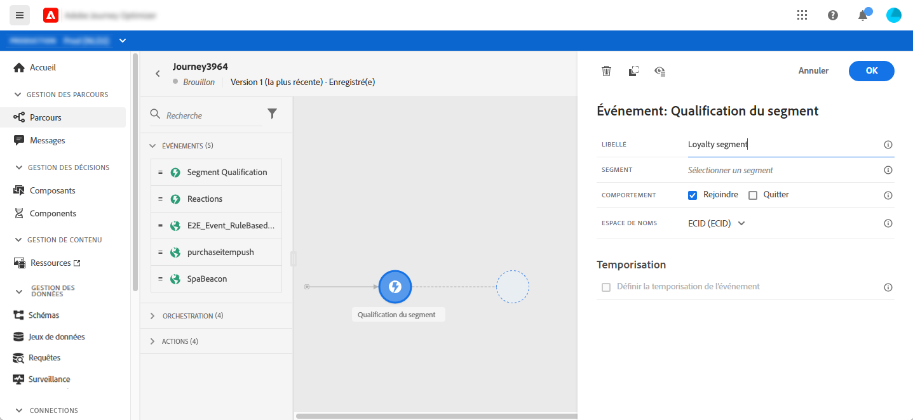
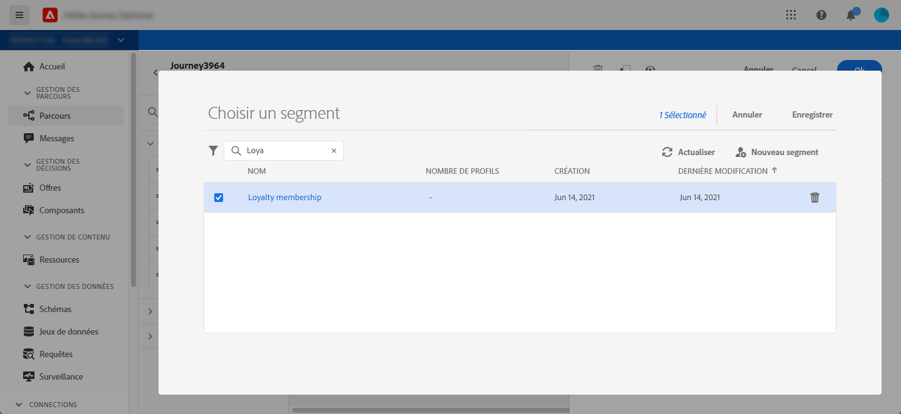
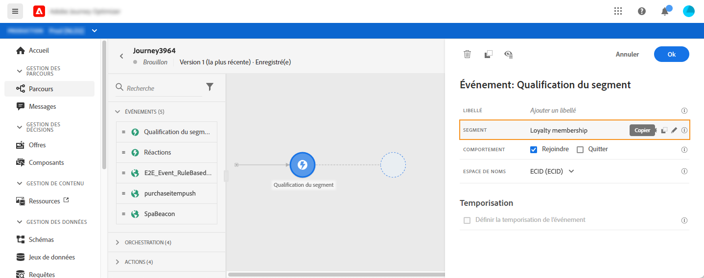
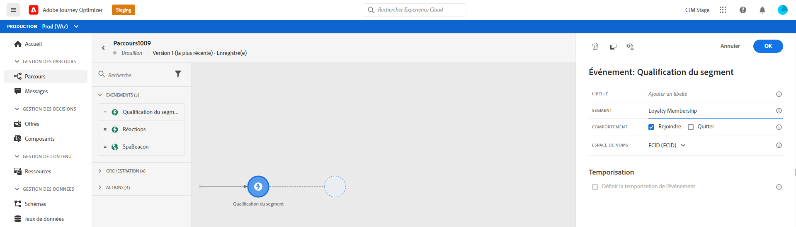
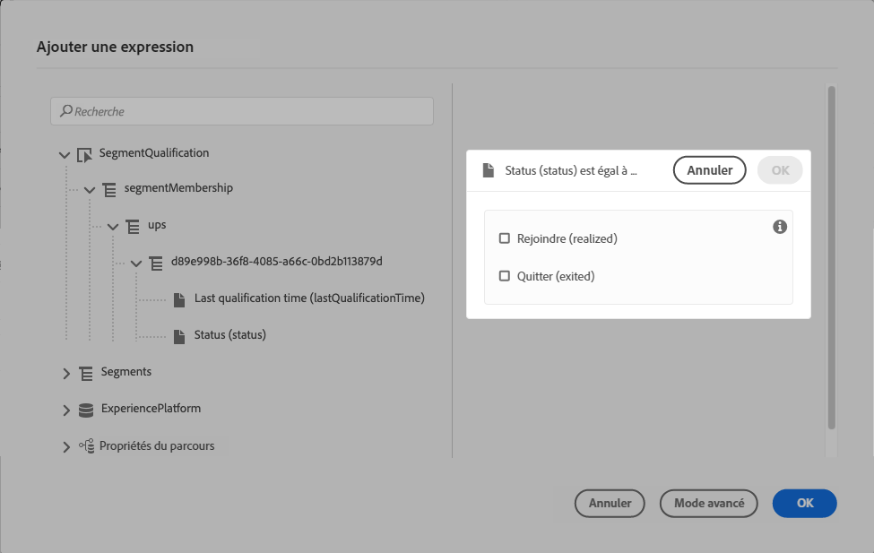
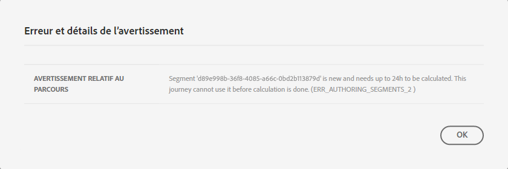
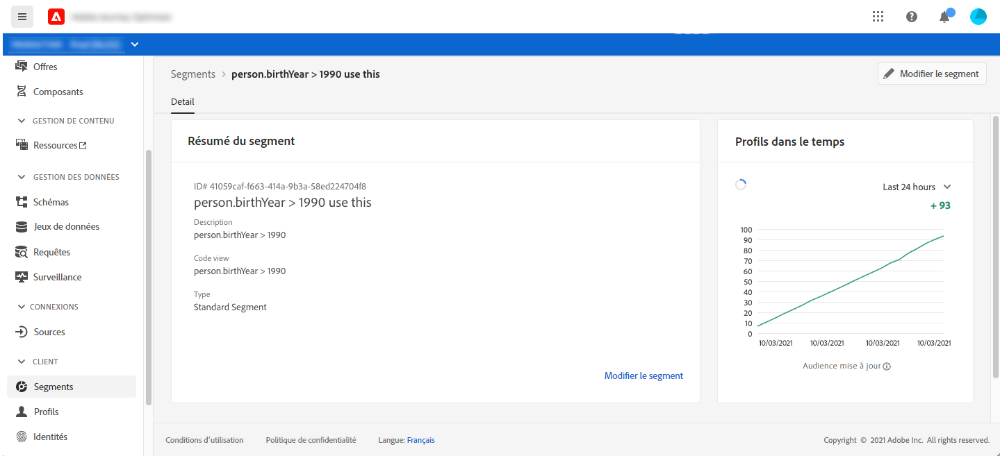

# Événements de qualification de segment {#segment-qualification}

## À propos des événements de qualification de segment {#about-segment-qualification}

Cette activité permet à votre parcours d&#39;écouter les entrées et les sorties de profils dans les segments Adobe Experience Platform afin de faire entrer ou avancer des individus dans un parcours. Pour plus d&#39;informations sur la création de segments, consultez cette [section](../segment/about-segments.md).

Supposons que vous ayez un segment &quot;client argenté&quot;. Avec cette activité, vous pouvez faire entrer tous les nouveaux clients argentés dans un parcours et leur envoyer une série de messages personnalisés.

Ce type de événement peut être positionné comme la première étape ou une étape ultérieure du parcours.

>[!IMPORTANT]
>
>Gardez à l’esprit que les segments Adobe Experience Platform sont calculés une fois par jour (**segments de lot**) ou en temps réel (**segments en flux continu**, à l’aide de l’option Audiences haute fréquence de Adobe Experience Platform).
>
>Si le segment sélectionné est diffusé en continu, les individus appartenant à ce segment peuvent potentiellement entrer dans le parcours en temps réel. Si le segment est par lot, les personnes nouvellement qualifiées pour ce segment peuvent entrer dans le parcours lorsque le calcul du segment est exécuté sur Adobe Experience Platform.

1. Dépliez la catégorie **[!UICONTROL Événements]** et déposez une **[!UICONTROL qualification de segment]** activité dans votre canevas.

   

1. Ajoutez une **[!UICONTROL étiquette]** à l&#39;activité. Cette étape est facultative.

1. Cliquez dans le champ **[!UICONTROL Segment]** et sélectionnez les segments à exploiter.

   >[!NOTE]
   >
   >Notez que vous pouvez personnaliser les colonnes affichées dans la liste et les trier.

   

   Une fois le segment ajouté, le bouton **[!UICONTROL Copier]** permet de copier son nom et son ID :

   `{"name":"Loyalty membership“,”id":"8597c5dc-70e3-4b05-8fb9-7e938f5c07a3"}`

   

1. Dans le champ **[!UICONTROL Comportement]**, choisissez d’écouter les entrées de segment, les sorties ou les deux.

   >[!NOTE]
   >
   >Notez que **[!UICONTROL Entrée]** et **[!UICONTROL Sortie]** correspondent aux états de participation des segments **Réalisés** et **Sortie** de Adobe Experience Platform. Pour plus d’informations sur l’évaluation d’un segment, consultez la [documentation du service de segmentation](https://experienceleague.adobe.com/docs/experience-platform/segmentation/tutorials/evaluate-a-segment.html?lang=en#interpret-segment-results).

1. Sélectionnez un espace de nommage. Cela n&#39;est nécessaire que si le événement est considéré comme la première étape du parcours.

   

La charge utile contient les informations contextuelles suivantes, que vous pouvez utiliser dans des conditions et des actions :

* le comportement (entrée, sortie)
* l&#39;horodatage de la qualification
* l’identifiant de segment

Lorsque vous utilisez l’éditeur d’expressions dans une condition ou une action qui suit une activité de **[!UICONTROL qualification de segment]**, vous avez accès au noeud **[!UICONTROL SegmentQualification]**. Vous pouvez choisir entre **[!UICONTROL Dernière heure de qualification]** et **[!UICONTROL état]** (entrer ou quitter).

Voir [activité de condition](../building-journeys/condition-activity.md#about_condition).

## Meilleures pratiques {#best-practices-segments}

L&#39;activité **[!UICONTROL Qualification de segment]** permet l&#39;entrée immédiate dans les parcours de personnes qualifiées ou disqualifiées d&#39;un segment Adobe Experience Platform.

La vitesse de réception de ces informations est élevée. Les mesures effectuées montrent une vitesse de 10 000 événements reçues par seconde. Par conséquent, vous devez vous assurer de comprendre comment les pics d&#39;entrée peuvent se produire, comment les éviter et comment préparer votre parcours pour eux.

### Segments par lots {#batch-speed-segment-qualification}

Lorsque vous utilisez la qualification de segment pour un segment par lot, notez qu’un pic d’entrée survient au moment du calcul quotidien. La taille du pic dépend du nombre de personnes qui entrent (ou sortent) dans le segment quotidiennement.

De plus, si le segment de lot est créé et immédiatement utilisé dans un parcours, le premier lot de calculs peut faire entrer un très grand nombre de personnes sur le parcours.

### Segments en flux continu {#streamed-speed-segment-qualification}

Lors de l’utilisation de la qualification de segment pour les segments en flux continu, il y a moins de risque d’obtenir de grands pics d’entrées/sorties en raison de l’évaluation continue du segment. Néanmoins, si la définition de segment conduit à rendre un grand volume de clients admissibles en même temps, il peut y avoir un pic également.

Pour plus d’informations sur la segmentation en flux continu, voir cette [page](https://experienceleague.adobe.com/docs/experience-platform/segmentation/api/streaming-segmentation.html#api)

### Comment éviter les surchargements{#overloads-speed-segment-qualification}

Voici quelques bonnes pratiques qui aideront à éviter la surcharge des systèmes utilisés dans les parcours (sources de données, actions personnalisées, **activités Message**).

N’utilisez pas, dans une activité **[!UICONTROL Qualification de segment]**, un segment de lot immédiatement après sa création. Il évitera le premier pic de calcul. Notez qu’un avertissement jaune s’affichera dans le canevas de parcours si vous êtes sur le point d’utiliser un segment qui n’a jamais été calculé.

Mettez en place une règle de plafonnement pour les sources de données et les actions utilisées dans les parcours pour éviter de les surcharger (reportez-vous à cette [section](https://experienceleague.adobe.com/docs/journeys/using/working-with-apis/capping.html)). Notez que la règle de plafonnement n’a pas de nouvelle tentative. Si vous devez réessayer, vous devez utiliser un autre chemin dans le parcours en cochant la case **[!UICONTROL Ajouter un autre chemin en cas de dépassement de délai ou d&#39;erreur]** dans les conditions ou les actions.

Avant d’utiliser le segment dans un parcours de production, évaluez toujours d’abord le volume de personnes admissibles à ce segment tous les jours. Pour ce faire, vous pouvez vérifier le menu **[!UICONTROL Segments]**, ouvrir le segment, puis consulter le graphique **[!UICONTROL Profils au fil du temps]**.

