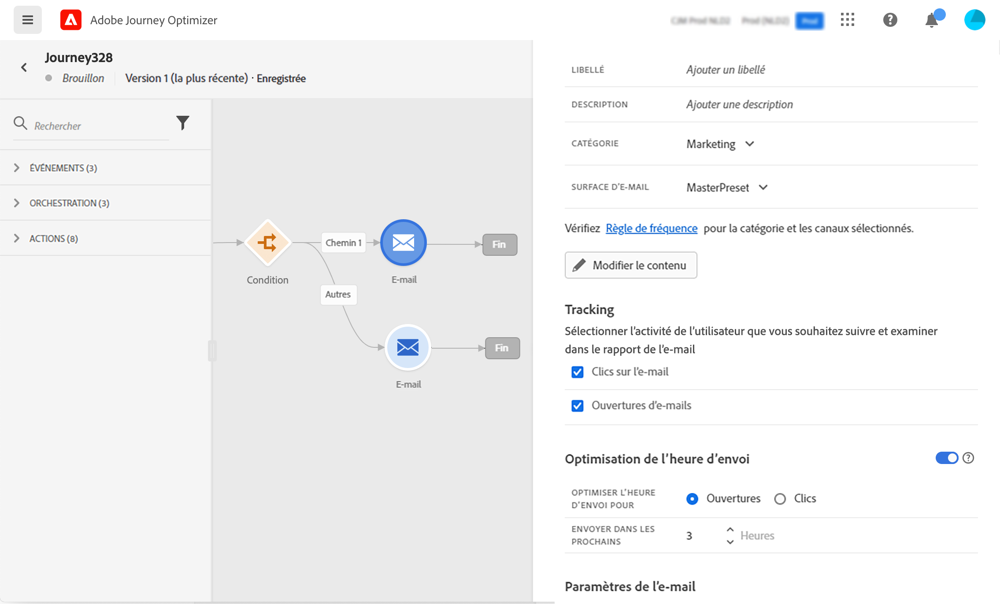
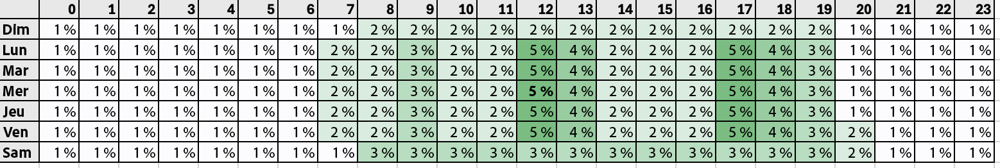
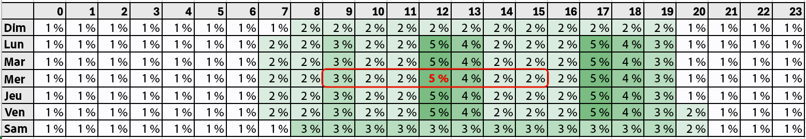

# Optimisation de l’heure d’envoi{#send-time-optimization}

>[!CONTEXTUALHELP]
>id="jo_bestsendtime_disabled"
>title="À propos de l&#39;optimisation de l&#39;heure d&#39;envoi"
>abstract="La fonctionnalité d’optimisation de l’heure d&#39;envoi d’Adobe Journey Optimizer, proposée par les services d’IA d’Adobe, peut prévoir le meilleur moment pour envoyer un e-mail ou un message push afin d’optimiser l’engagement en fonction des taux historiques d’ouverture et de clic."

>[!CONTEXTUALHELP]
>id="jo_bestsendtime_email"
>title="Activer l’optimisation de l’heure d’envoi"
>abstract="Choisissez si vous souhaitez optimiser les ouvertures d&#39;e-mail ou les clics sur e-mail en sélectionnant le bouton radio approprié. Vous pouvez également choisir de mettre entre crochets les heures d&#39;envoi utilisées par le système en saisissant une valeur pour l&#39;option Envoyer pendant."

>[!CONTEXTUALHELP]
>id="jo_bestsendtime_push"
>title="Activer l’optimisation de l’heure d’envoi"
>abstract="Les messages push sont définis par défaut sur l&#39;option d&#39;ouverture, car les clics ne s&#39;appliquent pas à la messagerie push. Vous pouvez également choisir de mettre entre crochets les heures d&#39;envoi utilisées par le système en saisissant une valeur pour l&#39;option Envoyer pendant."

La fonctionnalité d’optimisation de l’heure d’envoi d’Adobe Journey Optimizer, optimisée par les services d’IA dédiée au parcours d’Adobe, choisit l’heure d’envoi optimale pour les e-mails et les messages push afin d’optimiser l’engagement de la clientèle, en fonction du comportement historique d’ouverture et de clic de votre clientèle.

L’optimisation de l’heure d’envoi n’est disponible que pour les types d’action intégrés E-mail et Push de Journey Optimizer et n’est actuellement pas disponible pour les messages envoyés par le biais d’actions personnalisées ou pour d’autres types d’action. L’optimisation de l’heure d’envoi n’est disponible que pour les actions E-mail et Push dans les parcours et n’est actuellement pas disponible pour les messages envoyés via les campagnes.

>[!AVAILABILITY]
>
>* La fonctionnalité d’optimisation de l’heure d’envoi est activée sur demande pour les clientes et clients Adobe Journey Optimizer. Pour activer la fonctionnalité pour votre organisation, contactez l’assistance clientèle d’Adobe ou votre représentant ou représentante Adobe.
>
>* L’optimisation de l’heure d’envoi s’applique uniquement aux canaux **E-mail** et **Notification push**.
>

## Utilisation de l’optimisation de l’heure d’envoi{#use-send-time-optimization}

Utilisez l’optimisation de l’heure d’envoi sur une action e-mail ou push en activant le bouton bascule Optimisation de l’heure d’envoi dans les paramètres d’action.

L’optimisation de l’heure d’envoi ne doit pas être utilisée pour les messages opérationnels urgents et sensibles au facteur temps, comme une confirmation de commande, une notification de réinitialisation de mot de passe ou une notification de changement de porte d’embarquement. L’optimisation de l’heure d’envoi est davantage destinée aux communications marketing moins urgentes, par exemple, une annonce publicitaire hebdomadaire, des informations promotionnelles sur un nouveau produit ou des informations sur une vente d’un mois.

Pour les e-mails, choisissez si vous souhaitez optimiser les ouvertures d’e-mail ou les clics sur e-mail en sélectionnant le bouton radio approprié. Les messages push sont toujours optimisés pour les ouvertures.

>[!TIP]
>
>Pour de meilleurs résultats, la plupart des e-mails doivent être optimisés pour les clics. Choisissez d’optimiser les ouvertures si votre e-mail est de nature informative et n’est pas destiné à orienter directement une action.

Pour les e-mails et les messages push, choisissez le nombre maximal d’heures que le système attendra avant d’envoyer le message en définissant une valeur pour l’option « Envoyer dans les prochaines ». Vous pouvez choisir une valeur comprise entre 1 et 168 heures.

>[!TIP]
>
>Pour des résultats optimaux, choisissez une durée d’attente maximale comprise entre 6 et 24 heures. Choisir une valeur inférieure pour le temps d’attente maximal réduit le nombre d’heures d’envoi disponibles et peut donc réduire la valeur potentielle de l’optimisation de l’heure d’envoi. Si vous choisissez une valeur plus élevée pour le temps d’attente maximal, un message peut être obsolète ou non pertinent au moment de son envoi.

Lorsque votre parcours est activé et qu’un client ou une cliente atteint l’action E-mail ou Push dans le parcours, l’optimisation de l’heure d’envoi choisira l’heure d’envoi prévue la plus appropriée disponible pour chaque personne dans les limites que vous avez spécifiées.

## Fonctionnement de l’optimisation de l’heure d’envoi {#how-send-time}

Le modèle d’optimisation de l’heure d’envoi ingère les données de comportement des clientes et clients Adobe Journey Optimizer de votre organisation et examine les événements d’ouverture et de clic au niveau de la personne pour déterminer à quel moment vos clientes et clients sont les plus susceptibles d’interagir avec vos messages.

L’optimisation de l’heure d’envoi effectue des prédictions pour chaque heure de la semaine, pour chaque personne, en fonction de trois types de données comportementales :

1. Comportement global de vos utilisateurs et utilisatrices
1. Comportement des utilisateurs et utilisatrices semblables dans le même fuseau horaire
1. Comportement de cette personne spécifique

Ces prédictions sont pondérées et combinées à l’aide d’une approche bayésienne, ce qui donne lieu à une « carte thermique » pour chaque mesure (ouvertures d’e-mails, clics d’e-mail et ouvertures push), pour chaque personne, qui indique les heures de la semaine où le contact avec cette personne est le plus et le moins susceptible d’entraîner le résultat d’engagement souhaité (ouverture/clic), comme illustré dans l’exemple de carte thermique ci-dessous :

Si une personne ayant les probabilités prédites ci-dessus est ciblée pour un message à 9 h mercredi avec l’optimisation de l’heure d’envoi activée et une durée d’attente maximale de 7 heures, l’heure d’envoi sélectionnée pour le message sera 12 h :

## Détails de l’entraînement et de la notation du modèle d’optimisation de l’heure d’envoi  {#model-send-time}

Une fois que la fonctionnalité d’optimisation de l’heure d’envoi est activée pour votre organisation, le modèle d’IA dédiée au parcours est entraîné sur les événements d’envoi, d’ouverture et de clic d’e-mails et de notifications push dans tous les parcours et actions de votre organisation au cours des 16 dernières semaines, que ces actions utilisent ou non l’optimisation de l’heure d’envoi. Cela permet à l’optimisation de l’heure d’envoi de bénéficier de toutes les données générées par vos clientes et clients.

Les modèles sont initialement entraînés et évalués chaque semaine. Au bout de 16 semaines, les modèles sont entraînés de nouveau et évalués tous les mois. La notation du modèle inclut tous les profils clients, qu’ils soient existants ou nouveaux depuis la dernière exécution de notation.

Les messages envoyés par l’optimisation de l’heure d’envoi reçoivent soit une heure d’envoi de message « d’exploration » sélectionnée pour tester différentes heures d’envoi et observer la réponse des clientes et clients, soit une heure d’envoi de message « optimisée » sélectionnée pour maximiser les taux de clics/d’ouverture. 5 % des événements d’envoi reçoivent une heure d’envoi d’« exploration » et 95 % des événements d’envoi sont « optimisés ».

Les heures d’envoi d’exploration sont sélectionnées de manière aléatoire à partir des heures d’envoi rendues disponibles par le temps d’attente maximal configuré. Par exemple, si un message est sélectionné le mercredi à 9 h avec l’optimisation de l’heure d’envoi activée et un temps d’attente maximal de 3 heures, les heures d’envoi d’exploration pour le message seront réparties uniformément entre 9 h, 10 h, 11 h et 12 h.

## Questions fréquentes {#faq-send-time}

Vous trouverez ci-dessous les questions fréquentes sur l’optimisation de l’heure d’envoi.

Vous avez besoin de plus d’informations ? Utilisez les options de commentaires au bas de cette page pour poser votre question ou contacter la [communauté Adobe Journey Optimizer](https://experienceleaguecommunities.adobe.com/t5/adobe-journey-optimizer/ct-p/journey-optimizer?profile.language=fr){target="_blank"}.

+++Combien de temps dois-je patienter avant d’utiliser l’optimisation de l’heure d’envoi ?

Votre organisation doit utiliser l’action E-mail dans Journey Optimizer pendant au moins 30 jours avant d’utiliser l’optimisation de l’heure d’envoi dans les e-mails afin de permettre la collecte de certains événements d’envoi, d’ouverture et de clic d’e-mail.

Votre organisation doit utiliser l’action Push dans Journey Optimizer pendant au moins 30 jours avant d’utiliser l’optimisation de l’heure d’envoi dans Push pour permettre la collecte de certains événements d’envoi et d’ouverture de notifications push.

Si votre organisation utilise déjà les types d’action E-mail et/ou Push depuis au moins 30 jours, elle n’a pas besoin d’attendre plus longtemps pour utiliser l’optimisation de l’heure d’envoi après son activation par Adobe. Les résultats continueront de s’améliorer à mesure que votre organisation collecte des données pendant une période allant jusqu’à 16 semaines.

+++

+++Comment puis-je voir l’heure d’envoi à laquelle une personne recevra un message ?

Afin de minimiser l’impact du modèle sur la richesse des profils, les scores des modèles sont stockés compressés dans 3 attributs de profil stockés dans `_experience.intelligentServices.journeyAI.sendTimeOptimization` et ne sont pas conçus pour être lisibles par une personne.

+++

+++Quel est le pourcentage moyen d’amélioration avec l’optimisation de l’heure d’envoi ?

L’optimisation de l’heure d’envoi peut augmenter le taux de clics sur les e-mails et le taux d’ouverture des notifications push entre environ 2 et 10 % pour tous les messages optimisés par une organisation.

Par exemple, si une organisation qui envoie des e-mails sans optimisation de l’heure d’envoi présente un taux de clic de 5,0 % en moyenne, le même ensemble d’e-mails avec optimisation de l’heure d’envoi peut entraîner un taux de clic de 5,5 % en moyenne (5,0 %*(1+10 %)=5,5 %).

En raison de la variabilité au sein de petites tailles d’échantillon, l’optimisation de l’heure d’envoi peut ne pas être observable sur les envois de messages uniques.

Les organisations sont plus susceptibles de tirer de plus grands avantages de l’utilisation de l’optimisation de l’heure d’envoi lorsque les conditions suivantes sont présentes :

* Les parcours existants utilisent des heures d’envoi fixes et mal optimisées.
* La variabilité du comportement du client ou de la cliente (clics et ouvertures) correspond à son emplacement et à ses préférences.
* Les organisations utilisent l’optimisation de l’heure d’envoi sur une plus grande fraction des e-mails et des messages push.
* Les organisations choisissent des temps d’attente maximum dans la plage recommandée de 6 à 12 heures.

+++

+++Je clique toujours sur les e-mails ou les messages push à 12 h. Pourquoi l’algorithme ne m’a-t-il pas envoyé de message à 12 h ?

Cela peut se produire pour plusieurs raisons :

* Votre message a été sélectionné comme heure d’envoi de message « Exploration » au lieu d’heure d’envoi de message « Optimisé ».
* Le comportement des utilisateurs et utilisatrices semblables a influencé le modèle à recommander une autre heure d’envoi.

+++

+++Comment l’optimisation de l’heure d’envoi connaît-elle le fuseau horaire d’une personne ?

L’optimisation de l’heure d’envoi utilise le champ de profil `timeZone` pour déterminer le fuseau horaire d’un utilisateur ou d’une utilisatrice. S’il n’est pas disponible pour cette personne, l’optimisation de l’heure d’envoi tente de déduire le fuseau horaire d’une personne à partir d’autres informations géographiques du profil de la personne, telles que le pays et l’État.

+++

+++L’optimisation de l’heure d’envoi enverra-t-elle des messages push aux personnes pendant la nuit dans leur fuseau horaire local ?

L’optimisation de l’heure d’envoi peut envoyer des messages push aux utilisateurs et utilisatrices pendant la nuit dans leur fuseau horaire local dans les circonstances suivantes :

* Lorsque les utilisateurs et utilisatrices adoptent un comportement indiquant qu’ils sont susceptibles d’interagir avec un message envoyé la nuit.
* Lorsque le modèle choisit une heure d’envoi d’« exploration ».

Pour éviter d’envoyer des messages push aux clientes et clients pendant les heures nocturnes, planifiez les envois de messages push par lots pour qu’ils se produisent le matin ou au début de l’après-midi et choisissez une durée plus courte pour l’optimisation de l’heure d’envoi. (Par exemple, une heure d’envoi de 9 h et un temps d’attente maximal de 8 heures.)

+++

