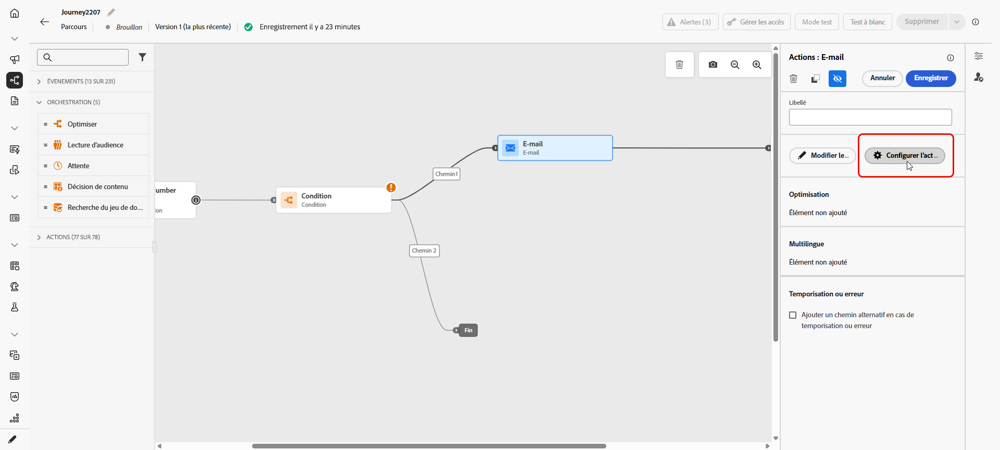
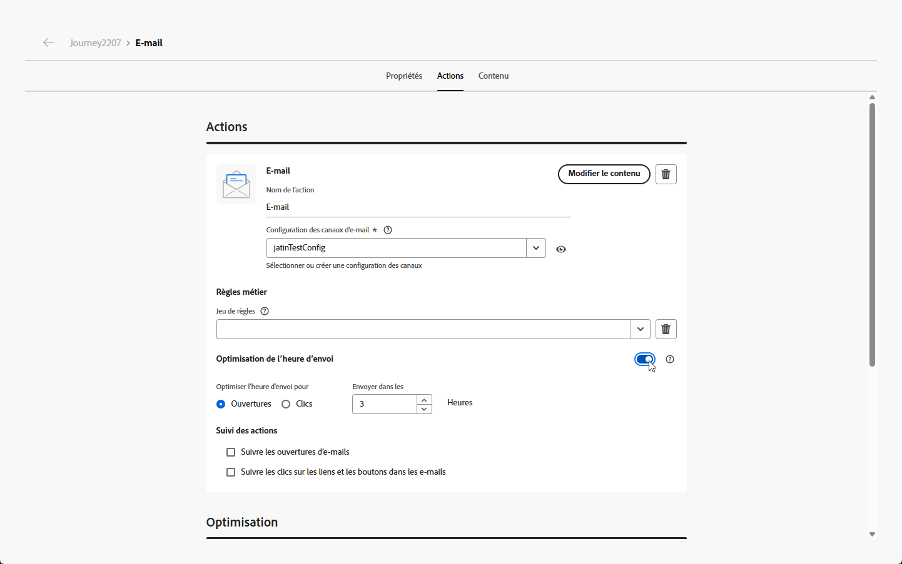
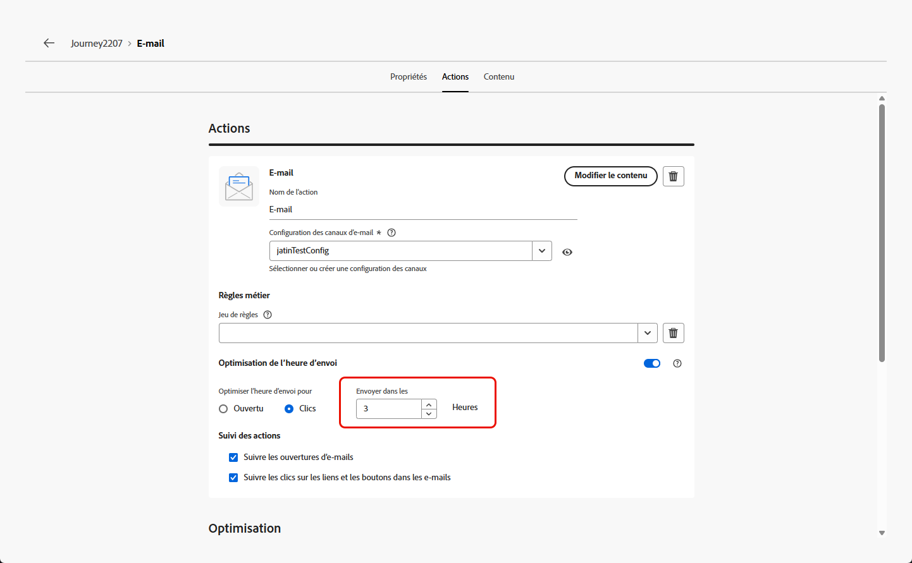
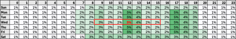

# Optimisation de l’heure d’envoi{#send-time-optimization}

>[!BEGINSHADEBOX]

**Sur cette page :** découvrez comment activer l’optimisation de l’heure d’envoi afin que l’IA d’Adobe prévoie le meilleur moment pour diffuser des e-mails et des messages push en fonction du comportement historique d’ouverture et de clic de chaque client.

>[!ENDSHADEBOX]

>[!CONTEXTUALHELP]
>id="jo_bestsendtime_disabled"
>title="À propos de l&#39;optimisation de l&#39;heure d&#39;envoi"
>abstract="La fonctionnalité d’optimisation de l’heure d’envoi d’[!DNL Adobe Journey Optimizer], optimisée par les services d’IA d’Adobe, peut prévoir le meilleur moment pour envoyer un e-mail ou un message push afin d’optimiser l’engagement en fonction des taux historiques d’ouvertures et de clics."

>[!CONTEXTUALHELP]
>id="jo_bestsendtime_email"
>title="Activer l’optimisation de l’heure d’envoi"
>abstract="Une case d’option détermine s’il faut optimiser les ouvertures d’e-mails ou les clics sur les e-mails. Les heures d’envoi utilisées peuvent également être limitées en saisissant une valeur pour l’option Envoyer dans les."

>[!CONTEXTUALHELP]
>id="jo_bestsendtime_push"
>title="Activer l’optimisation de l’heure d’envoi"
>abstract="Les messages push sont définis par défaut sur l’option d’ouverture, car les clics ne s’appliquent pas à la messagerie push. Les heures d’envoi utilisées peuvent également être limitées en saisissant une valeur pour l’option Envoyer dans les."

La fonctionnalité d’optimisation de l’heure d’envoi d’[!DNL Adobe Journey Optimizer], optimisée par les services d’IA dédiée aux Parcours d’Adobe, choisit l’heure d’envoi optimale pour les e-mails et les messages push afin d’optimiser l’engagement du client, en fonction du comportement historique d’ouverture et de clic de vos clients.

L’optimisation de l’heure d’envoi n’est disponible que pour les types d’action intégrés E-mail et Push de Journey Optimizer et n’est actuellement pas disponible pour les messages envoyés par le biais d’actions personnalisées ou pour d’autres types d’action. L’optimisation de l’heure d’envoi n’est disponible que pour les actions E-mail et Push dans les parcours et n’est actuellement pas disponible pour les messages envoyés via les campagnes.

>[!AVAILABILITY]
>
>* La fonctionnalité d’optimisation de l’heure d’envoi est activée pour les clients [!DNL Adobe Journey Optimizer] sur demande. Pour activer la fonctionnalité pour votre organisation, contactez l’assistance clientèle d’Adobe ou votre représentant ou représentante Adobe.
>
>* L’optimisation de l’heure d’envoi s’applique uniquement aux canaux **E-mail** et **Notification push**.
>

## Utiliser l’optimisation de l’heure d’envoi{#use-send-time-optimization}

Pour activer et configurer l’optimisation de l’heure d’envoi sur une action push ou un e-mail, procédez comme suit.

Avant de commencer, déterminez quels messages sont adaptés avant de l’activer. L’optimisation de l’heure d’envoi ne doit pas être utilisée pour les messages opérationnels urgents et sensibles au temps, tels qu’une confirmation de commande, une notification de réinitialisation de mot de passe ou une notification de changement de porte d’embarquement. Il fonctionne mieux pour les communications marketing moins urgentes, telles qu’une publicité hebdomadaire, des informations promotionnelles sur un nouveau produit ou des informations sur une vente d’un mois.

1. Dans le Parcours, ouvrez le menu **[!UICONTROL Configurer l’action]**.

   

1. Activez le bouton **[!UICONTROL Optimisation de l’heure d’envoi]** dans le menu Optimisation de l’heure d’envoi .

   

1. Pour les e-mails, choisissez d’optimiser les ouvertures ou les clics publicitaires en sélectionnant l’option appropriée. Les messages push sont toujours optimisés pour les ouvertures.

   Pour de meilleurs résultats, optimisez la plupart des e-mails pour les **clics**. Choisissez **Ouvertures** lorsque le message est informatif et n’est pas destiné à effectuer une action spécifique.

1. Pour les messages e-mail et push, définissez **[!UICONTROL Envoyer dans les prochains]** sur le nombre maximal d&#39;heures (1-168) que le système attendra avant d&#39;envoyer le message.

   Pour de meilleurs résultats, choisissez une valeur comprise entre 6 et 24 heures. Une valeur inférieure réduit le nombre d’heures d’envoi disponibles et peut limiter les avantages de l’optimisation de l’heure d’envoi. Une valeur plus élevée peut signifier que le message est obsolète ou moins pertinent au moment de son envoi.

   

1. Pour les e-mails, choisissez la configuration du suivi des actions. Vous pouvez effectuer le suivi des ouvertures d’e-mail et des clics sur les liens et les boutons dans l’e-mail.

Lorsque votre parcours est activé et qu’un client ou une cliente atteint l’action E-mail ou Push dans le parcours, l’optimisation de l’heure d’envoi choisira l’heure d’envoi prévue la plus appropriée disponible pour chaque personne dans les limites que vous avez spécifiées.

Pour surveiller les performances de votre parcours, reportez-vous à la page [Aperçu](../reports/channel-report-cja.md).

## Fonctionnement de l’optimisation de l’heure d’envoi {#how-send-time}

Le modèle d’optimisation de l’heure d’envoi ingère les données de comportement des clients [!DNL Adobe Journey Optimizer] de votre organisation et examine les événements d’ouverture et de clic au niveau de l’utilisateur pour déterminer à quel moment vos clients sont les plus susceptibles d’interagir avec vos messages.

L’optimisation de l’heure d’envoi effectue des prédictions pour chaque heure de la semaine, pour chaque personne, en fonction de trois types de données comportementales :

1. Comportement global de vos utilisateurs et utilisatrices
1. Comportement des utilisateurs et utilisatrices semblables dans le même fuseau horaire
1. Comportement de cette personne spécifique

Ces prédictions sont pondérées et combinées à l’aide d’une approche bayésienne, ce qui donne lieu à une « carte thermique » pour chaque mesure (ouvertures d’e-mails, clics d’e-mail et ouvertures push), pour chaque personne, qui indique les heures de la semaine où le contact avec cette personne est le plus et le moins susceptible d’entraîner le résultat d’engagement souhaité (ouverture/clic), comme illustré dans l’exemple de carte thermique ci-dessous :

Si une personne ayant les probabilités prédites ci-dessus est ciblée pour un message à 9 h mercredi avec l’optimisation de l’heure d’envoi activée et une durée d’attente maximale de 7 heures, l’heure d’envoi sélectionnée pour le message sera 12 h :

## Détails de l’entraînement et de la notation du modèle d’optimisation de l’heure d’envoi  {#model-send-time}

Une fois que la fonctionnalité d’optimisation de l’heure d’envoi est activée pour votre organisation, le modèle d’IA dédiée au parcours est entraîné sur les événements d’envoi, d’ouverture et de clic d’e-mails et de notifications push dans tous les parcours et actions de votre organisation au cours des 16 dernières semaines, que ces actions utilisent ou non l’optimisation de l’heure d’envoi. Cela permet à l’optimisation de l’heure d’envoi de bénéficier de toutes les données générées par vos clientes et clients.

Les modèles sont initialement entraînés et évalués chaque semaine. Au bout de 16 semaines, les modèles sont entraînés de nouveau et évalués tous les mois. La notation du modèle inclut tous les profils clients, qu’ils soient existants ou nouveaux depuis la dernière exécution de notation.

Les messages envoyés par l’optimisation de l’heure d’envoi reçoivent soit une heure d’envoi de message « d’exploration » sélectionnée pour tester différentes heures d’envoi et observer la réponse des clientes et clients, soit une heure d’envoi de message « optimisée » sélectionnée pour maximiser les taux de clics/d’ouverture. 5 % des événements d’envoi reçoivent une heure d’envoi d’« exploration » et 95 % des événements d’envoi sont « optimisés ».

Les heures d’envoi d’exploration sont sélectionnées de manière aléatoire à partir des heures d’envoi rendues disponibles par le temps d’attente maximal configuré. Par exemple, si un message est sélectionné le mercredi à 9 h avec l’optimisation de l’heure d’envoi activée et un temps d’attente maximal de 3 heures, les heures d’envoi d’exploration pour le message seront réparties uniformément entre 9 h, 10 h, 11 h et 12 h.

## Questions fréquentes {#faq-send-time}

Vous trouverez ci-dessous les questions fréquentes sur l’optimisation de l’heure d’envoi.

Vous avez besoin de plus d’informations ? Utilisez les options de commentaires au bas de cette page pour poser votre question ou communiquer avec [[!DNL Adobe Journey Optimizer] communauté](https://experienceleaguecommunities.adobe.com/t5/adobe-journey-optimizer/ct-p/journey-optimizer?profile.language=fr){target="_blank"}.

+++Combien de temps dois-je patienter avant d’utiliser l’optimisation de l’heure d’envoi ?

Votre organisation doit utiliser l’action E-mail dans Journey Optimizer pendant au moins 30 jours avant d’utiliser l’optimisation de l’heure d’envoi dans les e-mails afin de permettre la collecte de certains événements d’envoi, d’ouverture et de clic d’e-mail.

Votre organisation doit utiliser l’action Push dans Journey Optimizer pendant au moins 30 jours avant d’utiliser l’optimisation de l’heure d’envoi dans Push pour permettre la collecte de certains événements d’envoi et d’ouverture de notifications push.

Si votre organisation utilise déjà les types d’action E-mail et/ou Push depuis au moins 30 jours, elle n’a pas besoin d’attendre plus longtemps pour utiliser l’optimisation de l’heure d’envoi après son activation par Adobe. Les résultats continueront de s’améliorer à mesure que votre organisation collecte des données pendant une période allant jusqu’à 16 semaines.

+++

+++Comment puis-je voir l’heure d’envoi à laquelle une personne recevra un message ?

Afin de minimiser l’impact du modèle sur la richesse des profils, les scores des modèles sont stockés compressés dans 3 attributs de profil stockés dans `_experience.intelligentServices.journeyAI.sendTimeOptimization` et ne sont pas conçus pour être lisibles par une personne.

+++

+++Quel est le pourcentage moyen d’amélioration avec l’optimisation de l’heure d’envoi ?

L’optimisation de l’heure d’envoi peut augmenter le taux de clics sur les e-mails et le taux d’ouverture des notifications push entre environ 2 et 10 % pour tous les messages optimisés par une organisation.

Par exemple, si une organisation qui envoie des e-mails sans optimisation de l’heure d’envoi présente un taux de clic de 5,0 % en moyenne, le même ensemble d’e-mails avec optimisation de l’heure d’envoi peut entraîner un taux de clic de 5,5 % en moyenne (5,0 %*(1+10 %)=5,5 %).

En raison de la variabilité au sein de petites tailles d’échantillon, l’optimisation de l’heure d’envoi peut ne pas être observable sur les envois de messages uniques.

Les organisations sont plus susceptibles de tirer de plus grands avantages de l’utilisation de l’optimisation de l’heure d’envoi lorsque les conditions suivantes sont présentes :

* Les parcours existants utilisent des heures d’envoi fixes et mal optimisées.
* La variabilité du comportement du client ou de la cliente (clics et ouvertures) correspond à son emplacement et à ses préférences.
* Les organisations utilisent l’optimisation de l’heure d’envoi sur une plus grande fraction des e-mails et des messages push.
* Les organisations choisissent des temps d’attente maximum dans la plage recommandée de 6 à 12 heures.

+++

+++Je clique toujours sur les e-mails ou les messages push à 12 h. Pourquoi l’algorithme ne m’a-t-il pas envoyé de message à 12 h ?

Cela peut se produire pour plusieurs raisons :

* Votre message a été sélectionné comme heure d’envoi de message « Exploration » au lieu d’heure d’envoi de message « Optimisé ».
* Le comportement des utilisateurs et utilisatrices semblables a influencé le modèle à recommander une autre heure d’envoi.

+++

+++Comment l’optimisation de l’heure d’envoi connaît-elle le fuseau horaire d’une personne ?

L’optimisation de l’heure d’envoi utilise le champ de profil `timeZone` pour déterminer le fuseau horaire d’un utilisateur ou d’une utilisatrice. S’il n’est pas disponible pour cette personne, l’optimisation de l’heure d’envoi tente de déduire le fuseau horaire d’une personne à partir d’autres informations géographiques du profil de la personne, telles que le pays et l’État.

+++

+++L’optimisation de l’heure d’envoi enverra-t-elle des messages push aux personnes pendant la nuit dans leur fuseau horaire local ?

L’optimisation de l’heure d’envoi peut envoyer des messages push aux utilisateurs et utilisatrices pendant la nuit dans leur fuseau horaire local dans les circonstances suivantes :

* Lorsque les utilisateurs et utilisatrices adoptent un comportement indiquant qu’ils sont susceptibles d’interagir avec un message envoyé la nuit.
* Lorsque le modèle choisit une heure d’envoi d’« exploration ».

Pour éviter d’envoyer des messages push aux clientes et clients pendant les heures nocturnes, planifiez les envois de messages push par lots pour qu’ils se produisent le matin ou au début de l’après-midi et choisissez une durée plus courte pour l’optimisation de l’heure d’envoi. (Par exemple, une heure d’envoi de 9 h et un temps d’attente maximal de 8 heures.)

+++

+++ Référence des connaissances sur l’IA

Cette section contient des connaissances structurées destinées à soutenir l’interprétation, la récupération et la réponse aux questions liées à ce sujet.

Pour une compréhension totale, ces informations doivent être combinées avec la documentation de cette page. Aucune des sources n’est conçue pour être autonome. La page décrit la fonctionnalité, tandis que cette section fournit un contexte supplémentaire qui permet de clarifier la terminologie, l’intention, l’applicabilité et les contraintes.

* **TL;DR:** Cette page explique comment configurer et utiliser l’optimisation de l’heure d’envoi dans Adobe Journey Optimizer, une fonctionnalité optimisée par l’IA qui prédit le meilleur moment pour envoyer des e-mails ou des messages push à chaque individu afin de maximiser l’engagement.

**Intentions:**
* Activer l’optimisation de l’heure d’envoi sur un e-mail ou une action push dans un parcours
* Choisissez d’optimiser les ouvertures ou les clics publicitaires sur les e-mails
* Définir la fenêtre d’attente maximale (Envoyer dans les prochains délais) pour une diffusion retardée
* Comprendre comment le modèle d’IA prédit des heures d’envoi optimales à l’aide de données comportementales
* Déterminer si l’optimisation de l’heure d’envoi est appropriée pour un type de message donné

**Glossaire:**
* **Optimisation de l’heure d’envoi (STO)** : une fonctionnalité optimisée par l’IA qui retarde la diffusion des messages à chaque profil jusqu’à l’heure d’engagement optimale prévue dans une fenêtre temporelle configurée *(spécifique au produit)*
* **IA dédiée au Parcours** : les services d’IA d’Adobe alimentent l’optimisation de l’heure d’envoi dans Journey Optimizer *(spécifique au produit)*
* **Heure d’envoi de l’exploration** : heure d’envoi sélectionnée de manière aléatoire (utilisée pour 5 % des envois) pour tester différents moments et améliorer la précision du modèle *(spécifique au produit)*
* **Heure d’envoi optimisée** : heure d’envoi prédite par le modèle sélectionnée pour maximiser les taux de clics ou d’ouverture (utilisée pour 95 % des envois) *(spécifique au produit)*
* **Envoyer dans les prochains** : nombre maximal d’heures (1-168) que le système attendra avant d’envoyer le message à un profil donné *(spécifique au produit)*

**Mécanismes de sécurisation :**
* L’optimisation de l’heure d’envoi doit être activée par Adobe pour l’organisation. Contactez l’assistance clientèle d’Adobe ou votre représentant Adobe pour l’activer.
* L’optimisation de l’heure d’envoi s’applique uniquement aux canaux E-mail et Notification push dans les Parcours. Elle n’est pas disponible pour les campagnes ou les actions personnalisées.
* L’organisation doit avoir utilisé des actions E-mail ou Push dans Journey Optimizer pendant au moins 30 jours avant que l’optimisation de l’heure d’envoi ne produise des résultats significatifs.
* N’utilisez pas l’optimisation de l’heure d’envoi pour les messages opérationnels urgents ou sensibles au temps (par exemple, confirmations de commande, réinitialisations de mot de passe, changements de porte d’embarquement).
* La plage de temps d’attente maximale est comprise entre 1 et 168 heures ; la plage recommandée est comprise entre 6 et 24 heures pour obtenir de meilleurs résultats.
* Les scores du modèle sont stockés dans les attributs de profil à l’adresse `_experience.intelligentServices.journeyAI.sendTimeOptimization` et ne sont pas lisibles par l’utilisateur.
* Les modèles sont entraînés une fois par semaine au début, puis entraînés à nouveau et notés tous les mois après 16 semaines.

**Terminologie:**
* Nom canonique : Optimisation de l’heure d’envoi — Acronyme : STO — variantes : meilleure heure d’envoi, heure d’envoi AI, heure d’envoi intelligente
* Synonymes : « Optimisation de l’heure d’envoi » = « Heure d’envoi optimale » = « Heure d’envoi de l’IA »
* Ne les confondez pas : « Heure d’envoi de l’exploration » ≠ « Heure d’envoi optimisée » (l’exploration est aléatoire pour les tests de modèle ; l’optimisation est prédite par le modèle pour l’engagement)

**FAQ:**
* **Q : Quels canaux prennent en charge l’optimisation de l’heure d’envoi ?** — Seuls les canaux E-mail et Notification push des Parcours sont pris en charge ; les campagnes et actions personnalisées ne sont pas prises en charge.
* **Q : Dois-je optimiser les ouvertures ou les clics sur les e-mails ?** — Optimiser pour les clics pour la plupart des e-mails. Choisissez Ouvertures lorsque le message est informatif et ne vise pas à effectuer une action spécifique.
* **Q : Combien de temps l&#39;organisation doit-elle attendre avant d&#39;activer la STO ?** — Au moins 30 jours d’utilisation des e-mails ou des notifications push dans Journey Optimizer sont nécessaires pour collecter suffisamment de données comportementales. Les résultats continuent de s’améliorer pendant 16 semaines.
* **Q : Est-ce que STO peut envoyer des notifications push la nuit ?** — Oui, si le comportement d&#39;un utilisateur suggère un engagement de nuit ou si une heure d&#39;envoi d&#39;exploration est sélectionnée. Pour éviter cela, utilisez une heure d’envoi du matin avec une courte fenêtre d’attente maximale.
* **Q : Quel est le bénéfice attendu de l’optimisation de l’heure d’envoi ?** — Amélioration d&#39;environ 2 à 10 % du taux de clics sur les e-mails ou du taux d&#39;ouverture des notifications push pour tous les messages optimisés, bien que les avantages puissent ne pas être observables sur les envois individuels de faible volume.

+++

