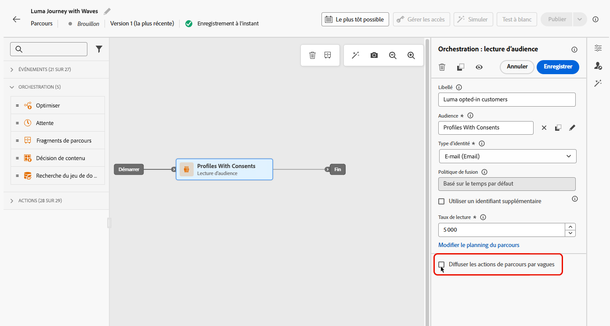
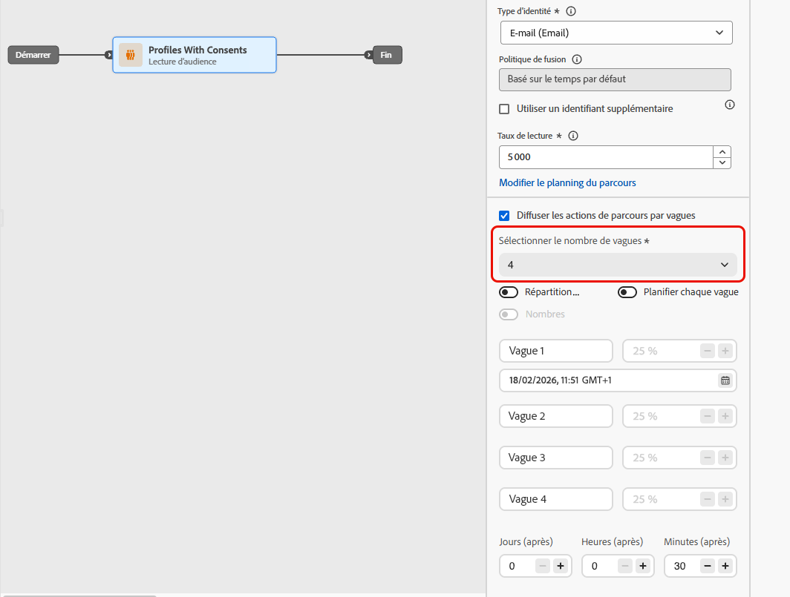
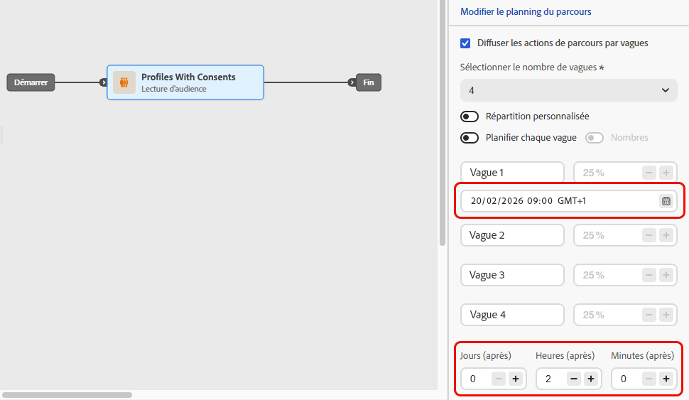
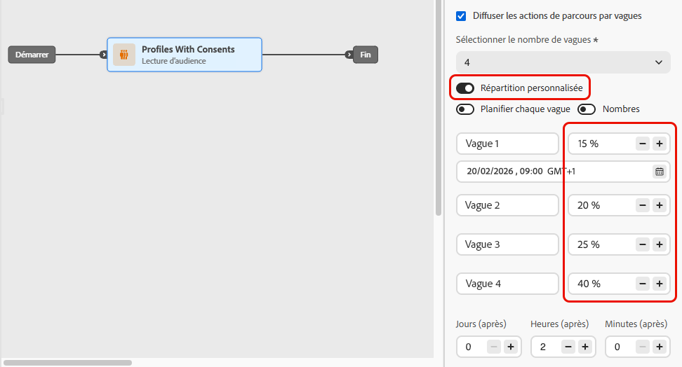
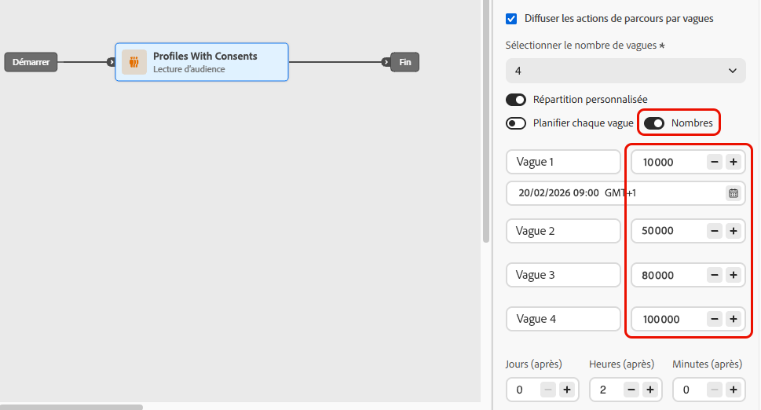
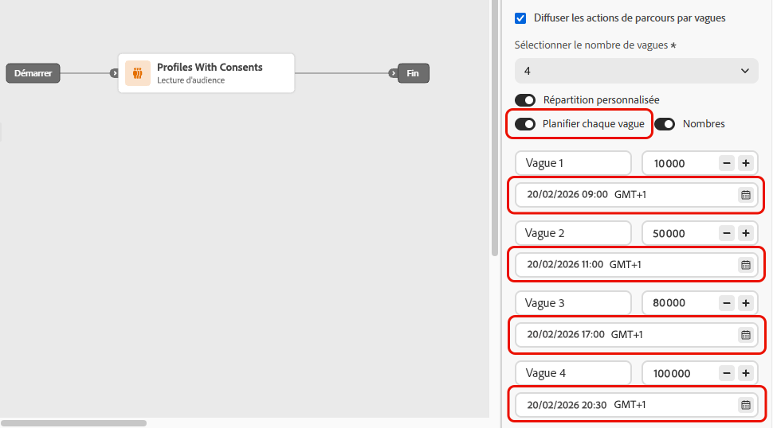
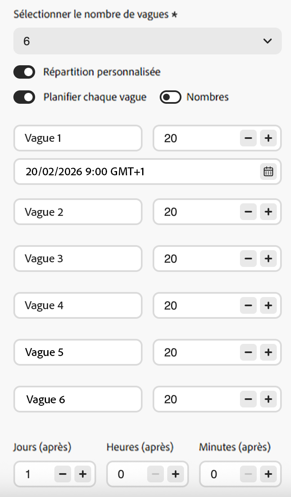
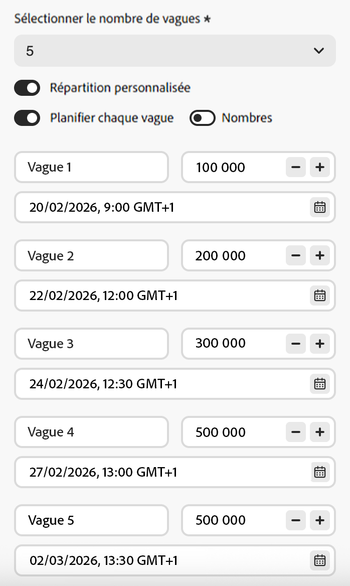
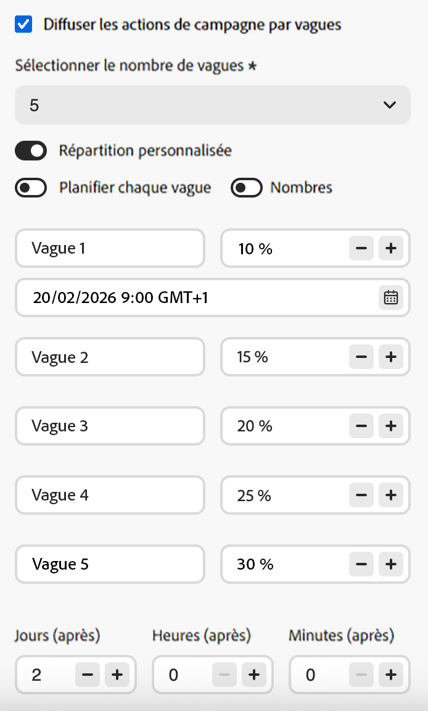

# Utiliser l’envoi par vagues dans les parcours {#send-using-waves-journeys}

>[!BEGINSHADEBOX]

**Sur cette page :** découvrez comment diffuser des messages sortants à partir d’un parcours d’audience lue par lots planifiés, appelés vagues, pour équilibrer la charge, protéger les systèmes en aval et prendre en charge la délivrabilité.

>[!ENDSHADEBOX]

Vous pouvez diffuser des messages sortants à partir d’un parcours par lots (vagues) au fil du temps, au lieu de les diffuser tous en même temps. L’envoi de vagues permet d’équilibrer la charge, d’éviter de surcharger les systèmes en aval (tels que les centres d’appels ou les landing pages) et de prendre en charge la délivrabilité et la réputation de l’expéditeur, en particulier pour les parcours de lecture d’audience à volume élevé.

<!--
>[!CAUTION]
>
>Wave sending is available for read audience journeys only and applies to **outbound** actions only (Email, SMS, Push, Direct mail).
-->

Vous le configurez au niveau du parcours lorsque vous définissez la manière dont l’audience entre et comment les actions sont planifiées. Vous définissez le nombre de vagues, leur taille (en pourcentage de l’audience ou en nombres absolus) et le moment où chaque vague s’exécute.

## Limites et mécanismes de sécurisation {#limitations-guardrails}

* L’envoi de vagues est uniquement disponible pour les parcours d’audience lue avec les types de planificateur **[!DNL As soon as possible]** et **[!UICONTROL Une fois]**. En savoir plus sur le planning de parcours .
* L’envoi de vagues n’est pas disponible pour les parcours récurrents, déclenchés par un événement, d’événement métier, de mode test ou d’exécution d’essai.
* Vous devez définir au moins 2 vagues de **2** et vous pouvez ajouter jusqu’à 10 vagues de ****.
* L’intervalle minimum entre le début de deux vagues est de **30 minutes**.
* Un début de vague ne peut pas être antérieur au début du parcours ou antérieur.
* La division de l’audience en vagues peut prendre jusqu’à 1 heure. Les profils ne peuvent pas entrer dans le parcours avant cette date.
* Dans une seule version de parcours, deux vagues ne s’exécutent jamais en même temps. La prochaine vague ne commence qu&#39;une fois la précédente terminée. Par exemple, si des vagues sont planifiées à 1 heure d’intervalle, mais que la première vague dure 2 heures, la seconde vague commence à la fin de la première vague, et non à l’heure planifiée.
* Les démarrages de vagues peuvent être retardés lorsque la plateforme applique des limites de quota ou lorsque la capacité du système est soumise à une charge importante.

## Configurer l’envoi de vagues dans un parcours {#configure-wave-sending}

1. Commencez votre parcours par une activité [ Lecture d’audience ](read-audience.md).

1. Double-cliquez sur l’activité **[!UICONTROL Lecture d’audience]** pour afficher ses propriétés et sélectionnez l’option **[!UICONTROL Diffuser l’action de parcours par vagues]**.

   {width="100%"}

1. Définissez le **nombre de vagues** (par exemple, 4).

   {width="80%"}

   >[!NOTE]
   >
   >Vous devez définir au moins 2 vagues et pouvez ajouter jusqu’à 10 vagues.

1. Choisissez comment définir la taille et la durée des vagues comme décrit ci-dessous.

### Ondes égales {#equal-waves}

Par défaut, l’audience est divisée en vagues de taille égale. Définissez un intervalle fixe entre le début de chaque vague (par exemple, 2 heures).

{width="70%"}

>[!NOTE]
>
>L’intervalle minimum entre le début de deux vagues est de **30 minutes**.

Le système planifie ensuite automatiquement les vagues suivantes (par exemple, la première vague à 9 :00, la deuxième à 11 :00, la troisième à 13 :00, la quatrième à 15 :00).

### Distribution personnalisée {#custom-distribution}

Sélectionnez l’option **[!UICONTROL Distribution personnalisée]** pour définir la taille de chaque vague en pourcentage de l’audience totale (par exemple, 15 %, 20 %, 25 %, 40 %).

{width="70%"}

Sélectionnez **[!UICONTROL Nombres]** pour définir la taille de chaque vague en tant que nombre absolu de profils (par exemple, 10 000 ; 50 000).

{width="70%"}

>[!NOTE]
>* Si vous utilisez des pourcentages, toutes les vagues doivent totaliser 100 %. Un avertissement s&#39;affiche si ce n&#39;est pas le cas.
>* Lorsque vous utilisez des nombres, le système ne valide pas la couverture : assurez-vous que la taille des vagues couvre l’audience visée. [En savoir plus](#faq)

### Planning personnalisé {#custom-schedule}

Sélectionnez **[!UICONTROL Planifier chaque vague]** pour définir une date et une heure de début spécifiques pour chaque vague. Les vagues n’ont pas besoin d’être régulièrement espacées (par exemple, 9 :00, 11:00, 17:00, 20 :30).

{width="70%"}

>[!NOTE]
>
>L’intervalle minimum entre le début de deux vagues est de **30 minutes**.

## Cas d’utilisation {#use-cases}

L’envoi de vagues vous permet de contrôler le moment et le nombre de messages envoyés, ce qui peut améliorer la délivrabilité, protéger la réputation de l’expéditeur et aligner les envois sur votre capacité opérationnelle. Envisagez d’utiliser des vagues dans les scénarios suivants :

* **Gestion du centre d’appel ou de la réaction :** limitez le nombre de messages envoyés par jour ou par heure afin que les équipes en aval (par exemple l’assistance clientèle) puissent gérer les réponses. Par exemple, envoyez 20 messages par jour pour correspondre à la capacité du centre d’appels.

  {width="55%"}

* **Volume et délivrabilité élevés :** évitez d’envoyer un parcours très volumineux en une seule fois. Diffusez la diffusion au fil du temps pour aider à maintenir la réputation de l&#39;expéditeur et réduire le risque d&#39;être marqué comme indésirable.

  {width="55%"}

* **Ramp-up :** lors de l’utilisation d’une nouvelle plateforme ou d’une nouvelle adresse IP, augmentez progressivement le volume (par exemple, 10 % lors de la première vague, puis 15 %, 20 %, etc.) pour établir progressivement la réputation.

  {width="55%"}

## Questions fréquentes {#faq}

+++ Que se passe-t-il si la somme des tailles des vagues n’est pas égale à votre audience totale ?

* Si la somme de vos tailles de vagues **dépasse** l’audience (par exemple, vous planifiez 100 000 dans la première vague pour une audience de 100 000), la première vague sera envoyée à l’audience complète et les vagues restantes n’auront plus personne à qui envoyer ; elles ne s’exécuteront pas.
* Si la somme **est inférieure** à l’audience (par exemple, si vous définissez quatre vagues totalisant 40 000 profils pour une audience de 100 000), seuls les profils inclus dans ces vagues recevront le message. Le reste de l’audience ne recevra pas la communication et ne fera pas l’objet de nouvelles tentatives par vagues ultérieures.

+++

+++ Puis-je attribuer différents segments ou critères à des vagues individuelles ?

Vous pouvez uniquement définir la taille et la durée des vagues. La même audience traverse le parcours. Vous ne pouvez pas attribuer différents segments ou critères à des vagues individuelles.

+++

+++ L’audience est-elle réévaluée avant chaque vague ou est-elle corrigée au début du parcours ?

L’audience est **évaluée une fois** lorsque le parcours est déclenché. Un instantané des profils admissibles est pris à ce stade et utilisé pour toutes les vagues. L’appartenance à l’audience n’est pas réévaluée avant chaque vague suivante.

Toutefois, les attributs **de profil) sont lus au moment de chaque traitement de vague** et non au début du parcours. Cela signifie que pour les vagues qui se propagent sur plusieurs jours :

* Les attributs Personalization (par exemple, le prénom ou le niveau de fidélité d’un profil) reflètent l’état du profil au moment de l’exécution de la vague.
* **Les contrôles de consentement et de suppression sont appliqués au moment de l’envoi pour chaque vague.** Si un profil se désinscrit entre deux vagues, il ne recevra pas de messages des vagues suivantes.

En résumé : *qui* est inclus dans le parcours est fixe au départ, mais *les données utilisées pour les envoyer à ces profils* reflète leur état actuel lors du traitement de leur vague.

+++

## Voir également {#see-also}

* [Utiliser une audience dans un parcours ](read-audience.md) : configurez l&#39;activité Lecture d&#39;audience.

+++ Référence des connaissances sur l’IA

Cette section contient des connaissances structurées destinées à soutenir l’interprétation, la récupération et la réponse aux questions liées à ce sujet.

Pour une compréhension totale, ces informations doivent être combinées avec la documentation de cette page. Aucune des sources n’est conçue pour être autonome. La page décrit la fonctionnalité, tandis que cette section fournit un contexte supplémentaire qui permet de clarifier la terminologie, l’intention, l’applicabilité et les contraintes.

* **TL;DR:** Cette page explique comment configurer l’envoi de vagues dans les parcours d’audience de lecture Adobe Journey Optimizer pour diffuser des messages sortants par lots contrôlés au fil du temps, améliorer la délivrabilité et protéger la réputation de l’expéditeur.

**Intentions:**
* Activer l’envoi de vagues sur un parcours Lecture d’audience pour diffuser des messages par lots
* Configurer des vagues égales avec un intervalle fixe entre chaque vague
* Définir les tailles de vagues personnalisées sous la forme de pourcentages ou de nombres absolus de profils
* Planifier chaque vague avec une date et une heure de début spécifiques à l’aide de la planification personnalisée
* Contrôler le volume de diffusion pour protéger la réputation de l&#39;expéditeur ou s&#39;aligner sur la capacité opérationnelle

**Glossaire:**
* **Envoi de vagues** : mode de diffusion qui divise l’audience de lecture en lots (vagues) et envoie des messages à chaque lot à des intervalles planifiés au lieu de les envoyer tous en même temps *(spécifique au produit)*
* **Vagues égales** : configuration de vague dans laquelle l’audience est divisée en portions de taille égale avec un intervalle fixe entre les débuts de vague *(spécifique au produit)*
* **Distribution personnalisée** : configuration de vague dans laquelle la taille de chaque vague est définie manuellement comme un pourcentage ou un nombre absolu de profils *(spécifiques au produit)*
* **Planning personnalisé** : configuration de vague dans laquelle chaque vague comporte une date et une heure de début spécifiques, ce qui permet des *d’espacement non uniformes (spécifiques au produit)*

**Mécanismes de sécurisation :**
* L’envoi de vagues est uniquement disponible pour les parcours Lecture d’audience avec les types de planificateur « Dès que possible » et « Une fois » ; il n’est pas disponible pour les parcours récurrents, déclenchés par un événement, d’événement métier, de mode test ou d’exécution d’essai.
* Un minimum de 2 vagues et un maximum de 10 vagues doivent être définis.
* L&#39;intervalle minimum entre le début de deux vagues consécutives est de 30 minutes.
* Une heure de début de vague ne peut pas être antérieure au début du parcours ou antérieure.
* La division de l’audience en vagues peut prendre jusqu’à 1 heure ; les profils peuvent ne pas entrer avant cette date.
* Dans une seule version de parcours, deux vagues ne s’exécutent jamais simultanément ; la vague suivante ne commence qu’une fois la précédente terminée.
* Le début des vagues peut être retardé par les limites de quota de la plateforme ou par la lourde charge du système.
* Lors de l’utilisation de la distribution personnalisée en pourcentage, le total de toutes les vagues doit être de 100 %.
* Lors de l’utilisation de la distribution personnalisée basée sur les nombres, le système ne valide pas la couverture totale ; l’utilisateur ou l’utilisatrice doit s’assurer que les tailles de vagues couvrent l’audience prévue.
* Si la taille des vagues dépasse l’audience, la première vague est envoyée à l’audience complète et les vagues restantes ne s’exécutent pas.
* Si la taille totale des vagues est inférieure à l’audience, seuls les profils des vagues définies reçoivent le message ; les autres ne sont pas retraitées.

**Terminologie:**
* Nom canonique : Envoi par vagues — Acronyme : none — variantes : diffusion par lots, diffusion par vagues, envoi par phases
* Synonymes : « vagues » = « lots » = « phases de diffusion »
* Ne les confondez pas : « Envoi de vagues » ≠ « parcours récurrent » (l’envoi de vagues divise une seule audience lue en lots minutés ; les parcours récurrents relient l’audience selon un planning)

**FAQ:**
* **Q : L’envoi de vagues peut-il être utilisé sur les parcours récurrents ?** — Non ; l’envoi de vagues n’est disponible que pour les parcours Lecture d’audience avec le type de planificateur « Dès que possible » ou « Une fois ».
* **Q : Quel est le temps minimum entre deux vagues ?** — 30 minutes entre le début de deux vagues consécutives.
* **Q : Que se passe-t-il si la taille de mes vagues est supérieure à celle de l’audience ?** — La première vague envoie à l’audience complète et les vagues suivantes n’ont plus de profils auxquels envoyer des messages ; elles ne s’exécutent pas.
* **Q : Puis-je attribuer différents contenus ou segments à des vagues individuelles ?** — Non ; toutes les vagues utilisent la même audience et le même contenu parcours. Seules la taille et la durée peuvent être personnalisées par vague.
* **Q : Combien de vagues puis-je configurer ?** — Entre 2 et 10 vagues par parcours.
* **Q : Quand dois-je utiliser l’envoi de vagues ?** utilisez-le pour protéger la réputation de l&#39;expéditeur en cas d&#39;envois volumineux, pour aligner la diffusion sur la capacité de l&#39;équipe en aval (par exemple, centres d&#39;appels) ou pour augmenter progressivement le volume sur une nouvelle adresse IP ou une nouvelle plateforme.

+++
