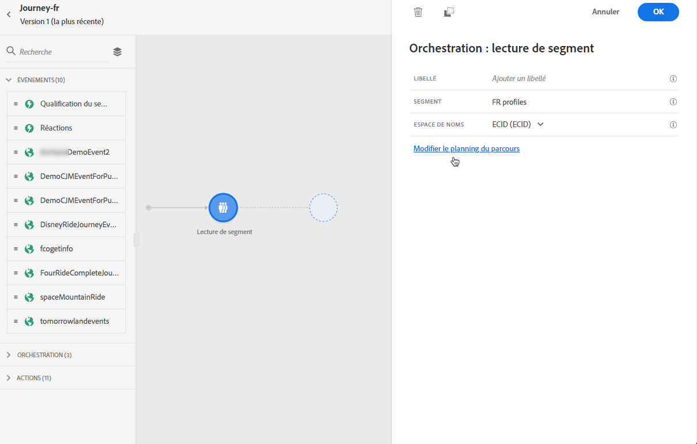
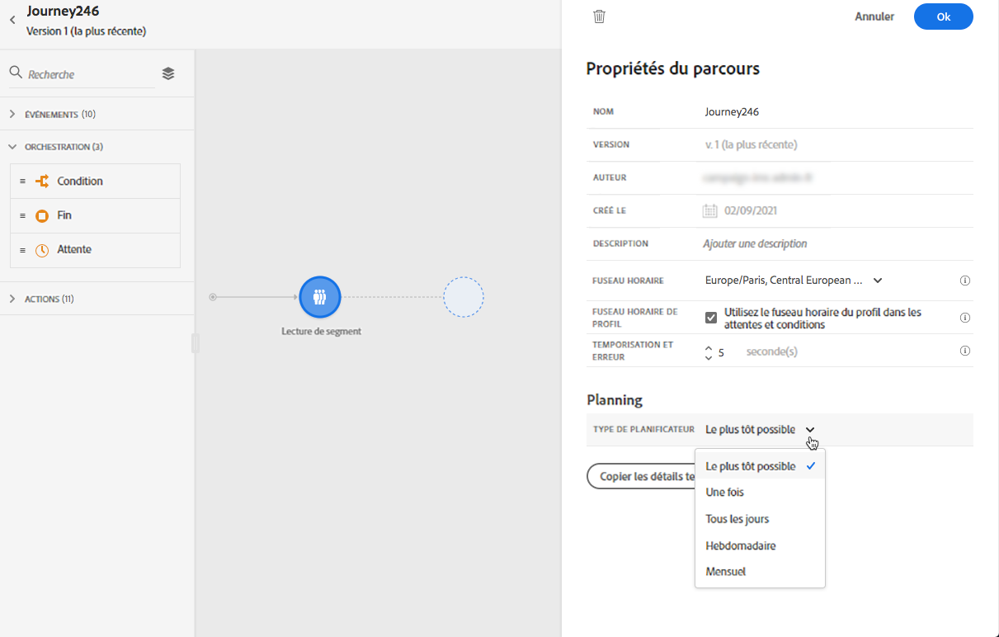
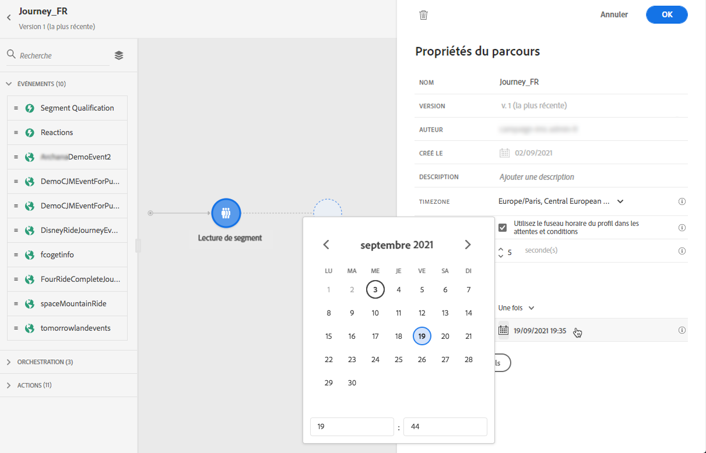
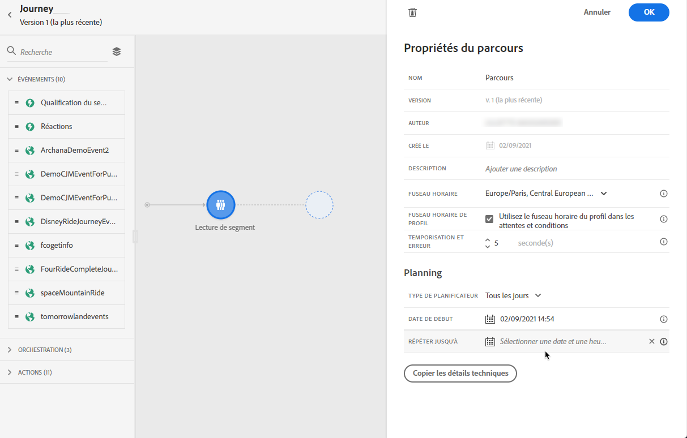

# Exécution du parcours {#message-execution}

## Tester votre parcours

Vous pouvez tester votre parcours à l’aide de profils de test. Cette étape est recommandée pour valider vos paramètres et messages.

En savoir plus dans cette [section](testing-the-journey.md).

## Activer votre parcours

Vous devez publier votre parcours pour l’activer.

En savoir plus dans cette [section](publishing-the-journey.md).

Une fois publié, vous pouvez surveiller votre parcours à l’aide des outils de rapports dédiés afin de mesurer l’efficacité de votre parcours.

[En savoir plus sur les rapports](../reports/live-report.md)

## Envoi des messages {#send-messages}

Lorsque le contenu de votre message est défini et publié, il est prêt à être envoyé par l’intermédiaire d’un [parcours](journey.md).

>[!NOTE]
>
>Vous pouvez ajouter un message qui est toujours en mode Brouillon à un parcours, mais assurez-vous que le message est publié avant de publier le parcours.

Une fois qu’un message est envoyé, vous pouvez surveiller son exécution au moyen de plusieurs indicateurs. [En savoir plus sur la surveillance de l’exécution des messages](../message-monitoring.md).

## Planification des messages {#schedule-messages}

Les messages peuvent être planifiés via l&#39;activité **[!UICONTROL Lecture de segment]** dans un [parcours](journey.md). Vous pouvez indiquer quand le segment va rejoindre le parcours. [En savoir plus sur l&#39;activité Lecture de segment](read-segment.md).

Pour ce faire, procédez comme suit :

1. Modifiez un parcours, faites glisser et déposez une activité **[!UICONTROL Lecture de segment]** et commencez à la configurer. [En savoir plus sur la configuration de l&#39;activité Lecture de segment](read-segment.md#configuring-segment-trigger-activity).

1. Cliquez sur le lien **[!UICONTROL Modifier le planning du parcours]** pour accéder aux propriétés du parcours.

   

1. Configurez le champ **[!UICONTROL Type de planificateur]** : sélectionnez la valeur souhaitée dans la liste pour que le segment rejoigne le parcours à une date/heure spécifique ou sur une base récurrente.

   >[!NOTE]
   >
   >La section **[!UICONTROL Planificateur]** n’est disponible que lorsqu’une activité **[!UICONTROL Lecture de segment]** a été déposée dans la zone de travail.

   

1. Si vous sélectionnez **[!UICONTROL Une fois]**, définissez une date et une heure spécifiques auxquelles le segment va rejoindre le parcours.

   

1. Si vous sélectionnez une méthode récurrente, modifiez la date et l’heure du début. Vous pouvez également définir une date et une heure de fin facultatives.

   

   >[!NOTE]
   >
   >Par défaut, les segments rejoignent le parcours **[!UICONTROL Dès que possible]**, c’est-à-dire 1 heure après la publication de celui-ci.

1. Cliquez sur **[!UICONTROL OK]** pour enregistrer vos modifications.

<!--Unitary messages that are triggered by an event within a journey cannot be scheduled.-->
